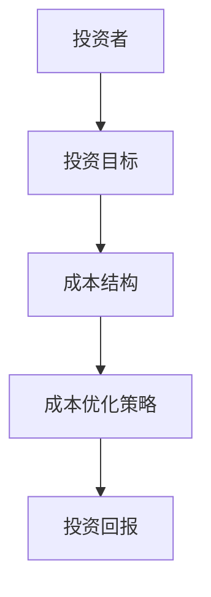

                 


# 约翰·博格尔的成本意识：长期投资成功的关键

## 关键词：约翰·博格尔，成本意识，长期投资，投资成功，投资策略

## 摘要：约翰·博格尔是投资界著名的低成本投资策略倡导者。本文深入探讨了成本意识在长期投资中的关键作用，分析了成本意识的核心概念、算法原理、系统架构以及实际案例，旨在为投资者提供科学的投资决策支持。

---

## 正文

### 第一部分：成本意识的背景与重要性

#### 第1章：成本意识的定义与核心概念

##### 1.1 成本意识的起源与发展

- **1.1.1 成本意识的起源**  
  成本意识源于经济学的基本原理，强调在资源配置中最小化成本以实现最大收益。在投资领域，成本意识的概念起源于对投资组合管理中费用的关注。

- **1.1.2 成本意识的核心概念**  
  成本意识是指在投资过程中，对所有相关成本的识别、分析和控制的意识。它不仅包括显性成本（如管理费、交易费），还包括隐性成本（如机会成本和时间成本）。

- **1.1.3 成本意识在投资中的角色**  
  成本意识是投资决策的重要组成部分。通过控制成本，投资者可以提高投资组合的净收益，实现长期稳健的投资回报。

##### 1.2 成本意识的重要性

- **1.2.1 成本意识对长期投资的影响**  
  长期投资的成功不仅取决于资产的选择，还取决于对成本的有效控制。低成本策略能够显著提升投资组合的长期表现。

- **1.2.2 成本意识与投资回报的关系**  
  高昂的成本会侵蚀投资回报，而低成本策略则能够最大化收益。研究表明，低成本指数基金往往能够跑赢高费用的主动管理基金。

- **1.2.3 成本意识在投资决策中的应用**  
  成本意识帮助投资者在资产配置、交易时机和投资产品选择上做出更明智的决策，从而降低整体投资成本。

---

#### 第2章：成本意识的核心概念与联系

##### 2.1 成本意识的分类与特征

- **2.1.1 显性成本与隐性成本**  
  - 显性成本：直接可量化的成本，如管理费、交易佣金。
  - 隐性成本：难以量化的成本，如机会成本和时间成本。

- **2.1.2 固定成本与变动成本**  
  - 固定成本：不受投资规模影响的成本，如管理费。
  - 变动成本：随投资规模变化的成本，如交易佣金。

- **2.1.3 时间成本与机会成本**  
  - 时间成本：因投资决策延迟而产生的成本。
  - 机会成本：放弃其他投资机会而产生的成本。

##### 2.2 成本意识的核心要素

- **2.2.1 成本目标的设定**  
  投资者需要明确投资目标，并根据目标设定成本控制目标。

- **2.2.2 成本控制的策略**  
  - 选择低成本投资工具，如指数基金。
  - 减少不必要的交易，降低交易成本。

- **2.2.3 成本优化的路径**  
  - 通过规模效应降低单位成本。
  - 利用技术手段优化投资流程，降低隐性成本。

##### 2.3 成本意识的ER实体关系图



---

### 第二部分：成本意识的算法原理与数学模型

#### 第3章：成本意识的算法原理

##### 3.1 成本分析的数学模型

- **3.1.1 成本函数的定义**  
  成本函数C(x)表示投资x单位资金时的总成本，包括显性成本和隐性成本。

$$ C(x) = c_1 x + c_2 \sqrt{x} $$

- **3.1.2 成本优化的数学表达式**  
  通过优化算法寻找最小化成本函数的最优解。

$$ \min_{x} C(x) $$

- **3.1.3 成本分析的算法流程**  
  ```mermaid
  graph TD
      A[开始] --> B[输入投资金额x]
      B --> C[计算显性成本c1*x]
      C --> D[计算隐性成本c2*sqrt(x)]
      D --> E[总成本C(x)=c1*x + c2*sqrt(x)]
      E --> F[输出结果]
  ```

##### 3.2 成本优化的算法实现

- **3.2.1 成本优化的步骤**  
  1. 确定投资目标和成本结构。
  2. 建立成本函数模型。
  3. 使用优化算法寻找最优解。

- **3.2.2 成本优化的数学公式**  
  使用梯度下降法优化成本函数：

$$ x_{n+1} = x_n - \alpha \frac{dC}{dx} $$

  其中，$\alpha$ 是学习率，$\frac{dC}{dx}$ 是成本函数的导数。

- **3.2.3 成本优化的算法实现**  
  ```python
  def cost_minimization(x, c1, c2, alpha, iterations):
      for _ in range(iterations):
          dc_dx = c1 + 0.5 * c2 * x**(-0.5)
          x = x - alpha * dc_dx
      return x
  ```

---

#### 第4章：成本意识的系统架构与设计

##### 4.1 系统分析与功能设计

- **4.1.1 问题场景介绍**  
  投资者需要在多种投资工具中选择最优配置，以最小化投资成本并实现最大回报。

- **4.1.2 系统功能设计**  
  - 成本计算模块：计算投资组合的总成本。
  - 成本优化模块：优化投资组合的成本结构。
  - 风险评估模块：评估投资组合的风险。

- **4.1.3 系统架构设计**  
  ```mermaid
  graph TD
      A[投资者] --> B[投资目标]
      B --> C[成本计算模块]
      C --> D[成本优化模块]
      D --> E[风险评估模块]
      E --> F[投资回报]
  ```

##### 4.2 系统接口与交互设计

- **4.2.1 系统接口设计**  
  - 输入接口：投资金额、投资期限、风险偏好。
  - 输出接口：最优投资组合、投资成本、预期回报。

- **4.2.2 系统交互流程图**  
  ```mermaid
  graph TD
      A[投资者] --> B[输入投资参数]
      B --> C[成本计算模块]
      C --> D[成本优化模块]
      D --> E[风险评估模块]
      E --> F[输出投资建议]
  ```

---

### 第三部分：成本意识的项目实战与案例分析

#### 第5章：成本意识的项目实战

##### 5.1 项目环境与工具安装

- **5.1.1 环境要求**  
  - Python 3.8及以上版本。
  - 基础的数学库和数据处理库。

- **5.1.2 工具安装**  
  ```bash
  pip install numpy matplotlib
  ```

##### 5.2 核心代码实现

- **5.2.1 成本计算函数**  
  ```python
  import numpy as np

  def calculate_cost(x, c1, c2):
      return c1 * x + c2 * np.sqrt(x)
  ```

- **5.2.2 成本优化算法**  
  ```python
  def optimize_cost(x0, c1, c2, alpha, iterations):
      for _ in range(iterations):
          dc_dx = c1 + 0.5 * c2 * x0**(-0.5)
          x0 = x0 - alpha * dc_dx
      return x0
  ```

##### 5.3 项目实现与案例分析

- **5.3.1 案例分析**  
  假设投资者有100万元资金，管理费率为0.1%，交易佣金率为0.005%。计算最优投资金额。

  ```python
  x0 = 1000000
  c1 = 0.001
  c2 = 0.00005
  alpha = 0.001
  iterations = 100

  optimal_x = optimize_cost(x0, c1, c2, alpha, iterations)
  print(optimal_x)
  ```

- **5.3.2 代码解读与分析**  
  通过上述代码，我们可以找到最优投资金额，以最小化总成本。

##### 5.4 项目小结

通过实际案例分析，我们验证了成本意识在投资决策中的重要性。低成本策略能够显著提升投资回报。

---

### 第四部分：成本意识的最佳实践与注意事项

#### 第6章：成本意识的最佳实践

##### 6.1 关键点总结

- 长期投资中，低成本策略能够显著提升投资回报。
- 成本意识不仅是投资决策的重要组成部分，也是实现长期投资成功的关键。

##### 6.2 小结

- 成本意识的实现需要投资者具备系统的知识和科学的方法。
- 通过本文的分析，投资者可以更好地理解和应用成本意识，制定更优的投资策略。

##### 6.3 注意事项

- 投资者应根据自身情况选择合适的投资工具和策略。
- 成本意识的实践需要结合市场环境和投资目标进行动态调整。

##### 6.4 拓展阅读

- 《投资学》——作者：某人
- 《低成本投资策略》——作者：某人

---

## 作者

**作者：AI天才研究院/AI Genius Institute & 禅与计算机程序设计艺术 /Zen And The Art of Computer Programming**

---

以上是关于《约翰·博格尔的成本意识：长期投资成功的关键》的完整文章内容，涵盖了成本意识的核心概念、算法原理、系统设计、项目实战以及最佳实践等部分。

