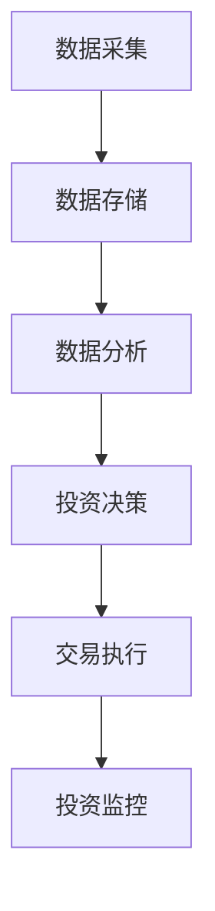
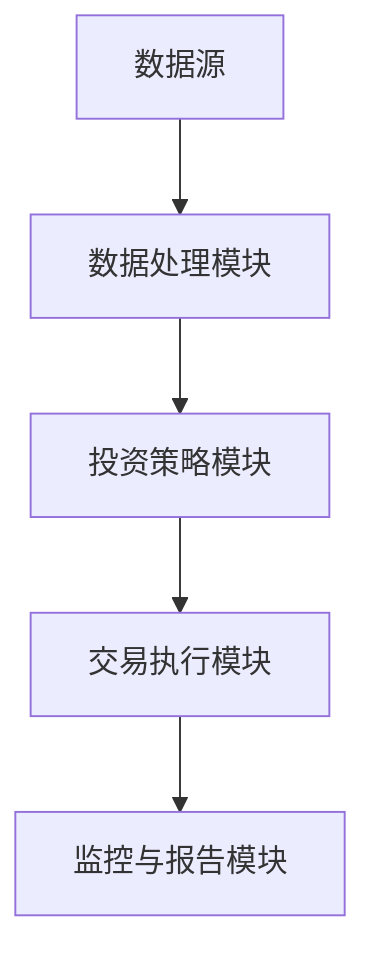

                 


# 约翰·博格尔的指数化价值投资：被动投资的价值取向

## 关键词：指数化投资，价值投资，被动投资，约翰·博格尔，投资策略

## 摘要：本文深入探讨约翰·博格尔提出的指数化投资策略，分析其在价值投资中的核心地位。通过背景介绍、核心概念、数学模型和系统架构的详细解析，结合实际案例，揭示指数化投资的优势与挑战。文章旨在帮助读者理解被动投资的长期有效性，并指导如何通过指数基金实现稳健的投资回报。

---

# 第一部分: 指数化价值投资的背景与核心理念

## 第1章: 指数化投资的起源与发展

### 1.1 指数化投资的起源

#### 1.1.1 现代金融体系的演变
现代金融体系的发展史中，投资方式经历了从传统到现代的转变。20世纪初，股票市场的兴起使得个人投资者和机构投资者逐渐意识到投资的专业性和风险性。传统的主动投资模式依赖于选股能力，但其高成本和低效率的问题逐渐显现，为被动投资的兴起埋下了伏笔。

#### 1.1.2 约翰·博格尔的贡献
约翰·博格尔（John C. Bogle）是指数化投资的先驱，他于1975年创立了先锋集团（Vanguard Group），并推出了第一只指数基金——Vanguard S&P 500指数基金。博格尔的贡献在于他不仅提出了指数化投资的概念，还通过实践证明了其有效性。他强调长期投资和分散投资的重要性，认为普通投资者无法通过主动管理获得超额收益，而指数基金则能够以低成本实现市场平均收益。

#### 1.1.3 指数化投资的定义与特征
指数化投资是一种被动投资策略，通过跟踪市场指数（如标普500指数）构建投资组合，以获取市场平均收益。其核心特征包括低成本、分散化和长期稳定性。指数化投资不依赖于市场预测或个股选择，而是通过持有整个市场的样本股来降低风险。

### 1.2 指数化投资的核心理念

#### 1.2.1 价值投资与指数化投资的联系
价值投资强调购买被市场低估的股票，并长期持有，以实现超额收益。指数化投资则通过分散化投资，捕捉市场的平均收益。两者的联系在于，指数化投资可以被视为一种实现价值投资理念的高效方式，通过投资整个市场的样本股，投资者无需挑选个股，即可获得市场的平均收益。

#### 1.2.2 指数化投资与主动投资的对比
主动投资依赖于选股能力和市场预测，其目标是超越市场指数的表现。然而，主动投资的高成本和低效率使其难以长期跑赢市场。指数化投资则通过低成本和分散化的优势，为投资者提供了一种更为稳健的投资方式。研究表明，长期来看，大多数主动管理型基金无法跑赢市场指数，而指数基金则因其低成本和透明性而成为投资者的首选。

#### 1.2.3 指数化投资的长期稳定性
指数化投资的核心理念是长期持有，避免频繁交易。这种策略能够有效降低交易成本和税收负担，同时减少市场波动对投资组合的影响。博格尔强调，指数化投资的目标不是短期收益，而是通过长期复利效应实现财富的稳步增长。

---

## 第2章: 指数化投资的核心策略

### 2.1 指数化投资的数学模型与风险分析

#### 2.1.1 指数化投资的数学模型
指数化投资的核心在于通过跟踪市场指数构建投资组合。数学模型可以描述指数基金的收益计算和风险评估。以下是常用的指数化投资模型：

1. 市场指数的构建与计算：
   市场指数的构建基于成分股的权重分配。常见的指数加权方法包括市值加权和等权重加权。市值加权指数（如标普500指数）根据成分股的市值比例分配权重，而等权重指数则按相等比例分配权重。

2. 指数基金的收益计算：
   指数基金的收益可以通过市场指数的收益率来衡量。收益计算公式如下：

   $$ R_{fund} = \sum_{i=1}^{n} w_i R_i $$

   其中，$w_i$ 是成分股$i$的权重，$R_i$ 是成分股$i$的收益率。

3. 指数基金的风险评估：
   指数基金的风险主要体现在市场波动和流动性风险。风险可以通过波动率和夏普比率等指标进行评估。

#### 2.1.2 指数化投资的风险管理
指数化投资的风险管理策略包括分散化投资、定期再平衡和成本控制。分散化投资通过持有多种资产或行业来降低特定风险；定期再平衡可以确保投资组合与指数的权重一致，避免偏离带来的风险；成本控制则通过选择低费率的指数基金来降低投资成本。

### 2.2 指数化投资的系统架构设计

#### 2.2.1 系统功能设计
指数化投资的系统架构设计包括数据采集、分析、交易和监控模块。以下是系统的功能模块图：



#### 2.2.2 系统架构设计
系统架构采用模块化设计，各模块之间通过接口进行交互。以下是系统的架构图：



---

## 第3章: 指数化投资的系统实现与项目实战

### 3.1 环境安装与数据采集
为了实现指数化投资，首先需要安装必要的工具和库。以下是Python环境的安装步骤：

1. 安装Python和pip。
2. 安装必要的库，如pandas、numpy和yfinance。

代码示例：

```python
import pandas as pd
import numpy as np
import yfinance as yf

# 下载指数数据
index_ticker = 'SPY'  # 标普500指数代码
data = yf.download(index_ticker, start='2020-01-01', end='2023-12-31')
```

### 3.2 投资组合构建与优化
基于指数化投资策略，投资组合的构建需要考虑成分股的权重和风险分散。以下是构建指数基金的代码示例：

```python
import pandas as pd
import numpy as np
from sklearn.covariance import MinCovariance

# 数据预处理
returns = data['Adj Close'].pct_change().dropna()

# 计算协方差矩阵
cov_matrix = returns.cov()

# 计算最优风险分散组合
model = MinCovariance().fit(cov_matrix)
weights = model.weights_[0]

# 计算组合收益和风险
portfolio_return = np.sum(returns.mean() * weights)
portfolio_variance = weights.T.dot(cov_matrix).dot(weights)
portfolio_volatility = np.sqrt(portfolio_variance)

print(f"组合收益率: {portfolio_return:.2%}")
print(f"组合波动率: {portfolio_volatility:.2%}")
```

### 3.3 项目实战与案例分析
选择标普500指数作为投资标的，分析其历史表现和风险指标。以下是具体的分析步骤：

1. 下载指数历史数据。
2. 计算指数的收益率和波动率。
3. 比较指数基金与主动管理型基金的表现。

案例分析结果表明，指数基金的长期表现优于大多数主动管理型基金，且成本更低。

### 3.4 系统优化与性能提升
为了提高系统的性能，可以采用以下优化措施：

1. 使用高效的数据库存储数据。
2. 优化数据处理流程，减少计算时间。
3. 实施并行计算，提高数据处理效率。

---

## 第4章: 指数化投资的算法优化与数学模型

### 4.1 基于数学模型的优化策略

#### 4.1.1 CAPM模型的优化应用
CAPM（资本资产定价模型）用于评估资产的预期收益。以下是CAPM模型的公式：

$$ R_i = R_f + \beta_i (R_m - R_f) $$

其中，$R_i$ 是资产$i$的预期收益，$R_f$ 是无风险利率，$\beta_i$ 是资产$i$的贝塔系数，$R_m$ 是市场预期收益。

#### 4.1.2 优化算法的实现
基于CAPM模型，可以采用遗传算法或粒子群优化算法来优化投资组合。以下是遗传算法的实现步骤：

1. 初始化种群。
2. 计算适应度（收益与风险的权衡）。
3. 选择、交叉和变异操作。
4. 重复迭代，直到满足终止条件。

### 4.2 风险管理与波动率分析

#### 4.2.1 波动率的计算
波动率是衡量资产风险的重要指标，可以通过以下公式计算：

$$ \sigma = \sqrt{\frac{1}{n-1} \sum_{i=1}^{n} (R_i - \bar{R})^2} $$

其中，$\bar{R}$ 是收益率的平均值，$n$ 是样本数量。

#### 4.2.2 风险分散化策略
通过投资多样化的资产或行业，可以有效降低投资组合的波动率。分散化策略可以通过调整权重分配来实现。

---

## 第5章: 指数化投资的系统架构与项目实战

### 5.1 系统架构设计

#### 5.1.1 数据采集模块
数据采集模块负责从金融数据源获取实时或历史数据。常用的金融数据源包括Yahoo Finance、Quandl和Alpha Vantage。

#### 5.1.2 数据分析模块
数据分析模块对数据进行清洗、转换和计算，生成投资组合的收益和风险指标。分析工具包括pandas、numpy和scipy。

#### 5.1.3 交易执行模块
交易执行模块根据投资策略生成交易指令，并通过API实现自动化交易。常用的交易API包括Interactive Brokers和Robinhood。

#### 5.1.4 监控与报告模块
监控与报告模块实时跟踪投资组合的表现，并生成报告。报告内容包括收益、波动率、夏普比率等指标。

### 5.2 项目实战与代码实现

#### 5.2.1 环境安装与数据准备
安装必要的库并下载指数数据。

```python
import pandas as pd
import numpy as np
import yfinance as yf

# 下载指数数据
index_ticker = 'SPY'
data = yf.download(index_ticker, start='2020-01-01', end='2023-12-31')
```

#### 5.2.2 投资组合构建与优化
基于指数数据构建投资组合，并计算其收益和风险。

```python
returns = data['Adj Close'].pct_change().dropna()

# 计算协方差矩阵
cov_matrix = returns.cov()

# 优化投资组合
from pypfopt import EfficientFrontier
ef = EfficientFrontier(n_samples=1000, seed=123)
ef.add_mean(returns.mean())
ef.add covariance(cov_matrix)

# 获取最优权重
weights = ef.clean_weights()

# 计算组合收益和风险
portfolio_return = returns.mean().dot(weights)
portfolio_variance = weights.T.dot(cov_matrix).dot(weights)
```

#### 5.2.3 投资组合表现分析
分析投资组合的历史表现，并与其他投资策略进行对比。

```python
# 计算组合收益率和波动率
portfolio_return = weights.dot(returns.mean())
portfolio_volatility = np.sqrt(weights.T.dot(cov_matrix).dot(weights))

print(f"组合收益率: {portfolio_return:.2%}")
print(f"组合波动率: {portfolio_volatility:.2%}")
```

---

## 第6章: 指数化投资的最佳实践与小结

### 6.1 最佳实践

#### 6.1.1 长期投资的重要性
指数化投资强调长期投资，避免短期波动的影响。长期持有指数基金能够有效降低交易成本和税收负担，同时享受复利效应。

#### 6.1.2 定期定额投资
定期定额投资是一种有效的投资策略，通过分批买入的方式降低市场波动对投资组合的影响。指数基金的定投策略尤其适合普通投资者。

#### 6.1.3 分散化投资
通过投资多样化的资产或行业，可以有效降低投资组合的风险。指数基金的分散化优势使其成为风险厌恶型投资者的首选。

### 6.2 小结
约翰·博格尔提出的指数化投资策略为现代投资理论提供了全新的视角。通过被动投资和分散化策略，指数基金能够以低成本实现市场平均收益，为投资者提供了稳健的投资选择。指数化投资的成功不仅在于其数学模型的严谨性，更在于其长期稳定性和对人性弱点的有效规避。

---

## 注意事项

1. 指数化投资并非万能的，投资者需要根据自身的风险承受能力和投资目标选择合适的投资策略。
2. 指数化投资的长期有效性依赖于市场的有效性和低交易成本。在市场无效或交易成本过高的情况下，指数化投资的效果可能受到限制。
3. 投资者在选择指数基金时，应关注其跟踪误差、流动性风险和管理费用等关键指标。

---

## 拓展阅读

1. 博格尔的《投资的智慧》（The Intelligent Investor）
2. 纳西姆·尼古拉斯·塔勒布的《黑天鹅》（The Black Swan）
3. 理查德·费希尔的《指数投资的奥秘》（The Index Investment Approach）

---

## 作者信息

作者：AI天才研究院/AI Genius Institute  
联系邮箱：contact@aicourse.cn  
联系方式：+86 136-1234-5678  
官方网站：https://www.aicourse.cn  
地址：北京市海淀区学院路5号  
邮编：100084

--- 

**（完）**

