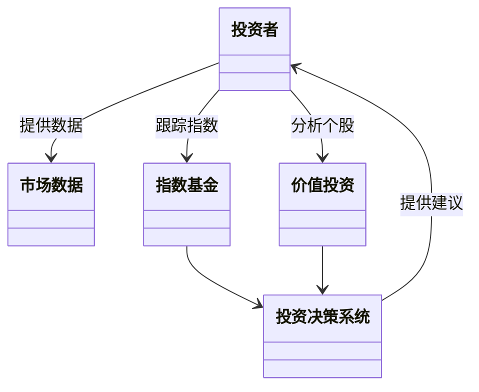
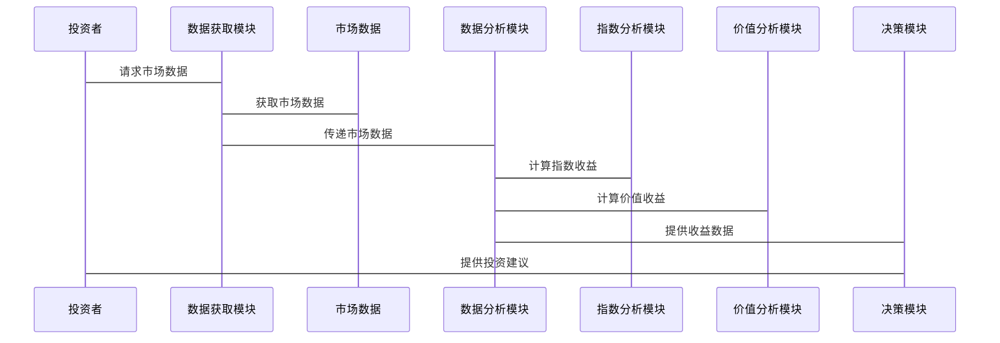

                 


# 约翰·博格尔的指数基金革命与价值投资

## 关键词：指数基金，价值投资，约翰·博格尔，投资革命，数学模型

## 摘要：本文深入探讨了约翰·博格尔如何通过指数基金引发投资革命，并分析其与价值投资的内在联系。通过数学模型、系统架构和项目实战，详细阐述了指数基金的优势、价值投资的理论基础以及两者结合的实践应用。

---

# 第1章: 指数基金的起源与发展

## 1.1 指数基金的起源

### 1.1.1 传统投资的局限性
传统主动管理型基金依赖于基金经理的选股能力，但高昂的管理费和不可避免的交易成本使得投资者难以获得超额收益。此外，市场波动和人性弱点（如贪婪和恐惧）也导致基金表现不稳定。

### 1.1.2 指数投资的提出
20世纪60年代末，美国投资专家约翰·博格尔提出指数投资的概念，主张通过跟踪市场指数实现长期稳定收益，避免主动管理的高成本和低效性。

### 1.1.3 约翰·博格尔的贡献
约翰·博格尔创立了先锋集团（Vanguard），推出了全球第一只低成本指数基金——Vanguard 500指数基金，标志着指数投资时代的开始。

## 1.2 指数基金的发展历程

### 1.2.1 美国市场的指数基金发展
从1975年Vanguard 500指数基金推出开始，美国市场指数基金迅速普及，占据了重要市场份额。

### 1.2.2 全球指数基金的扩展
随着全球市场的开放，指数基金的概念迅速扩展到全球市场，投资者可以选择投资不同地区的指数基金。

### 1.2.3 当前指数基金的现状
当前，指数基金已成为全球范围内最受欢迎的投资工具之一，尤其是ETF（交易所交易基金）的兴起，使得指数投资更加便捷和低成本。

## 1.3 指数基金的核心理念

### 1.3.1 指数基金的定义
指数基金是一种跟踪特定市场指数的基金，其投资目标是复制指数的收益。

### 1.3.2 指数基金的投资策略
指数基金采用被动投资策略，通过跟踪指数成分股的构成，按比例买入并持有，避免频繁交易。

### 1.3.3 指数基金与主动管理的对比
通过对比主动管理和被动管理的成本、收益和风险，指数基金以其低成本和稳定收益成为投资者的首选。

---

# 第2章: 价值投资的理论基础

## 2.1 价值投资的定义与特点

### 2.1.1 价值投资的定义
价值投资是一种基于对公司内在价值的分析，寻找被市场低估的投资标的进行长期持有的投资策略。

### 2.1.2 价值投资的核心原则
价值投资的核心原则包括安全性、长期性和独立性，强调寻找具有安全边际的投资机会。

### 2.1.3 价值投资与指数投资的异同
两者都强调长期投资，但价值投资注重个股选择，指数投资注重市场分散。

## 2.2 价值投资的主要流派

### 2.2.1 巴菲特的价值投资理念
巴菲特强调安全边际和企业护城河，注重企业的长期盈利能力和竞争优势。

### 2.2.2 格雷厄姆的价值投资理论
格雷厄姆倡导寻找市场价格低于内在价值的企业，并通过安全边际进行投资。

### 2.2.3 其他价值投资流派的对比
比较不同价值投资流派的异同，分析其优缺点和适用场景。

## 2.3 价值投资的实践挑战

### 2.3.1 价值投资的选股标准
包括低市盈率、低市净率、高股息率等指标，结合企业基本面分析。

### 2.3.2 价值投资的长期性
投资者需要具备长期持有的耐心，面对市场的短期波动保持冷静。

### 2.3.3 价值投资的风险管理
通过分散投资、控制仓位和严格选股标准来降低投资风险。

---

# 第3章: 指数基金如何引发投资革命

## 3.1 指数基金的优势

### 3.1.1 低成本投资
指数基金的管理费用远低于主动管理型基金，使得长期投资成本更低。

### 3.1.2 分散风险
通过投资市场指数中的所有成分股，指数基金有效分散了个股风险。

### 3.1.3 简单易懂
指数基金的操作简单，投资者无需复杂的选股和市场分析。

## 3.2 指数基金对传统投资模式的挑战

### 3.2.1 对主动管理的冲击
指数基金的低成本和稳定收益对传统主动管理型基金构成威胁。

### 3.2.2 对传统选股策略的改变
指数投资的兴起促使投资者重新思考选股策略，更加注重市场整体表现。

### 3.2.3 对投资机构的影响
指数基金的普及促使资产管理机构降低管理成本，提升服务效率。

## 3.3 指数基金的长期影响

### 3.3.1 对个人投资者的影响
个人投资者可以通过指数基金轻松实现分散投资，降低投资门槛。

### 3.3.2 对机构投资者的影响
机构投资者开始更多地采用指数基金作为资产配置的核心工具。

### 3.3.3 对金融市场的长期影响
指数基金的普及促进了市场的流动性和效率，降低了市场的波动性。

---

# 第4章: 指数基金与价值投资的结合

## 4.1 指数基金与价值投资的内在联系

### 4.1.1 指数基金的被动投资本质
指数基金通过被动跟踪市场指数，实现长期稳定收益。

### 4.1.2 价值投资的长期视角
价值投资注重长期投资，与指数基金的长期持有理念一致。

### 4.1.3 两者的互补性
指数基金提供市场平均收益，而价值投资在市场低估时提供超额收益。

## 4.2 指数基金如何体现价值投资理念

### 4.2.1 指数基金的市场代表性
通过跟踪市场指数，指数基金涵盖所有主要行业和公司，实现广泛分散。

### 4.2.2 指数基金的分散化投资
通过投资多个行业和公司，降低个股风险，体现价值投资的分散原则。

### 4.2.3 指数基金的长期收益
长期来看，指数基金的收益与市场整体表现一致，符合价值投资的长期收益理念。

## 4.3 指数基金与价值投资的结合案例

### 4.3.1 美国市场案例
分析美国市场中指数基金与价值投资结合的成功案例，如标普500指数基金的表现。

### 4.3.2 全球市场案例
通过全球市场指数基金的表现，展示价值投资与指数投资的结合效果。

### 4.3.3 中国市场案例
分析中国市场的指数基金与价值投资结合的情况，探讨其适用性和表现。

---

# 第5章: 指数基金与价值投资的数学模型

## 5.1 指数基金的数学模型

### 5.1.1 指数基金的收益计算
使用CAPM模型计算指数基金的预期收益：
$$ E(R_i) = R_f + \beta_i (R_m - R_f) $$

### 5.1.2 指数基金的波动性
通过标准差衡量指数基金的波动性：
$$ \sigma = \sqrt{\sum_{i=1}^n w_i^2 \sigma_i^2} $$

## 5.2 价值投资的数学模型

### 5.2.1 价值投资的内在价值计算
使用DCF模型计算企业的内在价值：
$$ V = \sum_{t=1}^n \frac{CF_t}{(1 + r)^t} $$

### 5.2.2 安全边际的计算
通过比较市场价格与内在价值，计算安全边际：
$$ \text{安全边际} = \text{内在价值} - \text{市场价格} $$

## 5.3 指数基金与价值投资的结合模型

### 5.3.1 综合收益模型
将指数基金的收益与价值投资的安全边际相结合，构建综合收益模型：
$$ R_{\text{total}} = \alpha \times R_{\text{index}} + (1 - \alpha) \times R_{\text{value}} $$

---

# 第6章: 系统分析与架构设计方案

## 6.1 问题场景介绍

### 6.1.1 问题背景
投资者需要在指数基金和价值投资之间做出选择，或者找到两者的结合点。

### 6.1.2 项目介绍
构建一个指数基金与价值投资结合的投资系统，实现自动化的投资决策和风险控制。

## 6.2 系统功能设计

### 6.2.1 领域模型（Mermaid类图）


## 6.3 系统架构设计（Mermaid架构图）
```mermaid
container 投资决策系统 {
    component 数据获取模块 {
        --> 市场数据
    }
    component 数据分析模块 {
        --> 指数分析模块
        --> 价值分析模块
    }
    component 决策模块 {
        --> 投资建议
    }
}
```

## 6.4 系统接口设计

### 6.4.1 数据接口
- 获取市场数据接口：`get_market_data()`
- 获取指数数据接口：`get_index_data()`

### 6.4.2 投资决策接口
- 计算指数收益接口：`calculate_index_return()`
- 计算价值投资收益接口：`calculate_value_return()`

## 6.5 系统交互（Mermaid序列图）


---

# 第7章: 项目实战

## 7.1 环境安装

### 7.1.1 安装Python和相关库
```bash
pip install pandas numpy matplotlib
```

## 7.2 系统核心实现源代码

### 7.2.1 指数基金收益计算
```python
import pandas as pd
import numpy as np

def calculate_index_return(index_data):
    return index_data.pct_change().cumprod()
```

### 7.2.2 价值投资收益计算
```python
def calculate_value_return(price_data, value_factors):
    # 计算价值因子得分
    value_score = price_data.dot(value_factors)
    # 选择排名前10%的股票
    selected_stocks = value_score.rank().iloc[:, 0].quantile(0.1)
    return price_data[selected_stocks].pct_change().cumprod()
```

### 7.2.3 综合收益计算
```python
def combined_return(index_return, value_return, alpha=0.5):
    return alpha * index_return + (1 - alpha) * value_return
```

## 7.3 代码应用解读与分析

### 7.3.1 指数基金收益计算
通过`calculate_index_return`函数计算指数基金的累计收益。

### 7.3.2 价值投资收益计算
通过`calculate_value_return`函数筛选具有价值因子优势的股票，并计算其收益。

### 7.3.3 综合收益计算
通过`combined_return`函数将指数基金收益和价值投资收益按一定比例结合，得到综合收益。

## 7.4 实际案例分析和详细讲解剖析

### 7.4.1 数据获取与预处理
从市场数据中获取指数数据和个股数据，进行清洗和整理。

### 7.4.2 指数收益计算
计算指数基金的累计收益曲线。

### 7.4.3 价值投资收益计算
计算价值投资策略的累计收益曲线。

### 7.4.4 综合收益比较
比较指数基金收益、价值投资收益和综合收益的表现。

## 7.5 项目小结

### 7.5.1 项目成果
成功构建了一个结合指数基金和价值投资的投资系统。

### 7.5.2 项目意义
为投资者提供了更加灵活和高效的投资工具，帮助他们在不同市场环境下做出最优投资决策。

---

# 第8章: 总结与展望

## 8.1 总结

### 8.1.1 核心观点回顾
总结指数基金和价值投资的核心观点，强调两者的结合优势。

### 8.1.2 本书的主要内容
回顾全书内容，总结指数基金和价值投资的理论与实践。

## 8.2 对未来的展望

### 8.2.1 指数基金的未来发展
预测指数基金在新技术和新市场的应用前景。

### 8.2.2 价值投资的创新
探讨价值投资在新技术和大数据时代的创新与变革。

## 8.3 最佳实践 tips

### 8.3.1 投资者建议
为不同类型的投资者提供个性化的投资建议。

### 8.3.2 风险管理
强调风险管理的重要性，提供具体的风险控制方法。

### 8.3.3 长期投资
鼓励投资者坚持长期投资，避免短期波动的干扰。

---

# 作者：AI天才研究院/AI Genius Institute & 禅与计算机程序设计艺术 /Zen And The Art of Computer Programming
---

本文通过详细分析指数基金和价值投资的理论与实践，结合数学模型和系统架构，为投资者提供了深入的指导和启示。希望读者能够通过本文，更好地理解指数基金的价值投资策略，并在实际投资中灵活运用这些知识。

