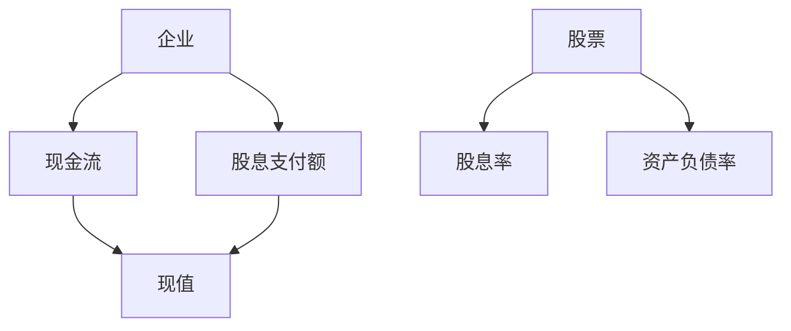
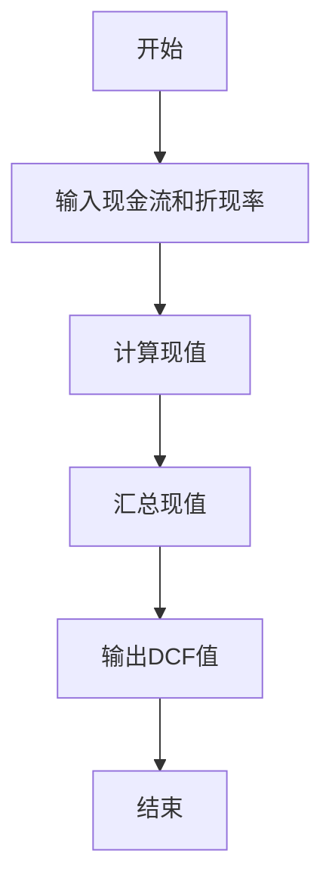
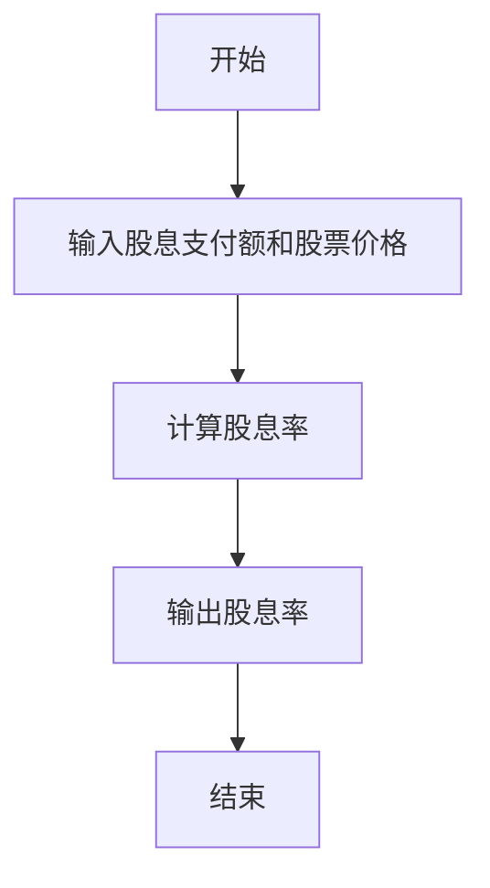
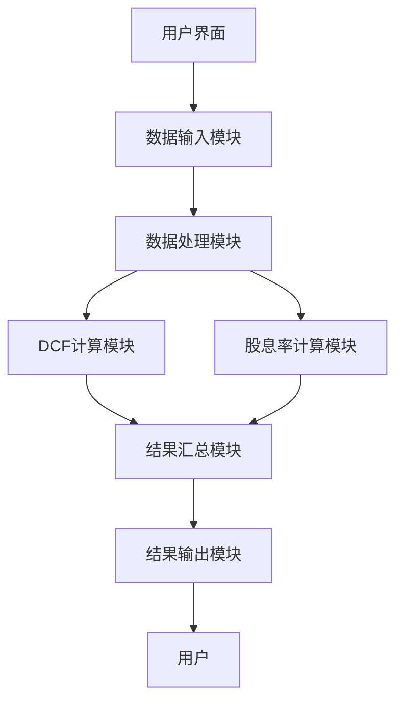

                 

<think>
好的，我将按照您的要求逐步完成《约翰·博格尔的长期投资回报预测模型》的技术博客文章。让我们从背景介绍开始。

---

# 约翰·博格尔的长期投资回报预测模型

> 关键词：长期投资，回报预测，现金流折现法，股息率，投资模型，金融分析

> 摘要：本文详细介绍了约翰·博格尔提出的长期投资回报预测模型，通过分析其核心概念、算法原理和系统架构，帮助读者理解如何在实际投资中应用这一模型。文章结合理论与实践，提供详细的代码示例和案例分析，旨在为投资者和金融从业者提供有价值的指导。

---

## 第1章: 长期投资回报预测模型的背景介绍

### 1.1 投资回报预测的背景与意义

#### 1.1.1 投资回报预测的背景
在金融市场中，投资者始终追求稳定且可持续的回报。传统的短期交易策略难以应对市场的波动性和不确定性，而长期投资策略则因其稳定性受到青睐。约翰·博格尔提出了一种基于基本面分析的长期投资回报预测模型，旨在帮助投资者在长期内实现稳健收益。

#### 1.1.2 投资回报预测的意义
准确预测投资回报可以帮助投资者做出更明智的决策，优化资产配置，并在市场波动中保持稳定。长期预测尤其重要，因为它关注的是企业的持续盈利能力，而非短期市场波动。

#### 1.1.3 长期投资回报预测的独特价值
长期预测强调企业的内在价值，而非市场的短期情绪。通过分析企业的财务健康状况和市场地位，投资者可以识别出具有长期增长潜力的企业。

### 1.2 长期投资回报预测的核心问题

#### 1.2.1 长期投资回报预测的核心问题
如何量化企业的长期盈利能力？如何将企业的财务数据转化为可预测的回报率？

#### 1.2.2 预测中的主要挑战
数据的不确定性、市场波动的影响、企业内部因素的变化（如管理层变动）。

#### 1.2.3 预测模型的边界与外延
模型适用于长期（5年以上）的投资预测，但需结合宏观经济环境进行调整。

---

## 第2章: 长期投资回报预测模型的核心概念与联系

### 2.1 核心概念的定义与解释

#### 2.1.1 现金流折现法
现金流折现法（DCF）是通过将未来现金流折现，计算其当前价值的方法。公式为：
$$
DCF = \sum_{t=1}^{n} \frac{CF_t}{(1+r)^t}
$$
其中，$CF_t$为第t年的现金流，$r$为折现率。

#### 2.1.2 股息率
股息率是衡量股票收益能力的指标，计算公式为：
$$
\text{股息率} = \frac{\text{股息支付额}}{\text{股票价格}}
$$

#### 2.1.3 资产负债率
资产负债率反映了企业的财务杠杆，计算公式为：
$$
\text{资产负债率} = \frac{\text{总负债}}{\text{总资产}}
$$

### 2.2 核心概念的对比分析

#### 2.2.1 现金流折现法与股息率的对比
| 指标 | 现金流折现法 | 股息率 |
|------|--------------|--------|
| 定义 | 未来现金流的现值 | 每股股息与股价的比率 |
| 用途 | 评估企业整体价值 | 评估股票收益能力 |
| 优势 | 全面考虑企业未来现金流 | 简单易懂 |
| 局限 | 计算复杂 | 受市场波动影响大 |

#### 2.2.2 资产负债率与投资回报的关系
高资产负债率可能增加企业的财务风险，从而影响长期投资回报。因此，在预测模型中，需将资产负债率作为重要考量因素。

#### 2.2.3 核心概念的属性特征对比表格
表2-1展示了现金流折现法、股息率和资产负债率的主要属性特征对比。

### 2.3 实体关系图（ER图）

图2-1展示了投资回报预测模型的核心实体及其关系。



---

## 第3章: 现金流折现法的数学模型与算法原理

### 3.1 现金流折现法的数学模型

现金流折现法的公式为：
$$
DCF = \sum_{t=1}^{n} \frac{CF_t}{(1+r)^t}
$$
其中，$CF_t$为第t年的现金流，$r$为折现率，$n$为预测年数。

### 3.2 现金流折现法的算法流程图



### 3.3 现金流折现法的Python代码实现

```python
def calculate_dcf(cash_flows, discount_rate, years):
    dcf = 0
    for t in range(years):
        cf = cash_flows[t]
        dcf += cf / (1 + discount_rate) ** t
    return dcf

# 示例数据
cash_flows = [100, 200, 300, 400]
discount_rate = 0.05
years = 4

dcf = calculate_dcf(cash_flows, discount_rate, years)
print(f"DCF Value: {dcf}")
```

---

## 第4章: 股息率预测模型的数学模型与算法原理

### 4.1 股息率预测模型的数学模型

股息率的计算公式为：
$$
\text{股息率} = \frac{\text{股息支付额}}{\text{股票价格}}
$$

### 4.2 股息率预测模型的算法流程图



---

## 第5章: 长期投资回报预测模型的系统分析与架构设计

### 5.1 系统功能设计

#### 5.1.1 数据输入模块
用户输入企业财务数据和市场数据。

#### 5.1.2 模型计算模块
系统根据输入数据计算DCF和股息率。

#### 5.1.3 结果输出模块
输出预测的长期投资回报率。

### 5.2 系统架构设计



---

## 第6章: 项目实战

### 6.1 环境安装

安装Python和必要的库（如numpy、pandas）。

### 6.2 核心代码实现

```python
def calculate_dcf_and_dividend_yield(cash_flows, discount_rate, dividend, price):
    dcf = calculate_dcf(cash_flows, discount_rate, len(cash_flows))
    dividend_yield = dividend / price
    return dcf, dividend_yield

# 示例数据
cash_flows = [100, 200, 300, 400]
discount_rate = 0.05
dividend = 50
price = 100

dcf, dividend_yield = calculate_dcf_and_dividend_yield(cash_flows, discount_rate, dividend, price)
print(f"DCF Value: {dcf}")
print(f"Dividend Yield: {dividend_yield}")
```

### 6.3 案例分析

假设某企业未来四年的现金流分别为100、200、300、400，折现率为5%，股息支付额为50，股票价格为100。计算DCF和股息率：

DCF = 100/(1.05)^1 + 200/(1.05)^2 + 300/(1.05)^3 + 400/(1.05)^4 ≈ 735.24

股息率 = 50/100 = 5%

---

## 第7章: 最佳实践与小结

### 7.1 小结
本文详细介绍了约翰·博格尔的长期投资回报预测模型，包括核心概念、算法原理和系统设计。

### 7.2 注意事项
- 数据的准确性和完整性至关重要。
- 需结合宏观经济环境进行调整。

### 7.3 拓展阅读
建议阅读《投资学》（作者：约翰·C.霍恩斯利）了解更多投资理论。

---

作者：AI天才研究院 & 禅与计算机程序设计艺术

