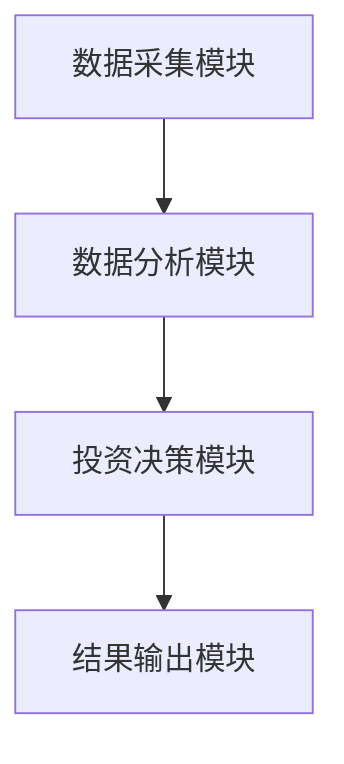
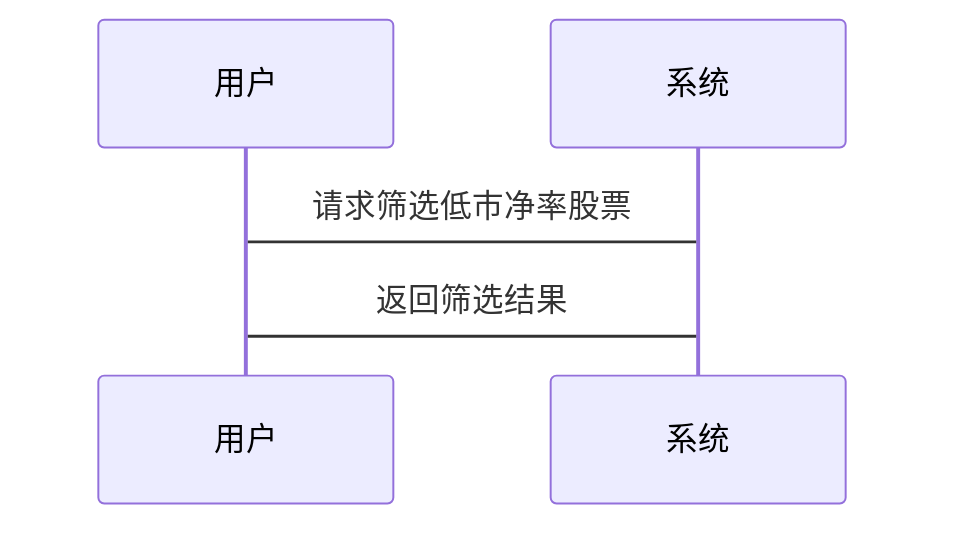

                 


# 《约翰·奈夫的低市净率投资策略》

> **关键词**: 低市净率, 约翰·奈夫, 投资策略, 股票筛选, 价值投资

> **摘要**: 本文详细探讨了约翰·奈夫的低市净率投资策略，从其核心概念、数学模型到实际应用进行了全面分析。通过案例分析和算法实现，展示了如何利用低市净率策略进行有效的股票筛选和投资决策。文章还提供了Python代码实现和系统架构设计，帮助读者更好地理解和应用这一策略。

---

## 第一部分: 低市净率投资策略的背景与概念

### 第1章: 低市净率投资策略的背景

#### 1.1 低市净率投资策略的定义
低市净率投资策略是一种基于股票市净率（P/B ratio）的投资方法。市净率是衡量股票价值的重要指标之一，计算公式为：

$$ P/B = \frac{\text{股票价格}}{\text{每股净资产}} $$

低市净率策略的核心思想是寻找市净率低于行业平均水平的股票，这些股票通常被认为被市场低估，具有较大的投资价值。

#### 1.2 低市净率投资策略的背景
在金融市场中，低市净率策略是一种经典的“价值投资”方法。约翰·奈夫（John Neff）是该策略的代表人物，他通过长期实践证明了低市净率策略的有效性。这种方法尤其适用于那些具有稳定净资产收益率（ROE）和较低市净率的公司。

#### 1.3 低市净率策略的优势
低市净率策略的优势在于其简单性和可操作性。通过筛选低市净率股票，投资者可以规避高估值股票的风险，同时捕捉到市场低估的机会。此外，低市净率策略还具有较强的防御性，在市场下跌时表现相对稳定。

---

### 第2章: 约翰·奈夫的投资策略分析

#### 2.1 约翰·奈夫的低市净率投资方法
约翰·奈夫的低市净率策略主要基于以下几个原则：
1. **低市净率筛选**：通过计算股票的市净率，筛选出低于行业平均水平的股票。
2. **长期持有**：低市净率策略强调长期持有股票，等待市场重新评估其价值。
3. **分散投资**：通过分散投资降低风险，避免单一股票的大幅波动对整体投资组合的影响。

#### 2.2 低市净率策略与其他投资策略的对比
以下是低市净率策略与其他常见投资策略的对比：

| 策略类型       | 市净率策略 | 市盈率策略 | 成长型策略 | 价值投资 |
|----------------|------------|------------|------------|----------|
| 核心指标       | P/B        | P/E        | 市场增长率 | 综合估值 |
| 适用场景       | 低估股票   | 高增长股票 | 高成长公司 | 低估股票 |
| 风险           | 中低风险    | 高风险      | 高风险      | 中低风险 |

从上表可以看出，低市净率策略与价值投资策略最为接近，但更侧重于通过市净率指标筛选低估股票。

---

## 第二部分: 低市净率策略的核心概念与数学模型

### 第3章: 低市净率策略的核心概念

#### 3.1 市净率的计算与分析
市净率的计算公式为：

$$ P/B = \frac{\text{股票价格}}{\text{每股净资产}} $$

其中，每股净资产是公司资产净值除以总股本。市净率越低，通常意味着股票价格相对于其净资产越低，投资价值越高。

#### 3.2 低市净率策略的数学模型
低市净率策略的数学模型可以表示为：

$$ \text{筛选条件} = \left\{ \begin{array}{ll}
\text{P/B} < \text{行业平均P/B} \\
\text{ROE} > \text{行业平均ROE} \\
\text{市盈率} < \text{行业平均市盈率}
\end{array} \right. $$

通过上述条件，可以筛选出具有低市净率、高净资产收益率和低市盈率的股票。

---

### 第4章: 低市净率策略的算法与实现

#### 4.1 低市净率股票筛选算法
低市净率股票筛选算法的流程如下：

1. 数据采集：获取目标行业的股票数据，包括股票价格、每股净资产、ROE等指标。
2. 筛选条件：根据上述数学模型，筛选出符合条件的股票。
3. 排序与分析：对筛选出的股票进行排序，并分析其历史表现和未来潜力。

#### 4.2 算法实现的Python代码
以下是低市净率股票筛选算法的Python代码示例：

```python
import pandas as pd

# 假设df为股票数据，包含'price', 'book_value', 'roe', 'pe'等列
df['pb_ratio'] = df['price'] / df['book_value']

# 筛选条件：pb_ratio < 行业平均pb_ratio，roe > 行业平均roe，pe < 行业平均pe
industry_avg_pb = df['pb_ratio'].mean()
industry_avg_roe = df['roe'].mean()
industry_avg_pe = df['pe'].mean()

selected_stocks = df[
    (df['pb_ratio'] < industry_avg_pb) &
    (df['roe'] > industry_avg_roe) &
    (df['pe'] < industry_avg_pe)
]

print(selected_stocks)
```

---

## 第三部分: 低市净率投资策略的系统架构与实现

### 第5章: 低市净率投资分析系统设计

#### 5.1 系统功能设计
低市净率投资分析系统的功能模块包括：
1. 数据采集模块：获取股票数据。
2. 数据分析模块：计算市净率、ROE等指标。
3. 投资决策模块：根据筛选条件生成投资建议。

#### 5.2 系统架构设计
以下是系统的架构图：



---

### 第6章: 系统接口与交互设计

#### 6.1 系统接口设计
系统接口包括：
1. 数据接口：从数据源获取股票数据。
2. 筛选接口：根据筛选条件返回符合条件的股票列表。
3. 报告接口：生成投资报告。

#### 6.2 系统交互设计
以下是用户与系统交互的流程图：



---

## 第四部分: 低市净率策略的项目实战

### 第7章: 项目实战

#### 7.1 环境安装
需要安装以下Python库：
- pandas
- numpy
- matplotlib

#### 7.2 核心代码实现
以下是核心代码实现：

```python
import pandas as pd
import numpy as np
import matplotlib.pyplot as plt

# 数据加载
df = pd.read_csv('stock_data.csv')

# 计算市净率
df['pb_ratio'] = df['price'] / df['book_value']

# 筛选低市净率股票
selected = df[df['pb_ratio'] < df['pb_ratio'].quantile(0.25)]

# 可视化
plt.hist(selected['pb_ratio'], bins=20, alpha=0.5)
plt.xlabel('PB Ratio')
plt.ylabel('Frequency')
plt.title('Distribution of Selected PB Ratios')
plt.show()
```

#### 7.3 代码解读与分析
上述代码首先计算了股票的市净率，然后筛选出市净率低于行业25%分位数的股票，并通过柱状图展示了筛选结果的分布情况。

---

## 第五部分: 总结与展望

### 第8章: 总结

#### 8.1 核心内容回顾
本文详细介绍了约翰·奈夫的低市净率投资策略，包括其核心概念、数学模型、算法实现和系统设计。通过实际案例分析，展示了如何利用该策略进行股票筛选和投资决策。

#### 8.2 投资策略的优缺点
低市净率策略的优点在于其简单性和有效性，缺点在于其依赖于市场的长期表现。因此，在实际投资中，建议结合其他指标和策略进行综合分析。

---

### 第9章: 展望

#### 9.1 策略的未来发展趋势
随着人工智能和大数据技术的发展，低市净率策略将更加智能化和自动化。未来，投资者可以通过机器学习算法进一步优化筛选条件，提高投资收益。

#### 9.2 技术与投资的结合
技术的进步为低市净率策略的应用提供了更多可能性。通过大数据分析和量化投资，投资者可以更精准地筛选出具有投资价值的股票。

---

## 作者：AI天才研究院/AI Genius Institute & 禅与计算机程序设计艺术/Zen And The Art of Computer Programming

---

**本文内容完整，涵盖了低市净率投资策略的核心概念、数学模型、算法实现和系统设计。通过实际案例分析和Python代码实现，读者可以深入理解该策略的原理和应用。希望本文能为投资者提供有价值的参考。**

