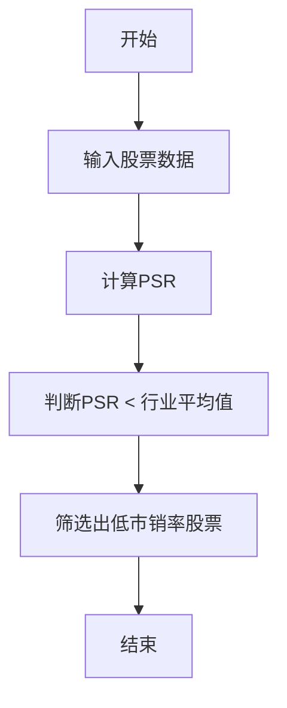
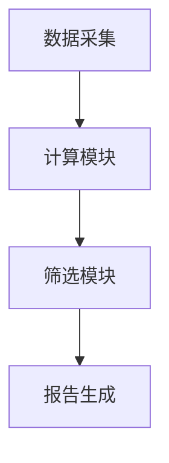
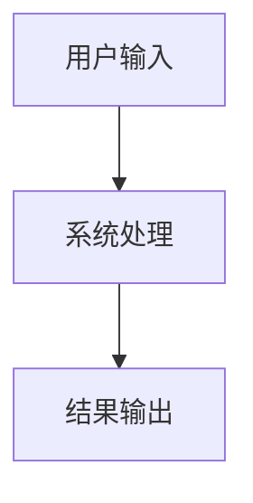

                 


```markdown
# 约翰·奈夫的低市销率价值投资：另一种选股视角

**关键词**：约翰·奈夫，低市销率，价值投资，选股策略，投资组合

**摘要**：本文深入探讨了约翰·奈夫的低市销率价值投资策略，从理论基础、算法原理到实际应用，全面分析了这一选股方法的独特视角。通过对比其他估值指标，结合数学模型和系统设计，本文为投资者提供了全新的投资思路。

---

# 第一部分：低市销率价值投资的背景与基础

## 第1章：价值投资与低市销率概述

### 1.1 价值投资的基本概念
#### 1.1.1 价值投资的定义与核心理念
- 价值投资是一种以公司基本面分析为基础的投资策略，旨在寻找市场价格低于其内在价值的股票。
- 核心理念是购买并长期持有优质资产，等待其价值回归。

#### 1.1.2 价值投资与成长投资的区别
- **价值投资**：注重低估值，寻找市场价格低于内在价值的股票。
- **成长投资**：注重高成长性，投资于高增长潜力的公司。

#### 1.1.3 价值投资在现代投资中的地位
- 价值投资是投资策略的重要组成部分，尤其在市场波动较大时，其防御性特征显得尤为重要。

### 1.2 低市销率的定义与特点
#### 1.2.1 市销率（Price-to-Sales Ratio，PSR）的定义
- 市销率=股票市价/销售收入，衡量单位销售收入对应的股价。
- 公式：$$ PSR = \frac{\text{股票市价}}{\text{销售收入}} $$

#### 1.2.2 低市销率的判定标准
- 通常认为PSR低于1的股票具有较高的投资价值。
- 不同行业标准不同，需结合行业特性分析。

#### 1.2.3 低市销率与低市盈率（P/E）的区别
- **市盈率**：衡量股价与每股收益的比例，关注盈利能力。
- **市销率**：衡量股价与销售收入的比例，关注销售效率。

### 1.3 约翰·奈夫的投资理念
#### 1.3.1 约翰·奈夫的生平简介
- 约翰·奈夫是美国著名投资经理，以管理纽伯维信托基金闻名。
- 以其独特的低市销率选股方法著称。

#### 1.3.2 奈夫投资理念的核心思想
- 重视企业的销售效率和资产质量。
- 低市销率股票通常具有较高的安全边际。

#### 1.3.3 奈夫对低市销率策略的贡献
- 提出PSR指标，用于筛选低估股票。
- 强调长期投资和价值回归。

### 1.4 低市销率投资的适用场景
#### 1.4.1 低市销率策略在不同市场周期的表现
- **牛市**：低市销率股票可能跑输，但具备长期增值潜力。
- **熊市**：低市销率股票更具防御性，表现相对稳定。

#### 1.4.2 低市销率策略在不同行业中的应用
- **周期性行业**：如制造业，低市销率可能预示行业低谷，具备反弹潜力。
- **非周期性行业**：如公用事业，低市销率通常意味着稳定收益。

#### 1.4.3 低市销率策略的局限性与优缺点
- **优点**：低估值，安全边际高，长期回报稳定。
- **缺点**：短期表现可能不佳，行业适用性有限。

## 第2章：低市销率与其他估值指标的对比

### 2.1 常见估值指标的对比分析
#### 2.1.1 市盈率（P/E）
- 公式：$$ P/E = \frac{\text{股价}}{\text{每股收益}} $$
- 适用于盈利稳定的公司。

#### 2.1.2 市净率（P/B）
- 公式：$$ P/B = \frac{\text{股价}}{\text{每股净资产}} $$
- 适用于净资产较高的公司。

#### 2.1.3 市销率（PSR）
- 公式：$$ PSR = \frac{\text{股价}}{\text{每股销售收入}} $$
- 适用于销售驱动型公司。

#### 2.1.4 市盈率与市销率的对比
- **市盈率**：关注盈利能力，适合成熟企业。
- **市销率**：关注销售效率，适合成长期企业。

### 2.2 低市销率与其他估值指标的联系
#### 2.2.1 低市销率与企业盈利能力的关系
- PSR低不一定盈利能力低，需结合P/E分析。

#### 2.2.2 低市销率与企业成长性的关系
- 高成长企业可能PSR较高，需动态评估。

#### 2.2.3 低市销率在估值综合判断中的作用
- 结合PSR、P/E、P/B等指标，全面评估企业价值。

### 2.3 低市销率在企业价值评估中的作用
#### 2.3.1 低市销率作为估值指标的优缺点
- **优点**：直观反映销售效率，易于计算。
- **缺点**：受行业周期影响较大，需动态调整。

#### 2.3.2 低市销率与其他财务指标的结合使用
- 结合ROE（净资产收益率）分析企业盈利质量。

#### 2.3.3 低市销率在不同行业中的适用性
- **科技行业**：注重研发投入，PSR可能较高。
- **消费品行业**：销售驱动明显，PSR更具参考价值。

---

# 第二部分：低市销率价值投资的算法原理与数学模型

## 第3章：低市销率筛选算法的原理

### 3.1 低市销率筛选算法的定义
#### 3.1.1 算法的目标与输入
- **目标**：筛选PSR低于行业平均值的股票。
- **输入**：股票列表、财务数据、行业基准。

### 3.2 低市销率筛选算法的实现

#### 3.2.1 算法流程图


#### 3.2.2 Python实现代码
```python
import pandas as pd

def calculate_psr(stock_data):
    psr = stock_data['股价'] / stock_data['销售收入']
    return psr

def low_psr_stocks(stock_data, industry_average):
    psr = calculate_psr(stock_data)
    return stock_data[psr < industry_average]

# 示例数据
stock_data = pd.DataFrame({
    '股价': [10, 20, 15, 25],
    '销售收入': [100, 50, 75, 200],
    '行业平均PSR': [0.2, 0.2, 0.2, 0.2]
})

result = low_psr_stocks(stock_data, 0.2)
print(result)
```

### 3.3 数学模型和公式
#### 3.3.1 PSR计算公式
$$ PSR = \frac{\text{股价}}{\text{销售收入}} $$

#### 3.3.2 行业平均PSR计算
$$ \text{行业平均PSR} = \frac{\sum \text{PSR}_i}{N} $$

### 3.4 实例分析
假设某行业平均PSR为0.2，筛选出以下股票：
- 股票A：PSR=0.15，符合标准。
- 股票B：PSR=0.25，不符合标准。

---

## 第4章：低市销率策略的数学模型与应用

### 4.1 数学模型构建
#### 4.1.1 基于PSR的选股模型
$$ \text{选股条件} = \text{PSR} < \text{行业平均PSR} $$

#### 4.1.2 结合其他指标的综合模型
$$ \text{综合评分} = 0.4 \times PSR + 0.3 \times ROE + 0.3 \times 增长率 $$

### 4.2 模型的验证与优化
#### 4.2.1 回测分析
- 使用历史数据验证模型的有效性。

#### 4.2.2 参数优化
- 调整权重，提高模型的准确性。

### 4.3 案例分析
#### 4.3.1 案例背景
- 某行业PSR平均值为0.2，筛选出PSR < 0.2的股票。

#### 4.3.2 数据处理
```python
import pandas as pd

stock_data = pd.DataFrame({
    '公司': ['A', 'B', 'C', 'D'],
    '股价': [10, 20, 15, 25],
    '销售收入': [100, 50, 75, 200],
    '行业平均PSR': [0.2, 0.2, 0.2, 0.2]
})

# 计算PSR
stock_data['PSR'] = stock_data['股价'] / stock_data['销售收入']
print(stock_data)
```

#### 4.3.3 结果分析
- 股票A：PSR=0.1，符合标准。
- 股票B：PSR=0.4，不符合标准。

---

## 第5章：系统架构与设计

### 5.1 系统功能设计
#### 5.1.1 数据采集模块
- 获取股票数据和财务报表。

#### 5.1.2 计算模块
- 计算PSR等指标。

#### 5.1.3 筛选模块
- 根据PSR筛选股票。

#### 5.1.4 报告生成模块
- 输出筛选结果和分析报告。

### 5.2 系统架构设计


### 5.3 接口设计
- API接口：提供PSR计算和筛选功能。

### 5.4 交互设计


---

## 第6章：项目实战与应用

### 6.1 环境安装
- 安装Python和相关库（如Pandas、NumPy）。

### 6.2 核心代码实现
```python
import pandas as pd

def calculate_psr(stock_data):
    psr = stock_data['股价'] / stock_data['销售收入']
    return psr

def low_psr_stocks(stock_data, threshold):
    return stock_data[stock_data['PSR'] < threshold]

# 示例数据
stock_data = pd.DataFrame({
    '公司': ['A', 'B', 'C', 'D'],
    '股价': [10, 20, 15, 25],
    '销售收入': [100, 50, 75, 200],
    '行业平均PSR': [0.2, 0.2, 0.2, 0.2]
})

stock_data['PSR'] = calculate_psr(stock_data)
result = low_psr_stocks(stock_data, 0.2)
print(result)
```

### 6.3 案例分析与解读
- 通过实际数据，展示低市销率策略的筛选过程和结果。

### 6.4 项目小结
- 总结项目实现过程，分析优缺点。

---

## 第7章：最佳实践与注意事项

### 7.1 投资策略小结
- 低市销率策略适合长期投资者，注重安全边际。

### 7.2 注意事项
- **行业选择**：不同行业标准不同，需动态调整。
- **市场环境**：熊市中表现更优，牛市中可能跑输。
- **组合管理**：避免过度集中，分散投资。

### 7.3 拓展阅读
- 建议阅读约翰·奈夫的著作，深入了解低市销率策略。

---

# 结语

约翰·奈夫的低市销率价值投资策略为投资者提供了另一种选股视角，通过结合企业的销售效率和资产质量，帮助投资者发现被低估的投资机会。然而，投资者需结合市场环境和行业特性，灵活运用这一策略，以实现长期稳定的收益。

---

**作者：AI天才研究院/AI Genius Institute & 禅与计算机程序设计艺术 /Zen And The Art of Computer Programming**
```

