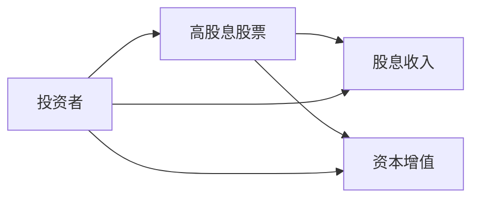

                 

# 约翰·奈夫的高股息价值投资：稳定收益的来源

## 关键词：高股息股票、价值投资、股息率、约翰·奈夫、稳定收益

## 摘要：  
高股息价值投资是一种通过投资高股息率股票来实现稳定收益的投资策略。本文从背景介绍、核心概念、筛选标准、投资策略、组合构建和风险管理等多方面详细阐述了高股息价值投资的理论与实践，结合约翰·奈夫的投资理念，为读者提供了一套系统化的高股息股票投资方法。通过分析股息率、股息增长能力、公司财务状况等关键因素，本文为投资者提供了稳定收益的来源和实现路径。

---

## 第一章: 高股息价值投资的背景与意义

### 1.1 高股息投资的定义与特征  
高股息投资是指投资者选择那些股息率较高、股息支付能力强的股票进行投资，以获取稳定的股息收入和资本增值。其核心特征包括：  
1. **高股息率**：股息率是衡量股票收益的重要指标，通常以股息收益率（Dividend Yield）来衡量，计算公式为：  
$$\text{股息收益率} = \frac{\text{每股股息}}{\text{股价}} \times 100\%$$  
2. **稳定性**：高股息股票通常来自成熟行业中的优质企业，具有稳定的盈利能力和分红能力。  
3. **风险相对较低**：相较于成长型股票，高股息股票的风险较低，适合风险厌恶型投资者。  

### 1.2 高股息投资的重要性和意义  
高股息投资在资产配置中扮演着重要角色，尤其适合追求稳定收益的投资者。其重要性体现在：  
1. **稳定现金流**：高股息股票能为投资者提供稳定的股息收入，有助于实现财务目标。  
2. **抗跌性**：在市场波动中，高股息股票通常表现较为稳定，具有较强的抗跌能力。  
3. **长期增值**：优质高股息股票往往伴随着资本增值，长期持有可以获得双重收益。  

### 1.3 高股息投资的边界与外延  
高股息投资并非适用于所有市场环境和投资者，其适用边界包括：  
1. **市场周期**：高股息股票在低利率环境下更具吸引力，而在高利率环境下可能面临估值压力。  
2. **行业选择**：高股息股票主要集中在公用事业、金融、房地产等传统行业，新兴行业股息率通常较低。  
3. **投资者类型**：高股息投资适合风险厌恶型投资者，尤其是那些需要稳定收入来源的投资者，如退休人士。  

---

## 第二章: 高股息价值投资的核心概念与联系

### 2.1 高股息投资的核心原理  
高股息投资的核心在于通过筛选高股息率股票，实现稳定的股息收入和资本增值。其原理包括：  
1. **股息支付能力**：公司必须具备稳定的盈利能力和良好的财务状况，才能持续支付高股息。  
2. **股息增长模型**：股息支付能力较强的公司通常能够实现股息增长，进一步提升投资收益。  
3. **价值评估**：高股息股票的价值不仅体现在股息收入上，还包括公司未来增长的潜力。  

### 2.2 高股息投资的核心要素对比  
高股息投资的核心要素包括股息率、股息增长能力、公司规模和行业地位。以下是三者的对比分析：  
| **要素**       | **股息率**       | **股息增长能力** | **公司规模**       |
|----------------|------------------|------------------|------------------|
| 定义           | 每股股息与股价的比率 | 股息支付能力的持续增长 | 公司的营业收入、净利润等指标 |
| 重要性         | 短期收益的直接体现 | 长期收益的核心驱动 | 公司抗风险能力的体现 |
| 影响因素       | 股价波动、每股股息 | 公司盈利增长、股息政策 | 行业地位、市场竞争力 |

### 2.3 高股息投资的ER实体关系图  

---

## 第三章: 高股息股票的筛选与分析

### 3.1 高股息股票的筛选标准  
筛选高股息股票时，需综合考虑以下标准：  
1. **股息率**：通常选择股息率在3%以上的股票，但需警惕过高的股息率可能意味着公司财务状况不佳。  
2. **股息增长能力**：优先选择股息连续增长的公司，这表明公司具有稳定的盈利能力和分红意愿。  
3. **财务健康状况**：关注公司的净利润率、资产负债率、现金流等指标，确保公司具备持续支付股息的能力。  

### 3.2 高股息股票的行业分布  
高股息股票主要集中在以下行业：  
1. **公用事业**：如电力、水务等行业的公司通常具有稳定的收益和较高的股息率。  
2. **金融行业**：银行、保险公司等金融机构通常通过分红回报股东。  
3. **房地产**：房地产信托基金（REITs）通常需要将大部分利润以股息形式分配给股东。  

### 3.3 高股息股票的个案分析  
以某公用事业公司为例，假设其股价为20元，每股股息为1.2元，股息率为6%。通过分析其财务报表，发现公司净利润率为15%，资产负债率为60%，现金流充裕，具备持续支付股息的能力。  

---

## 第四章: 约翰·奈夫的投资理念与策略

### 4.1 约翰·奈夫的高股息投资理念  
约翰·奈夫是高股息价值投资的代表人物，其投资理念包括：  
1. **注重股息支付能力**：奈夫认为，股息是检验公司财务健康的重要指标，持续支付股息的公司更有可能保持稳定增长。  
2. **长期投资**：奈夫主张长期持有优质高股息股票，通过复利效应实现财富增长。  
3. **风险控制**：在选择股票时，奈夫注重分散投资，避免过度集中于单一行业或公司。  

### 4.2 约翰·奈夫的高股息投资策略  
1. **股息率筛选**：奈夫通常选择股息率在5%以上的股票作为投资标的。  
2. **股息增长模型**：通过分析公司过去几年的股息增长率，预测未来股息支付能力。  
3. **价值评估**：结合市盈率、市净率等指标，评估股票的内在价值，避免高估风险。  

### 4.3 数学模型与公式  
1. **股息率计算公式**：  
$$\text{股息收益率} = \frac{\text{每股股息}}{\text{股价}} \times 100\%$$  
2. **股息增长模型**：  
$$D_{n} = D_{0} \times (1 + g)^n$$  
其中，\(D_{n}\) 为第n年的股息，\(D_{0}\) 为初始股息，\(g\) 为股息增长率，\(n\) 为年数。  

---

## 第五章: 高股息股票投资组合的构建与风险管理

### 5.1 投资组合构建  
1. **资产分配**：根据风险承受能力，将高股息股票与其他资产（如债券、黄金）进行合理配置。  
2. **股票选择**：根据股息率、股息增长能力、财务状况等因素，筛选出5-10只优质高股息股票。  
3. **定期 rebalancing**：每隔一段时间（如每年），根据市场变化和个人财务状况，调整投资组合。  

### 5.2 风险管理  
1. **分散投资**：避免将所有资金投入单一行业或公司，降低特定风险。  
2. **市场风险控制**：在市场波动较大时，适当降低高股息股票的仓位，避免大幅回撤。  
3. **流动性管理**：保持一定比例的现金头寸，以应对突发事件或投资机会。  

---

## 第六章: 总结与展望

### 6.1 总结  
高股息价值投资是一种通过筛选高股息率股票，实现稳定收益的投资策略。其核心在于股息支付能力、公司财务状况和行业选择。通过约翰·奈夫的投资理念，我们可以更好地理解高股息投资的内在逻辑和实践方法。

### 6.2 展望  
随着市场环境的变化，高股息投资也将面临新的机遇和挑战。未来，投资者需要更加关注全球经济环境、行业发展趋势以及公司的基本面变化，以优化投资策略。  

---

## 作者：AI天才研究院/AI Genius Institute & 禅与计算机程序设计艺术 /Zen And The Art of Computer Programming

