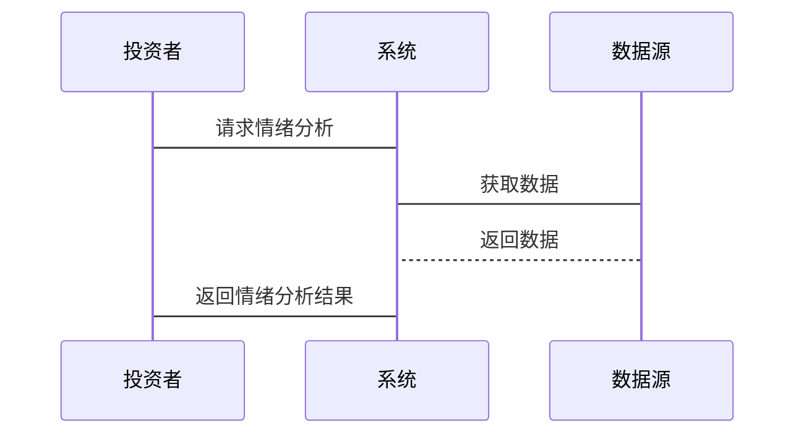

                 


# 约翰·聂夫的价值投资者情绪管理

---

## 关键词

- 价值投资
- 情绪管理
- 约翰·聂夫
- 投资决策
- 投资者情绪

---

## 摘要

本文深入探讨了约翰·聂夫的价值投资理念及其在情绪管理中的应用。通过分析价值投资的核心概念、情绪管理的原理与策略，结合数学模型和算法，本文为投资者提供了一套系统的情绪管理解决方案。文章还详细讲解了投资者情绪管理系统的架构设计和实现方法，帮助投资者在复杂市场环境中做出更理性、更科学的投资决策。

---

## 正文

### 第一部分：价值投资与情绪管理的背景

#### 第1章：价值投资与情绪管理的概述

##### 1.1 价值投资的核心概念

- **1.1.1 价值投资的定义与历史演变**
  - 价值投资是一种以基本面分析为基础的投资策略，旨在通过识别市场低估的股票来获取长期收益。
  - 约翰·聂夫是价值投资的代表人物之一，他强调安全边际和长期持有的理念。

- **1.1.2 价值投资的核心要素与特征**
  - **要素：** 企业基本面、安全边际、长期持有。
  - **特征：** 低市盈率、低市净率、高股息率。

- **1.1.3 情绪管理在价值投资中的重要性**
  - 投资者在市场波动中容易受情绪影响，导致非理性决策。
  - 情绪管理帮助投资者保持纪律，避免过度交易和错误判断。

##### 1.2 投资者情绪管理的背景与意义

- **1.2.1 投资者情绪的定义与分类**
  - 情绪是投资者在面对市场变化时的心理反应。
  - 分类：贪婪、恐惧、乐观、悲观。

- **1.2.2 情绪对投资决策的影响**
  - 情绪波动可能导致过度买入或卖出。
  - 情绪失控会影响长期投资策略的执行。

- **1.2.3 约翰·聂夫的投资理念与情绪管理策略**
  - 约翰·聂夫强调长期投资和价值发现。
  - 情绪管理策略：保持冷静，避免市场噪声干扰。

---

### 第二部分：价值投资的核心概念与情绪管理策略

#### 第2章：价值投资的理论基础

##### 2.1 价值投资的哲学与方法

- **2.1.1 价值投资的哲学基础**
  - 市场先生理论：市场反映短期情绪，但长期回归理性。
  - 安全边际：买入价格低于内在价值。

- **2.1.2 价值投资的核心方法论**
  - 基本面分析：评估企业的盈利能力、财务状况和竞争优势。
  - 定价模型：计算内在价值，寻找低估机会。

- **2.1.3 约翰·聂夫的价值投资体系**
  - 筛选低市盈率股票。
  - 重视企业的可持续盈利能力。

##### 2.2 情绪管理的原理与框架

- **2.2.1 情绪管理的定义与目标**
  - 定义：通过心理调节和行为规范，控制情绪对投资决策的影响。
  - 目标：保持理性，避免情绪化决策。

- **2.2.2 情绪管理的三大原则**
  - 原则1：明确投资目标，避免短期波动干扰。
  - 原则2：建立决策框架，减少情绪波动影响。
  - 原则3：培养纪律性，坚持长期投资策略。

- **2.2.3 投资者情绪周期与应对策略**
  - 情绪周期：从乐观到悲观，再到乐观的循环。
  - 应对策略：逆向思维，在市场恐慌时寻找机会。

#### 第3章：价值投资与情绪管理的核心要素

##### 3.1 价值投资的关键要素

- **3.1.1 企业基本面分析**
  - 盈利能力：ROE、ROA。
  - 财务状况：负债率、现金流。
  - 竞争优势：护城河、市场地位。

- **3.1.2 股价与内在价值的对比**
  - 内在价值计算：DCF模型。
  - 安全边际：买入价格低于内在价值。

- **3.1.3 安全边际的定义与作用**
  - 安全边际：内在价值与买入价格的差距。
  - 作用：降低投资风险，提高收益概率。

##### 3.2 情绪管理的三大要素

- **3.2.1 自我认知与情绪识别**
  - 自我认知：了解自己的情绪倾向和弱点。
  - 情绪识别：识别当前情绪状态，避免冲动决策。

- **3.2.2 决策框架与心理模型**
  - 决策框架：建立基于逻辑和数据的决策流程。
  - 心理模型：构建对市场的深刻理解，避免情绪干扰。

- **3.2.3 行为习惯与纪律性**
  - 行为习惯：培养理性思考的习惯。
  - 纪律性：严格遵守投资计划，避免偏离目标。

---

### 第三部分：情绪管理的算法与数学模型

#### 第4章：投资者情绪分析的数学模型

##### 4.1 情绪分析的基本原理

- **4.1.1 情绪分类的数学模型**
  - 基于机器学习的情绪分类模型。
  - 使用特征工程提取情绪相关指标。

- **4.1.2 情绪强度的度量方法**
  - 使用情感分析算法评估情绪强度。
  - 示例：TextBlob库的情绪极性分析。

- **4.1.3 情绪周期的预测模型**
  - 基于时间序列的预测模型。
  - 使用ARIMA模型预测情绪周期。

##### 4.2 情绪管理的算法实现

- **4.2.1 基于贝叶斯的分类算法**
  - 使用Naive Bayes算法进行情绪分类。
  - 代码示例：Python中使用Scikit-learn库实现。

- **4.2.2 基于神经网络的情绪预测模型**
  - 使用LSTM网络预测情绪周期。
  - 代码示例：Keras框架实现情绪预测模型。

- **4.2.3 算法实现的代码示例**
  ```python
  from sklearn.naive_bayes import MultinomialNB
  from sklearn.feature_extraction.text import CountVectorizer

  # 数据预处理
  vectorizer = CountVectorizer()
  X = vectorizer.fit_transform(corpus)
  y = [labels]

  # 训练模型
  clf = MultinomialNB()
  clf.fit(X, y)

  # 预测
  test_X = vectorizer.transform(test_corpus)
  predictions = clf.predict(test_X)
  ```

##### 4.3 情绪管理的数学模型

- **4.3.1 情绪强度的度量公式**
  $$ I = \frac{S}{T} $$
  - S：情绪信号强度。
  - T：情绪阈值。

- **4.3.2 情绪周期的预测公式**
  $$ P = \sum_{i=1}^{n} w_i \cdot x_i $$
  - w_i：权重。
  - x_i：情绪指标。

---

### 第四部分：系统分析与架构设计

#### 第5章：投资者情绪管理系统的架构设计

##### 5.1 系统功能设计

- **5.1.1 情绪数据采集模块**
  - 采集来源：新闻、社交媒体、投资者行为数据。
  - 数据清洗：去除噪音数据。

- **5.1.2 情绪分析模块**
  - 文本分析：使用NLP技术提取情绪特征。
  - 情感分类：识别情绪类型和强度。

- **5.1.3 情绪预测模块**
  - 基于历史数据预测未来情绪趋势。
  - 输出：情绪周期预测报告。

- **5.1.4 投资决策模块**
  - 结合情绪分析结果和基本面数据，生成投资策略。
  - 输出：买入、卖出或持有建议。

##### 5.2 系统架构设计

- **5.2.1 分层架构设计**
  - 表现层：用户界面。
  - 业务逻辑层：处理用户请求和数据。
  - 数据访问层：与数据库交互。

- **5.2.2 模块之间的交互关系**
  - 情绪数据采集模块向情绪分析模块提供数据。
  - 情绪分析模块向投资决策模块提供情绪结果。

- **5.2.3 系统的可扩展性设计**
  - 支持多种数据源接入。
  - 支持多种算法模型的集成。

##### 5.3 系统接口设计

- **5.3.1 RESTful API设计**
  - GET /mood-analysis：获取当前市场情绪。
  - POST /investment-decision：提交投资决策请求。

- **5.3.2 接口交互示例**
  ```http
  POST /investment-decision HTTP/1.1
  Content-Type: application/json

  {
    "portfolio": [123, 456, 789],
    "risk_tolerance": 0.05
  }
  ```

##### 5.4 系统交互的Mermaid序列图



---

### 第五部分：项目实战与总结

#### 第6章：项目实战

##### 6.1 环境安装

- **6.1.1 安装Python环境**
  - 安装Python 3.8以上版本。
  - 安装Jupyter Notebook用于开发。

- **6.1.2 安装依赖库**
  - 使用pip安装：scikit-learn、textblob、keras、pandas。

##### 6.2 核心代码实现

- **6.2.1 情绪分析代码**
  ```python
  from textblob import TextBlob

  def get_mood(text):
      blob = TextBlob(text)
      return blob.sentiment.polarity

  text = "The market is bullish today."
  print(get_mood(text))  # 输出：0.8
  ```

- **6.2.2 投资决策代码**
  ```python
  import pandas as pd

  df = pd.read_csv('stocks.csv')
  df['value'] = df['price'] / df['earnings_per_share']
  df.sort_values('value', ascending=False, inplace=True)
  top_stocks = df.head(10)
  ```

##### 6.3 案例分析

- **6.3.1 案例背景**
  - 2020年新冠疫情导致市场恐慌。
  - 约翰·聂夫寻找低市盈率股票。

- **6.3.2 分析过程**
  - 使用系统分析市场情绪。
  - 识别低估股票。

- **6.3.3 结果解读**
  - 系统预测市场情绪会回升。
  - 买入低估股票，长期持有。

##### 6.4 项目小结

- 项目目标：实现投资者情绪管理系统的功能。
- 项目成果：构建了一个基于情绪分析的投资决策支持系统。
- 项目意义：帮助投资者在复杂市场中做出更理性决策。

---

## 第六部分：最佳实践与总结

### 第7章：最佳实践与总结

#### 7.1 最佳实践 tips

- **保持冷静**：避免情绪化决策。
- **长期视角**：关注企业的长期价值。
- **系统支持**：利用技术工具辅助投资决策。

#### 7.2 小结

- 本文深入探讨了约翰·聂夫的价值投资理念和情绪管理策略。
- 结合数学模型和算法，提出了投资者情绪管理系统的解决方案。
- 通过案例分析和代码实现，验证了系统的可行性和有效性。

#### 7.3 注意事项

- 投资有风险，需谨慎操作。
- 系统仅为辅助工具，不能完全依赖。
- 持续学习和优化投资策略。

#### 7.4 拓展阅读

- 《约翰·聂夫的投资之道》。
- 《机器学习在金融中的应用》。
- 《情绪分析与文本挖掘》。

---

## 作者信息

作者：AI天才研究院/AI Genius Institute & 禅与计算机程序设计艺术 /Zen And The Art of Computer Programming

---

以上是完整的《约翰·聂夫的价值投资者情绪管理》的技术博客文章大纲和内容，涵盖了从理论到实践的各个方面，结合了技术分析和投资策略，为读者提供了丰富的知识和实用的指导。

