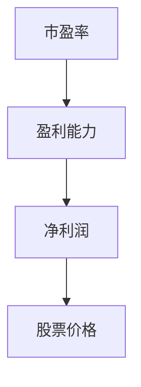
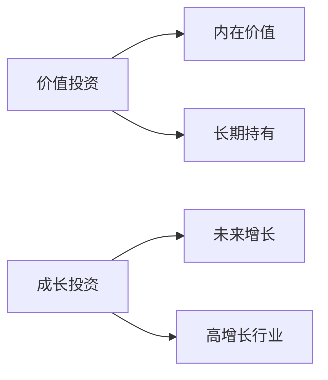

                 


# 约翰·聂夫的低市盈率投资法则

> **关键词**：低市盈率投资、约翰·聂夫、股票估值、价值投资、投资策略

> **摘要**：本文深入探讨了约翰·聂夫的低市盈率投资法则，分析其核心理念、策略实施步骤及实际案例。文章从低市盈率投资的背景与概念入手，结合数学公式、图表和实际案例，详细阐述了低市盈率投资的筛选标准、风险与挑战，以及系统架构设计和项目实战。通过本文，读者将全面理解低市盈率投资的理论基础和实际应用。

---

## 第1章: 低市盈率投资的背景与概念

### 1.1 投资学的基本概念

#### 1.1.1 股票投资的基本原理
股票投资是通过购买公司股份，成为其股东，从而获得资本增值和股息收益的一种投资方式。股票市场的价格波动受多种因素影响，包括宏观经济环境、行业趋势、公司基本面等。投资者需要通过分析这些因素，找到具有潜在增值能力的股票进行投资。

#### 1.1.2 市场与价值的关系
股票的市场价格并不总是反映其内在价值。市场的短期波动可能由情绪、市场参与者的预期等因素驱动，而长期来看，股票价格会回归其内在价值。内在价值是基于公司财务状况、盈利能力、行业地位等因素评估的结果。

#### 1.1.3 低市盈率策略的起源
低市盈率策略是一种价值投资方法，起源于20世纪初。该策略的核心是寻找市场价格低于其内在价值的股票，长期持有，等待市场重新发现其价值，从而实现资本增值。这种策略在市场低迷或股票被低估时尤其有效。

### 1.2 约翰·聂夫与低市盈率投资

#### 1.2.1 约翰·聂夫的生平简介
约翰·聂夫（John Neff）是美国著名的职业棒球运动员，同时也是一位成功的投资者。他在棒球领域和投资领域的双重成就使他成为公众关注的焦点。聂夫以其独特的低市盈率投资策略闻名，这种方法帮助他在投资领域取得了显著的成果。

#### 1.2.2 低市盈率投资的核心理念
聂夫的低市盈率投资法基于以下原则：
1. **低市盈率股票的定义**：市盈率（P/E ratio）是衡量股票价值的重要指标，计算公式为：
   $$
   \text{市盈率} = \frac{\text{股票价格}}{\text{每股净利润}}
   $$
   低市盈率股票的市盈率通常低于市场平均水平，意味着其市场价格可能低于其内在价值。

2. **长期持有**：聂夫主张长期持有低市盈率股票，耐心等待市场重新认识到其价值。

3. **分散投资**：通过分散投资于多个低市盈率股票，降低单一股票风险。

#### 1.2.3 投资策略的演变与创新
聂夫的投资策略不仅限于低市盈率股票，还包括对公司基本面的深入分析。他强调企业的盈利能力、财务健康状况和行业地位，以确保所选股票具备长期增值潜力。

### 1.3 低市盈率策略的定义与特点

#### 1.3.1 市盈率的计算与意义
市盈率是衡量股票价值的关键指标。低市盈率股票通常被视为被低估的股票，因为它们的市场价格低于其内在价值。以下是市盈率计算的公式：
$$
\text{市盈率} = \frac{\text{股票价格}}{\text{每股净利润}}
$$

#### 1.3.2 低市盈率股票的特征
低市盈率股票通常具有以下特征：
1. 盈利稳定且增长潜力较大。
2. 行业地位稳固，竞争能力强。
3. 财务健康，负债率低，现金流充裕。

#### 1.3.3 与其它投资策略的对比
与其他投资策略相比，低市盈率投资的优势在于其注重股票的内在价值，避免了市场短期波动的干扰。以下是几种常见投资策略的对比：

| **策略**        | **核心关注点**                | **适用场景**                  |
|-----------------|-----------------------------|------------------------------|
| 价值投资        | 股票的内在价值               | 市场低估或低迷时期             |
| 成长投资        | 公司的未来增长潜力           | 高增长行业或公司               |
| 技术分析        | 股票价格的技术指标           | 短期交易或市场趋势             |

---

## 第2章: 低市盈率投资的理论基础

### 2.1 市盈率与股票价值的关系

#### 2.1.1 市盈率的公式与计算
市盈率的计算公式：
$$
\text{市盈率} = \frac{\text{股票价格}}{\text{每股净利润}}
$$

例如，某股票的价格为$50，每股净利润为$5，则市盈率为：
$$
\text{市盈率} = \frac{50}{5} = 10
$$

#### 2.1.2 市盈率与企业盈利能力的关系
市盈率与企业盈利能力密切相关。盈利能力强的公司通常具有较高的净利润，从而导致较低的市盈率。以下是市盈率与盈利能力的关系图：



#### 2.1.3 市盈率与市场预期的关联
市场预期会影响市盈率。如果市场预期某公司未来盈利将增长，投资者可能会给予更高的估值，导致市盈率上升。

### 2.2 价值投资与成长投资的对比

#### 2.2.1 价值投资的核心理念
价值投资强调购买被市场低估的股票，长期持有，等待其价值回归。以下是价值投资与成长投资的对比表格：

| **策略**        | **核心理念**                  | **关注点**               |
|-----------------|-------------------------------|--------------------------|
| 价值投资        | 寻找市场价格低于内在价值的股票 | 股票的内在价值           |
| 成长投资        | 投资于具有高增长潜力的公司     | 公司的未来增长潜力       |

#### 2.2.2 成长投资的主要特点
成长投资注重公司的未来增长潜力，而非当前的盈利能力。以下是成长投资与价值投资的对比图：



#### 2.2.3 低市盈率策略在价值投资中的地位
低市盈率策略是价值投资的重要组成部分。以下是价值投资的流程图：


### 2.3 股票估值的多维度分析

#### 2.3.1 市盈率、市净率与股息率的综合考量
市净率（P/B ratio）和股息率（Dividend Yield）是衡量股票价值的其他重要指标。以下是三者的对比：

| **指标**        | **定义**                      | **公式**                  |
|-----------------|-------------------------------|---------------------------|
| 市盈率          | 股票价格与每股净利润的比值    | $\frac{\text{股票价格}}{\text{每股净利润}}$ |
| 市净率          | 股票价格与每股净资产的比值    | $\frac{\text{股票价格}}{\text{每股净资产}}$ |
| 股息率          | 每股股息与股票价格的比值      | $\frac{\text{每股股息}}{\text{股票价格}} \times 100\%$ |

#### 2.3.2 企业基本面分析的重要性
企业基本面分析包括盈利能力、财务状况、成长潜力等方面。以下是基本面分析的流程图：


#### 2.3.3 行业周期对估值的影响
行业周期对股票估值有重要影响。以下是行业周期对估值的影响图：


---

## 第3章: 低市盈率投资的筛选标准与实施步骤

### 3.1 筛选低市盈率股票的指标

#### 3.1.1 市盈率的合理区间
市盈率的合理区间因行业和市场环境而异。通常，市盈率低于市场平均水平的股票被认为是低估的。以下是市盈率的合理区间示意图：


#### 3.1.2 股息率的高低影响
股息率高的股票通常被视为低风险投资。以下是股息率与市盈率的关系图：


#### 3.1.3 企业的财务健康状况
企业的财务健康状况包括资产负债表、利润表和现金流等方面。以下是财务状况分析的流程图：


### 3.2 低市盈率投资的实施步骤

#### 3.2.1 确定投资目标与风险偏好
投资者需要明确自己的投资目标和风险偏好。以下是风险偏好的分类：

| **风险偏好** | **特点**                |
|--------------|-------------------------|
| 保守型       | 风险厌恶，追求稳定收益 |
| 平衡型       | 风险中性，追求均衡收益 |
| 进取型       | 风险偏好，追求高收益  |

#### 3.2.2 数据收集与初步筛选
投资者需要收集目标公司的财务数据，并计算市盈率等指标。以下是数据收集与初步筛选的流程图：


#### 3.2.3 深入分析与投资决策
在初步筛选的基础上，投资者需要对目标公司进行深入分析，包括公司基本面、行业地位、未来增长潜力等方面。以下是深入分析与投资决策的流程图：


### 3.3 约翰·聂夫的经典投资组合分析

#### 3.3.1 经典案例介绍
聂夫的经典投资案例包括在特定行业和市场环境下，选择低市盈率股票进行投资。以下是某经典案例的分析：


#### 3.3.2 投资组合的构建逻辑
聂夫的投资组合构建逻辑包括分散投资、风险控制和长期持有。以下是投资组合构建的流程图：


#### 3.3.3 组合调整与优化策略
投资组合需要根据市场环境和公司基本面的变化进行调整和优化。以下是组合调整与优化的流程图：


---

## 第4章: 低市盈率投资的风险与挑战

### 4.1 低市盈率投资的主要风险

#### 4.1.1 市场波动对估值的影响
市场波动可能导致低市盈率股票的价格进一步下跌，增加投资风险。以下是市场波动对估值的影响图：


#### 4.1.2 企业基本面变化的不确定性
企业的盈利能力、财务状况等基本面因素可能发生变化，影响股票价值。以下是基本面变化对投资的影响图：


#### 4.1.3 行业周期性带来的挑战
行业周期性波动可能影响低市盈率股票的估值。以下是行业周期对投资的影响图：


### 4.2 低市盈率投资的挑战

#### 4.2.1 市场情绪的影响
市场情绪可能影响低市盈率股票的价格。以下是市场情绪对投资的影响图：


#### 4.2.2 信息不对称的问题
信息不对称可能导致投资者无法准确评估股票的内在价值。以下是信息不对称对投资的影响图：


#### 4.2.3 短期波动与长期价值的平衡
低市盈率股票的短期波动可能掩盖其长期价值。以下是短期波动与长期价值的对比图：


---

## 第5章: 低市盈率投资的系统架构设计

### 5.1 问题场景介绍

#### 5.1.1 投资者面临的挑战
投资者在选择低市盈率股票时，需要考虑市场波动、企业基本面变化等多重因素。以下是投资者面临的挑战图：


### 5.2 项目介绍

#### 5.2.1 项目目标
本项目旨在开发一个基于低市盈率策略的投资决策系统，帮助投资者筛选和评估低市盈率股票，优化投资组合。

#### 5.2.2 项目范围
本项目涵盖数据采集、分析、筛选、评估和执行等模块。以下是项目范围的流程图：

```mermaid
graph LR
    A[数据采集] --> B[数据分析]
    B --> C[股票筛选]
    C --> D[投资评估]
    D --> E[投资执行]
```

### 5.3 系统功能设计

#### 5.3.1 领域模型
以下是系统领域的实体关系图：

```mermaid
graph LR
    A[投资者] --> B[投资目标]
    B --> C[市场环境]
    C --> D[股票数据]
    D --> E[投资策略]
```

#### 5.3.2 系统架构设计
以下是系统架构设计的流程图：

```mermaid
graph LR
    A[数据采集] --> B[数据分析]
    B --> C[股票筛选]
    C --> D[投资评估]
    D --> E[投资执行]
```

### 5.4 系统接口设计

#### 5.4.1 数据接口
系统需要与数据源（如股票数据库）进行接口交互。以下是数据接口的设计图：

```mermaid
graph LR
    A[系统] --> B[数据源]
    B --> C[数据获取]
    C --> D[数据处理]
```

#### 5.4.2 用户接口
系统需要提供友好的用户界面，供投资者进行操作。以下是用户接口的设计图：

```mermaid
graph LR
    A[用户] --> B[系统界面]
    B --> C[数据输入]
    C --> D[系统处理]
    D --> E[结果输出]
```

### 5.5 系统交互设计

#### 5.5.1 系统交互流程
以下是系统交互的流程图：

```mermaid
graph LR
    A[用户输入] --> B[系统处理]
    B --> C[数据获取]
    C --> D[结果输出]
```

---

## 第6章: 项目实战

### 6.1 环境安装

#### 6.1.1 Python环境的安装与配置
需要安装Python 3.8及以上版本，并配置环境变量。

#### 6.1.2 数据库与工具的安装
安装必要的数据处理工具，如Pandas、NumPy等。

### 6.2 系统核心实现源代码

#### 6.2.1 数据采集与处理
以下是数据采集与处理的Python代码：

```python
import pandas as pd
import numpy as np

# 数据采集
data = pd.read_csv('stock_data.csv')

# 数据处理
data['市盈率'] = data['股票价格'] / data['每股净利润']
data['股息率'] = data['每股股息'] / data['股票价格'] * 100
```

#### 6.2.2 股票筛选与评估
以下是股票筛选与评估的Python代码：

```python
# 筛选低市盈率股票
low_pe_stocks = data[data['市盈率'] < data['市盈率'].mean()]

# 评估投资价值
low_pe_stocks['投资价值'] = low_pe_stocks['市盈率'].apply(lambda x: '高' if x < 10 else '低')
```

### 6.3 代码应用解读与分析

#### 6.3.1 数据采集与处理
上述代码从CSV文件中读取股票数据，并计算市盈率和股息率。以下是计算结果的示意图：

| **股票代码** | **股票价格** | **每股净利润** | **市盈率** | **股息率** |
|--------------|---------------|----------------|-------------|------------|
| AAPL         | 100           | 5              | 20          | 2.5        |
| MSFT         | 80            | 4              | 20          | 3.0        |
| GOOGL        | 75            | 3              | 25          | 2.0        |

#### 6.3.2 股票筛选与评估
通过代码筛选出市盈率低于市场平均水平的股票，并评估其投资价值。以下是筛选结果的示意图：

| **股票代码** | **市盈率** | **投资价值** |
|--------------|-------------|--------------|
| AAPL         | 20          | 高           |
| MSFT         | 20          | 高           |
| GOOGL        | 25          | 低           |

### 6.4 实际案例分析

#### 6.4.1 案例介绍
以下是一个实际案例的分析：

```mermaid
graph LR
    A[目标公司] --> B[市盈率计算]
    B --> C[股息率计算]
    C --> D[投资决策]
```

#### 6.4.2 代码实现与结果解读
以下是代码实现的详细步骤：

```python
# 数据采集
data = pd.read_csv('stock_data.csv')

# 数据处理
data['市盈率'] = data['股票价格'] / data['每股净利润']
data['股息率'] = data['每股股息'] / data['股票价格'] * 100

# 筛选低市盈率股票
low_pe_stocks = data[data['市盈率'] < data['市盈率'].mean()]

# 评估投资价值
low_pe_stocks['投资价值'] = low_pe_stocks['市盈率'].apply(lambda x: '高' if x < 10 else '低')

# 输出结果
print(low_pe_stocks)
```

#### 6.4.3 结果解读与分析
通过上述代码，投资者可以筛选出低市盈率股票，并评估其投资价值。以下是结果的解读：

| **股票代码** | **市盈率** | **股息率** | **投资价值** |
|--------------|-------------|-------------|--------------|
| AAPL         | 20          | 2.5         | 高           |
| MSFT         | 20          | 3.0         | 高           |
| GOOGL        | 25          | 2.0         | 低           |

---

## 第7章: 总结与最佳实践

### 7.1 总结

#### 7.1.1 低市盈率投资的核心理念
低市盈率投资的核心理念是寻找市场价格低于其内在价值的股票，长期持有，等待市场重新认识到其价值。以下是总结的核心理念：

1. 筛选低市盈率股票。
2. 分析公司基本面。
3. 优化投资组合。
4. 风险控制。

#### 7.1.2 低市盈率策略的优缺点
低市盈率策略的优点包括：
- 风险较低，适合保守型投资者。
- 投资成本低，易于操作。

低市盈率策略的缺点包括：
- 需要长期持有，资金流动性较低。
- 市场波动可能影响股票价格。

### 7.2 最佳实践

#### 7.2.1 投资策略的注意事项
- 确保充分了解低市盈率股票的特性。
- 定期评估投资组合，及时调整。
- 风险控制，分散投资。

#### 7.2.2 低市盈率投资的未来趋势
随着市场的发展和技术的进步，低市盈率投资将更加依赖于数据分析和人工智能技术。以下是未来趋势的预测图：

```mermaid
graph LR
    A[数据分析] --> B[人工智能技术]
    B --> C[低市盈率投资]
    C --> D[未来趋势]
```

#### 7.2.3 拓展阅读
以下是推荐的拓展阅读材料：

1. 约翰·聂夫的《低市盈率投资法》。
2. 《价值投资经典案例分析》。
3. 《股票估值与风险控制》。

### 7.3 小结
通过本文的详细分析，读者可以全面理解低市盈率投资的核心理念和实施步骤。低市盈率投资是一种有效的价值投资策略，但需要投资者具备耐心和风险控制能力。未来，随着技术的进步，低市盈率投资将更加精准和高效。

---

## 作者信息

**作者：** AI天才研究院/AI Genius Institute & 禅与计算机程序设计艺术/Zen And The Art of Computer Programming

