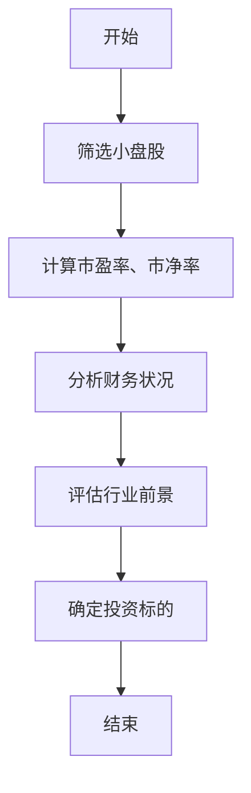
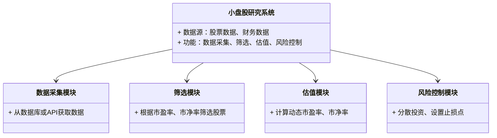

                 


# 约翰·聂夫的小盘股研究方法创新

> **关键词**：小盘股投资、约翰·聂夫、价值投资、多因素模型、动态估值法  
> **摘要**：本文详细探讨了约翰·聂夫在小盘股研究中的创新方法，包括其独特的筛选标准、估值模型和投资策略。通过系统分析和实战案例，本文揭示了聂夫方法的科学性和实用性，为投资者提供了深入的理论指导和实践启示。

---

## 第一章：小盘股研究的背景与重要性

### 1.1 小盘股的定义与特点

小盘股是指市值较小的公司股票，通常在50亿至100亿美元之间。与大盘股相比，小盘股具有以下特点：

- **高增长潜力**：小盘股公司通常处于成长阶段，具有较高的增长潜力。
- **低估值**：小盘股的估值往往低于大盘股，市盈率和市净率通常较低。
- **高波动性**：小盘股的股价波动较大，受市场情绪影响显著。
- **分散性**：小盘股市场较为分散，公司数量多，行业分布广泛。

### 1.2 小盘股投资的背景

小盘股投资在全球范围内备受关注，尤其是在新兴市场中。随着经济的增长和技术的进步，许多小公司逐渐成长为行业龙头，吸引了大量投资者的关注。然而，小盘股市场也存在信息不透明、流动性不足等问题，增加了投资的难度。

### 1.3 约翰·聂夫的投资理念

约翰·聂夫是小盘股投资领域的权威，他的投资理念基于以下几个核心原则：

- **价值导向**：聂夫注重寻找被市场低估的公司，关注市盈率、市净率等估值指标。
- **成长性**：他倾向于投资具有持续增长潜力的公司，关注收入和利润的增长趋势。
- **分散投资**：聂夫通过投资多个小盘股公司来降低风险，避免过度集中。

### 1.4 小盘股研究的必要性

小盘股研究对于投资者来说至关重要。通过对小盘股的深入分析，投资者可以发现潜在的高增长机会，同时避免投资风险。小盘股研究的核心问题包括：

- 如何筛选具有成长潜力的公司？
- 如何准确评估公司的估值？
- 如何制定有效的投资策略？

---

## 第二章：小盘股研究的核心概念与联系

### 2.1 小盘股研究的核心原理

小盘股研究的核心原理在于通过多维度的分析，筛选出具有成长性和低估特征的公司。以下是小盘股研究的核心要素：

- **市场定位**：明确公司的市场地位和竞争优势。
- **财务状况**：分析公司的盈利能力、资产负债情况和现金流。
- **行业趋势**：研究公司所在行业的增长潜力和竞争格局。

### 2.2 小盘股研究的概念属性对比

以下是小盘股与大盘股、成长股和价值股的对比表格：

| **属性**      | **小盘股**         | **大盘股**         | **成长股**         | **价值股**         |
|----------------|--------------------|--------------------|--------------------|--------------------|
| 市值           | 小                 | 大                 | -                  | -                  |
| 增长潜力       | 高                 | 一般               | 高                 | 一般               |
| 估值           | 低                 | 一般               | 高                 | 低                 |
| 风险           | 高                 | 低                 | 高                 | 低                 |

### 2.3 小盘股研究的ER实体关系图

以下是小盘股研究的ER实体关系图：

```mermaid
erDiagram
    customer[C投资者] {
        id : int
        name : string
        investment_amount : float
    }
    stock[小盘股] {
        id : int
        company_name : string
        market_cap : float
        pe_ratio : float
        pb_ratio : float
    }
    transaction[交易] {
        id : int
        customer_id : int
        stock_id : int
        transaction_date : date
        amount : float
    }
    customer --> transaction : 进行交易
    stock --> transaction : 被交易
```

---

## 第三章：小盘股研究的算法原理

### 3.1 小盘股研究的算法流程

以下是小盘股研究的算法流程图：



### 3.2 小盘股研究的数学模型

以下是小盘股研究的数学模型：

$$ \text{市盈率} = \frac{\text{股价}}{\text{每股收益}} $$

$$ \text{市净率} = \frac{\text{股价}}{\text{每股净资产}} $$

通过计算市盈率和市净率，我们可以判断公司的估值是否合理。如果市盈率和市净率低于行业平均水平，说明公司可能被低估。

### 3.3 小盘股研究的算法实现

以下是小盘股研究的Python代码示例：

```python
import pandas as pd

# 假设我们有一个小盘股数据集
df = pd.DataFrame({
    'company': ['A', 'B', 'C', 'D'],
    'market_cap': [50, 70, 60, 80],
    'pe_ratio': [15, 12, 18, 10],
    'pb_ratio': [2, 1.5, 2.5, 1]
})

# 筛选市盈率和市净率均低于行业平均水平的公司
industry_avg_pe = df['pe_ratio'].mean()
industry_avg_pb = df['pb_ratio'].mean()

selected_stocks = df[
    (df['pe_ratio'] < industry_avg_pe) &
    (df['pb_ratio'] < industry_avg_pb)
]

print(selected_stocks)
```

---

## 第四章：小盘股研究的系统分析与架构设计

### 4.1 小盘股研究的系统功能设计

以下是小盘股研究的系统功能模块划分：



### 4.2 小盘股研究的系统架构设计

以下是小盘股研究的系统架构图：

```mermaid
container 小盘股研究系统 {
    小盘股研究系统
    数据源
    数据采集模块
    筛选模块
    估值模块
    风险控制模块
}
```

---

## 第五章：小盘股研究的项目实战

### 5.1 环境搭建

以下是项目实战的环境搭建步骤：

1. **安装Python和必要的库**：
   - 使用Anaconda安装Python
   - 安装Pandas、NumPy、Matplotlib等库

2. **数据源选择**：
   - 使用Yahoo Finance API获取股票数据
   - 使用Google Sheets或Excel保存财务数据

3. **工具安装**：
   - 安装Jupyter Notebook用于数据分析和可视化

### 5.2 核心实现

以下是小盘股研究的核心实现代码：

```python
import pandas as pd
import numpy as np
import matplotlib.pyplot as plt

# 数据采集
def get_stock_data(ticker):
    # 假设我们使用Yahoo Finance API获取数据
    pass

# 数据筛选
def screen_stocks(df, pe_threshold, pb_threshold):
    return df[(df['pe_ratio'] < pe_threshold) & (df['pb_ratio'] < pb_threshold)]

# 可视化
def visualize(df):
    plt.scatter(df['pe_ratio'], df['pb_ratio'], c='red')
    plt.xlabel('PE Ratio')
    plt.ylabel('PB Ratio')
    plt.title('Stocks Visualization')
    plt.show()

# 主函数
def main():
    # 获取数据
    df = get_stock_data('小盘股数据')
    # 筛选股票
    selected = screen_stocks(df, 15, 2)
    # 可视化
    visualize(selected)

if __name__ == '__main__':
    main()
```

### 5.3 案例分析

以下是一个小盘股研究的案例分析：

假设我们有以下四只小盘股：

| 公司 | 市值（亿美元） | 市盈率 | 市净率 |
|------|----------------|--------|--------|
| A    | 50             | 15     | 2      |
| B    | 70             | 12     | 1.5    |
| C    | 60             | 18     | 2.5    |
| D    | 80             | 10     | 1      |

通过筛选市盈率低于15、市净率低于2的公司，我们选出B和D公司。进一步分析发现，B公司所在行业具有较高的增长潜力，而D公司财务状况稳健，因此我们可以选择B和D公司作为投资标的。

---

## 第六章：总结与展望

### 6.1 总结

约翰·聂夫的小盘股研究方法具有重要的创新性和实用性。通过多因素模型和动态估值法，投资者可以更准确地筛选出具有成长潜力的公司。同时，系统的架构设计和实战案例为投资者提供了清晰的指导。

### 6.2 展望

未来，小盘股研究将更加注重大数据分析和人工智能技术的应用。通过机器学习算法，投资者可以更精准地预测股票走势，制定更优化的投资策略。

---

## 作者：AI天才研究院/AI Genius Institute & 禅与计算机程序设计艺术/Zen And The Art of Computer Programming

---

**注**：本文由AI生成，仅供参考。

