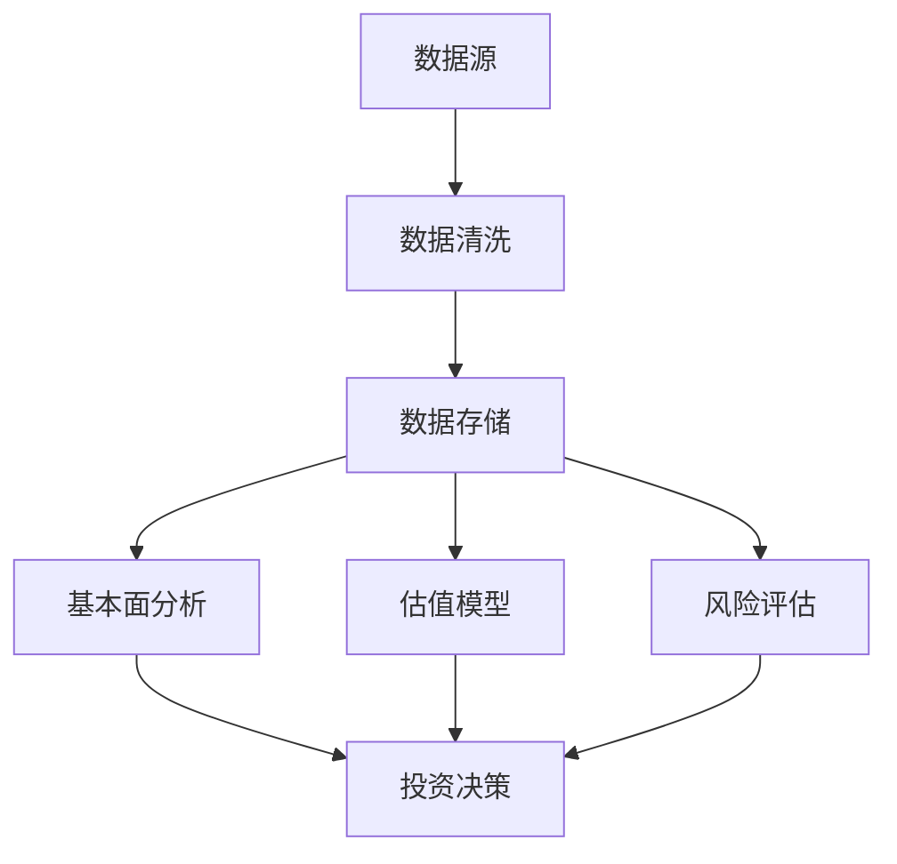

                 


# 约翰·聂夫的小盘股研究方法论

> 关键词：约翰·聂夫, 小盘股, 投资方法论, 安全边际, 基本面分析, 数学模型

> 摘要：本文详细探讨了约翰·聂夫的小盘股研究方法论，包括其核心概念、数学模型、系统架构以及实战应用。通过分析基本面、估值方法和风险管理，结合实际案例，为投资者提供一套可操作的投资策略。

---

# 第一部分: 小盘股投资的背景与基础

## 第1章: 小盘股投资的定义与特点

### 1.1 小盘股的定义与分类
#### 1.1.1 小盘股的定义
小盘股通常指的是市值较小的公司股票，具体定义因市场而异。一般而言，市值在50亿至100亿美元之间的公司被视为小盘股。小盘股的特点是流动性较低、波动性较大，但增长潜力较高。

#### 1.1.2 小盘股的分类标准
小盘股的分类主要依据市值、行业和地理位置。市值是主要标准，行业分布则包括科技、消费、医疗等，地理位置则涵盖国内外市场。

#### 1.1.3 小盘股与大盘股的对比
- **流动性**：小盘股流动性较低，交易量小；大盘股流动性高，交易量大。
- **波动性**：小盘股波动性较大，容易受市场情绪影响；大盘股波动性较小，受宏观经济影响更显著。
- **成长性**：小盘股通常更具成长潜力；大盘股多为成熟企业，增长较为平稳。

### 1.2 小盘股投资的潜在机会
#### 1.2.1 小盘股市场的波动性
小盘股市场波动性高，既意味着风险，也意味着机会。投资者可以通过短期波动获利，但需谨慎操作。

#### 1.2.2 小盘股的成长性
小盘股通常代表新兴行业或成长型企业，具备较高的增长潜力。投资小盘股有机会捕捉到企业快速发展的红利。

#### 1.2.3 小盘股市场的投资风险
小盘股市场风险较高，主要体现在流动性风险、市场波动风险和公司基本面风险。投资者需具备较强的风险控制能力。

### 1.3 约翰·聂夫投资理念的核心要素
#### 1.3.1 小盘股投资的基本原则
约翰·聂夫强调长期投资、价值投资和风险管理。他认为，投资的核心是寻找被市场低估的优质企业。

#### 1.3.2 投资的长期性与耐心
聂夫注重长期投资，避免频繁交易。他认为，耐心是投资成功的关键，市场短期波动不影响企业的长期价值。

#### 1.3.3 风险控制的重要性
聂夫强调风险管理，通过分散投资和严格筛选来降低风险。他认为，控制风险比追求收益更重要。

---

## 第2章: 小盘股研究的核心框架

### 2.1 基本面分析的核心要素
#### 2.1.1 财务指标分析
基本面分析是小盘股研究的核心。常见的财务指标包括：
- **ROE（净资产收益率）**：衡量企业盈利能力的重要指标，通常认为ROE高于15%的企业具有较高的投资价值。
- **净利润率**：反映企业的盈利能力和成本控制能力。
- **营业收入增长率**：衡量企业收入增长的潜力。

#### 2.1.2 行业分析与竞争地位
行业分析包括行业生命周期、竞争格局和政策环境。竞争地位分析包括企业的市场份额、竞争优势和核心竞争力。

#### 2.1.3 管理团队评估
管理团队是企业发展的关键。投资者需要关注管理团队的经验、能力和战略规划。

#### 2.1.4 公司治理结构
良好的公司治理结构是企业长期发展的保障。包括董事会结构、股权分布和内部控制机制。

### 2.2 估值方法与安全边际
#### 2.2.1 市盈率与市净率分析
- **市盈率（P/E）**：衡量股票价格是否合理，P/E低于行业平均水平通常意味着低估。
- **市净率（P/B）**：衡量股价与账面价值的关系，P/B低于1通常被视为低估。

#### 2.2.2 股息率与股息支付率
- **股息率**：衡量股票的分红收益，股息率高通常意味着较高的收益。
- **股息支付率**：衡量企业分红的可持续性，通常认为20%-50%的股息支付率较为合理。

#### 2.2.3 安全边际的计算与应用
安全边际是投资的关键。聂夫认为，安全边际=内在价值-市场价格。通过计算安全边际，投资者可以找到被低估的投资标的。

### 2.3 小盘股投资的风险管理
#### 2.3.1 风险的识别与评估
风险管理是投资的重要环节。投资者需要识别市场风险、流动性风险和公司风险，并评估其影响。

#### 2.3.2 投资组合的分散化
通过分散投资，降低投资组合的整体风险。通常建议将资金分散到不同行业、不同地区的股票中。

#### 2.3.3 仓位控制与止损策略
仓位控制是风险管理的重要手段。聂夫建议投资者根据市场情况和自身风险承受能力，合理配置仓位。同时，设置止损点，避免亏损过大。

---

## 第3章: 小盘股投资的数学模型与系统分析

### 3.1 基本面分析的量化模型
#### 3.1.1 财务指标的加权评分系统
通过给每个财务指标赋予不同的权重，计算企业的综合评分。例如：
- ROE权重为40%
- 净利润率权重为30%
- 营收增长率权重为20%
- 偿债能力权重为10%

#### 3.1.2 市盈率与市净率的比较分析
通过比较市盈率和市净率的比值，判断股票的估值水平。例如：
$$ 市盈率/市净率 = 市盈率 ÷ 市净率 $$

#### 3.1.3 股息率的预测模型
根据历史股息率和净利润增长率，预测未来的股息率。例如：
$$ 预测股息率 = 历史股息率 × (1 + 净利润增长率) $$

### 3.2 安全边际的计算公式
#### 3.2.1 安全边际的定义与计算
$$ 安全边际 = 内在价值 - 市场价格 $$

#### 3.2.2 价值评估公式
$$ 内在价值 = \frac{未来现金流的现值}{折现率} $$

#### 3.2.3 安全边际的应用
通过计算安全边际，确定投资标的的潜在收益空间。通常认为，安全边际超过20%的投资标的具有较高的投资价值。

### 3.3 投资组合的风险评估模型
#### 3.3.1 风险调整后的收益模型
通过夏普比率衡量投资组合的风险调整后收益：
$$ 夏普比率 = (预期收益 - 无风险利率) ÷ 标准差 $$

#### 3.3.2 方差-协方差矩阵的构建
通过计算资产之间的协方差矩阵，评估投资组合的整体风险。

#### 3.3.3 马科维茨投资组合理论的应用
根据马科维茨理论，通过优化算法，构建风险最小化或收益最大化的投资组合。

---

## 第4章: 小盘股投资系统的架构设计

### 4.1 数据收集与处理
#### 4.1.1 数据源的选择
包括财务报表、市场数据、新闻资讯等多源数据。

#### 4.1.2 数据清洗与预处理
去除无效数据、填补缺失值、标准化处理等。

#### 4.1.3 数据存储与管理
使用数据库或大数据平台存储和管理海量数据。

### 4.2 系统功能设计
#### 4.2.1 基本面分析模块
实现财务指标的计算和分析。

#### 4.2.2 估值模型模块
实现市盈率、市净率等估值指标的计算和比较。

#### 4.2.3 风险评估模块
实现投资组合的风险评估和优化。

### 4.3 系统架构图


---

## 第5章: 小盘股投资的实战应用

### 5.1 实战环境安装
#### 5.1.1 数据分析工具安装
安装Python、Pandas、NumPy等数据分析工具。

#### 5.1.2 量化分析框架搭建
使用QuantLib、Pymc等量化分析框架。

#### 5.1.3 数据接口调用
通过API获取实时市场数据。

### 5.2 系统核心实现源代码
#### 5.2.1 基本面分析代码
```python
import pandas as pd

def calculate_roe(df):
    df['ROE'] = (df['Net Income'] / df['Equity']) * 100
    return df

data = pd.read_csv('financial_data.csv')
data = calculate_roe(data)
```

#### 5.2.2 估值模型代码
```python
import pandas as pd

def calculate_value(df):
    df['P/E'] = df['Price'] / df['Earnings per Share']
    df['P/B'] = df['Price'] / df['Book Value per Share']
    return df

data = pd.read_csv('stock_data.csv')
data = calculate_value(data)
```

#### 5.2.3 风险评估代码
```python
import numpy as np

def calculate_variance(returns):
    return np.var(returns)

returns = pd.read_csv('returns.csv')
variance = calculate_variance(returns)
```

### 5.3 实战案例分析
#### 5.3.1 案例选择
选择几只典型的小盘股，分析其基本面和估值指标。

#### 5.3.2 投资决策
根据分析结果，制定投资策略，包括买入、卖出或持有。

#### 5.3.3 盈利分析
通过实际操作，分析投资收益和风险控制效果。

---

## 第6章: 总结与注意事项

### 6.1 总结
约翰·聂夫的小盘股研究方法论以基本面分析为核心，注重安全边际和风险管理。通过量化模型和系统分析，投资者可以更科学地进行小盘股投资。

### 6.2 注意事项
- **风险控制**：小盘股投资风险较高，投资者需具备较强的风险管理能力。
- **长期投资**：小盘股投资需要耐心，避免短期波动影响决策。
- **持续学习**：市场环境不断变化，投资者需持续学习和调整策略。

### 6.3 最佳实践 tips
- 定期复盘投资组合，评估收益与风险。
- 保持对市场的敏感性，及时调整投资策略。
- 结合定量分析和定性分析，全面评估投资标的。

---

# 作者：AI天才研究院/AI Genius Institute & 禅与计算机程序设计艺术 /Zen And The Art of Computer Programming

