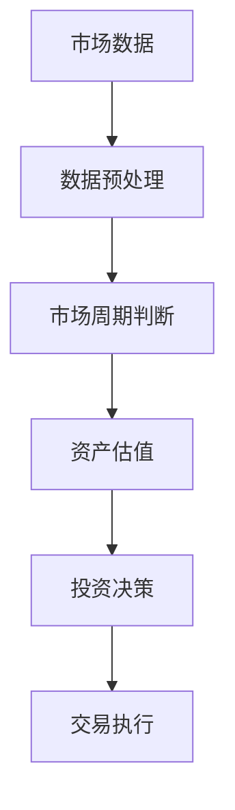
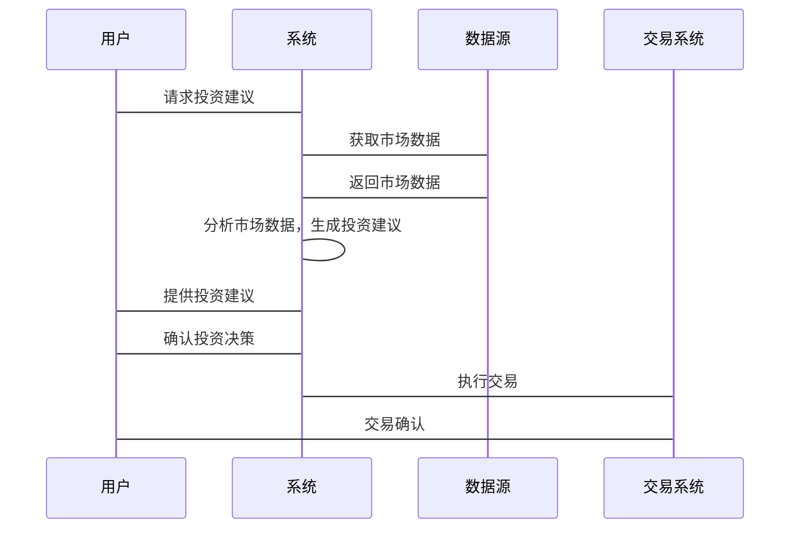

                 


# 约翰·邓普顿的危机投资策略：在恐慌中寻找机会

> 关键词：约翰·邓普顿，危机投资策略，恐慌指数，逆向投资，投资时机，资产估值

> 摘要：本文深入探讨了约翰·邓普顿的危机投资策略，分析了其核心思想、理论基础、数学模型和实际应用。通过详细解析邓普顿的投资理念，结合数学公式和实例，展示了如何在市场恐慌中寻找投资机会。文章内容丰富，结构清晰，适合对投资策略感兴趣的专业人士和投资者阅读。

---

# 第一部分：危机投资策略概述

## 第1章：危机投资策略的背景与意义

### 1.1 危机投资策略的背景

#### 1.1.1 什么是危机投资

危机投资是一种在市场出现危机或恐慌时，通过逆向思维寻找低估资产并进行投资的策略。这种策略的核心在于利用市场的非理性下跌，寻找被市场过度抛售但具有潜在价值的资产。

#### 1.1.2 危机投资的定义与特征

危机投资是指在市场恐慌、价格暴跌时，投资者逆市买入资产，以期望在市场恢复时获得超额收益。其主要特征包括：

- **逆向性**：在市场恐慌时买入，而非追逐热点。
- **价值导向**：注重资产的内在价值，而非短期价格波动。
- **风险承受能力**：需要较强的心理承受能力，因为市场恐慌时波动较大。

#### 1.1.3 危机投资的重要性和意义

危机投资的重要性体现在以下几个方面：

1. **捕捉低估机会**：市场恐慌时，许多优质资产被抛售，价格远低于其内在价值，为投资者提供了买入的良机。
2. **分散风险**：通过在危机中投资，投资者可以在市场低谷时建立廉价的头寸，降低整体投资组合的风险。
3. **超额收益**：危机投资通常能够在市场复苏时带来显著的超额收益。

### 1.2 约翰·邓普顿的生平与投资理念

#### 1.2.1 约翰·邓普顿的生平简介

约翰·邓普顿（John Templeton）是20世纪著名的投资家之一，被誉为“投资之王”。他出生于1912年，逝世于2008年。邓普顿的职业生涯始于1930年代，他以其独特的投资理念和卓越的投资业绩闻名于世。

#### 1.2.2 邓普顿的投资理念与风格

邓普顿的投资理念可以总结为以下几个方面：

- **逆向投资**：他在市场恐慌时买入，市场狂热时卖出。
- **价值投资**：注重资产的内在价值，寻找被市场低估的投资标的。
- **分散投资**：通过分散投资降低风险，避免过度集中。

#### 1.2.3 邓普顿与危机投资的关系

邓普顿是危机投资的代表人物之一。他在市场恐慌时，通过逆向思维寻找投资机会，积累了巨额财富。他的投资策略在多次危机中得到了验证，成为后世投资者的重要参考。

### 1.3 危机投资策略的核心思想

#### 1.3.1 危机投资的核心原则

- **市场非理性**：市场在恐慌时往往会出现非理性下跌，价格与价值脱节。
- **价值回归**：优质资产的价格最终会回归其内在价值。
- **逆向思维**：在市场恐慌时买入，市场狂热时卖出。

#### 1.3.2 危机投资的逻辑与框架

1. **识别市场恐慌**：通过市场指标和投资者情绪分析，识别市场是否处于恐慌状态。
2. **评估资产价值**：对潜在投资标的进行深入分析，判断其是否被市场低估。
3. **制定投资计划**：根据分析结果，制定逆向投资计划，并逐步实施。

#### 1.3.3 危机投资与价值投资的区别与联系

- **区别**：危机投资更注重市场周期和时机选择，而价值投资更关注资产的内在价值。
- **联系**：危机投资是价值投资的一种极端情况，强调在市场低谷时买入低估资产。

---

## 第2章：危机投资策略的理论基础

### 2.1 投资市场的周期性分析

#### 2.1.1 市场周期的定义与特征

市场周期是指经济和市场从繁荣到衰退，再从衰退到复苏的循环过程。通常包括以下几个阶段：

1. **牛市**：市场上涨，投资者情绪乐观。
2. **熊市**：市场下跌，投资者情绪悲观。
3. **危机**：市场出现恐慌性抛售，价格大幅偏离价值。
4. **复苏**：市场逐步恢复，价格回升。

#### 2.1.2 危机周期的形成与演变

危机周期的形成通常与市场过度杠杆、投资者情绪失控等因素有关。危机的演变过程可以分为以下几个阶段：

1. **酝酿阶段**：市场出现轻微下跌，投资者情绪开始转向谨慎。
2. **恐慌阶段**：市场出现大幅下跌，投资者恐慌性抛售。
3. **底部阶段**：市场达到最低点，优质资产价格被严重低估。
4. **复苏阶段**：市场逐步恢复，优质资产价格上涨。

#### 2.1.3 市场恐慌指数的分析

市场恐慌指数（VIX指数）是衡量市场波动性和投资者恐慌程度的重要指标。VIX指数越高，市场波动性越大，投资者情绪越悲观。

$$
\text{VIX指数} = \sqrt{\frac{1}{n}\sum_{i=1}^{n}(r_i - \mu)^2}
$$

其中，\( r_i \) 是市场收益率，\( \mu \) 是平均收益率，\( n \) 是样本数量。

---

### 2.2 投资者心理与行为分析

#### 2.2.1 投资者心理的常见偏差

投资者在市场恐慌时容易出现以下心理偏差：

1. **过度悲观**：对市场前景过于悲观，导致恐慌性抛售。
2. **从众心理**：跟随市场主流情绪，盲目抛售资产。
3. **损失厌恶**：害怕进一步亏损，导致错失买入良机。

#### 2.2.2 危机中的投资者行为特征

在市场恐慌时，投资者行为通常表现出以下特征：

1. **恐慌性抛售**：投资者急于卖出资产，导致价格进一步下跌。
2. **非理性决策**：投资者基于情绪而非理性进行决策。
3. **忽视价值**：忽略资产的内在价值，仅关注短期价格波动。

#### 2.2.3 市场恐慌与投资机会的关系

市场恐慌与投资机会密切相关。恐慌时，许多优质资产价格被低估，为投资者提供了买入的机会。然而，投资者需要具备识别市场恐慌的能力，才能抓住这些机会。

---

### 2.3 危机投资的经济学原理

#### 2.3.1 市场有效性的经济学分析

市场有效性是指市场价格反映了所有可获得的信息。在有效市场中，资产价格不会被长期低估或高估。然而，在市场恐慌时，价格可能偏离其内在价值，为投资者提供了套利机会。

#### 2.3.2 危机中的价格偏离与套利机会

在市场恐慌时，某些资产的价格可能远低于其内在价值，为套利者提供了机会。套利者通过买入低估资产，卖出高估资产，从中获利。

#### 2.3.3 马科维茨的现代投资组合理论与危机投资的关系

马科维茨的现代投资组合理论（MPT）强调分散投资和风险控制。在危机投资中，投资者需要结合MPT，通过分散投资降低风险，同时抓住市场恐慌带来的投资机会。

---

## 第3章：邓普顿危机投资策略的核心框架

### 3.1 邓普顿投资策略的三要素

#### 3.1.1 市场周期分析

邓普顿通过分析市场周期，判断市场所处的阶段，决定投资策略。他在市场恐慌时买入，在市场狂热时卖出。

#### 3.1.2 资产质量评估

邓普顿注重资产的内在价值，选择具有强大基本面和良好管理的公司进行投资。

#### 3.1.3 投资时机选择

邓普顿通过市场周期分析，选择在市场恐慌时买入，在市场复苏时卖出。

---

### 3.2 邓普顿的逆向投资法

#### 3.2.1 逆向投资的定义与核心思想

逆向投资是指在市场恐慌时买入，在市场狂热时卖出。其核心思想是“别人恐慌时我贪婪，别人贪婪时我恐慌”。

#### 3.2.2 逆向投资的实施步骤

1. **识别市场恐慌**：通过市场指标和投资者情绪分析，判断市场是否处于恐慌状态。
2. **评估资产价值**：对潜在投资标的进行深入分析，判断其是否被市场低估。
3. **制定投资计划**：根据分析结果，制定逆向投资计划，并逐步实施。
4. **持续监控与调整**：定期监控市场变化，根据市场波动调整投资组合。

#### 3.2.3 逆向投资的典型案例分析

案例：1987年美国股灾

1987年10月，美国股市发生股灾，道琼斯指数在一天内下跌了22.6%。邓普顿利用这次危机，大量买入优质资产，获得了丰厚的回报。

---

### 3.3 邓普顿的估值方法

#### 3.3.1 市场估值的指标与工具

邓普顿使用以下指标和工具进行市场估值：

- **市盈率（P/E）**：市价与每股收益的比率。
- **市净率（P/B）**：市价与每股净资产的比率。
- **股息率**：股息与股价的比率。
- **VIX指数**：市场波动性指数。

#### 3.3.2 邓普顿的估值模型

邓普顿的估值模型主要基于资产的内在价值，结合市场周期和资产质量进行综合评估。

#### 3.3.3 估值与投资决策的关系

估值是投资决策的基础。邓普顿通过准确的估值，判断资产是否被低估，决定是否买入。

---

## 第4章：危机投资策略的数学模型与算法原理

### 4.1 危机投资的量化分析模型

#### 4.1.1 市场恐慌指数的量化计算

$$
\text{市场恐慌指数} = \sqrt{\frac{1}{n}\sum_{i=1}^{n}(r_i - \mu)^2}
$$

其中，\( r_i \) 是市场收益率，\( \mu \) 是平均收益率，\( n \) 是样本数量。

#### 4.1.2 投资组合的风险评估模型

$$
\text{投资组合风险} = \sqrt{w_1^2\sigma_1^2 + w_2^2\sigma_2^2 + \cdots + w_n^2\sigma_n^2 + 2w_1w_2\sigma_1\sigma_2\rho_{1,2} + \cdots}
$$

其中，\( w_i \) 是投资比例，\( \sigma_i \) 是资产的风险，\( \rho_{i,j} \) 是资产之间的相关系数。

#### 4.1.3 市场周期的量化指标

市场周期可以通过以下指标进行量化：

- **VIX指数**：市场波动性指数。
- **市场市盈率**：市场整体市盈率。
- **市场市净率**：市场整体市净率。

### 4.2 邓普顿投资策略的算法实现

#### 4.2.1 投资时机选择的算法流程

1. **数据收集**：收集市场数据，包括价格、收益率、市场指标等。
2. **市场周期判断**：通过市场指标判断市场所处的周期阶段。
3. **资产估值**：对潜在资产进行估值，判断其是否被低估。
4. **投资决策**：根据分析结果，决定是否买入或卖出。

#### 4.2.2 资产质量评估的数学模型

$$
\text{资产价值} = \text{净利润} \times \text{市盈率} / \text{股票数量}
$$

#### 4.2.3 投资组合优化的数学公式

$$
\min_{w} \sum_{i=1}^{n} w_i^2\sigma_i^2 + 2w_iw_j\sigma_i\sigma_j\rho_{i,j}
$$

$$
\text{subject to} \quad \sum_{i=1}^{n} w_i = 1
$$

其中，\( w_i \) 是投资比例，\( \sigma_i \) 是资产风险，\( \rho_{i,j} \) 是资产之间的相关系数。

---

## 第5章：系统分析与架构设计

### 5.1 问题场景介绍

市场恐慌时，投资者需要快速做出决策，抓住投资机会。为了实现这一目标，可以开发一个基于邓普顿策略的自动化投资系统。

### 5.2 系统功能设计

1. **市场数据采集**：实时采集市场数据，包括价格、收益率等。
2. **市场周期判断**：通过算法判断市场所处的周期阶段。
3. **资产估值**：对潜在资产进行估值，判断其是否被低估。
4. **投资决策**：根据分析结果，生成投资决策。

### 5.3 系统架构设计



### 5.4 系统接口设计

1. **数据接口**：与数据源对接，获取市场数据。
2. **用户接口**：提供用户交互界面，显示市场情况和投资建议。
3. **交易接口**：与交易系统对接，执行投资决策。

### 5.5 系统交互流程图



---

## 第6章：项目实战

### 6.1 环境安装

需要安装以下工具和库：

1. **数据采集工具**：如Yahoo Finance API。
2. **数据处理工具**：如Python的Pandas库。
3. **数据分析工具**：如NumPy和SciPy。
4. **可视化工具**：如Matplotlib和Seaborn。

### 6.2 核心实现源代码

以下是一个简单的Python代码示例：

```python
import pandas as pd
import numpy as np
import yfinance as yf

# 下载市场数据
data = yf.download('^DJI', start='2000-01-01', end='2023-12-31')

# 计算市场周期指标
data['SMA_20'] = data['Close'].rolling(20).mean()
data['SMA_50'] = data['Close'].rolling(50).mean()

# 判断市场周期阶段
def get_market_phase(data):
    sma_20 = data['SMA_20']
    sma_50 = data['SMA_50']
    if sma_20 > sma_50:
        return '上升趋势'
    else:
        return '下降趋势'

market_phase = data['Close'].apply(get_market_phase)
```

### 6.3 案例分析与详细解读

以2008年全球金融危机为例，分析邓普顿策略的应用：

1. **市场周期判断**：市场处于恐慌阶段，VIX指数大幅上升。
2. **资产估值**：许多优质资产价格被低估。
3. **投资决策**：大量买入优质资产，如苹果、微软等。

---

## 第7章：最佳实践与小结

### 7.1 最佳实践

1. **持续学习**：保持对市场的敏感性，及时调整投资策略。
2. **分散投资**：通过分散投资降低风险。
3. **严格纪律**：严格按照投资计划执行，避免情绪化决策。

### 7.2 小结

约翰·邓普顿的危机投资策略为投资者提供了一种在市场恐慌中寻找机会的方法。通过逆向思维和价值投资，投资者可以在市场低谷时建立廉价的头寸，获得超额收益。

### 7.3 注意事项

- **风险控制**：在市场恐慌时，投资者需要具备较强的心理承受能力。
- **持续监控**：需要持续监控市场变化，及时调整投资组合。
- **专业性**：投资需要专业知识和经验，非专业投资者应谨慎操作。

### 7.4 拓展阅读

- 邓普顿的《投资的成功要素》
- 《价值投资：邓普顿的投资哲学》

---

# 作者：AI天才研究院/AI Genius Institute & 禅与计算机程序设计艺术 /Zen And The Art of Computer Programming

---

通过本文的详细分析，我们可以看到约翰·邓普顿的危机投资策略在实际投资中的重要性。投资者可以通过逆向思维和价值投资，在市场恐慌中寻找机会，实现超额收益。希望本文能为投资者提供有价值的参考和启发。

