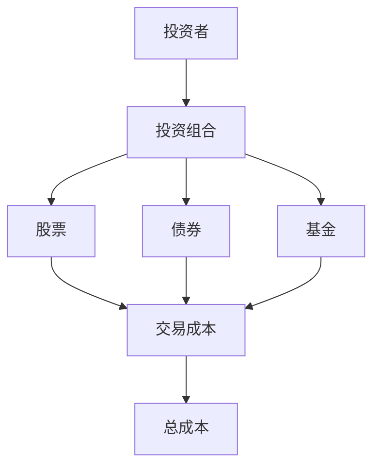
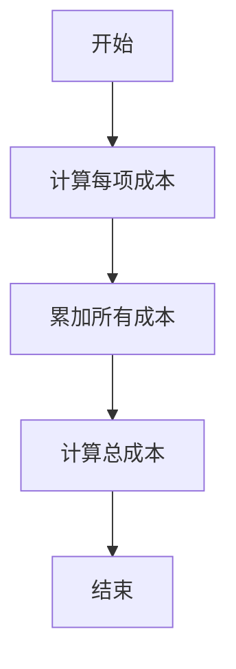
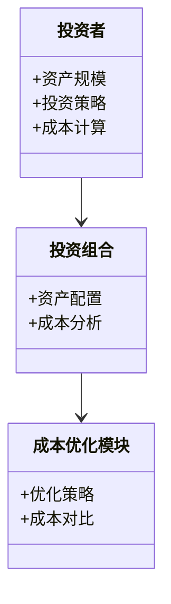

                 


```markdown
# 约翰伯格的'成本意识'：为什么每一分投资费用都重要

> 关键词：成本意识，投资费用，约翰伯格，投资回报，指数基金，低成本投资

> 摘要：本文深入探讨了成本意识在投资中的重要性，通过约翰伯格的理论，分析了每一分投资费用对长期回报的影响。文章从背景介绍、核心概念、算法原理、系统分析、项目实战和最佳实践等多角度，详细阐述了成本意识的原理与应用，并通过实际案例分析，帮助读者理解如何优化投资成本，实现更好的投资回报。

---

# 第一部分: 成本意识的背景与重要性

## 第1章: 投资的基本概念与成本意识的背景

### 1.1 投资的基本概念
#### 1.1.1 投资的定义与分类
- 投资的定义：将资金投入特定资产或项目，以期获得未来收益的行为。
- 投资的分类：
  - 股票：代表公司所有权的凭证。
  - 债券：债务人承诺在特定时间偿还本金和利息的债权凭证。
  - 基金：由专业管理人运作的集合投资工具。
  - 其他：房地产、黄金、艺术品等。

#### 1.1.2 投资的基本原则
- 长期视角：投资不是短期交易，而是长期资产配置。
- 分散投资：通过多元化降低风险。
- 理性决策：避免情绪化投资，基于数据和逻辑做决策。

#### 1.1.3 成本意识在投资中的地位
- 成本意识是投资决策中不可忽视的因素。
- 成本的高低直接影响投资回报。

### 1.2 成本意识的重要性
#### 1.2.1 成本意识的核心概念
- 成本是指投资者在投资过程中产生的各种费用，包括管理费、交易费、托管费等。
- 成本意识是指投资者对这些费用的敏感度和关注度。

#### 1.2.2 成本意识与投资回报的关系
- 高成本投资会侵蚀长期回报。
- 低成本投资能够提升净收益。

#### 1.2.3 成本意识在不同领域的应用
- 股票投资：降低交易成本和管理费。
- 基金投资：选择低成本指数基金。
- 其他投资：降低各类费用支出。

### 1.3 为什么每一分投资费用都重要
#### 1.3.1 成本的累积效应
- 高成本的累积效应会显著降低长期回报。
- 低成本的累积效应能够提升投资收益。

#### 1.3.2 成本对投资决策的影响
- 高成本可能导致投资者频繁交易，增加税负和交易费用。
- 低成本能够降低交易频率，减少市场冲击。

#### 1.3.3 成本优化的潜力与挑战
- 成本优化的潜力：通过选择低成本投资工具和策略，提升回报。
- 成本优化的挑战：市场波动、信息不对称等。

---

# 第二部分: 成本意识的核心概念与联系

## 第2章: 成本意识的核心概念与联系

### 2.1 成本意识的原理
#### 2.1.1 成本的定义与分类
- 成本的定义：投资过程中产生的各种费用。
- 成本的分类：
  - 显性成本：如管理费、交易费。
  - 隐性成本：如市场冲击、机会成本。

#### 2.1.2 成本的属性特征
| 成本属性 | 特征描述 |
|----------|----------|
| 显性成本 | 可直接量化，如管理费。 |
| 隐性成本 | 难以量化，如交易成本中的市场冲击。 |
| 时间依赖性 | 成本在不同时间段的影响不同。 |
| 可变性 | 成本可能随投资规模和策略变化。 |

#### 2.1.3 成本与收益的关系
- 成本与收益呈负相关：成本越高，收益可能越低。
- 长期来看，低成本投资更有可能实现超额收益。

### 2.2 成本意识的实体关系图



---

# 第三部分: 成本分析的算法原理

## 第3章: 成本分析的算法原理

### 3.1 成本分析的数学模型
#### 3.1.1 成本分析的基本公式
- 投资回报率（ROI）的计算：
  $$ ROI = \frac{\text{收益} - \text{成本}}{\text{成本}} $$

#### 3.1.2 成本分析的数学模型
- 累积成本计算：
  $$ C_{\text{total}} = \sum_{i=1}^{n} C_i $$
  其中，$C_i$ 是第 $i$ 项投资的成本。

#### 3.1.3 成本分析的实例应用
- 示例：假设投资100元，年管理费率为1%，则每年成本为1元，10年后累积成本为10元。

### 3.2 成本分析的算法流程



---

# 第四部分: 系统分析与架构设计方案

## 第4章: 系统分析与架构设计方案

### 4.1 问题场景介绍
- 投资者需要一个工具来计算和优化投资成本。
- 系统需要能够分析不同投资策略的成本，并提供优化建议。

### 4.2 项目介绍
- 项目名称：低成本投资优化系统。
- 项目目标：帮助投资者优化投资成本，提升投资回报。

### 4.3 系统功能设计
#### 4.3.1 领域模型（mermaid 类图）



### 4.4 系统架构设计（mermaid 架构图）

```mermaid
archi
    client -> server: HTTP 请求
    server -> db: 数据查询
    server -> service: 服务调用
    service -> db: 数据存储
    db --> server: 数据返回
    server -> client: 响应返回
```

---

# 第五部分: 项目实战

## 第5章: 项目实战

### 5.1 环境安装
- 安装Python和相关库（如numpy、pandas）。
- 安装Jupyter Notebook用于数据分析和可视化。

### 5.2 系统核心实现源代码
#### 5.2.1 成本计算函数

```python
def calculate_total_cost(costs):
    return sum(costs)
```

#### 5.2.2 投资回报率计算函数

```python
def calculate_return_on_investment(profits, costs):
    return (profits - costs) / costs
```

### 5.3 代码应用解读与分析
- 成本计算函数：接受一组成本数据，返回总成本。
- 投资回报率计算函数：计算基于利润和成本的投资回报率。

### 5.4 实际案例分析
#### 5.4.1 案例背景
- 投资者投入10000元，选择两只基金：
  - 基金A：年管理费率为1%，年收益率8%。
  - 基金B：年管理费率为0.5%，年收益率7%。

#### 5.4.2 计算与分析
- 基金A的年成本为100元，基金B的年成本为50元。
- 长期来看，低成本的基金B可能带来更高的净收益。

### 5.5 项目小结
- 成本计算和优化是投资决策中的关键步骤。
- 通过代码实现，可以量化成本影响，帮助投资者做出更明智的决策。

---

# 第六部分: 最佳实践

## 第6章: 最佳实践

### 6.1 小结
- 成本意识是投资成功的关键因素之一。
- 长期低成本投资能够显著提升净收益。

### 6.2 注意事项
- 避免过度关注短期成本。
- 综合考虑显性和隐性成本。

### 6.3 拓展阅读
- 《投资最重要的事情》——本杰明·格雷厄姆
- 《指数基金投资指南》—— fooish

---

# 结语

成本意识不仅是投资中的重要概念，更是实现长期投资目标的关键。通过本文的分析，读者可以更好地理解如何优化投资成本，提升投资回报。希望本文能够为投资者提供有价值的参考和启发。

---

作者：AI天才研究院/AI Genius Institute & 禅与计算机程序设计艺术 /Zen And The Art of Computer Programming
```

