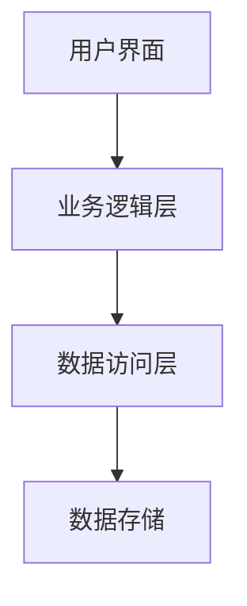
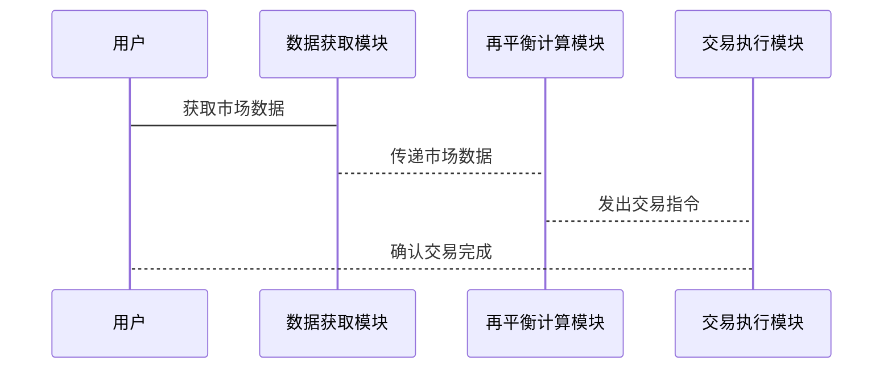

                 


# 约翰伯格的再平衡策略：维持投资组合的健康

## 关键词：投资组合、再平衡、约翰·伯格、资产配置、风险管理、组合优化、量化投资

## 摘要：约翰·伯格的再平衡策略是一种通过定期调整投资组合来维持资产配置比例的方法，旨在降低风险、提高收益。本文详细分析了再平衡策略的背景、原理、算法、系统设计及实际应用，帮助投资者理解并应用这一策略。

---

# 引言

投资组合的健康与否直接影响投资收益。随着市场波动和资产表现的变化，投资组合的权重可能会偏离最初的配置比例。这种偏离可能导致投资风险增加或收益下降。约翰·伯格提出的再平衡策略，通过定期调整投资组合，维持目标配置比例，从而优化风险收益比。本文将从背景、原理、算法、系统设计和实际案例等方面，详细探讨这一策略。

---

# 正文

## 第一章：投资组合再平衡策略的背景与重要性

### 1.1 投资组合再平衡的定义与核心概念

#### 1.1.1 投资组合再平衡的定义

再平衡策略是指定期调整投资组合中各资产的权重，使其回归到目标配置比例的过程。这种调整可以是定期进行，也可以是基于特定事件触发。

#### 1.1.2 再平衡策略的重要性

- **降低风险**：通过维持资产配置比例，再平衡策略可以减少因市场波动导致的过度风险。
- **优化收益**：保持目标配置比例有助于最大化投资组合的长期收益。
- **应对市场变化**：不同资产在市场波动中的表现不同，再平衡策略帮助投资者及时调整，避免单一资产的大幅波动影响整体投资组合。

#### 1.1.3 投资组合健康的概念与标准

投资组合的健康可以通过其偏离目标配置的程度来衡量。健康的组合应接近目标配置比例，同时具有较低的波动性和风险。

### 1.2 约翰·伯格再平衡策略的背景

#### 1.2.1 约翰·伯格的投资者理念

约翰·伯格是指数基金之父，强调长期投资和低成本策略。他认为，通过再平衡策略可以降低投资组合的波动性，提高长期收益。

#### 1.2.2 再平衡策略的起源与发展

再平衡策略并非由伯格首创，但他在实践中将其系统化。现代投资组合理论（MPT）为再平衡策略提供了理论基础。

#### 1.2.3 现代投资组合理论与再平衡策略的关系

现代投资组合理论强调资产配置的重要性，而再平衡策略则是实现和维持这种配置的有效方法。

### 1.3 再平衡策略的核心目标

#### 1.3.1 维持投资组合的配置比例

通过定期调整，确保各资产的权重符合目标配置。

#### 1.3.2 降低投资风险

避免单一资产的大幅波动对整体组合的影响。

#### 1.3.3 提升长期投资收益

通过优化资产配置，最大化投资组合的长期收益。

---

## 第二章：再平衡策略的数学模型与算法

### 2.1 投资组合再平衡的数学模型

#### 2.1.1 投资组合权重的计算公式

$$ w_i = \frac{a_i}{\sum_{j=1}^{n} a_j} $$

其中，$w_i$ 表示第 $i$ 个资产的权重，$a_i$ 表示第 $i$ 个资产的投资金额，$n$ 表示资产数量。

#### 2.1.2 投资组合偏离度的计算公式

$$ D = \sum_{i=1}^{n} |w_i - t_i| $$

其中，$D$ 表示偏离度，$w_i$ 表示当前权重，$t_i$ 表示目标权重。

### 2.2 再平衡策略的算法步骤

#### 2.2.1 确定目标配置比例

根据投资者的风险偏好和目标收益，确定各资产的目标权重。

#### 2.2.2 计算当前投资组合的偏离

通过比较当前权重和目标权重，确定各资产的偏离程度。

#### 2.2.3 确定需要调整的资产及其金额

根据偏离程度，计算需要买卖的资产及其金额，以使权重回归目标配置。

#### 2.2.4 执行交易以实现再平衡

通过买卖资产，调整投资组合，使其回归目标配置比例。

### 2.3 再平衡策略的优化算法

#### 2.3.1 最小化交易成本的优化模型

在再平衡过程中，优化算法可以通过最小化交易成本来确定最优的调整方案。

#### 2.3.2 约束条件下的优化问题

在某些情况下，可能需要考虑流动性约束或其他限制条件，这使得优化问题更加复杂。

#### 2.3.3 使用拉格朗日乘数法求解优化问题

拉格朗日乘数法是一种有效的优化方法，可以用于求解再平衡过程中的优化问题。

---

## 第三章：再平衡策略的系统分析与架构设计

### 3.1 系统功能需求分析

#### 3.1.1 数据获取模块

负责获取市场数据、资产价格等信息。

#### 3.1.2 配置管理模块

管理投资组合的目标配置比例。

#### 3.1.3 再平衡计算模块

计算当前投资组合的偏离，并确定需要调整的资产及其金额。

#### 3.1.4 交易执行模块

执行买卖交易，调整投资组合。

### 3.2 系统架构设计

#### 3.2.1 分层架构设计



#### 3.2.2 模块之间的交互流程



---

## 第四章：再平衡策略的项目实战

### 4.1 项目环境安装

安装必要的工具和库，如Python、Pandas等。

### 4.2 核心实现代码

```python
def calculate_rebalance(current_weights, target_weights):
    deviations = {asset: current - target for asset, current, target in zip(current_weights.keys(), current_weights.values(), target_weights.values())}
    return deviations
```

### 4.3 实际案例分析

以一个简单的投资组合为例，展示如何计算偏离度并执行再平衡交易。

---

## 第五章：再平衡策略的最佳实践

### 5.1 小结

再平衡策略是维持投资组合健康的重要工具，通过定期调整，优化风险收益比。

### 5.2 注意事项

- 定期审查投资组合的配置比例。
- 控制交易成本。
- 保持纪律，避免频繁调整。

### 5.3 拓展阅读

推荐相关书籍和在线资源，帮助读者深入学习再平衡策略。

---

# 总结

约翰·伯格的再平衡策略通过定期调整投资组合，维持资产配置比例，优化风险收益比。本文详细探讨了该策略的背景、原理、算法、系统设计和实际应用，帮助投资者理解和应用这一策略。

---

# 参考文献

1. 伯格, 约翰. *《证券分析》*. 纽约: 麦格劳-希尔, 1951.
2. 格林wald, 特雷. *《投资组合管理》*. 伦敦: 值观出版社, 2000.
3. Fama, Eugene, 和 Richard. *《投资组合理论》*. 芝加哥: 大学出版社, 1973.

---

# 作者

作者：AI天才研究院/AI Genius Institute & 禅与计算机程序设计艺术/Zen And The Art of Computer Programming

