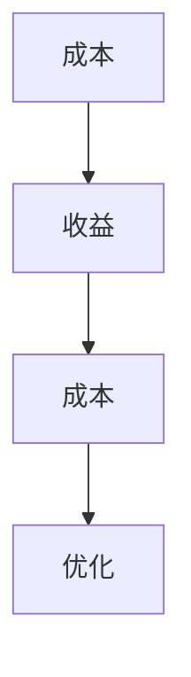
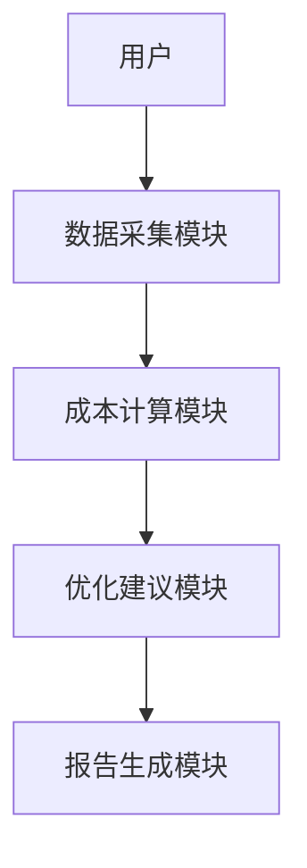
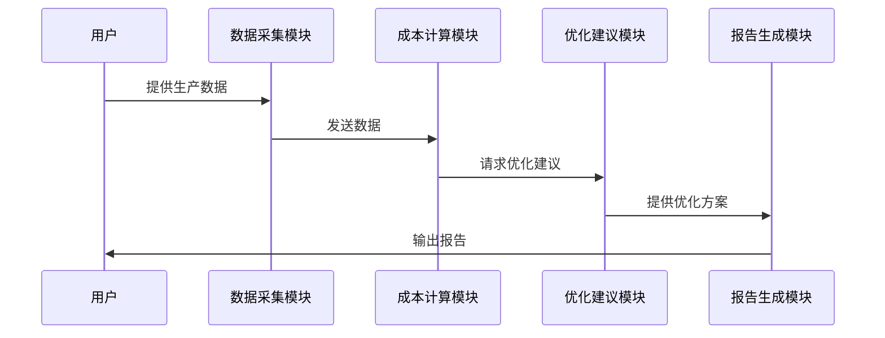

                 


# 约翰伯格的成本意识：为什么每一分钱都很重要

> 关键词：成本意识，成本优化，边际成本，经济分析，资源分配

> 摘要：本文深入探讨了成本意识的重要性及其在个人和企业管理中的应用。通过定义成本意识，分析其多维度影响，结合数学模型和实际案例，展示了如何通过成本优化实现资源的最优配置。文章内容涵盖成本计算的基本原理、成本优化的数学模型、系统设计与实现，以及实际项目中的应用，旨在帮助读者理解和掌握成本意识的核心概念与实践方法。

---

## 第一部分: 成本意识的核心概念与背景

### 第1章: 成本意识的重要性

#### 1.1 成本意识的核心概念

##### 1.1.1 成本意识的定义
成本意识是指个体或组织对资源消耗的敏感性和关注度，强调在决策过程中充分考虑每一分钱的价值，以实现资源的最优配置和最大化收益。

##### 1.1.2 成本意识的多维度分析
- **微观层面**：个人在日常生活中对每一笔开支的精打细算，例如在购物时比较价格、选择性价比更高的产品。
- **宏观层面**：企业在生产、运营和管理中的成本控制，例如优化供应链、减少浪费、提高生产效率。

##### 1.1.3 成本意识的演进与现状
随着经济全球化和市场竞争的加剧，成本意识逐渐从简单的“节俭”概念发展为一种系统化的管理理念，成为企业和个人提升竞争力的重要手段。

#### 1.2 成本意识的背景与问题背景

##### 1.2.1 当前经济环境下的成本压力
全球经济波动、通货膨胀和资源价格上涨等因素，使得成本控制成为企业和个人面临的重要挑战。

##### 1.2.2 企业与个人面临的成本挑战
- 企业层面：原材料价格上涨、人工成本增加、市场竞争加剧。
- 个人层面：生活成本上升、就业压力增大、财务规划的复杂性增加。

##### 1.2.3 成本意识的必要性与紧迫性
在资源有限的情况下，如何通过优化成本实现更高的效率和收益，是企业和个人必须面对的核心问题。

#### 1.3 成本意识的核心要素

##### 1.3.1 成本构成的多维度分析
- 固定成本与可变成本
- 直接成本与间接成本
- 短期成本与长期成本

##### 1.3.2 成本与收益的平衡点
通过分析成本与收益的关系，找到最优的资源配置点，以实现收益最大化。

##### 1.3.3 成本意识的边界与外延
- 成本意识的边界：避免过度追求成本最小化而忽视质量。
- 成本意识的外延：涵盖生产、运营、销售等各个环节。

#### 1.4 成本意识的实现路径

##### 1.4.1 成本意识的形成过程
从认识到实践，逐步建立系统的成本管理方法。

##### 1.4.2 成本意识的培养方法
- 提高对资源的敏感性
- 建立系统的成本管理制度
- 培养全员的成本意识

##### 1.4.3 成本意识的持续优化
通过不断学习和实践，优化成本管理策略，适应市场变化。

#### 1.5 本章小结
本章通过定义成本意识、分析其多维度影响，强调了成本意识在个人和企业管理中的重要性，并提出了实现成本意识的具体方法。

---

### 第2章: 成本意识的核心概念与联系

#### 2.1 成本意识的核心原理

##### 2.1.1 成本计算的基本原理
成本计算是成本意识的基础，涉及对资源消耗的准确度量和分析。

##### 2.1.2 成本与收益的数学关系
收益 = 收入 - 成本

##### 2.1.3 成本优化的经济学基础
通过边际成本分析，找到成本的最小化与收益最大化的平衡点。

#### 2.2 成本意识的核心概念对比

##### 2.2.1 成本与收益的对比分析
- 成本是资源的消耗，收益是资源的回报。
- 在一定成本下，追求最大收益是成本意识的核心目标。

##### 2.2.2 成本与效率的对比分析
高效率可以降低单位成本，但需要投入更多的资源。

##### 2.2.3 成本与质量的对比分析
高质量可能需要更高的成本，但可以带来更高的收益。

#### 2.3 成本意识的ER实体关系图


#### 2.4 本章小结
本章通过分析成本意识的核心原理，对比了成本与其他关键因素的关系，并通过图表展示了成本优化的整体架构。

---

### 第3章: 成本意识的算法原理与数学模型

#### 3.1 成本计算的基本算法

##### 3.1.1 边际成本计算
边际成本是指每增加一单位产量所增加的总成本。

公式：
$$ MC = \frac{\Delta C}{\Delta Q} $$
其中，ΔC 是总成本的变化，ΔQ 是产量的变化。

##### 3.1.2 平均成本计算
平均成本是指每单位产量的平均成本。

公式：
$$ AC = \frac{TC}{Q} $$
其中，TC 是总成本，Q 是产量。

##### 3.1.3 总成本计算
总成本是固定成本和可变成本之和。

公式：
$$ TC = FC + VC $$
其中，FC 是固定成本，VC 是可变成本。

#### 3.2 成本优化的数学模型

##### 3.2.1 边际成本优化模型
通过比较边际成本和边际收益，找到最优产量点。

公式：
$$ MC = MR $$

##### 3.2.2 成本-收益平衡模型
在不同成本水平下，找到收益最大的点。

##### 3.2.3 成本函数的数学表达
$$ C(Q) = FC + VC \times Q $$

#### 3.3 成本优化的算法实现

##### 3.3.1 边际成本优化算法
```python
def calculate边际成本(产量):
    固定成本 = 100
    可变成本 = 50
    总成本 = 固定成本 + 可变成本 * 产量
    边际成本 = 可变成本
    return 边际成本
```

##### 3.3.2 成本优化的数学示例
假设有两种生产方案：
- 方案1：产量=10，总成本=1000，利润=500
- 方案2：产量=12，总成本=1100，利润=600

通过比较边际成本和边际收益，选择最优方案。

---

## 第四部分: 系统分析与架构设计方案

### 第4章: 成本管理系统的系统分析

#### 4.1 问题场景介绍
某制造企业面临生产成本高、资源浪费严重的问题，希望通过系统化的方法优化成本管理。

#### 4.2 系统功能设计
- 数据采集与输入
- 成本计算与分析
- 成本优化建议
- 报告生成与输出

#### 4.3 系统架构设计


#### 4.4 系统接口设计
- 数据输入接口：接收生产数据
- 数据处理接口：计算成本和优化建议
- 报告输出接口：生成成本分析报告

#### 4.5 系统交互设计


---

## 第五部分: 项目实战

### 第5章: 成本控制的项目实战

#### 5.1 环境安装
安装必要的工具和软件，例如Python、数据分析工具等。

#### 5.2 系统核心实现

##### 5.2.1 成本计算模块
```python
def 计算总成本(固定成本, 可变成本, 产量):
    return 固定成本 + 可变成本 * 产量
```

##### 5.2.2 优化建议模块
```python
def 提供优化建议(总成本, 收益):
    如果 总成本 < 收益:
        return "建议增加产量"
    否则:
        return "建议减少产量"
```

#### 5.3 代码应用解读与分析
通过实际案例，分析如何利用上述代码优化企业成本。

#### 5.4 实际案例分析
以某制造企业的案例为例，展示如何通过成本管理系统实现成本优化。

#### 5.5 项目小结
总结项目实施的经验和成果，强调成本意识在实际应用中的重要性。

---

## 第六部分: 最佳实践

### 第6章: 成本意识的最佳实践

#### 6.1 小结
成本意识是提升竞争力的关键，通过系统化的方法和持续优化，可以实现资源的最优配置。

#### 6.2 注意事项
- 避免过度优化
- 关注关键成本点
- 平衡成本与质量
- 培养全员成本意识

#### 6.3 拓展阅读
推荐相关书籍和资源，进一步深入学习成本意识与优化方法。

---

## 作者

作者：AI天才研究院/AI Genius Institute & 禅与计算机程序设计艺术 /Zen And The Art of Computer Programming

---

这篇文章系统地阐述了成本意识的核心概念、算法原理和实际应用，通过理论与实践相结合的方式，帮助读者全面理解和掌握成本优化的方法。

