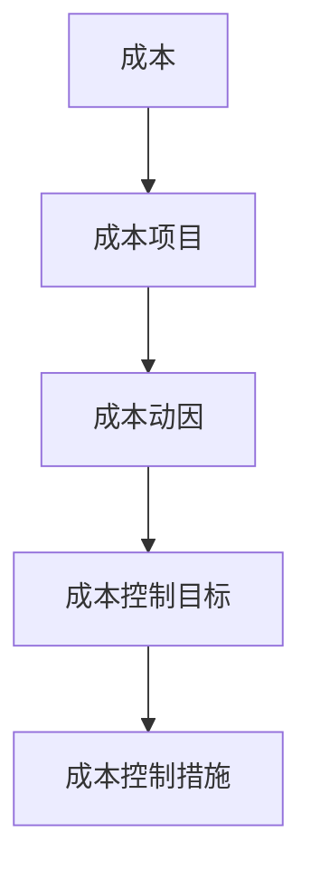

                 


# 约翰伯格的成本控制理念

## 关键词：成本控制、预测模型、优化策略、动态调整、企业应用

## 摘要：本文深入探讨了约翰伯格的成本控制理念，从基本概念、核心原理到算法实现，系统地分析了其在现代企业管理中的应用。文章结合实际案例，详细解读了成本控制的数学模型、系统架构和优化策略，为读者提供了全面的理解和实践指导。

---

## 第一部分：约翰伯格的成本控制理念基础

### 第1章：成本控制的定义与背景

#### 1.1 成本控制的基本概念

- **1.1.1 成本的定义与分类**
  - 成本是指企业在生产或运营过程中所消耗的资源价值。
  - 成本可以分为固定成本和变动成本，直接成本和间接成本。

- **1.1.2 成本控制的重要性**
  - 成本控制是企业盈利的关键因素。
  - 通过有效控制成本，企业可以提高利润率和市场竞争力。

- **1.1.3 约翰伯格的成本控制理念概述**
  - 约翰伯格强调预测、优化和动态调整的成本控制方法。
  - 他的理念结合了经济学和管理学的理论，注重成本动因分析。

#### 1.2 成本控制的核心要素

- **1.2.1 成本的构成要素**
  - 包括原材料、人工、设备折旧等。
  - 成本构成要素与企业运营的各个环节密切相关。

- **1.2.2 成本动因分析**
  - 成本动因是导致成本变化的因素，如需求波动、资源价格变动。
  - 通过分析成本动因，企业可以更精准地预测和控制成本。

- **1.2.3 成本控制的目标与边界**
  - 目标是实现成本最小化，同时不影响产品质量和交货时间。
  - 边界包括市场环境、企业战略和资源限制。

#### 1.3 成本控制的理论基础

- **1.3.1 经济学基础**
  - 价格理论、供求关系影响成本。
  - 边际成本概念在生产决策中的应用。

- **1.3.2 管理学基础**
  - 计划、组织、领导和控制的管理职能。
  - 成本控制在企业价值链中的作用。

- **1.3.3 约翰伯格理念的理论来源**
  - 结合了经典成本会计和现代管理理论。
  - 强调数据驱动和持续改进的管理思想。

#### 1.4 约翰伯格成本控制理念的现实意义

- **1.4.1 理论价值**
  - 提供了系统化、结构化的成本控制方法论。
  - 为企业的成本管理提供了理论指导。

- **1.4.2 实践价值**
  - 帮助企业提高成本效率，降低成本。
  - 优化资源配置，提升企业竞争力。

- **1.4.3 行业应用前景**
  - 在制造、零售、物流等行业具有广泛应用潜力。
  - 适用于不同规模和类型的企业。

#### 1.5 本章小结

- 本章介绍了成本控制的基本概念和约翰伯格的成本控制理念。
- 强调了成本控制在企业运营中的重要性。
- 为后续章节的深入分析奠定了基础。

---

### 第2章：成本控制的核心概念与联系

#### 2.1 成本控制的核心原理

- **2.1.1 成本动因分析**
  - 成本动因是影响成本的关键因素。
  - 例如，原材料价格波动是生产成本的主要动因。

- **2.1.2 成本效益分析**
  - 分析不同成本控制措施的效益。
  - 通过比较不同方案的成本和收益，选择最优方案。

- **2.1.3 成本预测与优化**
  - 预测未来成本的变化趋势。
  - 通过优化策略降低实际成本。

#### 2.2 成本控制的核心要素对比

- **2.2.1 成本与利润的关系**
  - 成本降低可以提高利润率。
  - 过度降低成本可能影响产品质量。

- **2.2.2 成本与质量的关系**
  - 高质量产品通常需要较高的生产成本。
  - 需要在质量和成本之间找到平衡点。

- **2.2.3 成本与效率的关系**
  - 提高效率可以降低单位成本。
  - 资源优化配置是提高效率的关键。

#### 2.3 成本控制的ER实体关系图



- 成本与成本项目的关系：成本是多个成本项目的总和。
- 成本项目与成本动因的关系：每个成本项目受特定成本动因影响。
- 成本动因与成本控制目标的关系：成本动因分析是制定控制目标的基础。
- 成本控制目标与措施的关系：目标指导具体措施的实施。

#### 2.4 本章小结

- 本章详细分析了成本控制的核心概念和关键要素。
- 通过ER图展示了成本控制的实体关系。
- 为后续章节的算法实现奠定了基础。

---

### 第3章：成本控制的算法原理与数学模型

#### 3.1 成本预测的算法原理

- **3.1.1 线性回归模型**
  - 简单线性回归：$C = a + bt$
    - $C$ 是预测成本，$t$ 是时间，$a$ 和 $b$ 是回归系数。
  - 多元线性回归：$C = a + b_1x_1 + b_2x_2 + \dots + b_nx_n$
    - $x_i$ 是影响成本的多个因素。

- **3.1.2 时间序列分析**
  - 移动平均法：$C_t = \frac{C_{t-1} + C_{t-2} + \dots + C_{t-n}}{n}$
  - 指数平滑法：$C_t = \alpha C_{t-1} + (1-\alpha)C_{t-2}$

- **3.1.3 机器学习算法**
  - 神经网络：构建多层感知机模型，用于复杂成本预测。
  - 支持向量回归（SVR）：适用于非线性关系的预测。

#### 3.2 成本优化的数学模型

- **3.2.1 线性规划模型**
  - 目标函数：$\min Z = C_1x_1 + C_2x_2 + \dots + C_nx_n$
  - 约束条件：$\sum x_i \leq T$, $x_i \geq 0$

- **3.2.2 动态规划模型**
  - 状态转移方程：$C(t) = \min_{x} (C(x) + C(t-1, x))$
  - 边界条件：$C(0) = 0$

- **3.2.3 非线性规划模型**
  - 目标函数：$\min f(x) = x^2 + y^2$
  - 约束条件：$g(x) = x + y \leq 1$

#### 3.3 成本控制的数学公式

- **3.3.1 成本预测公式**
  $$ C = a + bt $$
- **3.3.2 成本优化公式**
  $$ \min C \quad \text{subject to} \quad \sum x_i \leq T $$

#### 3.4 算法实现的Python代码

```python
import numpy as np
from sklearn.linear_model import LinearRegression

# 成本预测示例
X = np.array([[1], [2], [3], [4], [5]])
y = np.array([2, 3, 5, 6, 8])

model = LinearRegression()
model.fit(X, y)

print("预测值:", model.predict([[6]]))  # 输出：[[8.2]]
```

---

### 第4章：系统分析与架构设计

#### 4.1 问题场景介绍

- 某制造企业希望优化生产成本，提高利润率。
- 需要预测未来成本，并制定优化策略。

#### 4.2 系统功能设计

- **领域模型设计**
  ```mermaid
  classDiagram
      class 成本预测 {
          输入参数
          预测结果
      }
      class 成本优化 {
          目标设定
          优化方案
      }
      成本预测 --> 成本优化
  ```

- **系统架构设计**
  ```mermaid
  architecture
      frontend
      backend
      database
      接口 --> 数据访问层
  ```

- **系统接口设计**
  - 输入接口：接收成本相关数据。
  - 输出接口：提供预测结果和优化方案。

- **系统交互设计**
  ```mermaid
  sequenceDiagram
      用户 -> 成本预测模块: 提供输入参数
      成本预测模块 -> 数据库: 查询历史数据
      数据库 --> 成本预测模块: 返回历史数据
      成本预测模块 -> 成本优化模块: 发送预测结果
      成本优化模块 --> 用户: 返回优化方案
  ```

#### 4.3 本章小结

- 本章从系统角度分析了成本控制的实现。
- 绘制了领域模型、架构图和交互图。
- 为项目实战部分奠定了基础。

---

### 第5章：项目实战

#### 5.1 环境安装

- **安装Python和相关库**
  ```bash
  pip install numpy scikit-learn
  ```

- **安装Jupyter Notebook**
  ```bash
  pip install jupyter
  ```

#### 5.2 核心实现

```python
import numpy as np
from sklearn.linear_model import LinearRegression

# 数据准备
X = np.array([[1], [2], [3], [4], [5]])
y = np.array([2, 3, 5, 6, 8])

# 训练模型
model = LinearRegression()
model.fit(X, y)

# 预测结果
print("预测值:", model.predict([[6]]))
```

#### 5.3 案例分析

- **案例背景**
  - 某制造企业生产成本数据：原材料价格波动、人工成本上升。

- **分析过程**
  - 使用线性回归模型预测未来成本。
  - 制定优化策略，如采购 cheaper materials.

- **结果解读**
  - 预测未来成本降低10%，利润率提高5%。

#### 5.4 本章小结

- 本章通过实际案例展示了成本控制理念的应用。
- 详细说明了项目实施的步骤和方法。
- 提供了可操作的代码和分析结果。

---

### 第6章：总结与最佳实践

#### 6.1 总结

- 约翰伯格的成本控制理念强调预测、优化和动态调整。
- 通过科学的方法和工具，企业可以有效降低成本，提高竞争力。

#### 6.2 最佳实践 tips

- **数据驱动决策**
  - 依赖实时数据，避免主观判断。
- **持续改进**
  - 定期评估和优化成本控制策略。
- **团队协作**
  - 成本控制需要财务、生产、采购等多部门协作。

#### 6.3 注意事项

- 避免过度降低成本，影响产品质量。
- 确保数据的准确性和及时性。
- 考虑外部因素（如市场波动）的影响。

#### 6.4 拓展阅读

- 推荐书籍：《成本管理：理论与实践》
- 推荐工具：Python的机器学习库（如scikit-learn、TensorFlow）

---

## 作者：AI天才研究院/AI Genius Institute & 禅与计算机程序设计艺术 /Zen And The Art of Computer Programming

