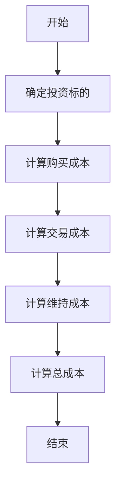
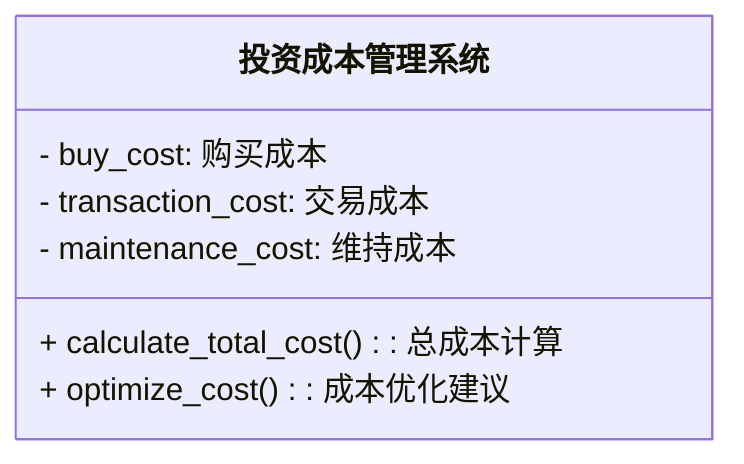
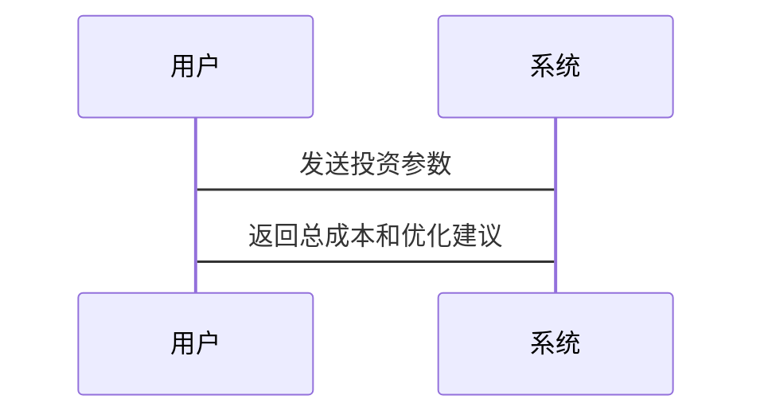

                 


# 《约翰伯格的投资成本意识》

## 关键词：
投资成本意识、约翰伯格、投资策略、成本计算模型、系统设计、Python实现

## 摘要：
本文深入探讨约翰伯格的投资成本意识，分析其在投资决策中的重要性。通过背景介绍、核心概念、算法原理、系统设计、项目实战和最佳实践，帮助读者理解如何有效管理投资成本以优化回报。文章结合理论与实践，提供详细的数学模型和系统架构，帮助投资者提升成本意识和决策能力。

---

## 第一部分：投资成本意识的背景与核心概念

### 第1章：投资成本意识的背景与问题背景

#### 1.1 投资成本意识的背景

- **1.1.1 投资成本意识的定义**  
  投资成本意识是指在投资决策中，对各种成本因素的识别、评估和管理的意识。它包括显性成本（如购买佣金、税费）和隐性成本（如时间成本、机会成本）。

- **1.1.2 投资成本意识的起源与发展**  
  约翰伯格作为投资界的重要人物，强调了成本在投资回报中的作用。他的研究表明，长期来看，低费用的投资策略往往表现更优。

- **1.1.3 投资成本意识在现代投资中的重要性**  
  随着市场的竞争加剧，投资者越来越意识到成本对收益的影响。降低投资成本可以提高净收益，尤其是在长期投资中效果显著。

#### 1.2 投资成本意识的核心问题

- **1.2.1 投资成本的构成与分类**  
  投资成本包括直接成本（如佣金、税费）和间接成本（如管理费、机会成本）。

- **1.2.2 投资成本与投资回报的关系**  
  投资成本的高低直接影响净收益。在相同的投资回报率下，成本越低，实际收益越高。

- **1.2.3 投资成本意识的边界与外延**  
  成本意识不仅限于交易成本，还包括税务、时间成本等。外延则涉及风险管理、资产配置等领域。

#### 1.3 投资成本意识的核心要素

- **1.3.1 投资成本的核心概念**  
  成本意识贯穿于整个投资周期，从初始购买到持有再到卖出，每个阶段都有不同的成本因素。

- **1.3.2 投资成本与风险的关系**  
  高成本投资可能带来更高的风险，因为投资者可能需要承担更多的费用，影响整体收益。

- **1.3.3 投资成本意识的结构与组成**  
  成本意识包括成本识别、评估、控制和优化四个环节，形成一个完整的管理流程。

---

## 第二部分：投资成本意识的核心概念与联系

### 第2章：投资成本的构成与分析

#### 2.1 投资成本的构成要素

- **2.1.1 购买成本**  
  包括佣金、印花税等，直接从收益中扣除。

- **2.1.2 交易成本**  
  每次交易产生的费用，频繁交易会增加累积成本。

- **2.1.3 维持成本**  
  包括管理费、托管费等，长期积累会影响收益。

- **2.1.4 机会成本**  
  投资于某一资产而放弃其他更高收益机会的成本。

#### 2.2 投资成本与收益的关系

- **2.2.1 投资成本对收益的影响**  
  成本高的投资组合在相同市场条件下收益较低。

- **2.2.2 投资成本与投资期限的关系**  
  长期投资中，低成本策略的优势更加明显。

- **2.2.3 投资成本与资产配置的关系**  
  成本意识影响资产配置决策，低成本资产更受青睐。

#### 2.3 投资成本的对比分析

- **2.3.1 不同投资策略下的成本对比**  
  比较主动型与被动型投资的成本差异。

- **2.3.2 不同资产类别中的成本差异**  
  股票、债券、基金等不同资产的成本结构不同。

- **2.3.3 不同市场环境中的成本变化**  
  市场波动会影响交易成本，如佣金折扣和税费变化。

---

## 第三部分：投资成本意识的算法原理

### 第3章：投资成本计算的数学模型

#### 3.1 投资成本计算的基本公式

- **3.1.1 总成本计算公式**  
  总成本 = 购买成本 + 交易成本 + 维持成本 + 机会成本。

- **3.1.2 单位成本计算公式**  
  单位成本 = 总成本 / 投资金额。

- **3.1.3 成本收益率计算公式**  
  成本收益率 = (总成本 / 总投资) × 100%。

#### 3.2 投资成本优化模型

- **3.2.1 成本最小化模型**  
  目标是最小化总成本，约束条件为投资收益最大化。

- **3.2.2 收益最大化模型**  
  在给定成本预算下，选择收益最大的投资组合。

- **3.2.3 风险调整的成本优化模型**  
  在考虑风险的前提下，优化成本和收益的平衡。

#### 3.3 投资成本计算的流程图



#### 3.4 投资成本计算的Python实现

```python
def calculate_total_cost(buy_cost, transaction_cost, maintenance_cost):
    total_cost = buy_cost + transaction_cost + maintenance_cost
    return total_cost

# 示例数据
buy_cost = 100  # 购买成本
transaction_cost = 50  # 交易成本
maintenance_cost = 20  # 维持成本

total_cost = calculate_total_cost(buy_cost, transaction_cost, maintenance_cost)
print(f"总成本为：{total_cost}")
```

---

## 第四部分：投资成本意识的系统分析与架构设计

### 第4章：投资成本管理系统设计

#### 4.1 系统功能设计

- **4.1.1 投资标的成本计算模块**  
  输入投资标的，计算各项成本并汇总。

- **4.1.2 成本优化建议模块**  
  根据成本计算结果，提供优化建议。

- **4.1.3 成本收益分析模块**  
  对比不同投资组合的成本收益，提供决策支持。

#### 4.2 系统架构设计



#### 4.3 系统接口设计

- **API接口**：
  - `/api/calculate_cost`：接收投资参数，返回总成本。
  - `/api/optimize_cost`：返回优化后的投资组合。

#### 4.4 系统交互流程



---

## 第五部分：投资成本意识的项目实战

### 第5章：投资成本管理系统实现

#### 5.1 环境安装

- 安装Python和相关库：
  ```bash
  pip install numpy pandas matplotlib
  ```

#### 5.2 核心代码实现

```python
import pandas as pd

def calculate_cost(portfolio):
    total_cost = 0
    for asset in portfolio:
        total_cost += asset.buy_cost + asset.transaction_cost + asset.maintenance_cost
    return total_cost

# 示例投资组合
portfolio = [
    {'buy_cost': 100, 'transaction_cost': 50, 'maintenance_cost': 20},
    {'buy_cost': 200, 'transaction_cost': 30, 'maintenance_cost': 10}
]

total_cost = calculate_cost(portfolio)
print(f"总成本为：{total_cost}")
```

#### 5.3 案例分析

- **案例1**：假设投资组合包含两只股票，计算总成本，优化建议为减少交易频率以降低交易成本。

---

## 第六部分：投资成本意识的最佳实践

### 第6章：最佳实践

#### 6.1 小结

- 成本意识贯穿投资全过程，降低投资成本是提高收益的关键。

#### 6.2 注意事项

- 定期审查投资组合，评估各项成本。
- 选择低费用的投资工具，如指数基金。
- 避免频繁交易，减少交易成本。

#### 6.3 拓展阅读

- 约翰伯格的《投资的革命》。
- 《投资组合管理：成本与收益的平衡》。

---

## 作者信息

作者：AI天才研究院/AI Genius Institute & 禅与计算机程序设计艺术 /Zen And The Art of Computer Programming

感谢您的阅读！如果对内容有疑问或需要进一步探讨，请随时联系。

