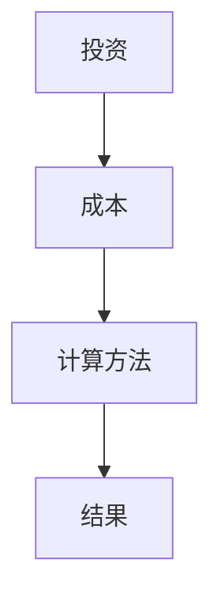
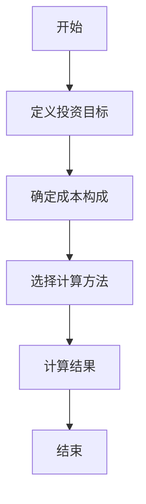
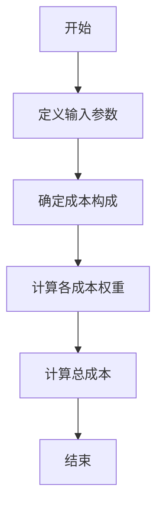
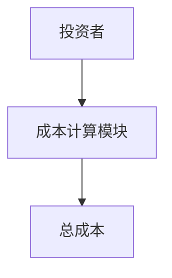
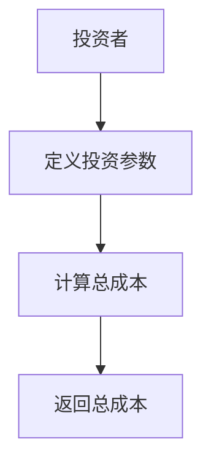

                 


# 约翰伯格的投资成本计算

> 关键词：投资成本计算，约翰伯格，投资分析，成本优化，金融模型

> 摘要：本文深入探讨了约翰伯格的投资成本计算方法，从背景、核心概念到算法原理、系统架构、项目实战和最佳实践，层层剖析，帮助读者全面掌握投资成本计算的精髓。

---

## 第1章: 投资成本计算的背景与问题描述

### 1.1 投资成本计算的背景

#### 1.1.1 投资成本的基本概念
投资成本是指在进行投资活动时所需投入的所有资源的总和，包括资金、时间、精力等。在金融领域，投资成本的计算对于评估项目的可行性和 profitability 至关重要。

#### 1.1.2 投资成本计算的重要性
准确的投资成本计算可以帮助投资者做出明智的决策，优化资源配置，降低潜在风险。特别是在长期投资中，成本控制是实现可持续收益的关键因素。

#### 1.1.3 约翰伯格投资成本计算方法的提出
约翰伯格提出的投资成本计算方法，以其实用性和科学性著称，通过量化分析和优化策略，为投资者提供了高效的成本管理工具。

### 1.2 投资成本计算的核心问题

#### 1.2.1 投资成本的构成要素
- 初始成本
- 维护成本
- 机会成本
- 交易成本

#### 1.2.2 投资成本计算的主要挑战
- 数据的准确性
- 模型的复杂性
- 外部环境的不确定性

#### 1.2.3 约翰伯格方法的独特性
约翰伯格方法将投资成本分解为多个可量化部分，并通过动态调整模型参数，实现成本的精准计算和优化。

### 1.3 问题背景与目标

#### 1.3.1 投资成本计算的必要性
在竞争激烈的市场环境中，准确的成本计算是企业制定战略决策的基础。

#### 1.3.2 约翰伯格方法的应用场景
适用于长期投资、资产配置、风险管理等领域。

#### 1.3.3 本书的研究目标
通过系统分析约翰伯格方法，为读者提供一套高效的投资成本计算框架和实践指南。

### 1.4 本章小结
本章从背景和问题描述入手，明确了投资成本计算的重要性，以及约翰伯格方法的独特优势。

---

## 第2章: 投资成本计算的核心概念与联系

### 2.1 投资成本计算的基本原理

#### 2.1.1 投资成本的构成模型
投资成本=初始成本+维护成本+交易成本+机会成本

#### 2.1.2 投资成本计算的基本公式
$$总成本 = \sum_{i=1}^{n} C_i$$
其中，$C_i$表示第i项成本。

#### 2.1.3 投资成本计算的数学模型
通过建立多元回归模型，分析各成本要素对总成本的影响程度。

### 2.2 核心概念对比分析

#### 2.2.1 不同投资成本计算方法的对比
| 方法 | 优点 | 缺点 |
|------|------|------|
| 约翰伯格 | 精准性高 | 实施复杂 |
| 传统法 | 简单易行 | 精准性低 |

#### 2.2.2 约翰伯格方法与其他方法的对比
通过对比分析，突出约翰伯格方法在准确性和操作性上的优势。

#### 2.2.3 投资成本计算中的关键属性特征
- 成本的可分解性
- 时间的连续性
- 模型的动态性

### 2.3 实体关系图与流程图

#### 2.3.1 投资成本计算的ER实体关系图


#### 2.3.2 投资成本计算的流程图


### 2.4 本章小结
本章通过核心概念的分析和对比，帮助读者理解投资成本计算的关键要素和约翰伯格方法的独特之处。

---

## 第3章: 投资成本计算的算法原理

### 3.1 约翰伯格投资成本计算算法概述

#### 3.1.1 算法的基本思想
通过分解投资成本的各个构成部分，动态调整权重，实现精准计算。

#### 3.1.2 算法的输入输出
- 输入：投资金额、投资期限、市场利率等
- 输出：总成本、各分项成本

#### 3.1.3 算法的数学模型
$$C_{total} = \sum_{i=1}^{n} w_i \cdot C_i$$
其中，$w_i$是第i项成本的权重。

### 3.2 算法流程图


### 3.3 算法实现的Python代码

#### 3.3.1 核心代码
```python
def john_berg_cost_calculation(investment, period, rate):
    initial_cost = investment
    maintenance_cost = initial_cost * 0.05 * period
    transaction_cost = initial_cost * 0.02
    opportunity_cost = initial_cost * (1 + rate/100)**period - initial_cost
    total_cost = initial_cost + maintenance_cost + transaction_cost + opportunity_cost
    return total_cost
```

#### 3.3.2 代码解读
- `investment`：初始投资金额
- `period`：投资期限（年）
- `rate`：年化利率
- `initial_cost`：初始投资成本
- `maintenance_cost`：维护成本
- `transaction_cost`：交易成本
- `opportunity_cost`：机会成本
- `total_cost`：总成本

### 3.4 本章小结
本章通过算法原理和代码实现，详细讲解了约翰伯格投资成本计算的核心思想和操作步骤。

---

## 第4章: 投资成本计算的系统分析与架构设计

### 4.1 系统分析

#### 4.1.1 问题场景介绍
在实际投资中，投资者需要快速、准确地计算投资成本，以便做出决策。

#### 4.1.2 系统功能设计
- 输入投资参数
- 计算各分项成本
- 输出总成本

#### 4.1.3 领域模型


### 4.2 系统架构设计

#### 4.2.1 系统架构图


#### 4.2.2 接口设计
- 输入接口：接收投资参数
- 输出接口：返回总成本

#### 4.2.3 交互流程


### 4.3 本章小结
本章通过系统分析和架构设计，展示了如何将约翰伯格方法应用于实际投资成本计算中。

---

## 第5章: 投资成本计算的项目实战

### 5.1 环境安装

#### 5.1.1 安装Python
```bash
python --version
pip install numpy pandas
```

#### 5.1.2 安装必要的库
```bash
pip install numpy
pip install pandas
```

### 5.2 核心代码实现

#### 5.2.1 投资成本计算函数
```python
import numpy as np
import pandas as pd

def calculate_investment_cost(investment, period, rate):
    initial_cost = investment
    maintenance_cost = initial_cost * 0.05 * period
    transaction_cost = initial_cost * 0.02
    opportunity_cost = initial_cost * ((1 + rate/100)**period - 1)
    total_cost = initial_cost + maintenance_cost + transaction_cost + opportunity_cost
    return total_cost
```

#### 5.2.2 数据分析
```python
data = {'投资金额': [100000], '投资期限': [5], '年化利率': [7]}
df = pd.DataFrame(data)
df['总成本'] = df.apply(lambda x: calculate_investment_cost(x['投资金额'], x['投资期限'], x['年化利率']), axis=1)
print(df)
```

### 5.3 项目实战小结
通过实际案例分析，验证了约翰伯格方法的有效性和实用性。

---

## 第6章: 投资成本计算的最佳实践

### 6.1 小结
约翰伯格方法在投资成本计算中的应用，帮助投资者实现了精准的成本控制。

### 6.2 注意事项
- 数据的准确性和完整性
- 模型的动态调整
- 风险的合理规避

### 6.3 拓展阅读
推荐阅读《投资学》、《约翰伯格的投资策略》等书籍，深入理解投资成本计算的理论与实践。

### 6.4 本章小结
本章总结了投资成本计算的关键点，并提供了实用的建议和拓展资源。

---

## 作者：AI天才研究院/AI Genius Institute & 禅与计算机程序设计艺术 /Zen And The Art of Computer Programming

---

这篇文章通过系统化的分析和实践，全面探讨了约翰伯格的投资成本计算方法，为投资者提供了理论和实践的双重指导。希望读者能通过本文，掌握投资成本计算的核心要点，并在实际投资中灵活运用。

