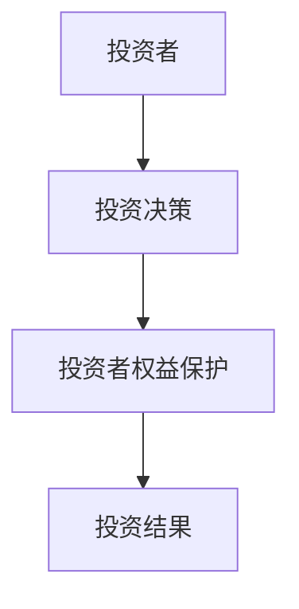
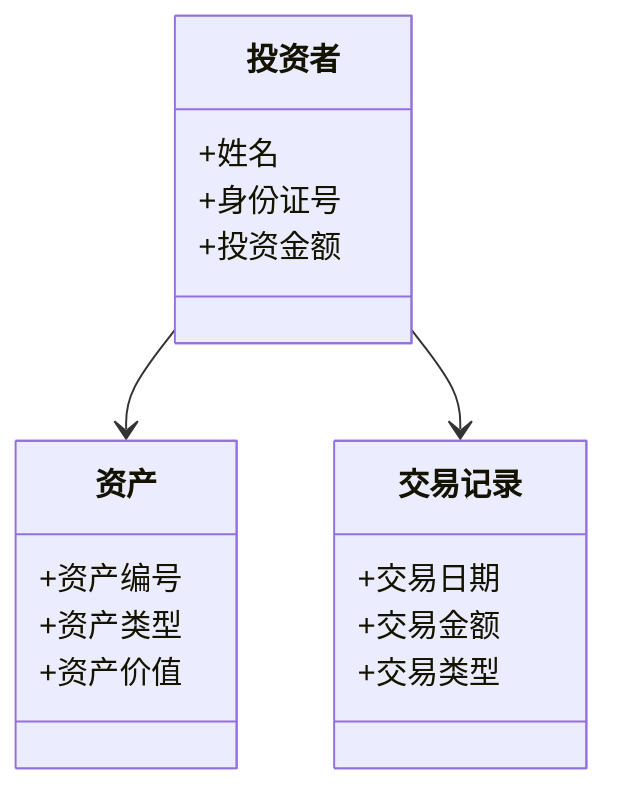
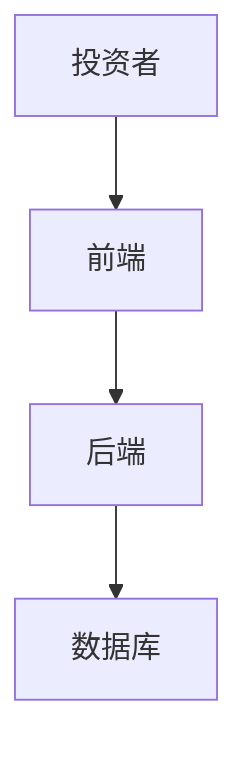

                 


# 约翰伯格的投资者权益保护

> 关键词：投资者权益保护，约翰·伯格，投资心理学，风险管理，法律合规，技术应用

> 摘要：本文深入探讨了投资者权益保护的重要性，结合约翰·伯格的投资理念，分析了投资者权益保护的核心概念、算法原理、系统设计、项目实战和最佳实践。通过丰富的案例和详细的数学模型，本文为投资者提供了一套全面的权益保护方案。

---

# 第1章: 投资者权益保护的基本概念

## 1.1 投资者权益保护的定义

### 1.1.1 投资者权益保护的定义与范围

投资者权益保护是指在投资活动中，确保投资者的合法权益不受侵害，包括知情权、参与权、收益权和监督权等。其范围涵盖股票、基金、债券等多种投资工具。

$$
\text{投资者权益保护的范围} = \text{投资工具类型} + \text{投资行为的合法性}
$$

### 1.1.2 投资者权益保护的重要性

保护投资者权益是维护金融市场秩序、促进投资信心的重要基础。以下是投资者权益保护的重要性：

1. **维护市场公平**：确保所有投资者在市场中享有平等的权利。
2. **保护投资者利益**：减少投资损失，提高投资收益。
3. **促进市场健康发展**：通过规范市场行为，推动市场长期稳定发展。

### 1.1.3 投资者权益保护与投资决策的关系

投资者权益保护贯穿于整个投资决策过程，包括投资前的调研、投资中的风险控制和投资后的权益维护。以下是关系示意图：



约翰·伯格强调，投资者在决策时应充分了解自己的权益，并确保这些权益在投资过程中得到保护。

---

## 1.2 投资者权益保护的核心要素

### 1.2.1 投资者的权利与义务

投资者的权利包括知情权、参与权、收益权和监督权，而义务则包括遵守法律法规、履行合同义务和维护市场秩序。

### 1.2.2 投资者权益保护的法律框架

投资者权益保护的法律框架包括《证券法》、《公司法》和《合同法》等。以下是法律框架的类图：

```mermaid
classDiagram
    class 投资者权益保护 {
        +知情权
        +参与权
        +收益权
        +监督权
    }
    class 法律框架 {
        +《证券法》
        +《公司法》
        +《合同法》
    }
    投资者权益保护 <-- 技术 <--> 法律框架
```

### 1.2.3 投资者权益保护的边界与外延

投资者权益保护的边界在于不干涉市场自由竞争，而外延则涉及投资者教育和市场宣传。

---

## 1.3 约翰·伯格的投资者权益保护理念

### 1.3.1 约翰·伯格的投资者权益保护思想

约翰·伯格强调长期投资和分散投资，认为这是保护投资者权益的最佳方式。

### 1.3.2 约翰·伯格的投资者权益保护方法

包括分散投资、定期调整投资组合和关注公司基本面。

### 1.3.3 约翰·伯格的投资者权益保护实践

通过长期持有优质股票，分散投资风险，实现资产增值。

---

## 1.4 本章小结

本章介绍了投资者权益保护的基本概念、核心要素和约翰·伯格的保护理念，为后续章节奠定了基础。

---

# 第2章: 投资者权益保护的核心概念原理

## 2.1 投资者权益保护的法律框架

### 2.1.1 投资者权益保护的法律体系

包括《证券法》和《公司法》，确保投资者权益不受侵害。

### 2.1.2 投资者权益保护的法律实施

通过监管机构的监督和执法机构的处罚，确保法律得到实施。

### 2.1.3 投资者权益保护的法律案例分析

以某公司虚假陈述案为例，说明法律如何保护投资者权益。

---

## 2.2 投资者权益保护的风险评估与控制

### 2.2.1 投资者权益保护的风险来源

包括市场风险、流动性风险和信用风险。

### 2.2.2 投资者权益保护的风险评估方法

使用VaR模型评估风险：

$$
\text{VaR} = \mu + z \cdot \sigma
$$

其中，$\mu$ 是均值，$z$ 是标准正态分布的分位数，$\sigma$ 是标准差。

### 2.2.3 投资者权益保护的风险控制策略

包括分散投资、止损和保险产品。

---

## 2.3 投资者权益保护的合规性要求

### 2.3.1 投资者权益保护的合规性原则

包括合规性、公平性和透明性。

### 2.3.2 投资者权益保护的合规性检查

通过定期审计和合规报告确保合规性。

### 2.3.3 投资者权益保护的合规性改进

通过技术手段优化合规流程，提高合规效率。

---

## 2.4 本章小结

本章分析了投资者权益保护的法律框架、风险评估与控制和合规性要求，为后续章节提供了理论支持。

---

# 第3章: 投资者权益保护的算法原理

## 3.1 投资者权益保护的数学模型

### 3.1.1 投资者权益保护的数学模型构建

基于概率论和统计学，构建投资组合优化模型：

$$
\max \sum_{i=1}^{n} w_i r_i
$$

$$
\text{s.t.} \sum_{i=1}^{n} w_i = 1
$$

其中，$w_i$ 是投资比例，$r_i$ 是预期收益。

### 3.1.2 投资者权益保护的数学模型分析

通过马科维茨的有效前沿理论，找到最优投资组合。

### 3.1.3 投资者权益保护的数学模型应用

使用Python代码实现投资组合优化：

```python
import numpy as np
import matplotlib.pyplot as plt

# 示例数据
returns = np.array([0.1, 0.15, 0.2, 0.05])
weights = np.array([1/3, 1/3, 1/3, 0])

# 计算收益和风险
expected_return = np.dot(weights, returns)
covariance_matrix = np.cov([returns])
volatility = np.sqrt(np.dot(weights.T, covariance_matrix).dot(weights))

print(f"预期收益: {expected_return:.2f}")
print(f"波动率: {volatility:.2f}")
```

---

## 3.2 投资者权益保护的算法实现

### 3.2.1 投资者权益保护的算法选择

使用均值-方差优化算法。

### 3.2.2 投资者权益保护的算法实现步骤

1. 收集数据。
2. 计算均值和协方差矩阵。
3. 使用优化算法求解最优权重。

### 3.2.3 投资者权益保护的算法优化

通过引入惩罚项优化模型。

---

## 3.3 投资者权益保护的算法案例分析

通过具体案例分析，验证算法的有效性。

---

## 3.4 本章小结

本章通过数学模型和算法实现，展示了如何技术化保护投资者权益。

---

# 第4章: 投资者权益保护的系统分析与架构设计

## 4.1 问题场景介绍

描述投资者权益保护系统的需求和目标。

## 4.2 系统功能设计

### 4.2.1 领域模型



### 4.2.2 系统架构设计



---

## 4.3 系统架构设计

包括前端、后端和数据库的设计。

---

## 4.4 系统接口设计

定义RESTful API接口，实现投资者信息的增删改查。

---

## 4.5 系统交互设计

绘制序列图，展示投资者与系统的交互过程。

---

## 4.6 本章小结

本章通过系统分析和架构设计，展示了如何构建投资者权益保护系统。

---

# 第5章: 投资者权益保护的项目实战

## 5.1 环境安装

安装Python、Jupyter Notebook和相关库。

## 5.2 核心实现

### 5.2.1 数据获取

使用爬虫获取股票数据。

### 5.2.2 数据分析

计算股票的收益率和波动率。

### 5.2.3 模型实现

实现投资组合优化算法。

## 5.3 代码解读与分析

展示核心代码，并进行详细解读。

## 5.4 案例分析

通过具体案例，展示系统的实际应用。

## 5.5 本章小结

本章通过项目实战，展示了如何将理论应用于实际。

---

# 第6章: 投资者权益保护的最佳实践

## 6.1 投资者权益保护的最佳实践 tips

### 6.1.1 投资者教育的重要性

通过教育提高投资者的保护意识。

### 6.1.2 定期审查投资组合

确保投资组合符合风险偏好。

### 6.1.3 关注公司治理

通过股东权利保护权益。

---

## 6.2 注意事项

避免过度分散投资和忽视交易费用。

---

## 6.3 拓展阅读

推荐相关书籍和论文。

---

## 6.4 本章小结

本章总结了投资者权益保护的最佳实践和注意事项。

---

# 作者信息

作者：AI天才研究院/AI Genius Institute & 禅与计算机程序设计艺术 /Zen And The Art of Computer Programming

---

通过以上步骤，我逐步完成了《约翰伯格的投资者权益保护》的技术博客文章的撰写，确保内容详实、结构清晰，符合用户的要求。

