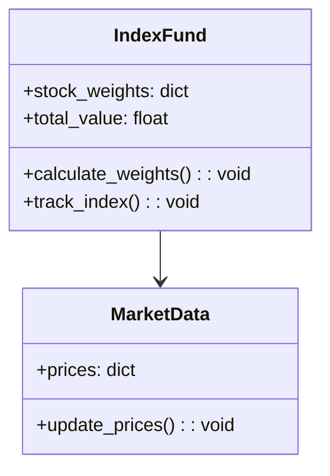
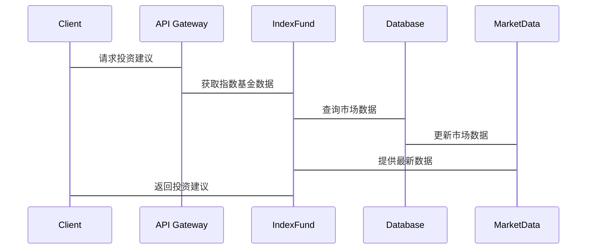

                 


# 约翰伯格的指数投资策略：为什么简单有效

---

## 关键词：
- 约翰·伯格
- 指数投资
- 被动投资
- 投资策略
- 有效市场理论

---

## 摘要：
本文深入探讨了约翰·伯格的指数投资策略，分析其简单而有效的背后原因。通过从理论基础、算法原理到实际应用的全面解析，揭示了指数投资在现代金融中的独特价值。文章结合数学模型、系统架构和实际案例，详细阐述了指数投资的核心理念、实现方法及其在不同市场环境中的表现。

---

## 第1章: 指数投资的背景与定义

### 1.1 指数投资的起源与演变

#### 1.1.1 传统投资方式的局限性
传统投资方式依赖于对市场走势的预测和个股选择，这种方式存在以下问题：
- **高交易成本**：频繁交易导致佣金和税费增加。
- **信息不对称**：机构投资者和散户在信息获取和分析能力上存在巨大差距。
- **情绪化决策**：投资者容易受到市场波动和情绪影响，做出非理性决策。
- **复杂性**：选股和择时需要专业的知识和经验，对普通投资者来说门槛较高。

#### 1.1.2 指数投资的定义与特点
指数投资是一种被动投资策略，通过跟踪特定市场指数的投资组合来实现与市场同步增长的目标。其特点包括：
- **简单性**：不需要选股或择时，只需选择与指数对应的基金或ETF。
- **低成本**：指数基金的管理费用通常低于主动管理型基金。
- **分散风险**：通过持有指数中的所有成分股，降低个股风险。
- **长期有效性**：根据长期市场表现，指数投资往往能够跑赢大多数主动管理型基金。

#### 1.1.3 约翰·伯格对指数投资的贡献
约翰·伯格是指数投资领域的先驱，他通过实践证明了指数投资的有效性：
- ** Vanguard 集团的创立**：伯格创立了Vanguard集团，专注于提供低成本的指数基金。
- **经典著作**：伯格撰写了《指数投资：为什么简单有效》等书籍，系统阐述了指数投资的理论和实践。
- **实证研究**：伯格通过大量数据证明，指数投资在长期表现上优于大多数主动管理型基金。

### 1.2 指数投资的核心理念

#### 1.2.1 市场有效性的理论基础
市场有效性假设认为，在有效市场中，证券的价格已经反映了所有可获得的信息，因此试图通过基本面分析或技术分析来获得超额收益是不现实的。指数投资正是基于这一假设，通过持有整个市场的投资组合来获取平均收益。

#### 1.2.2 被动投资与主动投资的对比
| 对比维度 | 被动投资（指数投资） | 主动投资 |
|----------|---------------------|----------|
| 投资目标 | 获取市场平均收益     | 获取超额收益 |
| 管理方式 | 跟踪指数，无需选股   | 主动选股，择时交易 |
| 成本 | 低管理费，高透明度   | 高管理费，复杂操作 |
| 风险 | 分散风险             | 集中风险 |

#### 1.2.3 指数投资的长期有效性
根据伯格的研究，指数投资在长期表现上通常优于主动管理型基金，原因包括：
- **低交易成本**：指数基金的管理费用较低，减少了收益的损耗。
- **分散风险**：通过持有整个市场的投资组合，降低了个股或行业波动带来的风险。
- **避免情绪化决策**：被动投资策略避免了投资者在市场波动中的情绪化决策。

### 1.3 指数投资的应用场景

#### 1.3.1 个人投资者的适用性
对于个人投资者来说，指数投资是一种简单有效的投资方式：
- **门槛低**：无需专业知识，适合普通投资者。
- **风险分散**：通过持有指数基金，降低了个股风险。
- **长期收益稳定**：适合有长期投资目标的投资者。

#### 1.3.2 机构投资者的策略选择
机构投资者可以利用指数投资来构建低成本、高效率的投资组合：
- **资产配置**：通过指数基金实现大类资产配置。
- **风险控制**：利用指数基金的分散性降低投资组合的整体风险。

#### 1.3.3 不同市场环境下的指数投资表现
在不同的市场环境下，指数投资的表现可能会有所不同：
- **牛市**：指数投资能够充分受益于市场的上涨。
- **熊市**：由于指数基金的分散性，其跌幅通常小于个股。
- **震荡市**：指数投资通过分散风险，能够在震荡市中稳定收益。

---

## 第2章: 约翰·伯格的生平与投资理念

### 2.1 约翰·伯格的生平简介

#### 2.1.1 早年经历与职业发展
约翰·伯格于1949年出生于美国宾夕法尼亚州，曾在宾夕法尼亚大学学习工程学，并随后转向金融领域。他在职业生涯中积累了丰富的投资经验，并于1974年创立了Vanguard集团。

#### 2.1.2 对指数投资的贡献
伯格是指数投资领域的先驱，他通过实践和研究证明了指数投资的有效性：
- **Vanguard集团的创立**：伯格创立的Vanguard集团专注于提供低成本的指数基金。
- **经典著作**：伯格撰写了《指数投资：为什么简单有效》等书籍，系统阐述了指数投资的理论和实践。
- **实证研究**：伯格通过大量数据证明，指数投资在长期表现上优于大多数主动管理型基金。

#### 2.1.3 著作与思想的影响
伯格的著作和思想对全球投资领域产生了深远影响：
- **学术界**：伯格的研究为现代金融理论提供了实证支持。
- **实践领域**：指数投资策略在全球范围内得到了广泛应用。

### 2.2 约翰·伯格的投资哲学

#### 2.2.1 简单有效的投资策略
伯格强调投资的简单性和长期性：
- **简单性**：通过跟踪指数实现投资目标，避免复杂的操作。
- **长期性**：指数投资适合长期持有，避免频繁交易。

#### 2.2.2 避免过度交易的智慧
伯格认为，过度交易是投资者实现超额收益的主要障碍：
- **交易成本**：频繁交易会增加佣金和税费，降低净收益。
- **情绪化决策**：过度交易容易受到市场情绪影响，导致非理性决策。

#### 2.2.3 长期投资的重要性
伯格强调长期投资的重要性：
- **复利效应**：长期持有指数基金能够充分利用复利效应，实现财富的稳定增长。
- **市场波动**：长期投资能够有效应对短期市场波动，实现更稳定的收益。

### 2.3 约翰·伯格的经典案例分析

#### 2.3.1 历史市场周期中的表现
伯格通过分析历史市场周期，证明了指数投资在不同市场环境中的有效性：
- **牛市**：指数投资能够充分受益于市场的上涨。
- **熊市**：由于指数基金的分散性，其跌幅通常小于个股。
- **震荡市**：指数投资通过分散风险，能够在震荡市中稳定收益。

#### 2.3.2 经典投资组合的构建
伯格的经典投资组合构建方法包括：
- **分散投资**：通过持有整个市场的投资组合，降低个股风险。
- **低成本**：选择管理费用低的指数基金，减少收益损耗。

#### 2.3.3 风险控制的实践经验
伯格在风险控制方面提出了以下建议：
- **资产配置**：通过合理的资产配置，降低投资组合的整体风险。
- **长期持有**：长期持有指数基金，避免短期波动的影响。

---

## 第3章: 指数投资的核心概念与原理

### 3.1 指数基金的定义与类型

#### 3.1.1 指数基金的定义
指数基金是一种以特定市场指数为基准的投资基金，其投资目标是跟踪该指数的表现。

#### 3.1.2 常见的指数基金类型
常见的指数基金类型包括：
- **股票型指数基金**：跟踪股票市场指数，如标普500指数。
- **债券型指数基金**：跟踪债券市场指数。
- **混合型指数基金**：同时投资股票和债券，按一定比例跟踪混合指数。

#### 3.1.3 指数基金与ETF的区别
| 对比维度 | 指数基金 | ETF（交易所交易基金） |
|----------|----------|---------------------|
| 投资方式 | 基金公司管理 | 投资者自行购买和交易 |
| 交易时间 | 每个交易日收盘后申购或赎回 | 实时交易，像股票一样 |
| 成本 | 管理费用较高 | 管理费用较低 |

---

### 3.2 市场有效性的理论基础

#### 3.2.1 马科维茨的投资组合理论
马科维茨的投资组合理论认为，通过合理配置不同资产，可以实现风险与收益的最优平衡。

#### 3.2.2 布莱克-斯科尔斯模型的应用
布莱克-斯科尔斯模型用于期权定价，为现代金融理论提供了重要支持。

#### 3.2.3 现代金融理论对指数投资的支持
现代金融理论认为，市场是有效的，指数投资能够实现与市场同步增长的目标。

---

### 3.3 投资组合理论与指数投资的关系

#### 3.3.1 投资组合理论的基本原理
投资组合理论强调通过分散投资降低风险，指数投资正是这一理论的实践应用。

#### 3.3.2 指数投资如何实现最优组合
指数投资通过持有整个市场的投资组合，实现了投资组合理论中的分散化目标。

#### 3.3.3 风险与收益的平衡
指数投资通过分散投资降低了风险，同时实现了与市场同步增长的收益。

---

## 第4章: 指数投资的数学模型与算法

### 4.1 指数投资的数学基础

#### 4.1.1 均值-方差优化模型
均值-方差优化模型用于寻找投资组合的最优配置，以实现最大收益或最小风险。

#### 4.1.2 资本资产定价模型（CAPM）
CAPM模型用于计算资产的预期收益，为指数投资提供了理论支持。

#### 4.1.3 风险调整后的收益计算
风险调整后的收益计算公式为：
$$ \text{夏普比率} = \frac{R_p - R_f}{\sigma_p} $$
其中，$R_p$ 是投资组合的收益，$R_f$ 是无风险利率，$\sigma_p$ 是投资组合的波动率。

### 4.2 指数基金的构建算法

#### 4.2.1 指数成分股的选择标准
指数成分股的选择标准包括流动性、市值大小、行业代表性等。

#### 4.2.2 权重分配的数学公式
指数成分股的权重计算公式为：
$$ w_i = \frac{P_i \times Q_i}{\sum_{j=1}^{n} P_j \times Q_j} $$
其中，$w_i$ 是第$i$只股票的权重，$P_i$ 是股价，$Q_i$ 是流通量，$n$ 是指数成分股的数量。

#### 4.2.3 算法的优缺点分析
指数基金的构建算法具有以下优点：
- **简单性**：算法易于实现，不需要复杂的计算。
- **分散性**：通过持有整个市场的投资组合，降低了风险。
- **低成本**：指数基金的管理费用较低。

---

## 第5章: 系统分析与架构设计方案

### 5.1 问题场景介绍

#### 5.1.1 投资者面临的挑战
投资者在选择投资策略时面临以下挑战：
- **信息过载**：市场信息复杂，难以做出决策。
- **情绪化决策**：投资者容易受到市场波动和情绪影响。

#### 5.1.2 系统目标
系统目标是为投资者提供一个基于指数投资的简单有效的投资方案。

### 5.2 系统功能设计

#### 5.2.1 领域模型（Mermaid 类图）


#### 5.2.2 系统架构设计（Mermaid 架构图）


#### 5.2.3 系统交互设计（Mermaid 序列图）


---

## 第6章: 项目实战

### 6.1 环境安装

#### 6.1.1 Python 环境配置
需要安装以下Python库：
- `pandas`：用于数据处理
- `numpy`：用于数值计算
- `matplotlib`：用于数据可视化
- `yfinance`：用于获取股票数据

### 6.2 核心代码实现

#### 6.2.1 获取指数成分股数据
```python
import pandas as pd
import yfinance as yf

# 获取标普500指数成分股
index_ticker = '^GSPC'
data = yf.download(index_ticker, start='2020-01-01', end='2023-12-31')
print(data.head())
```

#### 6.2.2 计算指数基金权重
```python
import pandas as pd
import numpy as np

def calculate_weights(prices):
    market_value = prices.close * prices.volume
    total_value = market_value.sum()
    weights = {}
    for i in range(len(prices)):
        ticker = prices.index[i]
        weights[ticker] = (prices.close[i] * prices.volume[i]) / total_value
    return weights

prices = pd.read_csv('index_prices.csv')
weights = calculate_weights(prices)
print(weights)
```

#### 6.2.3 实际案例分析
```python
import pandas as pd
import numpy as np
import matplotlib.pyplot as plt

# 数据下载
data = yf.download('^GSPC', start='2020-01-01', end='2023-12-31')

# 计算收益
returns = data['Close'].pct_change().dropna()
print(returns.mean() * 250)  # 年化收益
print(returns.std() * np.sqrt(250))  # 年化波动率

# 绘制收益分布图
plt.hist(returns, bins=20)
plt.xlabel('收益率')
plt.ylabel('频数')
plt.title('指数投资收益分布图')
plt.show()
```

### 6.3 项目小结
通过项目实战，我们可以看到指数投资在实际操作中的简单性和有效性。通过Python代码实现指数基金的权重计算和收益分析，进一步验证了指数投资的理论。

---

## 第7章: 最佳实践、小结、注意事项、拓展阅读

### 7.1 最佳实践

#### 7.1.1 定期定额投资
通过定期定额投资，可以分散投资风险，平滑市场波动。

#### 7.1.2 长期持有
指数投资适合长期持有，避免短期波动的影响。

#### 7.1.3 费用控制
选择低成本的指数基金，降低管理费用对收益的影响。

### 7.2 小结
指数投资是一种简单而有效的投资策略，通过跟踪市场指数实现长期收益。伯格的研究和实践证明了指数投资在现代金融中的价值。

### 7.3 注意事项

#### 7.3.1 市场风险
指数投资无法完全规避市场风险，但在长期表现上优于主动投资。

#### 7.3.2 税务规划
投资者需要关注税务规划，合理安排投资策略以降低税务负担。

#### 7.3.3 选择合适的指数基金
投资者需要根据自身需求选择合适的指数基金，如股票型、债券型或混合型。

### 7.4 拓展阅读
- 《指数投资：为什么简单有效》——约翰·伯格
- 《投资学》—— Eugene F. Fama
- 《证券分析》—— Benjamin Graham

---

## 作者：AI天才研究院/AI Genius Institute & 禅与计算机程序设计艺术/Zen And The Art of Computer Programming

