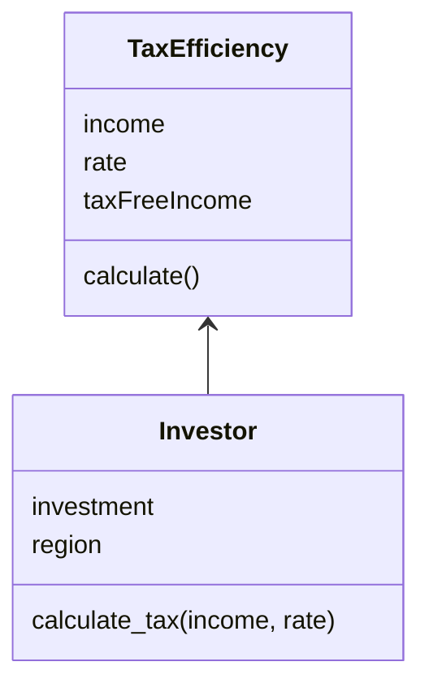
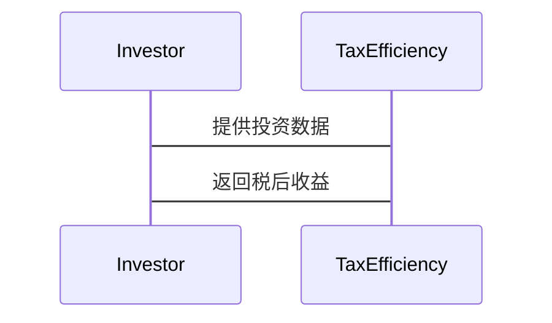

                 


# 约翰伯格的税收效率投资

> 关键词：税收效率，投资策略，优化算法，系统架构，数学模型

> 摘要：税收效率投资是通过优化税务规划和投资策略，最大化投资收益并最小化税负。本文深入分析税收效率投资的核心概念、优化算法、系统架构，并结合实际案例，提供详细的实现方法和最佳实践。

---

# 目录

1. [背景与基础](#背景与基础)
2. [核心理论](#核心理论)
3. [策略与方法](#策略与方法)
4. [系统分析与架构设计](#系统分析与架构设计)
5. [项目实战](#项目实战)
6. [最佳实践与小结](#最佳实践与小结)

---

## 第1章: 背景与基础

### 1.1 税收与投资的关系

#### 1.1.1 税收在投资中的作用
税收是影响投资收益的重要因素。通过合理规划税务，投资者可以降低税负，提高净收益。例如，长期资本收益税通常低于短期资本收益税，因此长期投资更有利于税后收益。

#### 1.1.2 税收对投资收益的影响
税款会直接减少投资收益。例如，假设投资收益为100元，税率为20%，税后收益为80元。因此，优化税务规划可以增加实际收益。

#### 1.1.3 税收效率的定义与内涵
税收效率是指在满足税务合规的前提下，通过优化税务结构，最大化投资收益的过程。它涉及税法、财务规划和投资策略的综合应用。

### 1.2 税收效率投资的核心概念

#### 1.2.1 税收效率的衡量标准
税收效率可以通过税后净收益、税负率等指标衡量。例如，税后净收益 = 投资收益 × (1 - 税率)。

#### 1.2.2 税收效率与投资回报的关系
税收效率直接影响投资回报。优化税务结构可以显著提高净收益，例如，通过选择低税率地区或税收优惠政策，降低整体税负。

#### 1.2.3 税收效率投资的边界与外延
税收效率投资需要在合法合规的前提下进行，避免偷税漏税。外延包括税务规划、资产配置和投资策略的优化。

### 1.3 税收效率投资的背景与现状

#### 1.3.1 税收政策对投资的影响
不同国家和地区的税收政策差异显著，影响投资者的决策。例如，某些地区提供税收减免或优惠，吸引投资者。

#### 1.3.2 当前税收效率投资的现状
随着全球化和金融市场的复杂化，税收效率投资越来越受到重视。投资者通过跨国投资、税务 residency 等策略优化税务负担。

#### 1.3.3 税收效率投资的未来趋势
未来，税收效率投资将更加依赖技术手段，如大数据和人工智能，进行实时监控和优化。同时，国际税收政策的变化也将推动税收效率投资策略的调整。

---

## 第2章: 核心理论

### 2.1 税收效率的数学模型

#### 2.1.1 税收效率的公式推导
假设投资收益为 R，税率为 t，则税后收益为 R × (1 - t)。税收效率可以表示为最大化税后收益的函数。

#### 2.1.2 税收效率与投资回报的关系式
税后净收益 = 投资收益 × (1 - 税率)
投资回报率 = 税后净收益 / 初始投资

#### 2.1.3 税收效率优化的数学模型
目标函数：Maximize (R × (1 - t))
约束条件：满足税法规定，合规投资行为。

### 2.2 税收效率的优化方法

#### 2.2.1 税收效率的优化目标
最大化税后净收益，最小化税负，同时确保合规性。

#### 2.2.2 常用优化算法介绍
- 线性规划：用于税率固定的优化问题。
- 动态规划：适用于多阶段投资决策的优化。
- 遗传算法：用于复杂非线性问题的优化。

#### 2.2.3 税收效率优化的数学模型
使用动态规划模型，考虑不同投资阶段的税率变化，选择最优投资路径。

### 2.3 税收效率的实现步骤

#### 2.3.1 税收效率分析的流程
1. 确定投资目标和收益。
2. 评估不同地区的税率和优惠政策。
3. 选择最优的税务结构。
4. 实施投资并监控税务变化。

#### 2.3.2 税收效率优化的具体步骤
1. 数据收集：收集相关税率和投资回报数据。
2. 建模：构建数学模型。
3. 求解：使用优化算法求解。
4. 验证：评估模型的准确性和可行性。

#### 2.3.3 税收效率实现的注意事项
确保合规性，避免税务风险，及时调整策略应对政策变化。

---

## 第3章: 税收效率投资的策略与方法

### 3.1 税收效率投资的策略

#### 3.1.1 税收效率投资的短期策略
- 利用税收节日或优惠政策。
- 短期资本收益税较低的地区投资。

#### 3.1.2 税收效率投资的长期策略
- 长期资本收益税较低。
- 利用税收递延账户，如IRA。

#### 3.1.3 税收效率投资的风险管理
- 分散投资以降低风险。
- 定期评估和调整税务结构。

### 3.2 税收效率投资的实现方法

#### 3.2.1 税收效率的系统设计
- 数据输入：投资收益、税率。
- 数据处理：计算税后收益。
- 输出：优化后的税务结构。

#### 3.2.2 税收效率的代码实现
```python
def tax_efficiency(income, rate):
    return income * (1 - rate)

# 示例
income = 100000
rate = 0.2
tax_free_income = tax_efficiency(income, rate)
print(tax_free_income)  # 输出 80000
```

### 3.3 税收效率投资的案例分析

#### 3.3.1 案例背景
投资者计划投资100万元，选择不同地区的税率和优惠政策。

#### 3.3.2 实施步骤
1. 收集税率信息。
2. 建立数学模型。
3. 选择最优地区。
4. 实施投资。

#### 3.3.3 案例结果
选择税率较低的地区，税后收益为80万元。

---

## 第4章: 系统分析与架构设计

### 4.1 系统功能设计

#### 4.1.1 需求分析
- 数据处理：税率、收益计算。
- 功能模块：数据输入、计算、结果输出。

#### 4.1.2 领域模型（Mermaid 类图）


#### 4.1.3 系统架构（Mermaid 架构图）


#### 4.1.4 系统接口设计
- 输入接口：接收投资收益和税率。
- 输出接口：返回税后收益。

#### 4.1.5 系统交互（Mermaid 序列图）


---

## 第5章: 项目实战

### 5.1 环境安装

#### 5.1.1 安装Python
```bash
python --version
pip install numpy pandas
```

#### 5.1.2 安装必要的库
```bash
pip install matplotlib
```

### 5.2 系统核心实现

#### 5.2.1 税收效率的代码实现
```python
import numpy as np
import pandas as pd

def calculate_tax_efficiency(income, rate):
    return income * (1 - rate)

# 示例
income_data = np.array([100000, 200000, 300000])
rates = np.array([0.2, 0.25, 0.3])
tax_free = income_data * (1 - rates)
print(tax_free)
```

#### 5.2.2 代码应用解读
- 使用NumPy进行向量化计算，提高效率。
- 输出税后收益数组，便于分析。

#### 5.2.3 实际案例分析
投资者在税率分别为20%、25%、30%的地区投资10万元，计算税后收益。

### 5.3 项目小结
通过代码实现，验证了税收效率计算的准确性，帮助投资者优化税务结构。

---

## 第6章: 最佳实践与小结

### 6.1 最佳实践

#### 6.1.1 合规性原则
确保所有税务优化行为合法合规，避免法律风险。

#### 6.1.2 定期评估
根据市场变化和政策调整，定期评估和优化税务结构。

#### 6.1.3 技术辅助
利用技术手段，如大数据和人工智能，实时监控和优化税务结构。

### 6.2 小结

### 6.3 注意事项
- 税务政策变化快，需及时调整策略。
- 保持投资组合的分散性，降低风险。

### 6.4 拓展阅读
推荐书籍和资源，深入学习税务优化和投资策略。

---

作者：AI天才研究院 & 禅与计算机程序设计艺术

