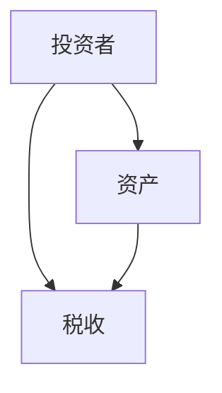
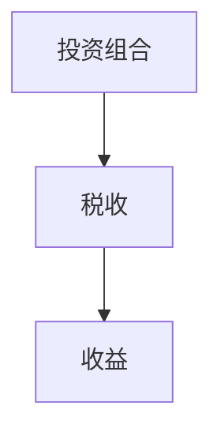
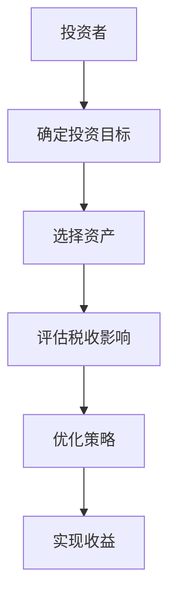
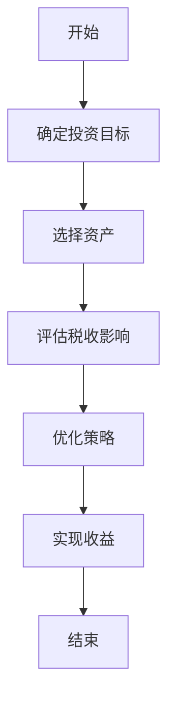

                 


# 约翰伯格的税收敏感投资：如何优化投资回报

> 关键词：税收敏感投资，投资回报优化，资产配置，税务规划，投资策略，数学模型

> 摘要：本文将深入探讨约翰伯格的税收敏感投资策略，从核心概念、算法原理、数学模型到系统架构，结合实际案例分析，为您详细讲解如何通过优化税收影响来提升投资回报。文章内容丰富，结构严谨，涵盖从理论到实践的全过程，助您全面理解并掌握这一投资策略。

---

## 第一部分: 约翰伯格的税收敏感投资概述

### 第1章: 税收敏感投资的背景与重要性

#### 1.1 税收敏感投资的定义与核心概念

##### 1.1.1 税收敏感投资的定义
税收敏感投资是一种在投资决策中充分考虑税收因素的投资策略，旨在通过优化税收负担来最大化投资回报。它强调在资产选择、投资时间和持有期限等方面，充分考虑不同资产的税收特性，以实现税后收益的最大化。

##### 1.1.2 税收在投资回报中的作用
税收是影响投资回报的重要因素之一。不同的资产类别（如股票、债券、房地产等）在不同地区和时间周期内，面临的税率和计税方式差异显著。通过合理规划税收，投资者可以在不降低税前收益的前提下，显著提高税后收益。

##### 1.1.3 税收敏感投资的核心要素
税收敏感投资的核心要素包括：
- **资产选择**：选择税收优惠或低税率的资产类别。
- **投资时间规划**：合理安排买入和卖出时间，避免高额短期资本利得税。
- **持有期限优化**：通过长期持有策略，降低短期资本利得税率。

#### 1.2 税收敏感投资的背景与问题背景

##### 1.2.1 税收对投资回报的影响
税收对投资回报的影响主要体现在以下几个方面：
1. **资本利得税**：短期资本利得税通常高于长期资本利得税。
2. **股息税**：股息收入的税率通常高于其他类型的投资收益。
3. **遗产税和赠与税**：这些税费可能影响资产的长期持有和传承。

##### 1.2.2 税收敏感投资的必要性
在当前复杂的经济环境中，税收敏感投资的必要性日益凸显：
- 税收政策的不断变化要求投资者具备更高的税务规划能力。
- 高净值投资者需要通过优化税收策略来保护和增加资产。
- 机构投资者需要在大规模投资中最大限度地降低成本。

##### 1.2.3 税收敏感投资的边界与外延
税收敏感投资的边界在于：
- **合法合规性**：所有税收优化策略必须符合相关法律法规。
- **可操作性**：策略需具备实际操作性，避免纸上谈兵。
- **风险控制**：在优化税收的同时，需确保投资组合的稳定性。

#### 1.3 税收敏感投资与传统投资的区别

##### 1.3.1 传统投资与税收敏感投资的对比
| 对比维度 | 传统投资 | 税收敏感投资 |
|----------|----------|--------------|
| 税收考虑 | 未充分考虑税收影响 | 税收是核心决策因素之一 |
| 投资策略 | 侧重于资产收益最大化 | 侧重于税后收益最大化 |
| 风险控制 | 未充分考虑税收风险 | 全面考虑税收风险 |

##### 1.3.2 税收敏感投资的独特优势
1. **税后收益更高**：通过优化税收策略，显著提高实际可支配收益。
2. **风险控制更优**：合理避税可以降低整体投资组合的风险。
3. **灵活性更强**：税收敏感投资可以根据市场变化及时调整策略。

##### 1.3.3 税收敏感投资的潜在风险
1. **政策风险**：税收政策的变化可能导致优化策略失效。
2. **合规风险**：过度避税可能面临法律风险。
3. **执行风险**：税收优化策略的执行成本可能高于预期收益。

---

### 第2章: 税收敏感投资的核心概念与联系

#### 2.1 税收敏感投资的核心原理

##### 2.1.1 税收对资产类别的影响
不同资产类别在税收政策上有显著差异：
- **股票**：短期资本利得税较高，长期资本利得税较低。
- **债券**：利息收入通常需缴纳较高的所得税。
- **房地产**：转让所得可能面临高额税费。

##### 2.1.2 税收对投资时间周期的影响
投资时间周期与税收密切相关：
- **短期投资**：资本利得税较高，税后收益较低。
- **长期投资**：资本利得税较低，税后收益较高。

##### 2.1.3 税收对投资组合优化的影响
通过合理配置不同资产和投资时间，可以有效降低整体税收负担。

#### 2.2 税收敏感投资的核心概念对比

##### 2.2.1 不同资产类别的税收特征对比
| 资产类别 | 税收政策 | 税收影响 |
|----------|----------|----------|
| 股票     | 短期资本利得税高 | 短期收益税后较低 |
| 债券     | 利息所得税高 | 收益税后较低 |
| 房地产   | 转让所得税费高 | 短期收益税后较低 |

##### 2.2.2 不同投资策略的税收影响对比
| 投资策略 | 税收影响 |
|----------|----------|
| 价值投资 | 税收影响较小，长期持有 |
| 投机交易 | 税收影响较大，短期交易频繁 |

##### 2.2.3 不同市场环境的税收优化策略对比
| 市场环境 | 税收优化策略 |
|----------|--------------|
| 牛市     | 优化资本利得税，长期持有 |
| 熊市     | 优化亏损抵扣，减少资本损失 |

#### 2.3 税收敏感投资的实体关系图

##### 2.3.1 投资者、资产、税收的关系图



##### 2.3.2 投资组合、税收、收益的关系图



##### 2.3.3 税收敏感投资的决策流程图



---

### 第3章: 税收敏感投资的算法原理

#### 3.1 税收敏感投资的数学模型

##### 3.1.1 投资收益的数学表达式
投资收益公式：
$$ \text{投资收益} = \text{资产收益} - \text{税收成本} $$

##### 3.1.2 税收对投资收益的影响公式
税后收益公式：
$$ \text{税后收益} = \text{税前收益} \times (1 - \text{税率}) $$

##### 3.1.3 投资组合优化的数学模型
投资组合优化模型：
$$ \max \sum_{i=1}^{n} w_i r_i (1 - t_i) $$
其中，\( w_i \) 是资产 \( i \) 的权重，\( r_i \) 是资产 \( i \) 的预期收益，\( t_i \) 是资产 \( i \) 的税率。

#### 3.2 税收敏感投资的算法流程

##### 3.2.1 税收敏感投资的算法步骤



##### 3.2.2 税收敏感投资的优化算法

```python
def optimize_tax_portfolio/assets/assets_list, target_return):
    # 输入参数：资产列表、目标回报
    # 输出：最优投资组合
    min_variance = infinity
    best_portfolio = None
    for portfolio in all_possible_portfolios:
        tax_cost = calculate_tax(portfolio)
        net_return = portfolio.return - tax_cost
        if net_return >= target_return and portfolio.variance < min_variance:
            min_variance = portfolio.variance
            best_portfolio = portfolio
    return best_portfolio
```

##### 3.2.3 税收敏感投资的数学公式与案例分析
案例分析：假设某投资者有两个资产选择，A资产税率为20%，B资产税率为30%。预期税前收益分别为10%和15%。计算税后收益：
- 资产A税后收益：\( 10\% \times (1 - 0.20) = 8\% \)
- 资产B税后收益：\( 15\% \times (1 - 0.30) = 10.5\% \)

---

通过以上分析，我们逐步揭示了税收敏感投资的核心原理、算法流程和数学模型。在后续章节中，我们将进一步探讨如何通过系统架构设计和实际项目案例，实现税收敏感投资的最优配置。

