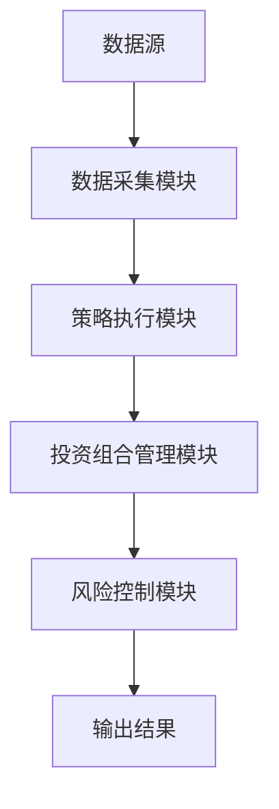

                 


# 约翰伯格的被动投资优势

> **关键词**：被动投资、指数基金、约翰伯格、投资策略、投资优势  
> **摘要**：被动投资是一种以指数基金为核心的长期投资策略，约翰·伯格作为该领域的先驱者，提出了许多经典的投资理念和策略。本文将从被动投资的背景与基础、指数基金的数学模型与算法、指数基金的系统架构与实现、项目实战与最佳实践等多个方面，全面分析约翰·伯格的被动投资优势，帮助读者深入理解被动投资的核心理念和实际应用。

---

## 第一部分: 被动投资的背景与基础

### 第1章: 被动投资的核心概念

#### 1.1 被动投资的定义与特点
被动投资是一种以长期持有指数基金为核心的投资策略，其核心理念是通过跟踪市场指数的收益，而非试图通过主动选股或择时来获取超额收益。被动投资的主要特点包括：
- **低成本**：被动投资通过跟踪指数基金，避免了主动管理的高费用。
- **分散风险**：被动投资通过持有市场上的所有股票或特定指数成分股，实现了风险的分散。
- **长期稳定**：被动投资强调长期投资，避免频繁交易带来的市场冲击和交易成本。

#### 1.2 约翰·伯格的被动投资理念
约翰·伯格是被动投资领域的先驱者，他提出了许多经典的投资理念：
- **指数基金的投资价值**：伯格认为，大多数投资者无法通过主动管理获得长期超额收益，而指数基金能够以较低的成本实现市场平均收益。
- **长期投资的重要性**：伯格强调，投资应注重长期持有，避免短期波动的干扰。
- **分散化投资**：通过持有指数基金，投资者可以分散个股风险，降低整体投资组合的波动性。

### 第2章: 指数基金的原理与优势

#### 2.1 指数基金的定义与特点
指数基金是一种以特定市场指数为投资标的基金，其目标是复制指数的收益。指数基金的特点包括：
- **跟踪误差小**：指数基金通过严格跟踪指数成分股，确保基金收益与指数收益一致。
- **透明度高**：投资者可以随时查看指数基金的成分股和权重，了解其投资组合的构成。
- **费用低**：指数基金的管理费用通常低于主动管理型基金。

#### 2.2 指数基金的投资策略
指数基金的投资策略主要包括：
- **成分股选择**：根据市场指数的成分股构成，选择相应的股票进行投资。
- **权重分配**：根据指数成分股的权重，分配相应的投资比例。
- **再平衡**：定期对投资组合进行再平衡，以保持与指数成分股权重的一致。

### 第3章: 约翰·伯格的指数基金实践

#### 3.1 约翰·伯格的指数基金产品
约翰·伯格是 Vanguard 集团的创始人，他推出的指数基金产品包括：
- **Vanguard S&P 500 Index Fund**：跟踪标普500指数，是全球最著名的指数基金之一。
- **Vanguard Total Stock Market Index Fund**：跟踪全市场指数，涵盖所有在美国上市的股票。

#### 3.2 约翰·伯格的指数基金投资策略
约翰·伯格的指数基金投资策略包括：
- **长期持有**：建议投资者长期持有指数基金，避免频繁交易。
- **成本控制**：通过降低管理费用，提高基金的净收益。
- **分散化投资**：通过投资指数基金，实现资产的分散化配置。

---

## 第二部分: 指数基金的数学模型与算法

### 第4章: 指数基金的数学模型

#### 4.1 指数基金的收益计算
指数基金的收益可以通过以下公式计算：
$$
R_f = R_{index} - \text{费用率}
$$
其中，$R_f$ 是基金的净收益，$R_{index}$ 是指数的收益，费用率是基金的管理费用。

#### 4.2 指数基金的风险模型
指数基金的风险可以通过标准差来衡量，公式为：
$$
\sigma_f = \sqrt{\sum_{i=1}^n w_i^2 \sigma_i^2}
$$
其中，$w_i$ 是第 $i$ 只股票的权重，$\sigma_i$ 是第 $i$ 只股票的收益率标准差。

### 第5章: 指数基金的算法实现

#### 5.1 指数基金的构建算法
指数基金的构建过程可以分为以下步骤：
1. **选择指数成分股**：根据目标指数的成分股列表，选择相应的股票。
2. **计算权重**：根据成分股在指数中的权重，计算每只股票的投资比例。
3. **构建投资组合**：按照计算出的权重，购买相应的股票，构建投资组合。

#### 5.2 指数基金的优化算法
为了优化指数基金的收益和风险，可以使用以下算法：
1. **最小方差优化**：通过调整投资组合的权重，使得投资组合的风险最小化。
2. **风险调整收益优化**：在给定风险水平下，最大化投资组合的预期收益。
3. **动态再平衡**：定期对投资组合进行调整，以保持与指数成分股权重的一致。

---

## 第三部分: 指数基金的系统架构与实现

### 第6章: 指数基金投资系统的架构设计

#### 6.1 系统功能设计
指数基金投资系统的功能模块包括：
- **数据采集模块**：采集市场指数和成分股数据。
- **策略执行模块**：根据指数基金的构建算法，执行投资策略。
- **风险控制模块**：监控投资组合的风险，进行动态再平衡。

#### 6.2 系统架构设计
指数基金投资系统的架构设计可以使用以下架构图：



---

## 第四部分: 项目实战与最佳实践

### 第7章: 指数基金的项目实战

#### 7.1 环境搭建
- **数据源**：使用Yahoo Finance获取指数成分股数据。
- **工具**：使用Python和Pandas进行数据处理。

#### 7.2 核心代码实现
以下是指数基金构建的Python代码示例：

```python
import pandas as pd
import numpy as np

# 数据采集
def get_data(tickers):
    data = pd.DataFrame()
    for ticker in tickers:
        df = pd.read_csv(f'data/{ticker}.csv')
        data[ticker] = df['Close']
    return data

# 构建指数基金
def build_index_fund(data, index_weights):
    fund = pd.Series(index=data.columns, dtype='float64')
    for i, (ticker, weight) in enumerate(index_weights.items()):
        fund[ticker] = data[ticker] * weight
    return fund.sum(axis=1)

# 示例运行
tickers = ['AAPL', 'MSFT', 'GOOGL']
index_weights = {'AAPL': 0.5, 'MSFT': 0.3, 'GOOGL': 0.2}
data = get_data(tickers)
fund = build_index_fund(data, index_weights)
print(fund)
```

#### 7.3 实际案例分析
通过上述代码，我们可以构建一个简单的指数基金，并计算其收益率和风险。

---

## 第五部分: 总结与最佳实践

### 8.1 总结
约翰·伯格的被动投资理念和指数基金策略为投资者提供了一种低成本、高效率的投资方式。通过长期持有指数基金，投资者可以实现资产的保值增值，同时避免主动投资的高风险和高成本。

### 8.2 最佳实践 tips
- **长期持有**：被动投资的核心是长期持有，避免频繁交易。
- **分散化投资**：通过投资指数基金，实现资产的分散化配置。
- **低成本**：选择管理费用低的指数基金，提高净收益。

### 8.3 未来展望
随着金融市场的不断发展，被动投资将继续吸引更多的投资者。未来，指数基金的投资策略和系统架构将更加智能化和自动化。

---

**作者：AI天才研究院/AI Genius Institute & 禅与计算机程序设计艺术 /Zen And The Art of Computer Programming**

