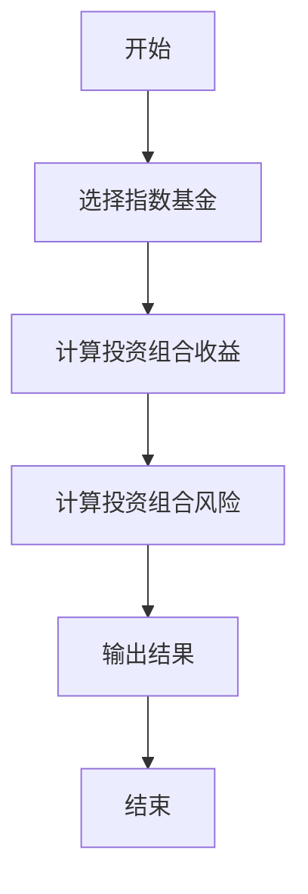
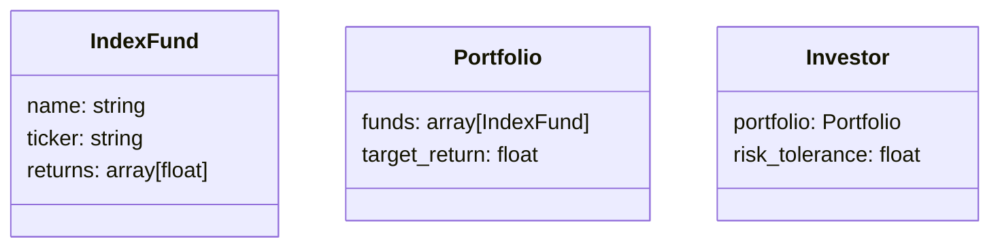
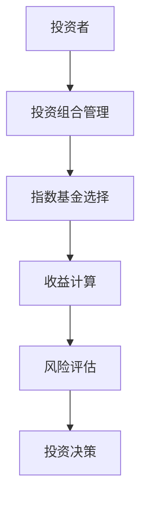

                 


# 约翰·伯格的被动投资哲学：战胜市场的不可能任务

## 关键词
- 被动投资、指数基金、约翰·伯格、投资哲学、现代投资组合理论、市场有效性、风险管理

## 摘要
被动投资是一种长期投资策略，通过持有低成本指数基金，追求市场平均收益。本文深入分析约翰·伯格的被动投资哲学，探讨其理论基础、数学模型、系统架构及实战应用。通过详细讲解，帮助读者理解被动投资的优势，并通过实际案例和代码实现，掌握被动投资的核心策略。

---

# 第一部分: 被动投资的背景与基础

## 第1章: 被动投资的概述与核心概念

### 1.1 被动投资的定义与特点

#### 1.1.1 什么是被动投资
被动投资是指投资者通过长期持有低成本指数基金或 ETF，追求市场平均收益，而不试图通过频繁交易或市场预测来获取超额收益。

#### 1.1.2 被动投资的核心特点
- 长期持有：避免频繁交易，降低交易成本和税务负担。
- 低成本：通过低成本指数基金或 ETF 降低管理费用。
- 分散投资：通过投资指数基金分散个股风险，降低波动性。

#### 1.1.3 被动投资与主动投资的区别
| 特性 | 被动投资 | 主动投资 |
|------|----------|----------|
| 目标 | 追求市场平均收益 | 追求超额收益 |
| 操作 | 长期持有，少干预 | 积极交易，主动选股 |
| 成本 | 低成本 | 高成本 |

### 1.2 约翰·伯格的投资哲学

#### 1.2.1 约翰·伯格的生平简介
约翰·伯格（John Bogle）是美国著名投资者和金融家，被誉为“指数基金之父”。他是先锋投资服务公司（Vanguard）的创始人，致力于推广低成本投资工具。

#### 1.2.2 约翰·伯格的投资理念
- 市场有效性：伯格认为市场是有效的，个体很难通过主动投资超越市场。
- 成本意识：低成本是实现长期收益的关键因素。
- 分散投资：通过指数基金分散风险，降低波动性。

#### 1.2.3 约翰·伯格对被动投资的贡献
伯格创立了 Vanguard，推出了一系列低成本指数基金，使普通投资者能够轻松实现被动投资。

### 1.3 指数基金与被动投资

#### 1.3.1 指数基金的定义
指数基金是按照特定市场指数（如标普500）构建投资组合，以跟踪该指数收益率的基金。

#### 1.3.2 指数基金的核心优势
- 成本低：指数基金的管理费用远低于主动管理基金。
- 分散风险：通过投资整个市场分散个股风险。
- 简单易懂：投资者无需选股或判断市场走势。

#### 1.3.3 指数基金的运作机制
指数基金通过复制市场指数，避免主动管理的高成本和高风险。

---

## 第2章: 被动投资的理论基础

### 2.1 现代投资组合理论

#### 2.1.1 现代投资组合理论的起源
现代投资组合理论（MPT）由哈里·马科维茨（Harry Markowitz）提出，强调通过分散投资降低风险。

#### 2.1.2 马科维茨的有效前沿理论
有效前沿理论指出，投资者可以通过合理配置资产，找到风险与收益的最佳平衡点。

#### 2.1.3 理论与被动投资的结合
被动投资通过指数基金实现分散投资，符合 MPT 的分散化原则。

### 2.2 市场有效性与被动投资

#### 2.2.1 市场有效性的定义与分类
- 弱有效市场：价格反映所有公开信息。
- 强有效市场：价格反映所有信息，包括内部信息。

#### 2.2.2 弱有效市场中的被动投资策略
在弱有效市场中，被动投资能够通过指数基金获得市场平均收益。

#### 2.2.3 强有效市场中的被动投资挑战
在强有效市场中，被动投资无法通过市场预测获得超额收益。

### 2.3 被动投资的数学模型

#### 2.3.1 投资收益的数学表达
投资收益可以用以下公式表示：
$$ R = r_m - \beta (r_m - r_f) $$
其中，$R$ 是投资组合的收益，$r_m$ 是市场收益，$\beta$ 是贝塔系数，$r_f$ 是无风险利率。

#### 2.3.2 风险与收益的平衡公式
夏普比率（Sharpe Ratio）用于衡量投资组合的风险调整后收益：
$$ S = \frac{R_p - R_f}{\sigma_p} $$
其中，$R_p$ 是投资组合的收益，$R_f$ 是无风险利率，$\sigma_p$ 是投资组合的波动率。

#### 2.3.3 指数基金的收益模型
指数基金的收益可以表示为：
$$ R_f = \alpha + \beta r_m + \epsilon $$
其中，$\alpha$ 是超额收益，$\beta$ 是贝塔系数，$\epsilon$ 是误差项。

---

## 第3章: 被动投资的核心策略

### 3.1 指数基金的选择与配置

#### 3.1.1 指数基金的分类
- 宽基指数基金：如标普500指数基金。
- 窄基指数基金：如科技股指数基金。

#### 3.1.2 指数基金的配置策略
- 定期定额投资：通过定期投入固定金额，分散投资成本。
- 资产配置：根据风险承受能力配置股票和债券比例。

#### 3.1.3 被动投资的再平衡策略
定期调整投资组合，以维持目标配置比例。

### 3.2 投资组合管理

#### 3.2.1 投资组合的构建
通过投资指数基金构建分散化的投资组合。

#### 3.2.2 投资组合的调整
定期根据市场变化调整投资组合。

#### 3.2.3 投资组合的风险管理
通过分散投资和再平衡降低投资风险。

---

## 第4章: 被动投资的数学模型与算法

### 4.1 被动投资的数学模型

#### 4.1.1 投资组合收益的计算
使用指数基金的历史收益率计算投资组合的预期收益。

#### 4.1.2 投资组合风险的计算
使用方差和标准差衡量投资组合的波动性。

### 4.2 被动投资的算法实现

#### 4.2.1 算法流程图


#### 4.2.2 Python代码实现
```python
import numpy as np

# 假设指数基金的收益率为一个数组
returns = np.array([0.05, 0.06, 0.04, 0.07, 0.05])

# 计算平均收益率
average_return = np.mean(returns)

# 计算收益率的方差
variance = np.var(returns)

# 计算标准差
std_deviation = np.std(returns)

print(f"平均收益率: {average_return}")
print(f"方差: {variance}")
print(f"标准差: {std_deviation}")
```

---

## 第5章: 被动投资的系统架构与实现

### 5.1 系统架构设计

#### 5.1.1 领域模型类图


#### 5.1.2 系统架构图


### 5.2 系统实现

#### 5.2.1 环境安装
安装必要的 Python 库：
```bash
pip install numpy pandas
```

#### 5.2.2 核心代码实现
```python
import pandas as pd
import numpy as np

# 假设指数基金的数据
data = {'name': ['标普500指数基金', '纳指100指数基金'],
        'returns': [[0.05, 0.06, 0.04], [0.07, 0.05, 0.06]]}
df = pd.DataFrame(data)

# 计算每只基金的平均收益
df['average'] = df['returns'].apply(lambda x: np.mean(x))

# 找出平均收益最高的基金
best_fund = df[df['average'] == df['average'].max()]
print(best_fund)
```

---

## 第6章: 项目实战与案例分析

### 6.1 环境安装

#### 6.1.1 安装必要的库
```bash
pip install pandas numpy
```

### 6.2 代码实现

#### 6.2.1 投资组合构建
```python
import pandas as pd

# 假设指数基金的数据
data = {'name': ['标普500指数基金', '纳指100指数基金'],
        'returns': [[0.05, 0.06, 0.04], [0.07, 0.05, 0.06]]}
df = pd.DataFrame(data)

# 计算每只基金的平均收益
df['average'] = df['returns'].apply(lambda x: sum(x)/len(x))

# 找出平均收益最高的基金
best_fund = df[df['average'] == df['average'].max()]
print(best_fund)
```

#### 6.2.2 投资组合优化
```python
import numpy as np

# 假设两只指数基金的收益率
fund1_returns = np.array([0.05, 0.06, 0.04])
fund2_returns = np.array([0.07, 0.05, 0.06])

# 计算两只基金的协方差矩阵
cov_matrix = np.cov(fund1_returns, fund2_returns)

# 计算最优投资比例
def optimal_allocation(f1, f2, cov):
    f1_var = np.var(f1)
    f2_var = np.var(f2)
    total_var = f1_var + f2_var - cov
    weight_f1 = f2_var / total_var
    weight_f2 = f1_var / total_var
    return weight_f1, weight_f2

w1, w2 = optimal_allocation(fund1_returns, fund2_returns, cov_matrix)
print(f"最优分配比例：基金1:{w1}, 基金2:{w2}")
```

### 6.3 案例分析

#### 6.3.1 案例背景
假设投资者有100,000美元可用于投资，目标是通过指数基金实现长期收益最大化。

#### 6.3.2 投资组合构建
选择两只指数基金，分别投资50%。

#### 6.3.3 投资组合表现
计算投资组合的预期收益和风险。

---

## 第7章: 最佳实践与小结

### 7.1 最佳实践

#### 7.1.1 选择低成本指数基金
尽量选择费用低的指数基金，降低长期成本。

#### 7.1.2 定期定额投资
通过定期定额投资，分散投资成本，降低市场波动影响。

#### 7.1.3 保持长期投资
被动投资需要长期持有，避免短期波动影响。

### 7.2 小结

被动投资是一种简单有效的投资策略，通过长期持有低成本指数基金，投资者可以实现市场平均收益，避免主动投资的高成本和高风险。约翰·伯格的被动投资哲学为投资者提供了重要的指导，帮助他们在复杂多变的市场中实现长期稳健的投资收益。

---

## 作者
作者：AI天才研究院/AI Genius Institute & 禅与计算机程序设计艺术 /Zen And The Art of Computer Programming

