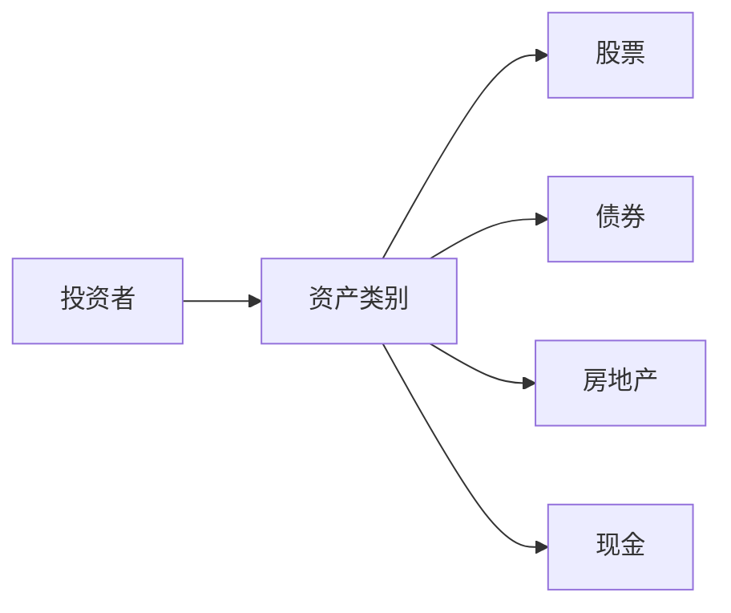
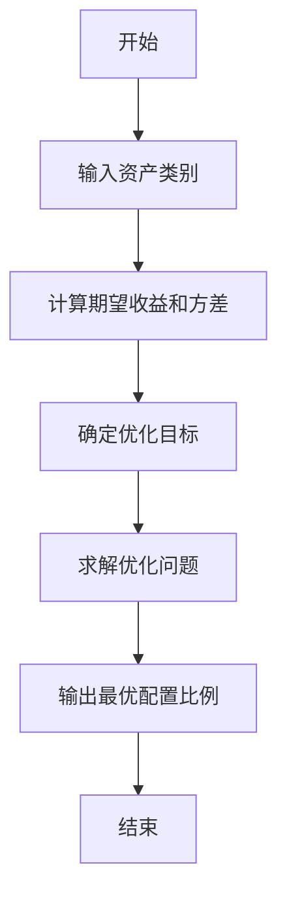
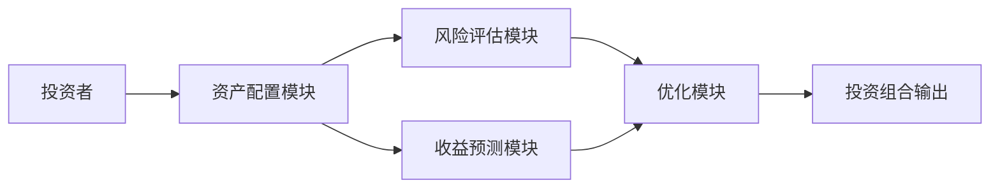
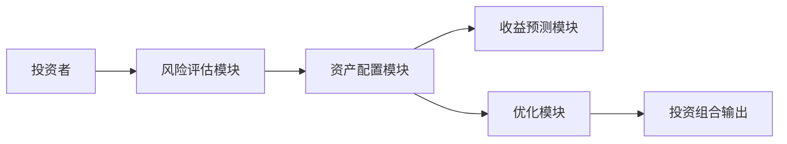

                 


# 约翰伯格的资产类别配置

## 关键词：
- 资产配置
- 资产类别
- 现代投资组合理论
- 风险管理
- 股票
- 债券
- 房地产

## 摘要：
本文将从资产类别配置的背景与基础出发，深入分析其核心概念与联系，探讨资产配置的算法原理，系统分析其架构设计，并结合实际案例进行项目实战。通过本文的学习，读者将能够全面掌握资产类别配置的理论与实践方法，从而在投资决策中做出科学合理的配置策略。

---

# 第1章: 资产类别配置概述

## 1.1 资产配置的基本概念
### 1.1.1 资产配置的定义
资产配置是指将资金分配到不同的资产类别（如股票、债券、房地产、现金等）中，以实现投资目标（如收益最大化、风险最小化）的过程。它是一种通过分散投资来平衡风险与收益的策略。

### 1.1.2 资产配置的重要性
资产配置是投资组合管理的核心，它能够帮助投资者在不同市场环境下降低风险、优化收益。通过合理的资产配置，投资者可以在市场波动中保持投资组合的稳定性。

### 1.1.3 资产配置的边界与外延
资产配置的边界包括投资目标、风险承受能力和投资期限。其外延则涉及市场环境、经济周期和政策变化等因素。

## 1.2 资产类别配置的核心要素
### 1.2.1 资产类别划分
资产类别通常包括股票、债券、房地产、现金等。每种资产类别具有不同的收益和风险特征。

### 1.2.2 配置比例与权重
根据投资者的风险偏好和收益目标，确定各资产类别在投资组合中的比例。

### 1.2.3 风险与收益的平衡
通过资产配置实现风险与收益的平衡，避免过度集中于高风险资产或低收益资产。

## 1.3 资产配置的理论基础
### 1.3.1 现代投资组合理论
现代投资组合理论（MPT）由哈里·马科维茨提出，认为通过合理配置资产可以实现收益最大化和风险最小化。

### 1.3.2 均值-方差模型
均值-方差模型用于计算投资组合的期望收益和风险（方差）。

### 1.3.3 马科维茨的有效前沿
有效前沿是指在给定风险下，能够实现最高收益的投资组合的集合。

## 1.4 资产配置的历史发展
### 1.4.1 传统资产配置方法
传统方法主要基于经验判断和资产类别特征。

### 1.4.2 现代资产配置方法
现代方法结合了数学模型和大数据分析。

### 1.4.3 当前趋势与创新
随着人工智能和大数据技术的发展，资产配置方法不断创新。

## 1.5 本章小结
本章介绍了资产配置的基本概念、重要性、核心要素和理论基础，为后续章节的学习奠定了基础。

---

# 第2章: 资产类别配置的核心概念与联系

## 2.1 核心概念原理
### 2.1.1 资产类别间的相关性
不同资产类别的收益和风险相关性影响投资组合的整体表现。

### 2.1.2 风险分散化原理
通过配置不同资产类别，分散特定资产的风险。

### 2.1.3 收益最大化原理
通过合理配置资产，实现收益的最大化。

## 2.2 资产类别属性特征对比表
| 资产类别 | 收益特征 | 风险特征 | 流动性特征 |
|----------|----------|----------|------------|
| 股票     | 高       | 高       | 中          |
| 债券     | 中       | 低       | 高          |
| 房地产   | 中高     | 中       | 低          |
| 现金     | 低       | 极低     | 极高        |

## 2.3 ER实体关系图


## 2.4 本章小结
本章通过对比分析不同资产类别的属性特征，揭示了资产配置的核心概念和内在联系。

---

# 第3章: 资产配置的算法原理

## 3.1 现代投资组合理论的数学模型
### 3.1.1 均值-方差优化模型
$$ \text{目标函数：} \min \sigma^2 \text{，在给定收益下} $$

### 3.1.2 数学公式
$$ \sigma^2 = \sum_{i=1}^n \sum_{j=1}^n w_i w_j \sigma_{ij} $$

## 3.2 算法流程图


## 3.3 资产配置算法实现
### 3.3.1 Python代码实现
```python
import numpy as np

def portfolio_optimization(returns, covariance, risk_tolerance):
    n = len(returns)
    # 初始化权重向量
    w = np.zeros(n)
    # 计算最优权重
    inv_cov = np.linalg.inv(covariance)
    ones = np.ones(n)
    numerator = inv_cov @ ones
    denominator = ones.T @ inv_cov @ ones
    w = risk_tolerance * numerator / denominator
    return w
```

### 3.3.2 代码解读
- `returns`：资产类别的预期收益。
- `covariance`：资产类别之间的协方差矩阵。
- `risk_tolerance`：风险容忍度。

## 3.4 本章小结
本章通过数学模型和算法流程图，详细讲解了资产配置的实现原理和方法。

---

# 第4章: 资产配置的系统分析与架构设计

## 4.1 项目介绍
### 4.1.1 项目背景
资产配置系统用于帮助投资者实现科学的投资决策。

### 4.1.2 项目目标
构建一个基于资产配置理论的智能化投资管理系统。

## 4.2 系统功能设计
### 4.2.1 领域模型类图


## 4.3 系统架构设计
### 4.3.1 系统架构图


## 4.4 系统接口设计
### 4.4.1 接口描述
- 输入：投资者风险偏好、资产类别信息。
- 输出：最优资产配置比例。

## 4.5 系统交互图


## 4.6 本章小结
本章通过系统架构设计和交互图，展示了资产配置系统的实现过程。

---

# 第5章: 资产配置的项目实战

## 5.1 环境安装
### 5.1.1 安装Python
```bash
python --version
pip install numpy pandas matplotlib
```

### 5.1.2 安装其他依赖
```bash
pip install pymermaid
```

## 5.2 核心代码实现
### 5.2.1 资产配置代码
```python
import numpy as np
import pandas as pd

def calculate_weights(risk_aversion, returns, covariance):
    inv_cov = np.linalg.inv(covariance)
    ones = np.ones(len(returns))
    numerator = inv_cov @ ones
    denominator = ones.T @ inv_cov @ ones
    weights = risk_aversion * numerator / denominator
    return weights

# 示例数据
returns = pd.Series([0.1, 0.05, 0.08, 0.02])
covariance = np.array([
    [0.02, 0.01, 0.015, 0.005],
    [0.01, 0.03, 0.02, 0.01],
    [0.015, 0.02, 0.04, 0.01],
    [0.005, 0.01, 0.01, 0.02]
])
risk_aversion = 5

weights = calculate_weights(risk_aversion, returns, covariance)
print("权重为：", weights)
```

### 5.2.2 代码解读
- `calculate_weights`函数：计算资产配置权重。
- `returns`：各资产类别的预期收益。
- `covariance`：各资产类别之间的协方差矩阵。
- `risk_aversion`：风险容忍度。

## 5.3 案例分析
### 5.3.1 数据分析
使用示例数据计算各资产类别的权重。

### 5.3.2 结果展示
通过图表展示各资产类别的配置比例。

## 5.4 本章小结
本章通过实际案例展示了资产配置的实现过程，帮助读者更好地理解和应用相关知识。

---

# 第6章: 资产配置的最佳实践与小结

## 6.1 最佳实践
### 6.1.1 定期调整配置比例
根据市场环境和个人风险偏好，定期调整资产配置比例。

### 6.1.2 结合市场趋势
关注宏观经济趋势和市场周期，优化资产配置策略。

### 6.1.3 量化分析
利用大数据和量化模型，提高资产配置的科学性和准确性。

## 6.2 小结
资产配置是投资管理的核心，通过科学的配置策略，投资者可以实现收益最大化和风险最小化。

## 6.3 注意事项
- 资产配置需要根据个人风险偏好和投资目标进行调整。
- 市场环境的变化可能会影响资产配置的有效性。

## 6.4 拓展阅读
- 马科维茨的《投资学原理》
- 约翰·伯格的《投资组合管理》

---

# 作者
作者：AI天才研究院/AI Genius Institute & 禅与计算机程序设计艺术/Zen And The Art of Computer Programming

