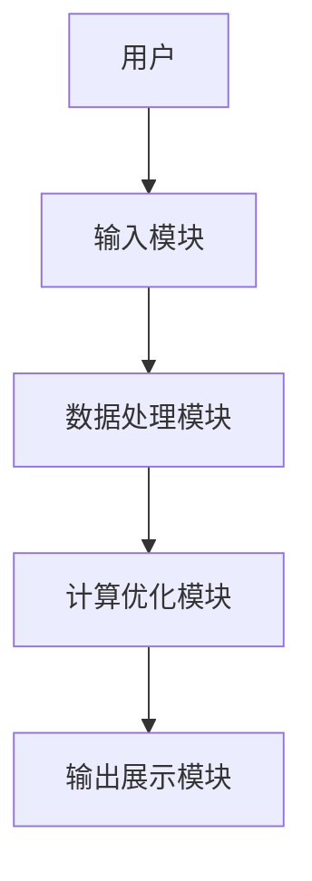

                 


# 约翰伯格的资产配置建议

## 关键词：资产配置、投资策略、财富管理、风险管理、投资组合优化

## 摘要：约翰伯格的资产配置策略是一种系统化的方法，旨在通过科学分配资金到不同资产类别，实现风险与收益的最优平衡。本文从资产配置的基本概念、历史发展、核心原理、系统架构到项目实战，全面解析约翰伯格的资产配置建议，帮助投资者制定有效的投资策略。

---

# 第一部分: 资产配置概述

## 第1章: 资产配置的基本概念

### 1.1 资产配置的定义与重要性

#### 1.1.1 资产配置的定义
资产配置是指根据投资目标、风险承受能力和市场环境，将资金分配到不同资产类别（如股票、债券、房地产等）的过程。其目的是在风险可控的前提下，最大化投资收益。

#### 1.1.2 资产配置在投资中的重要性
资产配置是投资成功的关键因素之一。通过分散投资，投资者可以降低特定资产的风险，同时优化整体投资组合的收益。

#### 1.1.3 资产配置与投资收益的关系
资产配置直接影响投资组合的收益和风险。科学的资产配置能够在不同市场条件下，平衡风险与收益，实现长期稳定的回报。

### 1.2 资产配置的核心要素

#### 1.2.1 投资目标与风险承受能力
投资目标和风险承受能力是资产配置的基石。不同的目标和风险偏好决定了资产分配的比例。

#### 1.2.2 资产类别与分配比例
资产类别包括股票、债券、现金等。分配比例需根据市场环境和投资者需求调整。

#### 1.2.3 时间跨度与市场环境
投资期限和市场环境影响资产配置策略。长期投资可承担更高风险，短期投资需注重流动性。

---

## 第2章: 资产配置的历史与发展

### 2.1 资产配置的起源与演变

#### 2.1.1 传统资产配置方法
早期的资产配置主要基于经验判断，缺乏系统性。

#### 2.1.2 现代资产组合理论的提出
20世纪50年代，哈里·马科维茨提出现代投资组合理论（MPT），奠定了资产配置的数学基础。

#### 2.1.3 资产配置的多样化发展
随着市场变化，资产配置逐渐多样化，引入更多资产类别和策略。

### 2.2 不同经济周期下的资产配置策略

#### 2.2.1 经济周期对资产配置的影响
经济周期波动影响各类资产的表现。投资者需根据周期调整配置。

#### 2.2.2 股票、债券、房地产等主要资产的表现
不同资产在不同周期下的收益和风险特征需重点分析。

#### 2.2.3 资产配置在通货膨胀与通货紧缩环境下的调整
通胀和通缩环境需调整资产类别，优化组合表现。

---

## 第3章: 资产配置的核心原理

### 3.1 现代投资组合理论（MPT）

#### 3.1.1 马科维茨的有效前沿理论
有效前沿理论指出，最优投资组合是在可行前沿上的点，平衡风险与收益。

#### 3.1.2 投资组合的分散化效应
分散化投资可降低非系统性风险，提高整体组合的稳定性。

#### 3.1.3 风险与收益的平衡
通过优化资产权重，找到收益与风险的最佳平衡点。

### 3.2 资产配置的数学模型

#### 3.2.1 均值-方差优化模型
数学公式：
$$ \text{Minimize } \sigma^2 \text{ subject to } \mu \cdot w = R_p $$
其中，$\sigma^2$是风险，$w$是资产权重，$\mu$是预期收益，$R_p$是目标收益。

#### 3.2.2 投资组合的风险度量
使用方差和标准差衡量投资组合风险。

#### 3.2.3 资产权重的计算公式
权重分配基于风险调整后的收益，优化后得到各资产的最优权重。

---

# 第二部分: 资产配置的系统架构

## 第4章: 资产配置的系统架构

### 4.1 资产配置系统的功能模块

#### 4.1.1 用户输入模块
收集投资者目标、风险偏好和时间跨度。

#### 4.1.2 数据处理模块
处理历史数据和市场预测，提供资产类别分析。

#### 4.1.3 计算优化模块
应用数学模型优化资产权重，生成配置建议。

#### 4.1.4 输出展示模块
以图表形式展示配置结果和风险收益分析。

### 4.2 系统架构设计

#### 4.2.1 系统架构图


#### 4.2.2 系统接口设计
API用于数据获取和结果输出，确保模块间高效交互。

#### 4.2.3 系统交互流程
用户输入需求，系统处理数据并优化，展示结果。

---

# 第三部分: 项目实战

## 第5章: 项目实战

### 5.1 环境安装

#### 5.1.1 安装Python和相关库
安装Python 3.8以上版本，使用pip安装numpy、pandas、scipy等库。

### 5.2 核心代码实现

#### 5.2.1 均值-方差优化代码
```python
import numpy as np
import scipy.optimize

def portfolio_optimization(weights, returns):
    n = len(weights)
    Cov = np.cov(returns)
    def objective(weights, Cov, returns):
        return -weights.T @ returns + 0.5 * weights.T @ Cov @ weights
    bounds = [(0, 1) for _ in range(n)]
    cons = ({'type': 'eq', 'fun': lambda w: sum(w) - 1})
    result = scipy.optimize.minimize(objective, np.ones(n)/n, args=(Cov, returns), 
                                      bounds=bounds, constraints=cons)
    return result.x

# 示例数据
returns = np.array([...])
weights = portfolio_optimization(weights, returns)
```

### 5.3 案例分析

#### 5.3.1 数据分析与可视化
使用历史数据进行回测，生成收益与风险曲线。

#### 5.3.2 结果解读
解释优化后的资产权重，分析不同市场的表现。

### 5.4 项目小结

总结实战经验，优化后的资产配置效果显著，验证了约翰伯格策略的有效性。

---

# 第四部分: 最佳实践与小结

## 第6章: 最佳实践与小结

### 6.1 总结

约翰伯格的资产配置策略通过科学方法优化投资组合，平衡风险与收益，值得投资者深入学习和实践。

### 6.2 注意事项

- 定期调整配置，应对市场变化。
- 结合宏观经济分析，优化投资决策。
- 选择合适的工具和模型，提高配置效率。

### 6.3 拓展阅读

推荐相关书籍和资源，进一步提升资产配置能力。

---

作者：AI天才研究院 & 禅与计算机程序设计艺术

