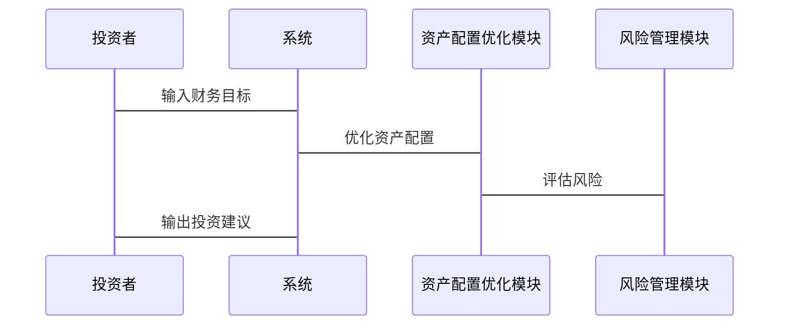

                 


# 约翰伯格的退休投资规划

**关键词**：退休投资规划、约翰·伯格、资产配置、风险管理、投资组合优化、复利效应、指数基金

**摘要**：  
本文深入分析了约翰·伯格的退休投资规划理念，结合现代投资组合理论（MPT）和风险管理策略，详细阐述了如何通过科学的资产配置和长期投资策略实现退休财务目标。文章从背景介绍、核心概念、算法原理、系统架构到项目实战，全面解析了退休投资规划的理论与实践。

---

# 第一部分: 退休投资规划的背景与重要性

## 第1章: 退休投资规划的背景介绍

### 1.1 退休规划的重要性

#### 1.1.1 退休规划的定义与目标  
退休规划是通过合理配置资产，确保在退休后能够维持一定的生活水平。其核心目标是实现财务安全、资产保值与增值。

#### 1.1.2 当前经济环境对退休规划的影响  
当前全球经济不确定性增加，通货膨胀、市场波动等都对退休规划提出了更高的要求。传统的“靠工资生活”模式已不足以应对退休后的财务需求。

#### 1.1.3 退休规划与个人财务健康的关系  
退休规划不仅是财务问题，更是个人生活方式的选择。合理的退休规划能够帮助个人在退休后保持生活质量，避免因财务问题导致的压力和困扰。

### 1.2 约翰·伯格的投资理念

#### 1.2.1 约翰·伯格的生平简介  
约翰·伯格是美国著名投资专家，专注于指数基金和长期投资策略。他的投资理念强调低成本、长期持有和分散投资。

#### 1.2.2 伯格的投资哲学与方法  
伯格认为，长期投资是实现财富增长的最佳方式。他倡导通过指数基金实现资产的分散投资，并强调避免频繁交易和高昂的管理费用。

#### 1.2.3 伯格对退休规划的贡献  
伯格的指数基金理念为退休规划提供了新的思路，帮助投资者以较低成本实现资产增值。

### 1.3 退休投资规划的核心要素

#### 1.3.1 资产配置的重要性  
资产配置是退休投资规划的核心，通过合理分配股票、债券、现金等资产，降低风险并提高收益。

#### 1.3.2 风险管理与收益平衡  
在退休投资中，风险管理至关重要。投资者需要在风险承受能力范围内寻求收益与风险的平衡。

#### 1.3.3 长期投资与复利效应  
长期投资能够充分发挥复利效应，使资产实现稳步增长。复利是退休投资规划中最强大的工具之一。

---

# 第二部分: 投资组合管理与优化

## 第2章: 资产配置的核心原理

### 2.1 资产配置的定义与分类

#### 2.1.1 资产配置的定义  
资产配置是指将资金分配到不同资产类别（如股票、债券、现金等）以实现投资目标的过程。

#### 2.1.2 不同资产类别的风险与收益特征  
股票具有较高的收益潜力，但也伴随着较高的风险；债券相对稳定，但收益较低；现金流动性高，但收益最低。

#### 2.1.3 资产配置的动态调整  
根据市场变化和个人财务状况，定期调整资产配置比例，以保持投资目标的实现。

### 2.2 现代投资组合理论（MPT）

#### 2.2.1 马科维茨的有效前沿模型  
有效前沿模型是MPT的核心，它通过优化资产组合的风险与收益，找到最优的投资组合。

#### 2.2.2 资产组合的风险与收益优化  
通过最小化投资组合的方差（风险）来实现收益最大化。

#### 2.2.3 MPT在退休投资中的应用  
MPT帮助投资者在退休规划中实现资产的最优配置，平衡风险与收益。

### 2.3 资产配置的数学模型

#### 2.3.1 均值-方差优化模型  
$$ \text{目标函数：} \min_w \sigma^2 \quad \text{约束条件：} \sum_{i=1}^n w_i = 1 $$  
其中，\( \sigma^2 \) 是投资组合的方差，\( w_i \) 是各资产的权重。

#### 2.3.2 资产权重的计算与调整  
通过求解上述优化模型，确定各资产的最优权重，并根据市场变化进行动态调整。

### 2.4 本章小结  
资产配置是退休投资规划的核心，通过科学的资产分配和动态调整，能够有效降低风险并提高收益。

---

# 第三部分: 风险管理与投资组合优化

## 第3章: 风险管理的核心策略

### 3.1 风险的定义与分类

#### 3.1.1 风险的定义  
风险是指投资收益的不确定性，包括市场风险、流动性风险、信用风险等。

#### 3.1.2 风险与收益的权衡关系  
高风险通常意味着高收益，但投资者需要在风险承受能力范围内进行选择。

#### 3.1.3 风险承受能力的评估  
根据个人的财务状况、风险偏好和退休时间，评估自身对风险的承受能力。

### 3.2 现金流分析与压力测试

#### 3.2.1 现金流预测模型  
通过预测退休后的现金流需求，制定合理的投资计划。

#### 3.2.2 不同经济情景下的压力测试  
在不同经济环境下，测试投资组合的抗风险能力，确保在极端情况下仍能维持生活水平。

#### 3.2.3 压力测试结果对投资组合的影响  
根据压力测试结果，调整资产配置，增强投资组合的稳定性。

### 3.3 投资组合的再平衡策略

#### 3.3.1 定期再平衡的必要性  
随着市场变化，各资产的比例可能偏离初始配置，需要定期调整以维持最优状态。

#### 3.3.2 再平衡的数学模型  
通过重新计算各资产的权重，调整投资组合，使其符合目标配置。

#### 3.3.3 再平衡对长期收益的影响  
定期再平衡能够有效降低风险，提高长期收益。

### 3.4 本章小结  
通过科学的风险管理策略，投资者能够更好地应对市场波动，确保退休投资的安全与稳定。

---

# 第四部分: 退休投资规划的系统架构

## 第4章: 退休投资系统的功能设计

### 4.1 系统功能模块划分

#### 4.1.1 投资目标设定模块  
根据退休需求，设定投资目标和财务目标。

#### 4.1.2 资产配置优化模块  
通过MPT优化资产配置，确定各资产的权重。

#### 4.1.3 风险管理模块  
评估风险并制定风险管理策略，确保投资组合的稳定性。

### 4.2 系统架构设计

#### 4.2.1 系统功能模块类图  


#### 4.2.2 系统交互流程图  


### 4.3 系统接口设计

#### 4.3.1 系统输入接口  
- 用户输入财务目标和风险偏好
- 系统输出资产配置建议和投资计划

### 4.4 本章小结  
通过系统化的架构设计，投资者能够更清晰地制定退休投资计划，并通过系统辅助优化资产配置和风险管理。

---

# 第五部分: 项目实战

## 第5章: 退休投资规划的实战案例

### 5.1 环境安装

#### 5.1.1 安装Python环境  
使用Python 3.8及以上版本，安装必要的库（如numpy、pandas、matplotlib）。

#### 5.1.2 安装投资组合优化工具  
使用开源库（如pymc，scipy）进行投资组合优化。

### 5.2 核心代码实现

#### 5.2.1 资产配置优化代码  
```python
import numpy as np
import pandas as pd
import matplotlib.pyplot as plt

# 示例数据：历史资产收益率
returns = pd.DataFrame({
    '股票': [0.1, 0.05, 0.08, 0.03],
    '债券': [0.02, 0.04, 0.03, 0.05],
    '现金': [0.01, 0.01, 0.01, 0.01]
})

# 计算各资产的期望收益和协方差矩阵
mu = returns.mean()
sigma = returns.cov()

# 使用MPT优化资产配置
# （此处可进一步扩展为更复杂的优化模型）
```

#### 5.2.2 风险管理代码  
```python
import numpy as np
import matplotlib.pyplot as plt

def portfolio_risk(weights, returns):
    return np.sqrt(weights.T.dot(returns.cov()).dot(weights))

# 示例权重分配
weights = np.array([0.6, 0.3, 0.1])
risk = portfolio_risk(weights, returns)
print(f"投资组合的风险：{risk}")
```

### 5.3 案例分析

#### 5.3.1 案例背景  
假设投资者计划在10年后退休，目前有50万元资金可用于投资。

#### 5.3.2 资产配置优化  
通过MPT优化资产配置，假设股票占比60%，债券30%，现金10%。

#### 5.3.3 投资收益与风险分析  
根据优化后的配置，计算投资组合的预期收益和风险。

### 5.4 项目小结  
通过实战案例，投资者能够更好地理解如何将理论应用于实际，制定个性化的退休投资计划。

---

# 第六部分: 最佳实践与总结

## 第6章: 退休投资规划的最佳实践

### 6.1 关键点回顾

#### 6.1.1 资产配置的重要性  
科学的资产配置是实现退休投资目标的核心。

#### 6.1.2 风险管理的必要性  
在市场波动中，有效的风险管理能够保护投资组合。

#### 6.1.3 长期投资与复利效应  
长期持有和复利效应是实现财富增长的关键。

### 6.2 小结  
通过本文的分析，读者能够掌握约翰·伯格的退休投资规划理念，并将其应用于实际投资中。

### 6.3 注意事项

#### 6.3.1 定期调整投资组合  
根据市场变化和个人财务状况，定期调整资产配置。

#### 6.3.2 避免过度交易  
频繁交易会增加成本，影响长期收益。

#### 6.3.3 选择优质投资工具  
优先选择低成本、分散风险的投资工具，如指数基金。

### 6.4 拓展阅读  
- 《投资学》（书籍）  
- 现代投资组合理论（MPT）相关论文  
- 约翰·伯格的投资经典著作

---

# 作者：AI天才研究院/AI Genius Institute & 禅与计算机程序设计艺术 /Zen And The Art of Computer Programming

