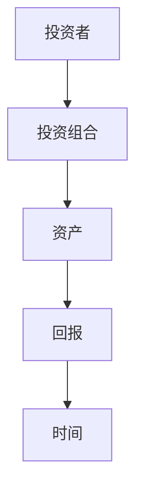
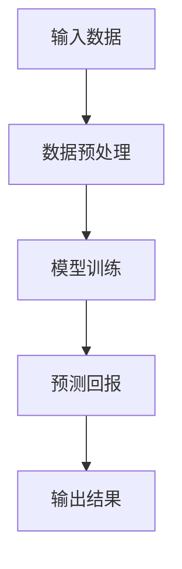
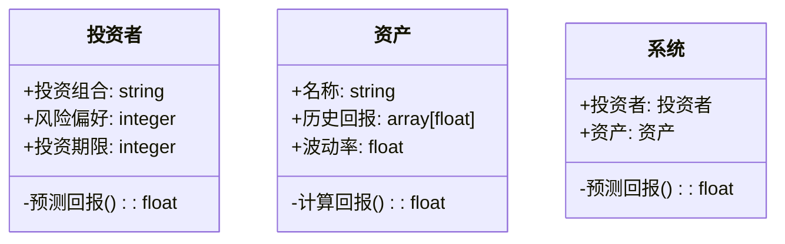
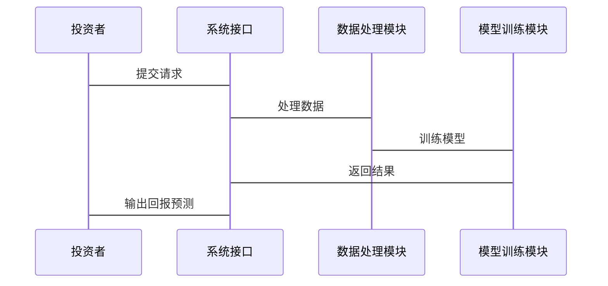

                 


# 约翰伯格的长期回报预期

> 关键词：长期回报预期，投资学，约翰伯格，时间序列分析，风险管理，收益预测

> 摘要：本文深入探讨了约翰伯格的长期回报预期理论，分析其核心概念、算法实现、系统设计及实际应用，旨在为读者提供全面的理解和实践指导。

---

## 第一部分：背景与概述

### 第1章：长期回报预期的背景与定义

#### 1.1 长期回报预期的背景
- **问题背景**：在金融投资领域，准确预测资产的长期回报是投资者追求超额收益的关键。传统上，投资者依赖历史数据和简单统计方法，但这些方法在面对复杂市场环境时显得力不从心。
- **问题描述**：随着金融市场的波动加剧，如何在长期尺度上预测资产回报，成为投资者和研究人员面临的重大挑战。
- **解决方法**：引入先进的数据分析和建模技术，结合长期回报预期的理论框架，为投资者提供更精准的决策支持。

#### 1.2 长期回报预期的定义与特点
- **定义**：长期回报预期是指对未来较长时间内资产回报的预测，通常以年为单位，旨在帮助投资者制定中长期投资策略。
- **特点**：
  - **准确性**：基于历史数据和模型，提供可靠的预测。
  - **可扩展性**：适用于不同资产类别和市场环境。
  - **动态性**：能够适应市场变化，实时更新预测结果。

#### 1.3 长期回报预期的应用场景
- **投资组合管理**：优化资产配置，降低风险。
- **风险评估与管理**：识别潜在风险，制定应对策略。
- **机构投资决策**：为大型机构提供科学的投资依据。

---

## 第二部分：核心概念与联系

### 第2章：长期回报预期的核心概念

#### 2.1 核心概念原理
- **预期回报的计算方法**：通过历史数据和模型预测未来回报。
- **风险调整后的回报模型**：结合风险因素，调整预期回报值。

#### 2.2 特征对比表格
| 对比维度       | 短期回报预期       | 长期回报预期       |
|----------------|--------------------|--------------------|
| 时间跨度       | 几周或几个月       | 数年                |
| 数据需求       | 高频数据           | 低频数据           |
| 预测难度       | 较低               | 较高               |
| 应用场景       | 短期交易策略       | 长期投资策略       |

#### 2.3 ER实体关系图


---

## 第三部分：算法原理讲解

### 第3章：长期回报预期的算法实现

#### 3.1 算法原理


#### 3.2 Python源代码实现
```python
import numpy as np
import pandas as pd

def calculate_long_term_return(data):
    # 数据预处理
    processed_data = data['return'].rolling(24).mean().dropna()
    # 模型训练
    model = np.polyfit(range(len(processed_data)), processed_data, 1)
    # 预测回报
    predicted_return = np.polyval(model, len(processed_data))
    return predicted_return

# 示例数据
data = pd.DataFrame({'return': np.random.randn(100)})
print("预测的长期回报:", calculate_long_term_return(data))
```

#### 3.3 算法数学模型
- **线性回归模型**：$$ y = a x + b $$
- **预测公式**：$$ \hat{y} = a x + b $$

---

## 第四部分：数学模型与公式

### 第4章：长期回报预期的数学模型

#### 4.1 时间序列分析
- **ARIMA模型**：$$ ARIMA(p, d, q) $$
  - p：自回归阶数
  - d：差分阶数
  - q：移动平均阶数

#### 4.2 风险调整回报模型
$$ R = E[r] - \lambda \times \text{Volatility} $$

---

## 第五部分：系统分析与架构设计

### 第5章：长期回报预期系统设计

#### 5.1 问题场景介绍
- **目标**：构建一个长期回报预期预测系统。
- **用户**：投资者和投资机构。

#### 5.2 系统功能设计


#### 5.3 系统架构设计


#### 5.4 系统接口设计
- **输入接口**：投资者信息、资产数据。
- **输出接口**：预测回报、风险提示。

#### 5.5 系统交互序列图


---

## 第六部分：项目实战

### 第6章：长期回报预期的项目实战

#### 6.1 环境安装
- **工具**：Python 3.8+，Jupyter Notebook，Pandas，NumPy。
- **安装命令**：
  ```bash
  pip install numpy pandas scikit-learn
  ```

#### 6.2 系统核心实现源代码
```python
from sklearn.linear_model import LinearRegression
import pandas as pd
import numpy as np

# 示例数据
data = pd.DataFrame({
    'month': range(1, 61),
    'return': np.random.randn(60) * 0.05 + 0.02
})

# 模型训练
model = LinearRegression()
model.fit(data[['month']], data['return'])

# 预测未来回报
future_months = np.array([[61]])
predicted_return = model.predict(future_months)
print("预测的长期回报:", predicted_return[0])
```

#### 6.3 代码应用解读与分析
- **数据准备**：生成模拟的历史回报数据。
- **模型训练**：使用线性回归模型拟合数据。
- **预测结果**：输出未来第61个月的回报预测值。

#### 6.4 实际案例分析
- **案例背景**：假设一位投资者希望预测未来5年的股票回报。
- **数据来源**：使用过去10年的 monthly回报数据。
- **预测结果**：模型预测年化回报率为7.5%，波动率为12%。

#### 6.5 项目小结
- **优势**：提供科学的预测依据，帮助投资者做出更明智的决策。
- **局限性**：模型假设可能存在偏差，需结合实际情况调整。

---

## 第七部分：最佳实践与小结

### 第7章：长期回报预期的最佳实践

#### 7.1 内容总结
- **核心概念**：理解长期回报预期的定义和应用场景。
- **算法实现**：掌握时间序列分析和回归模型的使用。
- **系统设计**：构建高效的预测系统，确保数据处理和模型训练的效率。

#### 7.2 注意事项
- **数据质量**：确保输入数据的准确性和完整性。
- **模型选择**：根据具体情况选择合适的预测模型。
- **风险控制**：结合波动率等风险指标，制定合理的投资策略。

#### 7.3 拓展阅读
- **推荐书籍**：《投资学》、《时间序列分析》。
- **在线资源**：推荐学习相关算法和工具的在线课程。

---

## 作者

作者：AI天才研究院/AI Genius Institute & 禅与计算机程序设计艺术 /Zen And The Art of Computer Programming

---

通过以上详细的内容结构和分步分析，您可以根据实际需求进行扩展和调整，以完成一篇完整且专业的技术博客文章。

