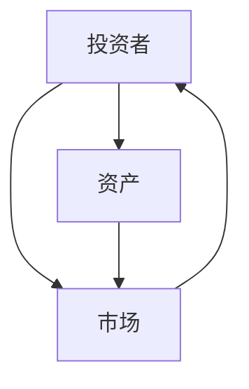
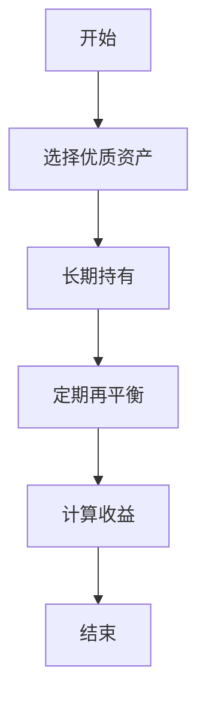
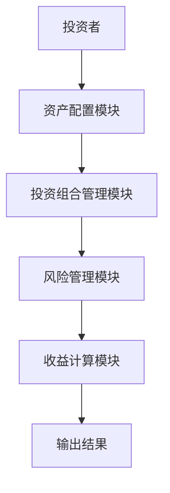
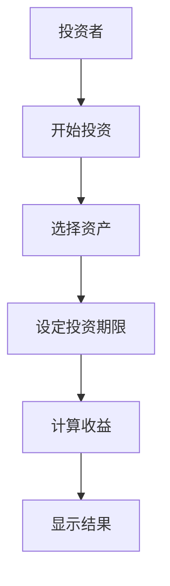

                 


# 约翰伯格的长期投资观

## 关键词：
- 长期投资、约翰·伯格、投资策略、价值投资、风险管理、投资回报

## 摘要：
本文深入探讨了约翰·伯格的长期投资理念，分析了其投资策略的核心要素，包括价值投资、风险管理、复利效应等。通过结合理论与实践，文章详细讲解了长期投资的数学模型、算法原理以及实际操作中的系统架构设计，为读者提供了全面而深入的视角，帮助投资者更好地理解和应用长期投资策略。

---

## 第一部分：长期投资的背景与核心概念

### 第1章：长期投资的背景与问题背景

#### 1.1 长期投资的背景介绍

- **1.1.1 投资市场的基本概念**  
  投资市场是通过购买资产（如股票、债券、房地产等）来实现财富增值的场所。投资者通过分析市场趋势和资产价值，做出买入或卖出的决策。

- **1.1.2 长期投资的定义与特点**  
  长期投资是指投资者将资金投入某资产，并在较长时间内（通常为数年）持有该资产，以实现资本增值和分红收益。其特点是注重资产的内在价值，而非短期市场波动。

- **1.1.3 约翰·伯格的生平与贡献**  
  约翰·伯格是美国著名投资家，被誉为“指数基金之父”。他创立了先锋集团（Vanguard），并提出了指数投资的理念，强调长期持有和分散投资的重要性。

#### 1.2 投资市场的核心问题

- **1.2.1 投资者的主要问题与挑战**  
  投资者在市场中面临的主要问题包括市场波动、信息不对称、交易成本以及心理偏差等。这些问题可能导致投资者做出错误决策，影响投资回报。

- **1.2.2 长期投资的核心目标**  
  长期投资的目标是通过选择优质资产并长期持有，实现财富的稳定增长。与短期投资相比，长期投资更注重资产的内在价值和成长潜力。

- **1.2.3 投资市场的边界与外延**  
  投资市场不仅包括传统的股票和债券市场，还涉及房地产、私募股权、艺术品等多种资产类别。长期投资的策略可以应用于不同类型的市场和资产。

#### 1.3 长期投资的核心概念

- **1.3.1 价值投资与成长投资的区别**  
  价值投资强调购买被市场低估的资产，追求其内在价值的实现。而成长投资则关注具有高成长潜力的公司，愿意为未来的增长支付较高的价格。

- **1.3.2 风险管理与收益平衡的关系**  
  风险管理是长期投资中不可忽视的一部分。通过分散投资和合理配置资产，投资者可以在控制风险的同时，实现收益的最大化。

- **1.3.3 长期投资的决策框架**  
  长期投资的决策框架包括资产选择、投资组合构建、定期再平衡以及持续监控等步骤。这一框架帮助投资者在市场波动中保持稳定，实现长期收益。

#### 1.4 本章小结

本章从投资市场的背景出发，详细介绍了长期投资的核心概念和约翰·伯格的贡献，为后续章节的深入分析奠定了基础。

---

## 第二部分：长期投资的核心概念与联系

### 第2章：长期投资的核心概念原理

#### 2.1 长期投资的原理

- **2.1.1 价值投资的核心原理**  
  价值投资的核心在于寻找市场价格低于内在价值的资产。通过长期持有，投资者等待市场重新认识到资产的真正价值，从而实现收益。

- **2.1.2 长期持有与复利效应**  
  长期持有通过复利效应实现财富的指数增长。复利不仅包括资本增值，还包括分红再投资带来的收益积累。

- **2.1.3 市场波动与投资决策的关系**  
  市场波动是短期投资者的敌人，但对长期投资者来说，波动提供了低位买入的机会。长期投资者应忽略短期波动，专注于资产的长期表现。

#### 2.2 核心概念属性特征对比

| **概念**       | **短期投资**               | **长期投资**               |
|----------------|---------------------------|---------------------------|
| 投资期限       | 短期（通常为几个月至一年）  | 长期（通常为数年至十年以上）|
| 投资目标       | 追求短期收益               | 追求长期资本增值           |
| 风险承受能力   | 风险承受能力较低           | 风险承受能力较高           |
| 投资策略       | 技术分析与趋势交易         | 价值分析与长期持有         |

#### 2.3 ER实体关系图架构



---

## 第三部分：长期投资的算法原理讲解

### 第3章：长期投资的算法原理

#### 3.1 算法原理概述

- **3.1.1 价值投资的量化分析方法**  
  通过量化分析，投资者可以评估资产的内在价值。常用的指标包括市盈率（P/E）、市净率（P/B）等。

- **3.1.2 长期持有策略的数学模型**  
  长期持有策略可以通过复利公式进行计算：

  $$ \text{最终收益} = \text{初始投资} \times (1 + r)^n $$

  其中，$r$ 是年化收益率，$n$ 是投资年数。

- **3.1.3 风险管理的算法实现**  
  风险管理通过分散投资、设定止损点等方式实现。例如，使用夏普比率（Sharpe Ratio）评估投资组合的风险调整后收益：

  $$ \text{夏普比率} = \frac{r_p - r_f}{\sigma_p} $$

  其中，$r_p$ 是投资组合的平均收益，$r_f$ 是无风险收益率，$\sigma_p$ 是投资组合的收益标准差。

#### 3.2 算法流程图



#### 3.3 Python源代码实现

```python
def calculate_long_term_return(initial_investment, annual_return, years):
    return initial_investment * (1 + annual_return) ** years

# 示例计算
initial = 10000
return_rate = 0.07  # 7%年化收益率
period = 10  # 投资10年
final_return = calculate_long_term_return(initial, return_rate, period)
print(f"最终收益为：{final_return:.2f}")
```

---

## 第四部分：长期投资的系统分析与架构设计

### 第4章：长期投资模拟系统架构

#### 4.1 系统功能设计

- **4.1.1 投资者信息管理**  
  包括投资者的资产配置、风险偏好和投资目标等信息。

- **4.1.2 资产选择与配置**  
  根据投资者的风险偏好，选择合适的资产类别并进行配置。

- **4.1.3 投资组合管理**  
  包括定期再平衡、风险监控和收益计算等功能。

#### 4.2 系统架构设计



#### 4.3 系统交互设计



---

## 第五部分：长期投资的项目实战

### 第5章：长期投资的实战案例

#### 5.1 环境安装与配置

- 安装Python和必要的库（如pandas、numpy、matplotlib）。

#### 5.2 核心代码实现

```python
import pandas as pd
import numpy as np

# 示例数据：股票历史价格
data = pd.DataFrame({
    '日期': ['2020-01-01', '2020-01-02', '2020-01-03'],
    '收盘价': [100, 101, 99]
})

# 计算投资收益
returns = data['收盘价'].pct_change().dropna()
cumulative_return = (1 + returns).cumprod()

print("累计收益率：", cumulative_return)
```

#### 5.3 案例分析与解读

- 选择优质资产（如指数基金）进行长期持有，定期进行再平衡，实现稳定的收益增长。

#### 5.4 项目小结

通过实战案例，读者可以理解如何将长期投资策略应用于实际操作中。

---

## 第六部分：长期投资的最佳实践

### 第6章：最佳实践与小结

#### 6.1 小结

- 长期投资的关键在于选择优质资产、分散投资和定期再平衡。
- 约翰·伯格的长期投资理念为投资者提供了宝贵的指导。

#### 6.2 注意事项

- 避免频繁交易，减少交易成本和税务负担。
- 定期审视和调整投资组合，以适应市场变化。

#### 6.3 拓展阅读

- 《投资最重要的事情》——本杰明·格雷厄姆
- 《指数基金投资指南》——陈雨露

---

## 作者：AI天才研究院/AI Genius Institute & 禅与计算机程序设计艺术 /Zen And The Art of Computer Programming

