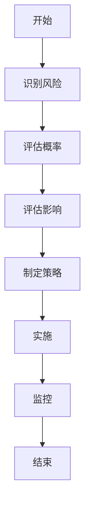
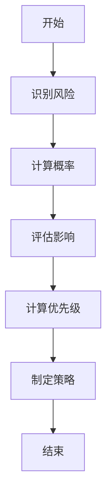
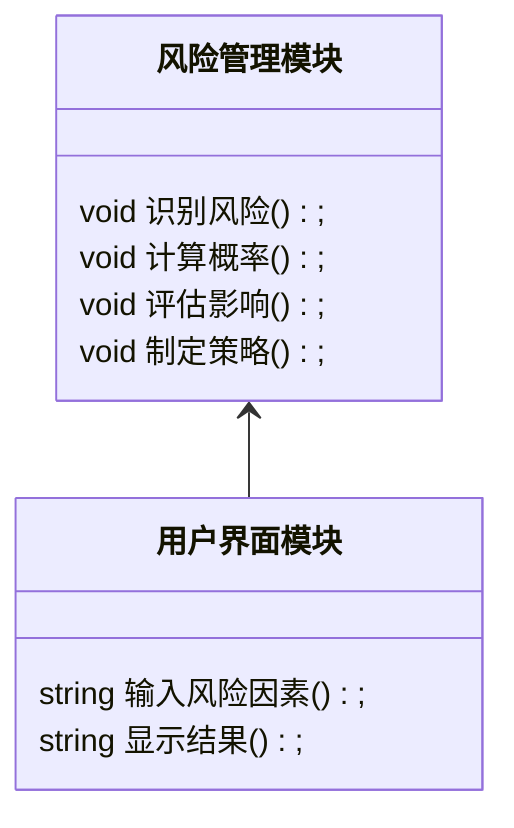

                 


# 约翰伯格的风险管理方法

**关键词**：风险管理，概率模型，决策树，系统架构，风险评估

**摘要**：本文深入探讨约翰·伯格的风险管理方法，从核心概念、算法原理到系统架构和项目实战，全面解析其在现代风险管理中的应用。通过数学模型和实际案例，帮助读者掌握风险量化与应对策略，提升风险管理的效率和效果。

---

## 第一部分: 风险管理的基本概念与背景

### 第1章: 风险管理的核心要素

#### 1.1 风险管理的定义与重要性
- 风险管理是识别、评估和应对潜在风险的系统性过程。
- 在现代企业中，风险管理是确保项目成功的关键因素。
- 约翰·伯格方法的独特之处在于其量化风险的概率和影响。

#### 1.2 风险管理的核心要素
- **风险识别**：识别可能影响项目的风险因素。
- **风险评估**：量化风险的概率和影响程度。
- **风险应对策略**：制定有效的应对措施。

#### 1.3 约翰伯格风险管理方法的背景
- 约翰·伯格提出的风险管理方法结合了概率论和系统工程。
- 该方法在金融、IT和工程等领域得到了广泛应用。

---

## 第2章: 约翰伯格风险管理方法的核心概念

### 2.1 风险的量化与概率模型
- **风险概率计算公式**：
  $$ P = \frac{N_{\text{success}}}{N_{\text{total}}} $$
- **风险影响评估模型**：
  $$ I = \text{影响程度} \times \text{发生概率} $$

### 2.2 约翰伯格方法的独特性
- **系统性思维**：将风险视为系统的一部分，综合考虑各因素的相互作用。
- **概率模型**：通过数学模型量化风险，提高决策的科学性。

### 2.3 系统模型与流程图


---

## 第3章: 算法原理与数学模型

### 3.1 约翰伯格方法的算法流程
1. **风险识别**：列出所有可能的风险因素。
2. **概率计算**：使用概率模型评估每个风险发生的可能性。
3. **影响评估**：分析每个风险的影响程度。
4. **策略制定**：根据概率和影响制定应对措施。

### 3.2 数学模型的应用
- **风险总值计算**：
  $$ TV = \sum_{i=1}^{n} (P_i \times I_i) $$
- **风险优先级排序**：
  $$ R = P \times I $$

### 3.3 算法流程图


---

## 第4章: 系统架构与项目实战

### 4.1 系统架构设计
- **功能模块**：
  - 风险识别模块
  - 概率计算模块
  - 影响评估模块
  - 策略制定模块
- **架构图**：


### 4.2 项目实战
#### 实战案例：软件开发项目的风险管理
1. **环境安装**：安装风险管理工具和相关软件。
2. **核心实现**：
   ```python
   def calculate_risk_probabilities(risk_factors):
       probabilities = {}
       for factor in risk_factors:
           prob = 0.0
           # 计算概率
           probabilities[factor] = prob
       return probabilities
   ```
3. **案例分析**：通过具体案例展示如何应用约翰伯格方法。

---

## 第5章: 最佳实践与总结

### 5.1 最佳实践
- 定期更新风险评估模型。
- 结合实际项目特点调整方法。
- 培训团队成员，提高风险管理意识。

### 5.2 小结
- 约翰伯格风险管理方法提供了科学的量化工具。
- 在实际应用中，需根据具体情况灵活调整。

### 5.3 注意事项
- 确保数据的准确性和完整性。
- 定期监控和评估风险应对措施的有效性。

### 5.4 拓展阅读
- 推荐阅读《风险管理的系统方法》。

---

**作者：AI天才研究院 & 禅与计算机程序设计艺术**

