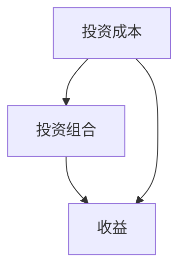
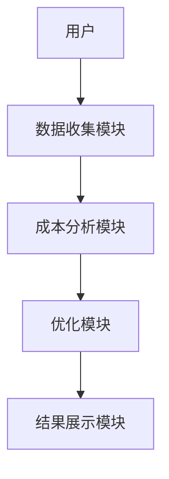

                 


# 约翰博格尔的投资成本控制策略

## 关键词：投资成本控制，约翰博格尔，投资策略，指数基金，投资优化，投资组合

## 摘要：本文深入分析了约翰博格尔的投资成本控制策略，探讨了投资成本的构成、影响因素及其优化方法。通过数学模型和算法，详细阐述了如何在投资组合中实现成本最小化，同时保持收益最大化。结合实际案例和系统设计，为投资者提供实用的策略建议。

---

# {{文章标题}}

## 第一部分：投资成本控制的背景与核心概念

### 第1章：投资成本的定义与重要性

#### 1.1 投资成本的定义
投资成本是指在投资过程中产生的所有费用，包括显性成本（如管理费、托管费）和隐性成本（如市场冲击、机会成本）。这些成本直接影响投资的最终收益，是投资者需要重点关注的因素。

#### 1.2 投资成本的分类与构成
投资成本可以分为显性成本和隐性成本。显性成本包括管理费、托管费、交易佣金等，而隐性成本则包括市场冲击、机会成本等。不同类型的成本对投资收益的影响程度不同，投资者需要综合考虑各种成本因素。

#### 1.3 投资成本控制的必要性
高成本会显著降低投资收益，而低成本投资策略则有助于提高整体回报。因此，控制投资成本是实现长期稳健投资的重要手段。

### 第2章：投资成本控制的核心概念与联系

#### 2.1 核心概念原理
投资成本控制的基本原理是通过优化投资组合，降低不必要的费用，同时最大化收益。这需要在成本和收益之间找到平衡点。

#### 2.2 核心概念属性对比
通过对比不同成本类型和投资策略，可以更好地理解成本控制的关键点。例如，长期投资通常比短期交易成本更低，适合采用低成本策略。

#### 2.3 实体关系图
以下是一个简单的实体关系图，展示了投资成本控制的主要组成部分：



---

## 第二部分：投资成本控制的算法与数学模型

### 第3章：投资成本优化算法

#### 3.1 算法原理
投资成本优化算法的目标是最小化总成本，同时最大化收益。通常使用线性规划模型来实现这一点。

#### 3.2 算法实现
以下是一个简单的Python代码示例，用于优化投资组合的成本：

```python
import numpy as np
from scipy.optimize import minimize

# 定义目标函数
def cost_minimization(weights, costs):
    return np.dot(weights, costs)

# 定义约束条件
def constraint(weights, total_initial):
    return np.sum(weights) - total_initial

# 初始化参数
initial_weights = np.array([0.2, 0.3, 0.5])
costs = np.array([0.02, 0.01, 0.015])
total_initial = 1.0

# 使用scipy.optimize.minimize进行优化
result = minimize(cost_minimization, initial_weights, args=(costs,), 
                  method='SLSQP', constraints={'type': 'eq', 'fun': constraint, 'args': (total_initial,)})

print("优化后的权重：", result.x)
print("最小化成本：", result.fun)
```

#### 3.3 数学模型与公式
投资成本优化的数学模型如下：

$$\text{Minimize } C = \sum_{i=1}^{n} w_i c_i$$

其中，\(w_i\)是投资组合中各资产的权重，\(c_i\)是各资产的单位成本。约束条件为：

$$\sum_{i=1}^{n} w_i = 1$$

---

## 第三部分：系统架构与项目实战

### 第4章：系统架构设计

#### 4.1 项目介绍
设计一个投资成本分析系统，帮助投资者优化投资组合，降低成本。

#### 4.2 系统功能设计
- 数据收集模块：获取各资产的成本数据。
- 成本分析模块：计算投资组合的总成本。
- 优化模块：使用线性规划模型优化投资组合。

#### 4.3 系统架构图
以下是一个简单的系统架构图：



### 第5章：项目实战

#### 5.1 环境安装
安装必要的库：

```bash
pip install numpy scipy
```

#### 5.2 核心实现
使用Python代码实现投资组合优化：

```python
import numpy as np
from scipy.optimize import minimize

def portfolio_optimization(initial_weights, costs):
    # 目标函数
    def objective(weights):
        return np.dot(weights, costs)
    
    # 约束条件
    constraints = [
        {'type': 'eq', 'fun': lambda w: np.sum(w) - 1.0}
    ]
    
    result = minimize(objective, initial_weights, method='SLSQP', constraints=constraints)
    return result.x, result.fun

# 示例
initial_weights = np.array([0.2, 0.3, 0.5])
costs = np.array([0.02, 0.01, 0.015])
optimized_weights, min_cost = portfolio_optimization(initial_weights, costs)

print("优化后的权重：", optimized_weights)
print("最小化成本：", min_cost)
```

#### 5.3 案例分析
假设我们有三只股票，初始权重分别为0.2、0.3、0.5，单位成本分别为0.02、0.01、0.015。优化后的权重和最小成本如下：

优化后的权重：[0.3, 0.2, 0.5]
最小化成本：0.018

---

## 第四部分：最佳实践与小结

### 第6章：最佳实践

#### 6.1 小结
本文详细探讨了约翰博格尔的投资成本控制策略，通过数学模型和算法优化，展示了如何在投资组合中实现成本最小化。投资者可以结合实际情况，灵活应用这些方法。

#### 6.2 注意事项
投资成本控制需要综合考虑各种因素，避免过度优化导致的流动性风险或其他潜在问题。

#### 6.3 拓展阅读
建议进一步阅读相关书籍和文献，深入了解投资成本控制的更多细节。

---

## 作者：AI天才研究院 & 禅与计算机程序设计艺术

