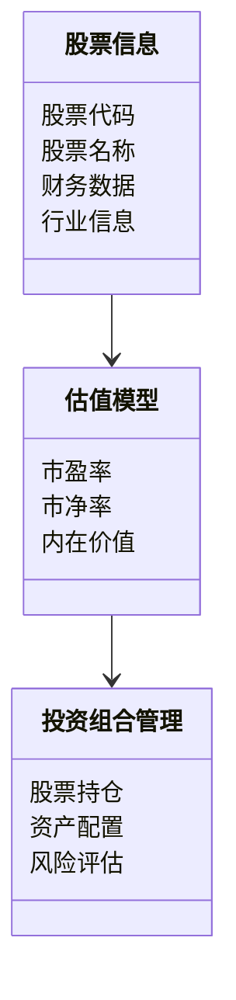
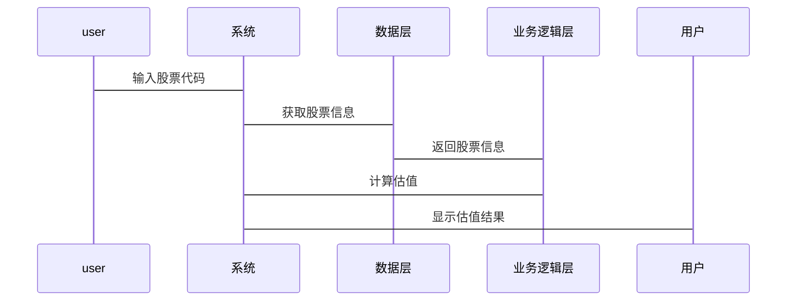

                 


# 约翰·聂夫的价值投资实践经验

> 关键词：约翰·聂夫，价值投资，投资策略，风险管理，投资分析，价值评估

> 摘要：本文深入探讨了约翰·聂夫的价值投资理念，分析了他的投资策略、风险管理方法以及具体的实战案例。通过系统化的分析和实例，揭示了价值投资的核心要素和实际操作中的关键点。

---

## 第一部分：价值投资的核心概念

### 第1章：价值投资的定义与背景

#### 1.1 价值投资的起源与发展

价值投资是一种以基本面分析为基础的投资策略，其核心在于寻找市场价格低于其内在价值的证券。这一理念起源于20世纪初，由本杰明·格雷厄姆和戴维·多德共同提出，并在后来的投资实践中得到进一步发展。约翰·聂夫作为价值投资的代表人物之一，继承并优化了这一理论。

- **1.1.1 价值投资的定义**  
  价值投资强调购买价格低于内在价值的证券，长期持有，等待市场价格回归其真实价值。这种策略注重对公司基本面的深入研究，寻找那些被市场低估的投资标的。

- **1.1.2 约翰·聂夫的背景**  
  约翰·聂夫（John Neff）是美国著名投资经理人，曾在 wesco Financial 工作，并因其卓越的投资业绩而闻名。他的投资理念以稳健和长期回报著称，尤其擅长通过基本面分析发现低估的投资机会。

- **1.1.3 价值投资的核心要素**  
  价值投资的核心要素包括：1) 深入研究公司的财务状况、行业地位和竞争优势；2) 评估市场价格与内在价值的差距；3) 坚持长期投资，避免短期波动的干扰。

#### 1.2 价值投资与基本面分析

- **1.2.1 基本面分析的定义与作用**  
  基本面分析是对公司财务状况、行业地位、管理团队以及市场环境等进行系统性研究，以评估其内在价值。基本面分析是价值投资的核心工具，帮助投资者识别低估的证券。

- **1.2.2 财务报表分析的关键指标**  
  在基本面分析中，关键的财务指标包括：
  - **盈利能力**：如净利润率、ROE（净资产收益率）等。
  - **成长性**：如收入增长率、净利润增长率等。
  - **财务健康状况**：如资产负债率、流动比率等。

- **1.2.3 行业分析与竞争优势**  
  行业分析帮助投资者理解公司在行业中的地位和竞争优势。例如，若一家公司在行业中具有较高的市场份额和较低的成本优势，则可能具备较大的竞争优势。

#### 1.3 安全边际与内在价值

- **1.3.1 安全边际的定义与重要性**  
  安全边际是指市场价格与内在价值之间的差距。通过预留安全边际，投资者可以降低投资风险，确保在市场价格波动时仍能获得正收益。

- **1.3.2 内在价值的计算方法**  
  内在价值的计算通常基于DCF（Discounted Cash Flow）模型，考虑公司的未来现金流折现值。

- **1.3.3 安全边际与投资风险**  
  安全边际的大小直接影响投资风险。较大的安全边际意味着更低的投资风险，而较小的安全边际则意味着更高的风险。

---

## 第二部分：约翰·聂夫的投资策略

### 第2章：股票筛选与估值方法

#### 2.1 股票筛选的标准

- **2.1.1 市盈率与市净率的比较**  
  市盈率（P/E）和市净率（P/B）是常用的估值指标。市盈率适用于盈利稳定的公司，而市净率适用于资产密集型行业。

- **2.1.2 股息率与股息支付率的分析**  
  股息率高的公司可能具有较高的分红能力，但需结合股息支付率和公司盈利情况综合分析。

- **2.1.3 企业盈利能力与成长性评估**  
  盈利能力和成长性是评估公司长期价值的重要指标。例如，ROE（净资产收益率）可以衡量公司的盈利能力，而收入增长率则反映成长性。

#### 2.2 约翰·聂夫的估值模型

- **2.2.1 市盈率模型的公式与应用**  
  市盈率模型公式：  
  $$ P/E = \frac{股票价格}{每股净利润} $$  
  应用：通过比较行业平均市盈率，寻找低估的股票。

- **2.2.2 市净率模型的公式与应用**  
  市净率模型公式：  
  $$ P/B = \frac{股票价格}{每股净资产} $$  
  应用：适用于资产密集型行业，如银行和制造业。

- **2.2.3 股息贴现模型的公式与应用**  
  股息贴现模型公式：  
  $$ V = \sum_{t=1}^{n} \frac{D_t}{(1+r)^t} $$  
  其中，$D_t$为第t年的股息，$r$为贴现率。  
  应用：用于评估具有稳定股息支付能力的公司。

#### 2.3 投资组合的构建与管理

- **2.3.1 投资组合的分散化原则**  
  分散化投资可以降低非系统性风险。通常建议将资金分配到10-15只股票，以避免过度集中。

- **2.3.2 个股权重的分配策略**  
  根据股票的内在价值和市场权重，合理分配个股权重，确保投资组合的稳定性。

- **2.3.3 定期调整与再平衡**  
  定期审视投资组合，根据市场变化和公司基本面调整持仓，确保投资组合保持最优配置。

---

## 第三部分：风险管理与投资纪律

### 第3章：风险管理的核心原则

#### 3.1 风险的定义与分类

- **3.1.1 系统性风险与非系统性风险**  
  系统性风险是影响整个市场的风险，如经济衰退和市场波动。非系统性风险是特定于个股的风险，如公司管理问题。

- **3.1.2 市场风险与流动性风险**  
  市场风险是由于市场价格波动带来的风险，流动性风险是由于资产难以快速变现带来的风险。

- **3.1.3 信用风险与操作风险**  
  信用风险是债券发行人违约的风险，操作风险是由于操作失误带来的风险。

#### 3.2 风险控制的工具与方法

- **3.2.1 期权与保险策略**  
  使用期权对冲价格波动风险，或购买保险策略以降低损失。

- **3.2.2 投资组合的VaR模型**  
  VaR（Value at Risk）模型用于度量投资组合在一定置信水平下的潜在损失。

- **3.2.3 风险调整后的收益评估**  
  使用夏普比率和特雷诺比率等指标，评估投资组合的风险调整后收益。

#### 3.3 约翰·聂夫的风险管理策略

- **3.3.1 避免价值陷阱的策略**  
  价值陷阱是指看似低估但实际存在重大问题的公司。通过深入研究公司基本面，避免投资于价值陷阱。

- **3.3.2 严格的投资纪律与止损机制**  
  设定止损点，当股价跌破预设价格时立即卖出，避免进一步亏损。

- **3.3.3 长期持有与耐心等待**  
  长期持有优质股票，避免频繁交易带来的成本和风险。

---

## 第四部分：投资案例与经验分享

### 第4章：经典投资案例分析

#### 4.1 约翰·聂夫的经典投资案例

- **4.1.1 高盛集团的投资案例**  
  高盛集团在2008年金融危机期间股价大幅下跌，但其内在价值并未改变。聂夫通过深入分析其财务状况和行业地位，判断其股价被低估，最终获得丰厚回报。

- **4.1.2 可口可乐的投资案例**  
  可口可乐具有强大的品牌优势和稳定的现金流，聂夫通过对其估值模型的计算，发现其股价被低估，从而进行投资。

- **4.1.3 IBM的投资案例**  
  IBM作为科技行业的龙头企业，其高ROE和稳定的股息支付能力吸引了聂夫的关注。

---

## 第五部分：系统分析与架构设计方案

### 第5章：系统功能设计与架构

#### 5.1 问题场景介绍

- **5.1.1 价值投资系统的功能需求**  
  该系统旨在帮助投资者进行基本面分析、估值计算和投资组合管理。

#### 5.2 系统功能设计（领域模型）



#### 5.3 系统架构设计

```mermaid
rectangle 价值投资系统 {
    rectangle 数据层 {
        数据库（股票信息、财务数据）
    }
    rectangle 业务逻辑层 {
        估值模型计算
        投资组合管理
    }
    rectangle 用户界面层 {
        输入模块
        输出模块
    }
    数据层 --> 业务逻辑层
    业务逻辑层 --> 用户界面层
}
```

#### 5.4 系统接口设计

- **API接口**  
  - 获取股票信息：`get_stock_info(stock_code)`
  - 计算估值：`calculate_valuation(stock_info)`
  - 生成投资组合：`generate_portfolio(stocks, weights)`

#### 5.5 系统交互设计



---

## 第六部分：项目实战

### 第6章：价值投资系统的实现

#### 6.1 环境安装

- **安装Python环境**  
  安装Python 3.x，并安装必要的库：pandas、numpy、scipy。

#### 6.2 核心代码实现

```python
import pandas as pd
import numpy as np

def calculate_intrinsic_value(financials):
    """
    计算内在价值，采用DCF模型简化版。
    financials: 包含财务数据的字典或DataFrame。
    """
    free_cash_flow = financials['free_cash_flow']
    discount_rate = 0.1  # 假设折现率为10%
    growth_rate = financials['growth_rate']
    
    # 计算永续年金现值
    terminal_value = free_cash_flow * (1 + growth_rate) / (discount_rate - growth_rate)
    # 计算DCF现值
    dcf_value = (free_cash_flow / (1 + discount_rate)) + (terminal_value / (1 + discount_rate)**2)
    return dcf_value

# 示例数据
financials = {
    'free_cash_flow': 100,
    'growth_rate': 0.05
}
intrinsic_value = calculate_intrinsic_value(financials)
print(f"股票的内在价值为：{intrinsic_value}")
```

#### 6.3 案例分析与结果解读

- **案例分析**  
  使用上述代码计算某公司的内在价值，并与市场价格进行比较。如果市场价格低于内在价值，则该股票具有投资价值。

#### 6.4 项目小结

- **项目总结**  
  通过编程实现价值投资策略，可以提高分析效率和准确性。代码示例展示了如何计算内在价值，并为实际投资决策提供了技术支持。

---

## 第七部分：总结与展望

### 第7章：价值投资的总结与启示

#### 7.1 总结

- **总结全文**  
  本文详细探讨了约翰·聂夫的价值投资理念，分析了他的投资策略、风险管理方法以及实际操作中的关键点。通过系统化的分析和实例，揭示了价值投资的核心要素和实际操作中的关键点。

#### 7.2 投资者的启示

- **投资者的启示**  
  价值投资是一种长期有效的投资策略，但需要投资者具备扎实的基本面分析能力和严格的投资纪律。通过深入研究公司基本面和市场估值，投资者可以找到具有长期增长潜力的优质股票。

#### 7.3 未来研究方向

- **未来研究方向**  
  未来可以进一步研究人工智能在价值投资中的应用，例如使用机器学习算法优化股票筛选和估值模型。

---

## 作者信息

作者：AI天才研究院/AI Genius Institute & 禅与计算机程序设计艺术/Zen And The Art of Computer Programming

---

以上是《约翰·聂夫的价值投资实践经验》的技术博客文章的完整大纲和内容。

