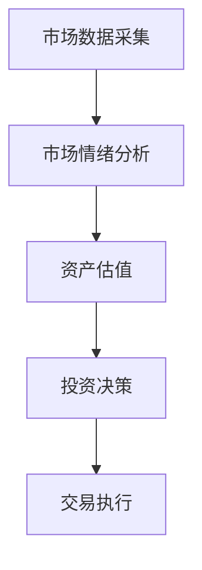
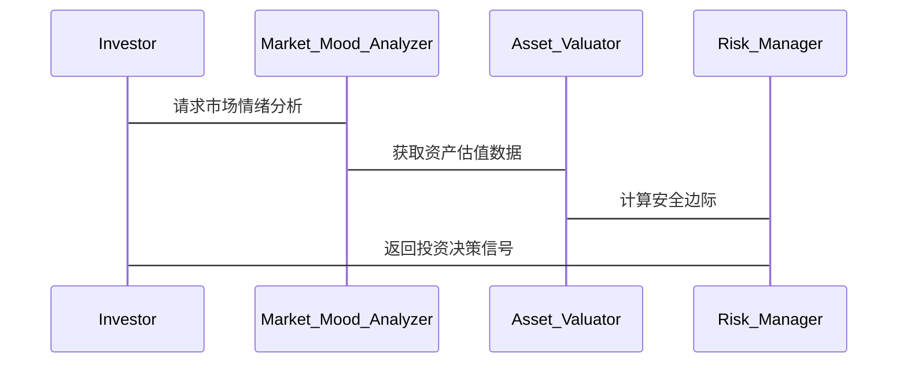

                 


# 约翰·聂夫的反向投资理念

## 关键词：反向投资、约翰·聂夫、安全边际、价值投资、市场周期

## 摘要：  
约翰·聂夫是逆向投资领域的权威人物，他的投资理念强调在市场低谷时买入，在市场高点时卖出，避开市场的狂热情绪，寻找被低估的投资机会。本文将从反向投资的背景、约翰·聂夫的核心理念、具体策略、风险管理、经典案例分析、实践指南以及未来趋势等方面，系统地探讨反向投资的理论与实践。通过本文，读者将深入了解反向投资的核心思想，学会如何在复杂多变的市场环境中运用这一理念，实现长期稳健的投资收益。

---

## 第1章：反向投资的背景与重要性

### 1.1 什么是反向投资  
反向投资是一种不同于传统投资的策略，它强调在市场情绪低落、投资者恐慌时买入资产，在市场情绪高涨、投资者狂热时卖出资产。与趋势投资不同，反向投资的核心思想是“逆市场而行”，寻找市场定价的偏差，利用市场的非理性波动获取超额收益。

#### 核心概念与联系  
反向投资的核心概念包括市场情绪、价值发现、安全边际等。市场情绪是反向投资的核心变量，它反映了市场的狂热或恐慌，为投资者提供了判断市场定价是否偏离内在价值的依据。价值发现是反向投资的目标，通过分析资产的内在价值，寻找市场低估的投资机会。安全边际是反向投资的风险控制手段，通过预留安全空间，降低投资组合的波动性。

#### 算法原理讲解  
反向投资的核心算法是市场情绪分析与资产估值的结合。通过量化市场情绪，投资者可以判断市场的定价偏差，并据此调整投资策略。以下是一个简化的市场情绪分析算法：

```python
def market_mood_analysis():
    import pandas as pd
    import numpy as np
    # 假设 market_data 是一个包含市场指数和投资者情绪的数据框
    # 计算市场情绪指数（例如使用移动平均线和标准差）
    market_mood = pd.rolling_mean(market_data['market_index'], window=20)
    market_mood_zscore = (market_mood - market_mood.mean()) / market_mood.std()
    # 判断市场情绪状态
    if market_mood_zscore[-1] > 1:
        return "市场情绪过高，考虑卖出"
    elif market_mood_zscore[-1] < -1:
        return "市场情绪过低，考虑买入"
    else:
        return "市场情绪中性，保持观望"
```

#### 系统分析与架构设计方案  
反向投资系统的核心功能包括：  
1. **市场数据采集**：获取市场的实时数据，包括指数、个股、债券等。  
2. **市场情绪分析**：通过算法计算市场的短期和长期情绪指数。  
3. **资产估值**：基于基本面分析，计算资产的内在价值。  
4. **投资决策**：根据市场情绪和估值结果，生成买入、卖出或持有信号。  

以下是反向投资系统的架构图：



---

## 第2章：约翰·聂夫的核心投资理念  

### 2.1 约翰·聂夫的投资哲学  
约翰·聂夫认为，市场的波动性是投资机会的来源。他强调，投资者应避免跟随市场的短期波动，而是应该专注于长期价值的创造。以下是他的核心投资理念：  
1. **长期投资**：投资的目的是创造长期价值，而非短期收益。  
2. **逆向思维**：在市场恐慌时买入，在市场狂热时卖出。  
3. **安全边际**：在投资决策中预留安全空间，降低风险。  

#### 核心概念与联系  
约翰·聂夫的投资哲学以市场情绪、长期价值和安全边际为核心。市场情绪是触发投资行动的信号，长期价值是投资目标，安全边际是风险控制的关键。

#### 算法原理讲解  
以下是基于约翰·聂夫理念的安全边际计算公式：

$$ \text{安全边际} = \text{内在价值} \times (1 - \text{风险容忍度}) $$

其中，风险容忍度是一个介于0和1之间的参数，表示投资者对风险的承受能力。以下是一个Python实现：

```python
def calculate_margin_of_safety(intrinsic_value, risk_tolerance=0.1):
    return intrinsic_value * (1 - risk_tolerance)
```

#### 系统分析与架构设计方案  
约翰·聂夫的反向投资系统可以分为以下几个部分：  
1. **市场情绪分析**：通过技术指标和市场数据，判断市场的短期和长期情绪。  
2. **资产估值**：基于基本面分析，计算资产的内在价值。  
3. **投资决策**：根据市场情绪和估值结果，生成买入、卖出或持有信号。  
4. **风险管理**：通过安全边际和投资组合优化，控制投资风险。  

以下是系统的交互图：



---

## 第3章：反向投资的具体策略  

### 3.1 识别市场低估的机会  
在市场低谷时，许多资产的价格被市场情绪低估。以下是识别市场低估机会的具体步骤：  
1. **市场情绪分析**：通过技术指标和市场数据，判断市场的短期和长期情绪。  
2. **资产估值**：基于基本面分析，计算资产的内在价值。  
3. **安全边际计算**：通过预留安全空间，降低投资风险。  

#### 算法原理讲解  
以下是资产估值的简化公式：

$$ \text{内在价值} = \frac{\text{现金流}}{\text{折现率}} $$

以下是一个Python实现：

```python
def calculate_intrinsic_value(cash_flow, discount_rate):
    return cash_flow / discount_rate
```

### 3.2 避免市场高估的风险  
在市场高点时，许多资产的价格被市场情绪高估。以下是避免市场高估风险的具体策略：  
1. **市场情绪分析**：通过技术指标和市场数据，判断市场的短期和长期情绪。  
2. **资产估值**：基于基本面分析，计算资产的内在价值。  
3. **投资决策**：根据市场情绪和估值结果，生成卖出信号。  

#### 算法原理讲解  
以下是市场情绪分析的简化公式：

$$ \text{市场情绪指数} = \frac{\text{当前价格}}{\text{历史平均价格}} $$

以下是一个Python实现：

```python
def calculate_market_mood(current_price, historical_average_price):
    return current_price / historical_average_price
```

---

## 第4章：反向投资的风险管理  

### 4.1 风险管理的重要性  
反向投资的核心思想是逆市场而行，但这也意味着投资者需要承担市场的短期波动风险。以下是风险管理的重要性：  
1. **降低投资组合的波动性**：通过分散投资和预留安全空间，降低投资组合的波动性。  
2. **控制投资风险**：通过预留安全空间，降低投资组合的下行风险。  
3. **提高投资组合的稳定性**：通过长期价值导向，提高投资组合的稳定性。  

#### 算法原理讲解  
以下是投资组合优化的简化公式：

$$ \text{最优投资组合} = \argmin_{w} \left( w^T \Sigma w \right) $$

其中，$w$ 是权重向量，$\Sigma$ 是协方差矩阵。以下是一个Python实现：

```python
import numpy as np

def optimize_portfolio(returns):
    Sigma = np.cov(returns)
    w = np.linalg.inv(Sigma).dot(np.ones(len(Sigma)))
    w = w / np.sum(w)
    return w
```

---

## 第5章：反向投资的未来趋势  

### 5.1 市场环境的变化  
随着市场的复杂化和金融工具的多样化，反向投资的策略也需要不断调整。以下是市场环境的变化：  
1. **技术进步**：大数据和人工智能技术的应用，使得市场情绪分析和资产估值更加精确。  
2. **全球化**：市场的全球化使得投资者需要关注更多的市场和资产。  
3. **监管变化**：金融监管政策的变化，对投资者的投资策略产生重要影响。  

#### 算法原理讲解  
以下是基于大数据的市场情绪分析算法：

```python
def analyze_market_sentiment(text_data):
    import nltk
    from sklearn.feature_extraction.text import TfidfVectorizer
    from sklearn.svm import SVC
    vectorizer = TfidfVectorizer()
    X = vectorizer.fit_transform(text_data)
    clf = SVC()
    clf.fit(X, labels)
    return clf.predict(X_new)
```

### 5.2 反向投资与技术的结合  
随着技术的进步，反向投资的策略可以更加精准和高效。以下是反向投资与技术的结合：  
1. **大数据分析**：通过大数据技术，分析市场的历史数据和实时数据，判断市场的短期和长期情绪。  
2. **人工智能**：通过机器学习算法，预测市场的未来走势，优化投资策略。  
3. **自动化交易**：通过算法交易，实现投资策略的自动化执行。  

#### 算法原理讲解  
以下是基于机器学习的市场预测算法：

```python
def predict_market_trend(data):
    from sklearn.ensemble import RandomForestRegressor
    model = RandomForestRegressor()
    model.fit(X_train, y_train)
    y_pred = model.predict(X_test)
    return y_pred
```

---

## 第6章：反向投资的实践指南  

### 6.1 如何在实际投资中应用反向投资理念  
1. **制定投资计划**：根据市场情绪和资产估值，制定投资计划。  
2. **分散投资**：通过分散投资，降低投资组合的波动性。  
3. **定期调整**：根据市场的变化，定期调整投资组合。  

### 6.2 投资工具与资源  
1. **市场数据平台**：例如，Yahoo Finance、Bloomberg等。  
2. **数据分析工具**：例如，Python、R、MATLAB等。  
3. **投资管理软件**：例如，Morningstar、FactSet等。  

---

## 第7章：反向投资的注意事项  

### 7.1 避免价值陷阱  
在反向投资中，投资者需要注意价值陷阱。以下是避免价值陷阱的注意事项：  
1. **深入分析资产的基本面**：通过基本面分析，判断资产的内在价值。  
2. **关注市场情绪**：通过市场情绪分析，判断市场的定价偏差。  
3. **预留安全边际**：通过预留安全空间，降低投资风险。  

### 7.2 长期投资与短期波动的平衡  
反向投资的核心思想是长期投资，但在实际操作中，投资者需要平衡长期投资与短期波动的关系。以下是平衡长期投资与短期波动的注意事项：  
1. **长期投资**：专注于资产的长期价值，避免短期波动的干扰。  
2. **短期波动**：通过市场情绪分析，判断市场的短期波动，优化投资策略。  
3. **风险管理**：通过预留安全空间，降低投资组合的波动性。  

---

## 附录：反向投资的进一步学习与资源推荐  

### 1. 推荐书籍  
1. 《反向投资的艺术》（The Art of Contrarian Investing）  
2. 《价值投资实战策略》（Practical Value Investing Strategies）  

### 2. 推荐文章  
1. 约翰·聂夫的经典投资文章。  
2. 逆向投资的最新研究与实践。  

### 3. 工具推荐  
1. 数据分析工具：Python、R、MATLAB。  
2. 投资管理软件：Morningstar、FactSet。  
3. 市场数据平台：Yahoo Finance、Bloomberg。  

---

## 作者：AI天才研究院/AI Genius Institute & 禅与计算机程序设计艺术 /Zen And The Art of Computer Programming

---

通过本文，读者可以全面了解约翰·聂夫的反向投资理念，从理论到实践，从策略到风险管理，系统地掌握反向投资的核心思想。无论是对投资新手还是经验丰富的投资者，本文都能提供有价值的见解和指导。

