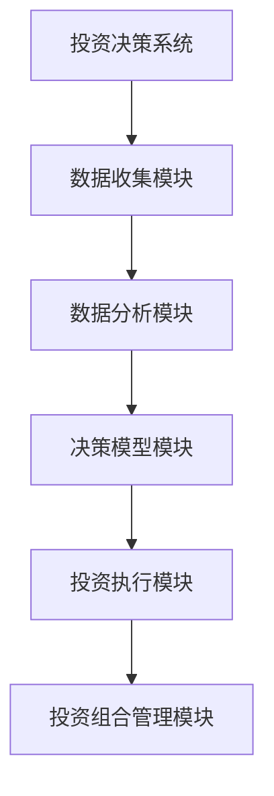

                 

# 约翰邓普顿的危机投资机会

## 关键词：约翰·邓普顿，危机投资，价值投资，安全边际，逆向思维

## 摘要：  
约翰·邓普顿爵士是全球著名的价值投资者，他以在市场危机中寻找投资机会而闻名。本文将从他的投资哲学、策略、方法、经典案例、系统分析、实战指南等多维度进行深入探讨，解析他在危机中的投资机会，为读者提供系统性的投资框架和实战指导。

---

## 第一部分: 约翰邓普顿的生平与投资哲学

### 第1章: 约翰邓普顿的生平简介

#### 1.1.1 约翰邓普顿的早年经历
约翰·邓普顿（John Templeton）出生于1912年，是一位英国投资者，后移居美国。他在1930年代开始投资生涯，经历了大萧条时期的市场波动，这为他后来的危机投资策略奠定了基础。

#### 1.1.2 约翰邓普顿的投资生涯
邓普顿的职业生涯以价值投资为核心，他善于在市场恐慌时寻找被低估的资产。他的投资风格注重安全边际，即买入价格远低于内在价值的资产。

#### 1.1.3 约翰邓普顿的投资理念与哲学
邓普顿的投资哲学强调：
1. **逆向思维**：在市场恐慌时买入，在市场狂热时卖出。
2. **安全边际**：买入价格远低于资产的内在价值。
3. **长期持有**：投资优质资产，长期持有以获得复利效应。

---

## 第二部分: 危机投资的基本概念与背景

### 第2章: 危机投资的定义与特征

#### 2.1.1 危机投资的定义
危机投资是指在市场危机或经济衰退期间，寻找被低估资产进行投资的策略。这种策略依赖于市场的非理性定价，通常在恐慌情绪弥漫时出现。

#### 2.1.2 危机投资的核心特征
1. **市场恐慌**：投资者情绪低落，市场流动性下降。
2. **价格低估**：资产价格远低于其内在价值。
3. **短期机会**：危机通常不会持续很长时间，投资者需要快速识别和抓住机会。

#### 2.1.3 危机投资与传统投资的区别
| 投资策略 | 危机投资 | 传统投资 |
|----------|----------|----------|
| 时间周期 | 短期（抓住市场恐慌） | 长期（关注资产长期价值） |
| 风险偏好 | 高风险（市场波动大） | 中低风险（注重稳定性） |
| 投资标的 | 被低估资产、破产企业 | 高质量资产、成长型企业 |

### 第3章: 危机投资的系统分析与架构设计

#### 3.1 危机投资的系统分析
1. **数据收集**：收集市场数据（如价格、市盈率、市净率）和宏观经济指标。
2. **数据分析**：使用统计方法识别市场底部和被低估资产。
3. **决策模型**：基于安全边际和逆向思维构建投资决策模型。

#### 3.2 危机投资的架构设计

---

## 第三部分: 约翰邓普顿的危机投资策略

### 第4章: 约翰邓普顿的核心投资策略

#### 4.1 价值投资策略
价值投资的核心是寻找市场价格低于内在价值的资产。邓普顿通过分析企业的基本面（如盈利能力、资产负债表）来确定其内在价值。

#### 4.2 安全边际
安全边际是邓普顿投资策略的关键。他要求买入价格远低于资产的内在价值，以确保在市场波动中不会出现重大损失。

#### 4.3 逆向思维
逆向思维是指在市场恐慌时买入，在市场狂热时卖出。邓普顿认为，市场的情绪波动是投资机会的来源。

### 第5章: 危机投资的实战指南

#### 5.1 投资环境的搭建
1. **工具安装**：安装金融数据分析工具（如Excel、Python）。
2. **数据获取**：获取历史市场数据和公司财务数据。
3. **模拟测试**：在模拟环境中测试投资策略。

#### 5.2 投资策略的实现
1. **数据处理**：使用Python处理市场数据，计算市盈率（P/E）和市净率（P/B）。
2. **模型构建**：基于安全边际构建投资决策模型。
3. **策略执行**：根据模型在市场底部买入被低估资产。

### 第6章: 危机投资的经典案例分析

#### 6.1 约翰邓普顿的经典投资案例
1. **购买破产企业股票**：邓普顿在企业破产时买入股票，等待企业复苏后出售。
2. **低价股票投资**：购买价格远低于市场平均水平的股票。

---

## 第四部分: 危机投资的最佳实践与总结

### 第7章: 投资策略的总结与展望

#### 7.1 约翰邓普顿投资策略的总结
1. **逆向思维**：在市场恐慌时寻找机会。
2. **安全边际**：确保买入价格低于内在价值。
3. **长期持有**：通过复利效应获得收益。

#### 7.2 危机投资的注意事项
1. **风险控制**：避免过度杠杆和集中投资。
2. **持续学习**：关注市场变化，不断优化投资策略。

---

## 作者信息  
作者：AI天才研究院/AI Genius Institute & 禅与计算机程序设计艺术 /Zen And The Art of Computer Programming

