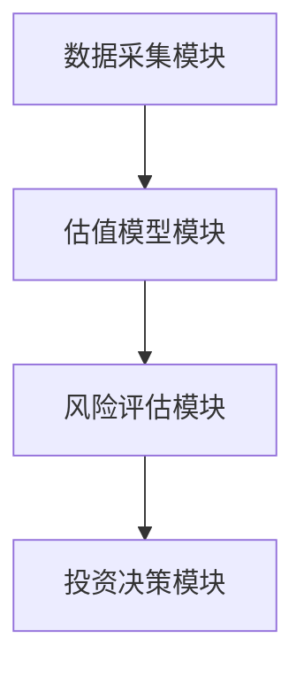
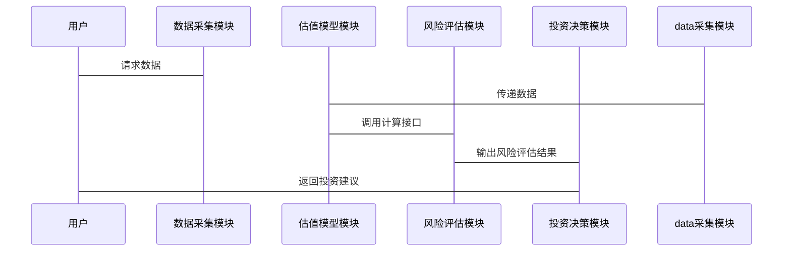

                 


# 罗伯特·哈格斯特罗姆的专注型价值投资：深入了解少数公司

## 关键词：专注型投资、罗伯特·哈格斯特罗姆、价值投资、企业分析、投资算法、系统设计

## 摘要：本文深入探讨了罗伯特·哈格斯特罗姆的专注型价值投资理念，分析了其核心概念、数学模型、系统架构及实战应用。通过详细讲解投资决策的数学模型、企业基本面分析、竞争优势评估以及投资系统的构建，本文为读者提供了一套系统化的方法来深入了解少数公司，实现长期稳健的投资收益。

---

## 第一部分：专注型价值投资的背景与理论基础

### 第1章：专注型价值投资的起源与核心理念

#### 1.1 专注型投资的定义与起源
- **1.1.1 专注型投资的定义**
  专注型价值投资是一种投资策略，强调通过深入研究少数优质企业，长期持有，以实现超额收益。其核心在于对企业基本面的深度分析和对行业趋势的准确判断。
- **1.1.2 投资理念的起源与发展**
  专注型投资的理念起源于价值投资理论，强调长期持有的理念，但与传统分散投资不同，专注型投资更注重集中于少数优质企业。
- **1.1.3 专注型投资与其他投资策略的区别**
  通过对比传统分散投资、指数投资和专注型投资的优缺点，分析其在风险控制、收益潜力和投资决策复杂性上的差异。

#### 1.2 罗伯特·哈格斯特罗姆的投资哲学
- **1.2.1 投资哲学的核心观点**
  哈格斯特罗姆的投资哲学强调对企业内在价值的深度挖掘，关注企业的长期竞争优势和管理层质量。
- **1.2.2 投资方法论**
  通过对企业财务状况、行业地位、竞争优势的全面分析，构建长期投资组合。
- **1.2.3 与巴菲特价值投资理念的比较**
  对比巴菲特的“ cigar butt”投资理念与哈格斯特罗姆的专注型投资策略，分析其异同点。

---

## 第二部分：专注型价值投资的核心概念与分析框架

### 第2章：企业基本面分析

#### 2.1 企业的财务健康状况
- **2.1.1 财务报表分析**
  - 利润表：分析企业盈利能力，关注营业收入、净利润等指标。
  - 资产负债表：评估企业资产结构和负债情况，关注流动资产、流动负债等关键指标。
  - 现金流量表：分析企业现金流状况，关注经营活动、投资活动和筹资活动的现金流情况。
- **2.1.2 财务健康状况的综合评估**
  通过财务比率分析（如ROE、ROA、净利率等）对企业财务健康状况进行综合评估。

#### 2.2 企业的竞争优势分析
- **2.2.1 核心竞争力的识别**
  通过对企业市场地位、产品优势、技术壁垒、品牌影响力等多维度分析，识别企业的核心竞争力。
- **2.2.2 护城河的构建与评估**
  分析企业的竞争优势是否具有可持续性，即是否存在宽宽的护城河，能够抵御竞争对手的侵蚀。
- **2.2.3 行业地位与竞争优势的比较**
  对比行业内其他企业的竞争优势，评估目标企业在行业中的地位和竞争优势。

---

### 第3章：投资决策的数学模型

#### 3.1 资产定价模型
- **3.1.1 CAPM模型的原理与应用**
  CAPM（资本资产定价模型）用于计算股票的理论价格，公式如下：
  $$ E(R_i) = R_f + \beta_i (E(R_m) - R_f) $$
  其中，$R_f$为无风险利率，$\beta_i$为股票的贝塔系数，$E(R_m)$为市场预期回报率。
- **3.1.2 WACC的计算方法**
  WACC（加权平均成本资本）用于评估企业整体价值，公式如下：
  $$ WACC = \left( \frac{D}{V} \times W_d \times r_d \right) + \left( \frac{E}{V} \times W_e \times r_e \right) $$
  其中，$D$和$E$分别为债务和股权，$V$为企业价值，$W_d$和$W_e$分别为债务和股权的权重，$r_d$和$r_e$分别为债务和股权的成本。

#### 3.2 现金流折现模型（DCF）
- **3.2.1 自由现金流的计算**
  自由现金流公式：
  $$ FCFF = NI + NDT + DTL - WC \Delta $$
  其中，$NI$为净利润，$NDT$为非现金费用，$DTL$为折旧与摊销，$WC \Delta$为营运资本变化。
- **3.2.2 折现率的确定与影响**
  折现率通常采用WACC或资本成本，公式同上。
- **3.2.3 企业价值的评估公式**
  企业价值公式：
  $$ V = \sum_{t=1}^{n} \frac{FCFF_t}{(1 + r)^t} + \frac{TV}{(1 + r)^n} $$
  其中，$r$为折现率，$TV$为终值。

---

## 第三部分：专注型价值投资的系统分析与架构设计

### 第4章：投资分析系统的架构设计

#### 4.1 系统功能设计
- **4.1.1 数据采集模块**
  负责收集企业的财务数据、行业数据和市场数据。
- **4.1.2 估值模型模块**
  包含CAPM、DCF等估值模型的实现。
- **4.1.3 风险评估模块**
  通过VaR（在险价值）等方法评估投资组合的风险。

#### 4.2 系统架构设计


#### 4.3 系统接口设计
- **API接口**
  - 数据接口：从数据库或第三方API获取数据。
  - 计算接口：调用估值模型和风险评估模块的API进行计算。

#### 4.4 系统交互流程


---

## 第四部分：专注型价值投资的项目实战

### 第5章：项目实战

#### 5.1 环境搭建
- **安装Python环境**
  使用Anaconda或Miniconda安装Python 3.8及以上版本。
- **安装依赖库**
  使用pip安装numpy、pandas、scipy等库。

#### 5.2 系统核心实现
```python
import numpy as np
import pandas as pd

def calculate_capm(rf, beta, rm):
    return rf + beta * (rm - rf)

def calculate_wacc(d, e, rd, re, tax_rate):
    wacc = (d / (d + e)) * rd * (1 - tax_rate) + (e / (d + e)) * re
    return wacc

# 示例数据
rf = 0.05
beta = 1.2
rm = 0.1
d = 50
e = 150
rd = 0.06
re = 0.12
tax_rate = 0.2

capm_return = calculate_capm(rf, beta, rm)
wacc = calculate_wacc(d, e, rd, re, tax_rate)

print(f"CAPM预期回报率: {capm_return:.2f}%")
print(f"WACC: {wacc:.2f}%")
```

#### 5.3 实际案例分析
- **案例分析**
  以某公司为例，分析其财务数据、竞争优势和市场地位，计算其内在价值，制定投资决策。

#### 5.4 项目小结
- **项目总结**
  通过实战项目，验证专注型投资策略的有效性，分析投资组合的风险与收益。

---

## 第五部分：专注型价值投资的最佳实践

### 第6章：最佳实践与总结

#### 6.1 小结
- **核心观点回顾**
  专注型投资强调对企业基本面的深度分析和长期持有，通过构建优质的投资组合实现超额收益。

#### 6.2 投资注意事项
- **风险管理**
  - 风险分散：通过投资少数优质企业，降低非系统性风险。
  - 定期复盘：定期评估投资组合的表现，及时调整投资策略。

#### 6.3 拓展阅读
- **推荐书籍**
  - 《巴菲特的智慧》
  - 《投资最重要的事》

---

## 作者：AI天才研究院 & 禅与计算机程序设计艺术

---

**本文内容仅供参考，不构成具体的投资建议。投资有风险，入市需谨慎。**

