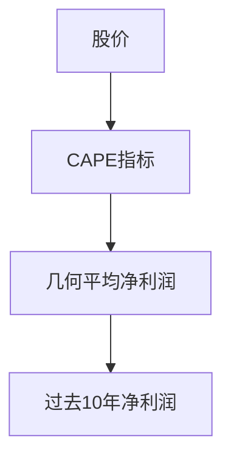
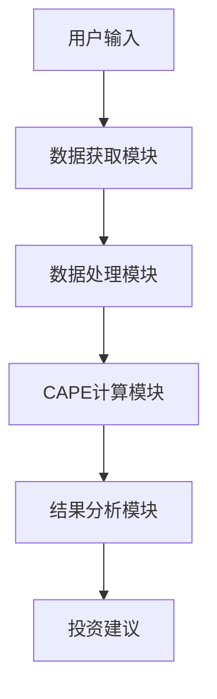
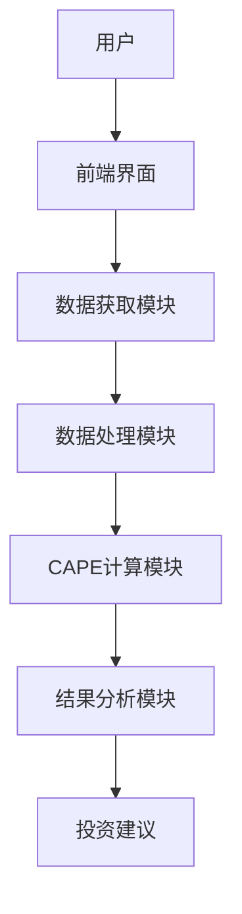
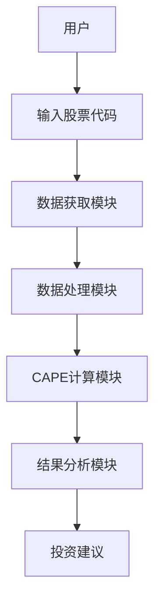

                 


# 罗伯特·希勒的周期性调整市盈率(CAPE)指标

## 关键词：周期性调整市盈率, CAPE, 罗伯特·希勒, 投资估值, 经济周期

## 摘要：本文深入探讨了由罗伯特·希勒提出的周期性调整市盈率（CAPE）指标，分析了其在投资决策中的重要性。文章从CAPE的背景、定义、计算方法、与其他估值指标的对比、数学模型、算法实现、系统架构设计、项目实战以及最佳实践等多个方面进行详细阐述，帮助读者全面理解并掌握CAPE指标的应用方法。

---

## 第1章: 罗伯特·希勒的周期性调整市盈率(CAPE)概述

### 1.1 传统市盈率的局限性
#### 1.1.1 市盈率的基本概念
市盈率（Price-to-Earnings Ratio，简称P/E）是衡量股票估值的重要指标，计算公式为：
$$P/E = \frac{\text{股价}}{\text{每股净利润}}$$  
市盈率反映了市场对每股收益的支付水平，但其局限性在于无法充分考虑经济周期波动对股价的影响。

#### 1.1.2 传统市盈率的缺陷
- 市盈率受短期经济波动影响较大，无法反映长期趋势。
- 在经济繁荣时期，市盈率可能被高估；在经济衰退时期，市盈率可能被低估。
- 传统市盈率未充分考虑企业盈利的周期性变化，可能导致估值偏差。

#### 1.1.3 经济周期波动对市盈率的影响
经济周期的波动会导致企业盈利和股价的波动，从而影响市盈率的准确性。在经济繁荣时期，企业盈利增长可能推动股价上涨，但市盈率未必能准确反映真实的估值。

### 1.2 罗伯特·希勒与CAPE的提出
#### 1.2.1 罗伯特·希勒的学术背景
罗伯特·希勒是美国耶鲁大学的经济学家，以其对市场波动性和估值的研究闻名。他提出的CAPE指标旨在克服传统市盈率的局限性。

#### 1.2.2 CAPE指标的提出动机
希勒认为，传统市盈率未能充分考虑经济周期对企业盈利的影响，尤其是在经济衰退期间，企业盈利可能大幅下降，导致市盈率失真。因此，他提出CAPE指标，通过调整企业盈利的周期性波动，提供更准确的估值指标。

#### 1.2.3 CAPE与传统市盈率的区别
CAPE与传统市盈率的主要区别在于其对盈利周期性波动的调整。传统市盈率仅考虑当前盈利，而CAPE使用过去10年的平均盈利数据，以消除短期波动的影响。

### 1.3 CAPE指标的核心理念
#### 1.3.1 周期性调整的基本概念
周期性调整是指通过对企业盈利的长期平均值进行调整，以消除短期经济波动的影响。CAPE指标通过使用过去10年的平均盈利数据，反映了企业盈利的长期趋势。

#### 1.3.2 市盈率与经济周期的关系
市盈率与经济周期密切相关。在经济繁荣时期，市盈率可能偏高；在经济衰退时期，市盈率可能偏低。通过周期性调整，可以更准确地反映企业的长期估值。

#### 1.3.3 CAPE指标的定义与公式
CAPE（周期性调整市盈率）的公式为：
$$CAPE = \frac{\text{当前股价}}{\text{过去10年平均净利润}}$$  
其中，过去10年平均净利润是指过去10年中每年净利润的几何平均值。

### 1.4 CAPE指标的经济意义
#### 1.4.1 CAPE在股市估值中的作用
CAPE指标通过调整企业盈利的周期性波动，提供了更为准确的股市估值指标。它可以帮助投资者更好地识别市场泡沫和低估。

#### 1.4.2 CAPE与市场泡沫的关系
在市场泡沫期间，股价可能远高于企业实际盈利水平，导致CAPE指标偏高。通过分析CAPE指标的变化趋势，可以帮助投资者识别市场泡沫。

#### 1.4.3 CAPE在投资决策中的应用
投资者可以通过分析CAPE指标的变化趋势，判断市场的长期估值水平，并据此进行投资决策。例如，当CAPE指标远高于历史平均水平时，可能意味着市场被高估，投资者应谨慎投资。

### 1.5 本章小结
本章介绍了传统市盈率的局限性，提出了CAPE指标的概念和定义，并分析了其在经济周期和投资决策中的作用。CAPE指标通过周期性调整，提供了更为准确的股市估值指标，帮助投资者更好地进行投资决策。

---

## 第2章: CAPE指标的核心概念与数学模型

### 2.1 CAPE指标的公式推导
#### 2.1.1 市盈率的基本公式
市盈率的计算公式为：
$$P/E = \frac{\text{股价}}{\text{每股净利润}}$$  
其中，每股净利润是企业过去一年的净利润。

#### 2.1.2 周期性调整的数学模型
周期性调整的核心思想是通过对企业盈利的长期平均值进行调整，消除短期波动的影响。数学上，周期性调整的净利润可以表示为过去10年的平均净利润的几何平均值：
$$\text{几何平均净利润} = \left(\prod_{i=1}^{10} \text{净利润}_i\right)^{1/10}$$  

#### 2.1.3 CAPE指标的最终公式
将几何平均净利润代入市盈率的公式，得到CAPE指标的计算公式：
$$CAPE = \frac{\text{股价}}{\text{几何平均净利润}}$$  

### 2.2 CAPE指标的属性特征对比
#### 2.2.1 CAPE与传统市盈率的对比分析
| 特性                | 传统市盈率                 | CAPE指标                   |
|---------------------|--------------------------|--------------------------|
| 计算基础            | 当前年净利润               | 过去10年平均净利润         |
| 时间跨度            | 1年                       | 10年                      |
| 对周期性波动的处理 | 未调整                   | 已调整                   |
| 优点                | 计算简单                 | 更能反映长期趋势         |
| 缺点                | 易受短期波动影响           | 计算复杂                 |

#### 2.2.2 CAPE与其他估值指标的对比
除了传统市盈率，CAPE还与其他估值指标如市净率（P/B）、股息率（Dividend Yield）等进行对比。CAPE的优势在于其对周期性波动的调整，使其更能反映企业的长期估值。

#### 2.2.3 CAPE指标的优缺点分析
- **优点**：通过周期性调整，CAPE指标能够更准确地反映企业的长期估值，减少短期波动的影响。
- **缺点**：计算复杂，且需要较长的历史数据支持。

### 2.3 CAPE指标的ER实体关系图


### 2.4 CAPE指标的数学模型
CAPE指标的数学模型为：
$$CAPE = \frac{\text{股价}}{\left(\prod_{i=1}^{10} \text{净利润}_i\right)^{1/10}}$$  
其中，$\text{净利润}_i$表示企业第i年的净利润。

### 2.5 本章小结
本章详细推导了CAPE指标的公式，分析了其与传统市盈率及其他估值指标的对比，并通过ER实体关系图展示了CAPE指标的核心概念。数学模型的建立为后续的算法实现奠定了基础。

---

## 第3章: CAPE指标的算法原理与实现

### 3.1 CAPE指标的算法流程
#### 3.1.1 数据获取
首先需要获取企业的历史股价和净利润数据。数据可以通过金融数据供应商或API获取。

#### 3.1.2 数据处理
将获取的历史数据进行清洗和处理，计算过去10年的平均净利润。

#### 3.1.3 CAPE计算
使用公式计算CAPE指标。

#### 3.1.4 结果分析
将计算出的CAPE指标与历史平均水平进行对比，分析市场估值水平。

### 3.2 CAPE指标的Python实现
#### 3.2.1 数据获取与处理
```python
import pandas as pd
import yfinance as yf

# 获取苹果公司过去10年的股价和净利润数据
data = yf.Ticker('AAPL').history(period='10y')
data = data[['Close', 'adj_close']]  # 获取收盘价和调整后收盘价
data.columns = ['股价', '调整后股价']
```

#### 3.2.2 几何平均净利润计算
```python
def calculate_cape(ticker):
    # 获取过去10年的净利润数据
    data = yf.Ticker(ticker).financials
    net_income = data.loc['net income', :].values
    # 计算几何平均净利润
    geometric_mean = (net_income.prod()) ** (1/len(net_income))
    return geometric_mean

# 计算苹果公司的几何平均净利润
geometric_mean_aapl = calculate_cape('AAPL')
print(f"苹果公司几何平均净利润为：{geometric_mean_aapl}")
```

#### 3.2.3 CAPE指标计算
```python
def calculate_cape(ticker):
    # 获取股价数据
    data = yf.Ticker(ticker).history(period='10y')
    current_price = data.iloc[-1]['Close']
    # 获取过去10年的净利润数据
    financials = yf.Ticker(ticker).financials
    net_income = financials.loc['net income', :].values
    # 计算几何平均净利润
    geometric_mean = (net_income.prod()) ** (1/len(net_income))
    # 计算CAPE
    cape = current_price / geometric_mean
    return cape

# 计算苹果公司的CAPE
cape_aapl = calculate_cape('AAPL')
print(f"苹果公司当前的CAPE为：{cape_aapl}")
```

#### 3.2.4 结果分析
通过上述代码，我们可以计算出苹果公司的CAPE指标，并将其与历史平均水平进行对比，分析市场估值水平。

### 3.3 CAPE指标的数学模型
$$CAPE = \frac{\text{股价}}{\left(\prod_{i=1}^{10} \text{净利润}_i\right)^{1/10}}$$  
其中，$\text{股价}$表示当前股价，$\text{净利润}_i$表示企业第i年的净利润。

### 3.4 本章小结
本章详细介绍了CAPE指标的算法流程，并通过Python代码实现了数据获取、处理和计算。数学模型的建立为后续的系统架构设计奠定了基础。

---

## 第4章: 系统分析与架构设计

### 4.1 问题场景介绍
为了更好地应用CAPE指标，我们设计了一个基于CAPE的股票估值系统。该系统将帮助投资者快速计算股票的CAPE指标，并进行投资决策。

### 4.2 系统功能设计
#### 4.2.1 系统功能模块
- 数据获取模块：获取股票的历史股价和净利润数据。
- 数据处理模块：清洗和整理数据，计算过去10年的几何平均净利润。
- CAPE计算模块：计算股票的CAPE指标。
- 结果分析模块：将计算出的CAPE指标与历史平均水平进行对比，生成投资建议。

#### 4.2.2 系统功能流程图


### 4.3 系统架构设计
#### 4.3.1 系统架构图


#### 4.3.2 系统接口设计
- 用户输入：股票代码
- 数据获取接口：API调用
- 数据处理接口：数据清洗和整理
- CAPE计算接口：几何平均净利润计算
- 结果分析接口：CAPE指标与历史平均水平对比

#### 4.3.3 系统交互流程图


### 4.4 本章小结
本章设计了一个基于CAPE的股票估值系统，包括系统功能模块、架构设计和接口设计。系统将帮助投资者快速计算股票的CAPE指标，并根据结果进行投资决策。

---

## 第5章: 项目实战——基于Python的CAPE指标实现

### 5.1 项目背景与目标
本项目旨在通过Python实现CAPE指标的计算，并分析其在股票估值中的应用。

### 5.2 环境安装与配置
#### 5.2.1 安装必要的库
- 安装`pandas`和`yfinance`库：
  ```bash
  pip install pandas yfinance
  ```

#### 5.2.2 配置数据源
使用`yfinance`库获取股票数据。

### 5.3 系统核心实现
#### 5.3.1 数据获取与处理
```python
import pandas as pd
import yfinance as yf

# 获取苹果公司过去10年的股价和净利润数据
data = yf.Ticker('AAPL').history(period='10y')
data = data[['Close', 'adj_close']]  # 获取收盘价和调整后收盘价
data.columns = ['股价', '调整后股价']
```

#### 5.3.2 几何平均净利润计算
```python
def calculate_cape(ticker):
    # 获取过去10年的净利润数据
    financials = yf.Ticker(ticker).financials
    net_income = financials.loc['net income', :].values
    # 计算几何平均净利润
    geometric_mean = (net_income.prod()) ** (1/len(net_income))
    return geometric_mean

# 计算苹果公司的几何平均净利润
geometric_mean_aapl = calculate_cape('AAPL')
print(f"苹果公司几何平均净利润为：{geometric_mean_aapl}")
```

#### 5.3.3 CAPE指标计算
```python
def calculate_cape(ticker):
    # 获取股价数据
    data = yf.Ticker(ticker).history(period='10y')
    current_price = data.iloc[-1]['Close']
    # 获取过去10年的净利润数据
    financials = yf.Ticker(ticker).financials
    net_income = financials.loc['net income', :].values
    # 计算几何平均净利润
    geometric_mean = (net_income.prod()) ** (1/len(net_income))
    # 计算CAPE
    cape = current_price / geometric_mean
    return cape

# 计算苹果公司的CAPE
cape_aapl = calculate_cape('AAPL')
print(f"苹果公司当前的CAPE为：{cape_aapl}")
```

#### 5.3.4 结果分析
将计算出的CAPE指标与历史平均水平进行对比，分析市场估值水平。

### 5.4 项目小结
本章通过Python代码实现了CAPE指标的计算，并通过实际案例展示了其在股票估值中的应用。项目代码可以作为投资者的工具，帮助其进行投资决策。

---

## 第6章: 最佳实践与注意事项

### 6.1 使用CAPE指标的注意事项
- **数据来源**：确保数据的准确性和完整性。
- **时间周期**：CAPE指标基于过去10年的数据，需确保数据的时间范围足够长。
- **市场环境**：考虑经济周期对市场估值的影响。

### 6.2 CAPE指标的最佳实践
- **结合其他指标**：将CAPE与其他估值指标结合使用，以提高判断的准确性。
- **长期视角**：CAPE指标更适合长期投资决策，需避免短期波动的干扰。

### 6.3 未来研究方向
- **多因子模型**：将CAPE与其他因子结合，构建更复杂的估值模型。
- **动态调整**：根据市场变化动态调整CAPE指标的计算方法。

### 6.4 本章小结
本章总结了使用CAPE指标时的注意事项，提出了最佳实践建议，并展望了未来的研究方向。

---

## 作者：AI天才研究院/AI Genius Institute & 禅与计算机程序设计艺术/Zen And The Art of Computer Programming

---

通过以上内容，读者可以全面了解罗伯特·希勒的周期性调整市盈率（CAPE）指标的背景、定义、计算方法、应用案例以及系统实现。结合理论与实践，本文为投资者提供了有效的工具和方法，帮助其更好地进行投资决策。

