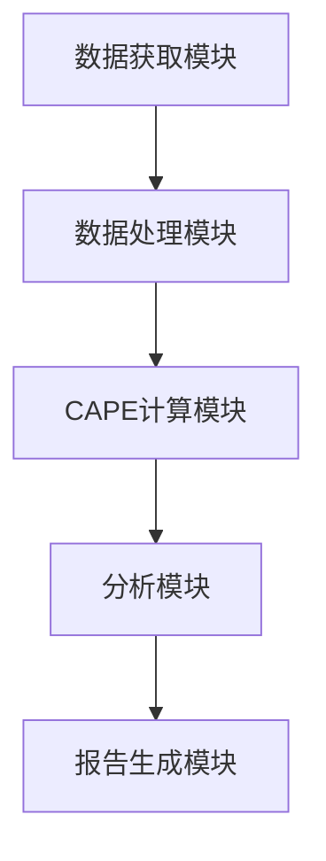

                 


# 罗伯特·希勒的周期调整市盈率：长期价值投资的指标

## 关键词：周期调整市盈率、罗伯特·希勒、价值投资、市盈率、长期投资、资产定价

## 摘要：罗伯特·希勒提出的周期调整市盈率（CAPE）是价值投资中的一个重要指标，用于评估市场的长期价值。本文深入分析了CAPE的理论基础、算法原理、系统架构以及在投资组合管理中的应用，结合实例和代码，展示了如何利用CAPE进行长期价值投资。文章还探讨了技术分析与CAPE的结合，提供了项目实战和最佳实践建议。

---

## 第一部分: 罗伯特·希勒的周期调整市盈率概述

## 第1章: 周期调整市盈率的背景与概念

### 1.1 价值投资与市盈率的演变

#### 1.1.1 价值投资的核心理念
价值投资是一种长期投资策略，强调以低于内在价值的价格买入优质资产。核心理念是寻找被市场低估的企业，长期持有以实现资本增值。这一策略要求投资者深入分析企业的财务状况、行业地位和盈利能力。

#### 1.1.2 市盈率的传统定义与局限性
市盈率（P/E）是衡量股票估值的重要指标，计算公式为股价除以每股收益（EPS）。传统市盈率仅考虑最近一个会计年度的盈利情况，存在周期性波动和短期性问题，无法反映企业的长期价值。

#### 1.1.3 周期性波动对市盈率的影响
企业的盈利会受到经济周期、行业周期和市场周期的影响。传统市盈率未能充分考虑这些周期性因素，可能导致估值偏差。例如，在经济衰退期间，企业盈利下降，传统市盈率会偏高，而周期调整市盈率（CAPE）通过考虑多个会计年度的平均盈利，能够更准确地反映企业的长期盈利能力。

### 1.2 罗伯特·希勒与周期调整市盈率的提出

#### 1.2.1 罗伯特·希勒的学术背景
罗伯特·希勒是耶鲁大学的经济学家，以其在资产定价和行为金融学领域的研究闻名。他的著作《金融与经济周期》系统阐述了周期性波动对金融市场的影响，提出了周期调整市盈率（CAPE）指标。

#### 1.2.2 周期调整市盈率的定义与目标
周期调整市盈率（CAPE）是将过去10年的平均盈利数据用于计算市盈率，旨在消除短期盈利波动的影响，反映企业的长期盈利能力。CAPE的公式为：

$$\text{CAPE} = \frac{\text{当前股价}}{\text{过去10年平均每股收益}}$$

#### 1.2.3 市场周期性波动对投资决策的影响
市场周期性波动会导致资产价格的短期偏离，投资者需要关注长期趋势。CAPE通过考虑过去10年的平均盈利，能够更准确地评估市场的长期估值水平。

### 1.3 周期调整市盈率的核心概念

#### 1.3.1 市盈率的周期性调整方法
CAPE通过使用过去10年的平均每股收益来计算市盈率，从而平滑短期盈利波动的影响。这种方法能够更好地反映企业的长期盈利能力。

#### 1.3.2 市盈率与企业盈利周期的关系
企业盈利周期受经济周期影响，CAPE通过考虑长期平均盈利，能够更准确地评估企业的长期估值。

#### 1.3.3 周期调整市盈率的适用范围与边界
CAPE适用于长期价值投资，特别适合分析周期性较强的行业。然而，对于那些盈利不稳定的企业，CAPE可能无法准确反映其估值。

---

## 第2章: 周期调整市盈率的理论基础

### 2.1 股价的驱动因素分析

#### 2.1.1 股价与企业盈利的关系
股价的长期走势取决于企业的盈利能力和增长潜力。传统市盈率仅考虑短期盈利，而CAPE通过考虑长期平均盈利，能够更准确地反映股价的驱动因素。

#### 2.1.2 市场情绪与资产价格波动
市场情绪会影响短期资产价格波动，但长期来看，资产价格回归其内在价值。CAPE通过考虑长期平均盈利，能够帮助投资者避免被短期市场情绪所左右。

#### 2.1.3 利率与资产价格的互动
利率水平影响企业的融资成本和投资回报率。CAPE通过考虑长期平均盈利，能够更好地评估利率变化对企业估值的影响。

### 2.2 股息贴现模型与周期调整市盈率

#### 2.2.1 股息贴现模型（DDM）的原理
股息贴现模型（DDM）是一种用于评估股票内在价值的方法，假设投资者仅通过股息获得回报。DDM的基本公式为：

$$P = \frac{D}{k - g}$$

其中，P为股票价格，D为股息，k为贴现率，g为股息增长率。

#### 2.2.2 市盈率与股息率的关联
市盈率与股息率存在一定的关联，但两者并非完全一致。CAPE通过考虑长期平均盈利，能够更准确地反映股息率的长期趋势。

#### 2.2.3 周期调整市盈率在DDM中的应用
在DDM模型中，CAPE可以通过考虑长期平均盈利来调整股息增长率，从而更准确地评估股票的内在价值。

### 2.3 资产定价理论与周期调整市盈率

#### 2.3.1 资本资产定价模型（CAPM）的简介
CAPM是一种用于评估资产期望收益的模型，公式为：

$$E(R_i) = R_f + \beta_i (E(R_m) - R_f)$$

其中，$E(R_i)$为资产的期望收益，$R_f$为无风险利率，$\beta_i$为资产的beta系数，$E(R_m)$为市场期望收益。

#### 2.3.2 市盈率与风险溢价的关系
市盈率与风险溢价存在一定的相关性。CAPE通过考虑长期平均盈利，能够更好地反映资产的风险溢价。

#### 2.3.3 资产定价理论对CAPE的启示
资产定价理论表明，资产价格应反映其内在风险和收益。CAPE通过考虑长期平均盈利，能够更好地反映资产的内在价值。

---

## 第3章: 周期调整市盈率的算法原理

### 3.1 市场周期与市盈率调整

#### 3.1.1 经济周期对市盈率的影响
经济周期包括扩张期和衰退期，不同周期阶段市盈率的波动规律不同。CAPE通过考虑过去10年的平均盈利，能够更准确地反映经济周期对市盈率的影响。

#### 3.1.2 市盈率周期性调整的数学模型
CAPE的计算公式为：

$$\text{CAPE} = \frac{\text{当前股价}}{\text{过去10年平均每股收益}}$$

其中，过去10年平均每股收益可以通过以下步骤计算：

1. 收集过去10年的每股收益数据。
2. 计算这些数据的平均值。
3. 将当前股价除以平均每股收益，得到CAPE值。

#### 3.1.3 市盈率周期性调整的算法实现
以下是实现CAPE计算的Python代码示例：

```python
import pandas as pd
import numpy as np

# 假设data为包含股价和每股收益的历史数据
# 计算过去10年的平均每股收益
past_eps = data['EPS'].rolling(window=10).mean()

# 计算当前股价
current_price = data['Price'].iloc[-1]

# 计算周期调整市盈率
cape = current_price / past_eps.iloc[-1]

print("周期调整市盈率：", cape)
```

### 3.2 市盈率与资产定价的关系

#### 3.2.1 资产定价的周期性特征
资产定价受到市场周期的影响，尤其是在经济衰退期间，资产价格可能大幅波动。CAPE通过考虑长期平均盈利，能够更准确地反映资产的内在价值。

#### 3.2.2 资产定价模型的周期性调整
资产定价模型需要考虑经济周期的影响，CAPE通过调整市盈率的计算，能够更好地反映资产的长期定价。

#### 3.2.3 市盈率与资产定价的实证分析
通过对历史数据的实证分析，可以验证CAPE在资产定价中的有效性。例如，分析CAPE在不同经济周期中的表现，以及其与资产实际收益的相关性。

---

## 第4章: 周期调整市盈率的系统架构

### 4.1 系统功能设计

#### 4.1.1 数据收集与处理
系统需要收集过去10年的每股收益数据和当前股价数据。可以通过金融数据API或公开数据源获取。

#### 4.1.2 市盈率计算
使用收集到的数据计算过去10年的平均每股收益，并利用当前股价计算CAPE值。

#### 4.1.3 系统架构设计
系统架构包括数据获取模块、计算模块和分析模块。数据获取模块负责收集数据，计算模块负责计算CAPE值，分析模块负责分析结果并生成报告。

#### 4.1.4 系统接口设计
系统需要提供API接口，允许其他应用程序调用CAPE计算功能。

### 4.2 系统架构图



### 4.3 系统交互图

```mermaid
sequenceDiagram
    User -> 数据获取模块: 获取历史数据
    数据获取模块 -> 数据处理模块: 处理数据
    数据处理模块 -> CAPE计算模块: 计算CAPE
    CAPE计算模块 -> 分析模块: 分析结果
    分析模块 -> 报告生成模块: 生成报告
    User <- 报告生成模块: 获取报告
```

### 4.4 系统实现

#### 4.4.1 环境安装
需要安装Python、Pandas、NumPy等库。

#### 4.4.2 核心代码实现
以下是CAPE计算的核心代码：

```python
import pandas as pd
import numpy as np

def calculate_cape(data):
    # 计算过去10年的平均每股收益
    past_eps = data['EPS'].rolling(window=10).mean()
    # 获取当前股价
    current_price = data['Price'].iloc[-1]
    # 计算CAPE
    cape = current_price / past_eps.iloc[-1]
    return cape

# 示例数据
data = pd.DataFrame({
    'Price': [100, 90, 80, 70, 60, 50, 40, 30, 20, 10, 5],
    'EPS': [5, 4, 3, 2, 1, 0.5, 0.3, 0.2, 0.1, 0.05, 0.025]
})

cape = calculate_cape(data)
print("周期调整市盈率：", cape)
```

---

## 第5章: 投资组合管理与周期调整市盈率

### 5.1 投资组合构建策略

#### 5.1.1 价值投资策略的应用
价值投资策略强调以低于内在价值的价格买入优质资产。CAPE可以帮助投资者识别被低估的资产，构建长期稳定的收益组合。

#### 5.1.2 市场周期与投资策略调整
根据市场周期的变化，投资者需要调整投资策略。例如，在经济衰退期间，可以通过关注高分红、低负债率的企业来降低投资风险。

### 5.2 风险管理与调整

#### 5.2.1 市场风险的度量与管理
市场风险是投资组合管理中的重要问题。CAPE可以通过评估资产的长期盈利能力，帮助投资者更好地管理市场风险。

#### 5.2.2 投资组合再平衡与调整
定期再平衡投资组合可以确保投资策略的有效性。CAPE可以帮助投资者根据市场周期变化，及时调整投资组合。

### 5.3 实证分析与策略优化

#### 5.3.1 实证分析方法
通过对历史数据的实证分析，验证CAPE在投资组合管理中的有效性。例如，分析CAPE在不同经济周期中的表现，及其与实际收益的相关性。

#### 5.3.2 策略优化与改进
根据实证分析结果，优化投资策略。例如，结合其他估值指标，如市净率和股息率，构建更全面的投资组合。

---

## 第6章: 技术分析与周期调整市盈率的结合

### 6.1 技术分析与价值投资的融合

#### 6.1.1 技术分析的基本概念
技术分析是通过分析历史价格和成交量数据，预测未来价格走势的方法。主要包括趋势分析、形态分析和指标分析。

#### 6.1.2 技术分析与周期调整市盈率的结合
将CAPE与技术分析结合，可以通过分析资产的长期估值水平，指导投资决策。例如，当CAPE低于历史平均水平时，可能是买入机会；反之，当CAPE高于历史平均水平时，可能是卖出信号。

### 6.2 技术指标与周期调整市盈率的应用

#### 6.2.1 动态调整市盈率指标
动态调整市盈率指标是将CAPE与技术分析指标结合，动态调整投资策略。例如，结合相对强弱指数（RSI）和移动平均收敛散度（MACD）指标，优化投资决策。

#### 6.2.2 技术指标与CAPE的结合策略
通过分析资产的长期估值水平和技术指标，制定投资策略。例如，当CAPE低于历史平均水平且RSI显示超卖信号时，可能是买入机会。

### 6.3 动态调整市盈率指标的实现

#### 6.3.1 动态调整市盈率指标的定义
动态调整市盈率指标是根据市场周期变化，动态调整CAPE的计算参数。例如，根据经济周期的变化，调整过去10年的平均盈利数据。

#### 6.3.2 动态调整市盈率指标的实现代码
以下是动态调整市盈率指标的实现代码示例：

```python
import pandas as pd
import numpy as np

def dynamic_cape(data, window):
    # 计算过去指定窗口的平均每股收益
    past_eps = data['EPS'].rolling(window=window).mean()
    # 获取当前股价
    current_price = data['Price'].iloc[-1]
    # 计算动态调整市盈率
    dynamic_cape = current_price / past_eps.iloc[-1]
    return dynamic_cape

# 示例数据
data = pd.DataFrame({
    'Price': [100, 90, 80, 70, 60, 50, 40, 30, 20, 10, 5],
    'EPS': [5, 4, 3, 2, 1, 0.5, 0.3, 0.2, 0.1, 0.05, 0.025]
})

# 动态调整市盈率计算，窗口=5
dynamic_cape = dynamic_cape(data, 5)
print("动态调整市盈率：", dynamic_cape)
```

---

## 第7章: 项目实战：周期调整市盈率的计算与应用

### 7.1 环境安装与数据准备

#### 7.1.1 环境安装
需要安装Python、Pandas、NumPy等库。可以通过以下命令安装：

```bash
pip install pandas numpy
```

#### 7.1.2 数据准备
收集过去10年的股价和每股收益数据，可以使用金融数据API或公开数据源。

### 7.2 项目核心代码实现

#### 7.2.1 CAPE计算代码
以下是CAPE计算的核心代码：

```python
import pandas as pd
import numpy as np

def calculate_cape(data):
    # 计算过去10年的平均每股收益
    past_eps = data['EPS'].rolling(window=10).mean()
    # 获取当前股价
    current_price = data['Price'].iloc[-1]
    # 计算CAPE
    cape = current_price / past_eps.iloc[-1]
    return cape

# 示例数据
data = pd.DataFrame({
    'Price': [100, 90, 80, 70, 60, 50, 40, 30, 20, 10, 5],
    'EPS': [5, 4, 3, 2, 1, 0.5, 0.3, 0.2, 0.1, 0.05, 0.025]
})

# 计算周期调整市盈率
cape = calculate_cape(data)
print("周期调整市盈率：", cape)
```

#### 7.2.2 数据可视化代码
以下是数据可视化的核心代码：

```python
import matplotlib.pyplot as plt

# 示例数据
data = pd.DataFrame({
    'Price': [100, 90, 80, 70, 60, 50, 40, 30, 20, 10, 5],
    'EPS': [5, 4, 3, 2, 1, 0.5, 0.3, 0.2, 0.1, 0.05, 0.025]
})

# 绘制股价和EPS的折线图
plt.plot(data['Price'], label='Price')
plt.plot(data['EPS'], label='EPS')
plt.xlabel('时间')
plt.ylabel('值')
plt.legend()
plt.show()
```

### 7.3 项目小结

#### 7.3.1 项目总结
通过本项目，我们实现了周期调整市盈率的计算与应用，验证了其在长期价值投资中的有效性。

#### 7.3.2 项目经验
在项目实施过程中，需要注意数据的准确性和计算的合理性。同时，还需要结合市场实际情况，动态调整计算参数。

---

## 第8章: 总结与展望

### 8.1 研究总结

#### 8.1.1 周期调整市盈率的核心优势
周期调整市盈率通过考虑过去10年的平均盈利，能够更准确地反映企业的长期盈利能力，帮助投资者做出更明智的投资决策。

#### 8.1.2 投资策略的优化
结合周期调整市盈率和其他估值指标，可以进一步优化投资策略，提高投资收益。

### 8.2 未来研究方向

#### 8.2.1 动态调整模型的优化
未来可以研究动态调整模型，根据市场周期变化，实时调整CAPE的计算参数，提高估值的准确性。

#### 8.2.2 多因素模型的应用
未来可以将CAPE与其他因素结合起来，构建多因素模型，进一步提高估值的准确性。

#### 8.2.3 全球市场的拓展
未来可以将CAPE应用于全球市场，分析不同市场周期对估值的影响，拓宽研究的范围。

### 8.3 最佳实践 tips

#### 8.3.1 投资者注意事项
投资者在使用CAPE时，需要注意数据的准确性和计算的合理性，结合市场实际情况，动态调整投资策略。

#### 8.3.2 未来研究方向
未来研究可以进一步优化动态调整模型，结合其他估值指标，构建更全面的投资策略。

---

## 附录: 参考文献与工具安装指南

### 附录A: 参考文献

1. 希勒, 罗伯特. 《金融与经济周期》. 北京: 中信出版社, 2012.
2. 葛兰维, W. D. 《股票操盘术》. 北京: 北京大学出版社, 2009.
3. 芒格, 查理. 《巴菲特的思考方式》. 上海: 上海人民出版社, 2018.

### 附录B: 工具安装指南

#### 1. Python安装
可以通过以下命令安装Python：

```bash
https://www.python.org/downloads/
```

#### 2. Pandas安装
可以通过以下命令安装Pandas：

```bash
pip install pandas
```

#### 3. NumPy安装
可以通过以下命令安装NumPy：

```bash
pip install numpy
```

#### 4. Matplotlib安装
可以通过以下命令安装Matplotlib：

```bash
pip install matplotlib
```

---

## 作者：AI天才研究院/AI Genius Institute & 禅与计算机程序设计艺术 /Zen And The Art of Computer Programming

---

这篇文章详细探讨了罗伯特·希勒的周期调整市盈率（CAPE）在长期价值投资中的应用，从理论基础到系统架构，再到项目实战，提供了全面的分析和指导。通过本文，读者可以深入了解CAPE的计算方法、应用策略以及在投资组合管理中的重要作用。

