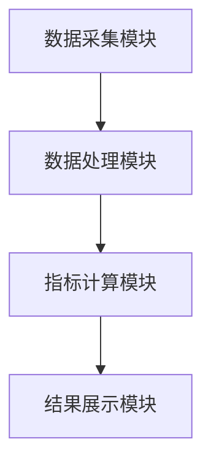

                 


# 罗伯特·希勒的泡沫识别与投资策略

> 关键词：罗伯特·希勒，泡沫识别，投资策略，PE/P指标，金融市场分析

> 摘要：本文深入探讨了罗伯特·希勒在泡沫识别方面的理论贡献，重点分析了PE/P指标的计算方法及其在投资策略中的应用。通过系统化的分析和实际案例，展示了如何利用PE/P指标识别市场泡沫并制定相应的投资策略。

---

## 第1章: 泡沫识别的背景与核心概念

### 1.1 泡沫识别的背景与问题背景

金融市场中的泡沫现象是投资者和经济学家长期关注的问题。泡沫的形成和破裂往往对市场产生重大影响，投资者需要识别泡沫以做出明智的投资决策。罗伯特·希勒在《非理性繁荣》中提出了PE/P指标，为泡沫识别提供了理论基础。

### 1.2 泡沫识别的核心概念与定义

泡沫是指资产价格远高于其内在价值的现象。希勒的PE/P指标通过比较股票价格与每股盈余（EPS）的比率，帮助识别市场是否被高估。与其他估值方法不同，PE/P指标考虑了市场情绪和预期因素，能够更准确地捕捉泡沫特征。

---

## 第2章: 罗伯特·希勒的泡沫识别方法

### 2.1 罗伯特·希勒的PE/P指标

PE/P指标定义为股票价格与每股盈余的比率。计算公式为：

$$ PE/P = \frac{Price}{Earnings\ per\ share} $$

该指标用于衡量市场是否被高估。当PE/P指标显著高于历史平均水平时，可能表明市场存在泡沫。

### 2.2 PE/P指标与传统估值方法的对比

传统估值方法如市盈率（P/E）和市净率（P/B）仅考虑当前财务数据，而PE/P指标引入了预期收益，能够更好地反映市场情绪。通过对比分析，可以发现PE/P指标在识别泡沫方面的独特优势。

---

## 第3章: 泡沫识别的算法原理

### 3.1 PE/P指标的计算流程

1. 数据采集：收集目标公司的股票价格和每股盈余数据。
2. 数据处理：计算每股盈余，考虑通货膨胀和市场环境因素。
3. 指标计算：使用公式计算PE/P指标。
4. 结果展示：将指标结果可视化，便于分析。

### 3.2 PE/P指标的数学模型

PE/P指标的数学模型如下：

$$ PE/P = \frac{P}{EPS} $$

其中，P为股票价格，EPS为每股盈余。通过比较PE/P指标的历史数据，可以识别市场泡沫。

---

## 第4章: 系统分析与架构设计

### 4.1 系统分析

系统目标是利用PE/P指标识别市场泡沫，帮助投资者制定投资策略。系统功能需求包括数据采集、指标计算和结果展示。模块划分包括数据采集模块、数据处理模块和指标计算模块。

### 4.2 系统架构设计

系统架构图如下：



---

## 第5章: 项目实战

### 5.1 环境安装与配置

安装Python和相关库（如pandas、numpy、matplotlib），配置数据源。

### 5.2 代码实现

```python
import pandas as pd
import numpy as np
import matplotlib.pyplot as plt

# 数据采集
data = pd.read_csv('stock_data.csv')

# 数据处理
data['EPS'] = data['Earnings'] / data['Shares']

# 指标计算
data['PE/P'] = data['Price'] / data['EPS']

# 结果展示
plt.plot(data['Date'], data['PE/P'])
plt.xlabel('日期')
plt.ylabel('PE/P 指标')
plt.title('PE/P 指标变化趋势')
plt.show()
```

### 5.3 案例分析

以某科技股为例，计算其PE/P指标并分析市场趋势。通过历史数据对比，识别潜在泡沫。

---

## 第6章: 最佳实践与小结

### 6.1 最佳实践

1. 定期更新数据，保持模型准确性。
2. 结合其他指标进行综合分析。
3. 风险控制，避免过度依赖单一指标。

### 6.2 小结

罗伯特·希勒的PE/P指标为泡沫识别提供了有效工具。投资者应结合市场环境和其他指标，制定合理的投资策略。

---

作者：AI天才研究院 & 禅与计算机程序设计艺术

