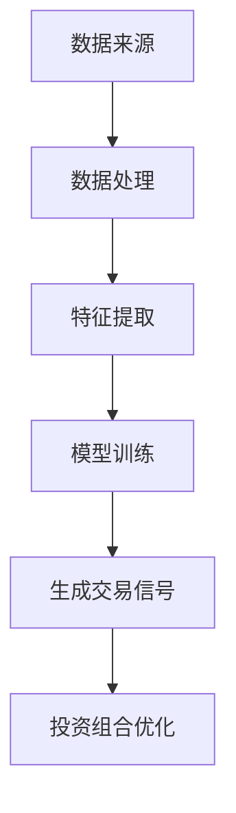
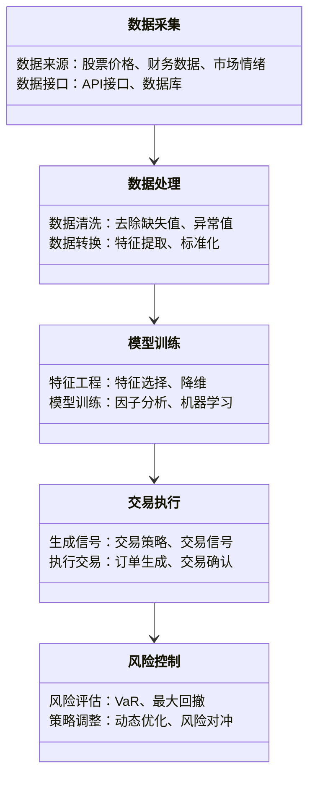
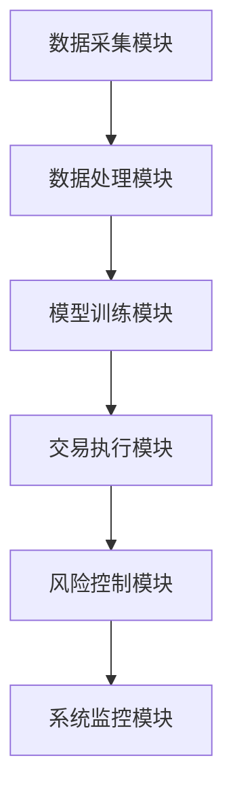
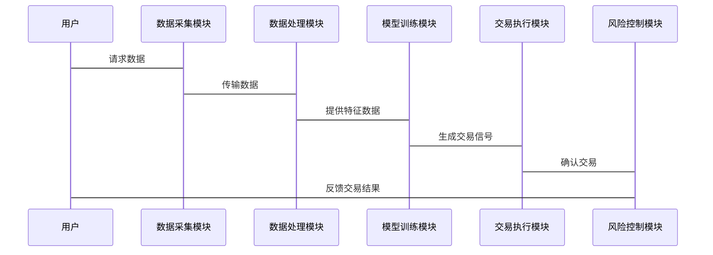

                 


# 罗伯特·阿诺特的系统化价值投资：算法与人工智能的应用

## 关键词：系统化价值投资，算法，人工智能，投资策略，数据分析，机器学习

## 摘要：  
本文深入探讨了系统化价值投资在现代金融中的应用，结合算法和人工智能技术，分析了其核心概念、算法原理、系统架构及实际案例。文章从背景介绍入手，详细讲解了系统化价值投资的核心要素，包括数据驱动的决策、算法模型的设计和风险控制的实现。随后，文章分析了基于因子分析、机器学习和时间序列分析的算法原理，展示了如何利用人工智能技术优化投资策略。最后，通过项目实战和系统架构设计，详细阐述了系统化价值投资的实际应用及其优势，为读者提供了全面而深入的技术指导。

---

# 第一部分: 系统化价值投资的背景与基础

## 第1章: 价值投资的系统化概述

### 1.1 价值投资的基本概念  
#### 1.1.1 价值投资的定义与核心理念  
价值投资是一种以基本面分析为基础的投资策略，强调以低于内在价值的价格购买优质资产。其核心理念是通过研究企业的财务状况、行业地位和竞争优势，寻找被市场低估的投资机会。  

#### 1.1.2 传统价值投资的局限性  
传统价值投资依赖于人工分析，存在主观性较强、效率低下、难以应对海量数据等问题。此外，市场波动和情绪化可能导致投资决策的偏差。  

#### 1.1.3 系统化投资的必要性  
系统化投资通过算法和人工智能技术，将价值投资的理念转化为可量化、可执行的投资策略，从而克服传统投资的局限性。  

### 1.2 系统化价值投资的定义与特点  
#### 1.2.1 系统化投资的定义  
系统化投资是指通过量化模型和算法，基于数据驱动的决策进行投资选择和组合管理。其核心是将投资策略系统化、自动化和可重复化。  

#### 1.2.2 系统化投资的核心特点  
- 数据驱动：依赖于大量历史数据和实时数据进行分析。  
- 算法主导：通过算法模型筛选投资标的并优化投资组合。  
- 量化交易：基于算法生成交易信号并执行交易。  

#### 1.2.3 系统化投资与传统投资的区别  
| 方面 | 系统化投资 | 传统投资 |  
|------|------------|----------|  
| 数据依赖 | 高度依赖 | 较低依赖 |  
| 决策方式 | 算法驱动 | 人工判断 |  
| 交易频率 | 高频或低频 | 低频或单次 |  

### 1.3 算法与人工智能在金融中的应用  
#### 1.3.1 金融数据分析的基本方法  
金融数据分析包括对价格数据、财务数据、市场情绪数据等的分析，常用的方法有时间序列分析、回归分析和聚类分析等。  

#### 1.3.2 人工智能在金融中的应用场景  
- 预测市场趋势：利用机器学习模型预测股票价格和市场波动。  
- 筛选投资标的：通过算法识别具有投资价值的资产。  
- 风险管理：利用AI技术进行风险评估和组合优化。  

#### 1.3.3 系统化价值投资中的算法策略  
- 基于因子模型的投资策略：通过筛选特定因子（如市盈率、市净率）构建投资组合。  
- 基于机器学习的投资策略：利用深度学习模型预测股票走势并生成交易信号。  

### 1.4 系统化价值投资的边界与外延  
#### 1.4.1 投资策略的边界  
系统化投资需要明确投资目标、风险承受能力和投资期限，确保策略的可行性和可扩展性。  

#### 1.4.2 系统化投资的外延  
- 自动化交易：基于算法实时执行交易。  
- 风险管理：通过动态调整投资组合控制风险。  
- 智能监控：利用AI技术实时监控市场变化并调整策略。  

#### 1.4.3 算法与AI在系统化投资中的作用  
算法和AI技术贯穿于系统化投资的各个环节，从数据采集、策略制定到交易执行，均为其实现提供了技术支撑。  

### 1.5 本章小结  
本章从系统化价值投资的背景出发，介绍了其核心理念和特点，并详细分析了算法与AI在金融中的应用。系统化投资通过数据驱动和算法主导的方式，将传统价值投资的理念转化为可量化的投资策略。

---

# 第二部分: 系统化价值投资的核心概念与联系

## 第2章: 系统化价值投资的核心要素

### 2.1 系统化投资的核心要素  
#### 2.1.1 数据驱动的决策  
- 数据来源：包括历史价格数据、财务数据、市场情绪数据等。  
- 数据处理：清洗、特征提取和数据标准化。  

#### 2.1.2 算法模型的设计  
- 模型选择：基于因子分析、机器学习和时间序列分析的算法模型。  
- 模型优化：通过回测和优化算法提升模型性能。  

#### 2.1.3 风险控制的实现  
- 风险管理策略：如最大回撤控制和VaR（Value at Risk）模型。  
- 系统化风险控制：通过动态调整投资组合实现风险分散。  

### 2.2 核心概念的原理  
#### 2.2.1 数据驱动的决策原理  
通过大量历史数据和实时数据的分析，利用统计学和机器学习方法发现数据中的规律，从而做出投资决策。  

#### 2.2.2 算法模型的构建原理  
基于金融数据的特征，设计算法模型并进行训练，最终实现对市场走势的预测和投资标的的筛选。  

#### 2.2.3 风险控制的实现原理  
通过量化风险指标并制定相应的控制策略，确保投资组合在市场波动中保持稳定。  

### 2.3 核心概念的对比分析  
#### 2.3.1 数据驱动与传统投资的对比  
| 方面 | 数据驱动 | 传统投资 |  
|------|----------|----------|  
| 数据依赖 | 高度依赖 | 较低依赖 |  
| 决策速度 | 快速 | 较慢 |  
| 决策精度 | 高 | 依赖人工判断 |  

#### 2.3.2 算法模型与传统模型的对比  
| 方面 | 算法模型 | 传统模型 |  
|------|----------|----------|  
| 模型复杂度 | 高 | 低 |  
| 模型适用性 | 强 | 有限 |  
| 模型更新 | 快速 | 缓慢 |  

#### 2.3.3 风险控制的对比分析  
| 方面 | 系统化风险控制 | 传统风险控制 |  
|------|----------------|----------------|  
| 控制方式 | 数据驱动 | 人工判断 |  
| 控制效果 | 精准 | 粗放 |  
| 控制效率 | 高 | 低 |  

### 2.4 核心概念的ER实体关系图  
```mermaid
er
    系统化投资
        系统化投资策略
            算法模型
                数据特征
                    数据来源
                    数据处理
                风险指标
                    回撤控制
                    VaR模型
            交易信号
                交易策略
                交易执行
        投资组合
            标的资产
                股票
                债券
            风险敞口
                系统性风险
                非系统性风险
```

### 2.5 本章小结  
本章详细分析了系统化价值投资的核心要素，包括数据驱动的决策、算法模型的设计和风险控制的实现。通过对比分析和ER实体关系图，明确了各要素之间的关系和作用。

---

# 第三部分: 系统化价值投资的算法原理

## 第3章: 系统化价值投资的算法基础

### 3.1 系统化投资的算法分类  
#### 3.1.1 基于因子分析的算法  
- 因子分析：通过提取影响资产价格的关键因子（如市盈率、市净率、ROE等）构建投资组合。  
- 因子权重：根据因子的重要性分配权重，优化投资组合的收益与风险比。  

#### 3.1.2 基于机器学习的算法  
- 机器学习模型：如随机森林、支持向量机（SVM）和神经网络，用于预测市场趋势和筛选投资标的。  
- 特征工程：通过对数据进行特征提取和选择，提升模型的预测精度。  

#### 3.1.3 基于时间序列的算法  
- 时间序列分析：利用ARIMA、GARCH等模型预测市场波动和资产价格走势。  
- 动态调整：根据市场变化动态优化投资策略。  

### 3.2 算法原理的数学模型  
#### 3.2.1 因子分析的数学模型  
因子分析模型可以表示为：  
$$ F = \alpha + \beta X + \epsilon $$  
其中，\( F \) 是因子，\( \alpha \) 是截距，\( \beta \) 是因子的回归系数，\( X \) 是资产的回报率，\( \epsilon \) 是误差项。  

#### 3.2.2 机器学习算法的数学模型  
以随机森林为例，模型的预测公式为：  
$$ y = \sum_{i=1}^{n} b_i \cdot I_i(x) $$  
其中，\( b_i \) 是树的权重，\( I_i(x) \) 是第\( i \)棵树的预测结果。  

#### 3.2.3 时间序列分析的数学模型  
ARIMA模型的通用形式为：  
$$ y_t = \phi_1 y_{t-1} + \phi_2 y_{t-2} + \theta_1 \epsilon_{t-1} + \epsilon_t $$  
其中，\( \phi_i \) 是自回归系数，\( \theta_i \) 是移动平均系数，\( \epsilon_t \) 是误差项。  

### 3.3 算法原理的流程图  


### 3.4 算法实现的Python代码  
```python
import pandas as pd
import numpy as np
from sklearn.ensemble import RandomForestRegressor

# 数据处理与特征提取
data = pd.read_csv('stock_data.csv')
features = data[['PE', 'PB', 'ROE', 'MarketCap']]
target = data['Return']

# 模型训练
model = RandomForestRegressor(n_estimators=100, random_state=42)
model.fit(features, target)

# 生成交易信号
predicted_returns = model.predict(features)
threshold = np.percentile(predicted_returns, 75)
trading_signal = predicted_returns > threshold

# 投资组合优化
selected_stocks = features[trading_signal].index
portfolio = pd.DataFrame({'Stock': selected_stocks, 'Weight': np.ones(len(selected_stocks)) / len(selected_stocks)})
```

### 3.5 本章小结  
本章详细介绍了系统化价值投资的算法基础，包括基于因子分析、机器学习和时间序列分析的算法原理，并通过流程图和代码示例展示了算法实现的步骤。

---

# 第四部分: 系统化价值投资的系统架构与实战

## 第4章: 系统化价值投资的系统架构设计

### 4.1 系统功能设计  
#### 4.1.1 领域模型设计  


### 4.2 系统架构设计  


### 4.3 系统接口设计  
- 数据接口：通过API获取股票价格、财务数据等。  
- 模型接口：提供特征提取、模型训练和预测的API。  
- 交易接口：连接交易系统，执行交易指令。  

### 4.4 系统交互流程图  


### 4.5 本章小结  
本章通过系统架构设计，详细描述了系统化价值投资的各个模块及其交互流程，为系统的实现提供了理论基础。

---

## 第5章: 系统化价值投资的项目实战

### 5.1 项目环境安装  
- Python环境：Python 3.8及以上版本。  
- 依赖库安装：pandas、numpy、scikit-learn、tensorflow、yfinance。  

### 5.2 系统核心实现  
```python
import yfinance as yf
from sklearn.decomposition import PCA
from sklearn.ensemble import VotingClassifier

# 数据采集
data = yf.download(tickers='AAPL', period='5y')
features = data[['Close', 'Open', 'Volume', 'Adj Close']]

# 数据处理
from sklearn.preprocessing import StandardScaler
scaler = StandardScaler()
scaled_features = scaler.fit_transform(features)

# 特征降维
pca = PCA(n_components=2)
pca_features = pca.fit_transform(scaled_features)

# 模型训练
from sklearn.svm import SVC
from sklearn.neighbors import KNeighborsClassifier
from sklearn.ensemble import VotingClassifier

model = VotingClassifier(
    estimators=[('svm', SVC()), ('knn', KNeighborsClassifier())],
    voting='soft'
)
model.fit(pca_features, features['Close'].values)

# 交易信号生成
predicted_prices = model.predict(pca_features)
trading_signal = predicted_prices > np.percentile(predicted_prices, 60)
```

### 5.3 代码应用解读  
- 数据采集：使用yfinance库获取股票数据。  
- 数据处理：标准化处理数据特征。  
- 特征降维：使用主成分分析（PCA）减少特征维度。  
- 模型训练：通过投票分类器组合SVM和KNN模型进行预测。  
- 交易信号生成：根据预测结果生成交易信号。  

### 5.4 实际案例分析  
以苹果公司（AAPL）为例，通过回测分析模型的预测精度和交易策略的有效性。  

### 5.5 项目小结  
本章通过实际项目实战，详细展示了系统化价值投资的实现过程，从环境搭建到代码实现，再到结果分析，为读者提供了完整的参考。

---

# 第五部分: 系统化价值投资的最佳实践

## 第6章: 最佳实践与小结

### 6.1 最佳实践  
- 数据质量：确保数据的完整性和准确性。  
- 模型优化：通过回测和优化算法提升模型性能。  
- 风险控制：制定合理的风险控制策略，确保投资组合的稳定性。  

### 6.2 小结  
系统化价值投资通过算法和人工智能技术，将传统投资理念转化为可量化、可执行的投资策略。其核心在于数据驱动的决策、算法模型的设计和风险控制的实现。通过本章的分析，读者可以全面理解系统化价值投资的理论与实践。

---

## 作者：AI天才研究院/AI Genius Institute & 禅与计算机程序设计艺术 /Zen And The Art of Computer Programming

