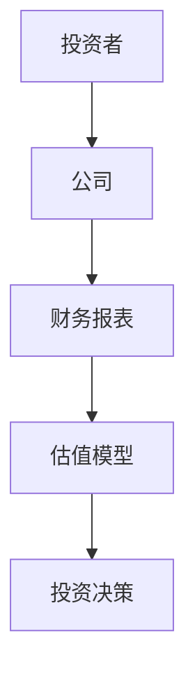
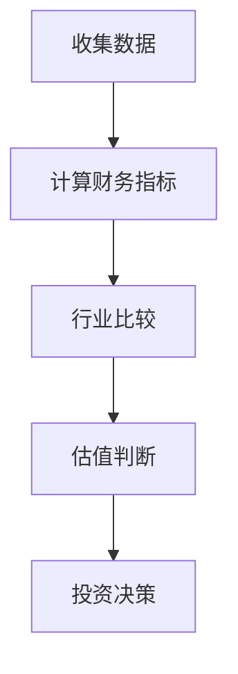

                 


# 罗杰·洛温斯坦的智慧型价值投资

> 关键词：价值投资，罗杰·洛温斯坦，投资策略，基本面分析，安全边际

> 摘要：本文深入探讨了罗杰·洛温斯坦的智慧型价值投资理念，从其投资哲学、策略到具体实施方法进行了详细分析。通过背景介绍、核心概念、算法原理、系统设计、项目实战和最佳实践等多维度解析，帮助读者全面理解智慧型价值投资的精髓。

---

## 第一部分：罗杰·洛温斯坦的智慧型价值投资概述

### 第1章：价值投资的背景与核心理念

#### 1.1 价值投资的起源与发展

- **价值投资的定义与核心概念**  
  价值投资是一种基于对公司内在价值评估的投资策略，强调以低于内在价值的价格买入优质股票。其核心在于识别市场低估的机会，长期持有优质资产，避免短期市场波动的干扰。

- **罗杰·洛温斯坦的贡献与影响力**  
  罗杰·洛温斯坦是价值投资领域的权威，其研究和实践深刻影响了投资界。他强调基本面分析、安全边际和长期投资的重要性，为投资者提供了系统的投资框架。

- **价值投资与其他投资策略的对比**  
  价值投资与成长投资、指数投资等策略相比，更注重企业的内在价值和长期稳定性。通过对比不同策略的优缺点，可以帮助投资者选择适合自己的投资方式。

---

### 第2章：罗杰·洛温斯坦的投资智慧

#### 2.1 洛温斯坦的投资哲学

- **价值投资的核心原则**  
  洛温斯坦强调，投资的本质是购买企业的一部分，而非单纯追求价格波动。他提出“价格是暂时的，价值是永久的”，即投资应基于对企业内在价值的准确评估。

- **长期投资与风险管理**  
  价值投资要求投资者具备长期视角，避免短期市场波动的干扰。同时，洛温斯坦强调风险管理的重要性，建议通过分散投资和设置止损来控制风险。

- **安全边际的概念与应用**  
  安全边际是指买入价格与内在价值之间的差距，用于缓冲短期市场波动和潜在的估值误差。洛温斯坦认为，安全边际是价值投资的核心要素之一，可以显著提高投资的确定性。

#### 2.2 洛温斯坦的投资策略

- **基本面分析的要点**  
  洛温斯坦的策略以基本面分析为基础，重点关注企业的盈利能力、财务状况和行业地位。他提出，投资者应深入分析企业的财务报表，识别潜在的风险和机会。

- **股票估值的方法与模型**  
  洛温斯坦常用的估值方法包括市盈率（PE）、市净率（PB）和股息率等指标。他强调，估值应基于企业的未来现金流，而非单纯的账面价值。

- **行业分析与公司分析的结合**  
  洛温斯坦认为，行业分析是公司分析的前提。他建议投资者选择具有稳定增长潜力的行业，并在行业内寻找具有竞争优势的龙头企业。

---

### 第3章：价值投资的核心概念与联系

#### 3.1 核心概念原理

- **价值投资的三要素**  
  1. **内在价值**：企业未来现金流的现值，是投资决策的基础。  
  2. **安全边际**：买入价格与内在价值的差距，用于降低投资风险。  
  3. **长期视角**：避免短期波动，关注企业的长期增长潜力。

- **安全边际的数学模型**  
  安全边际可以通过以下公式计算：  
  $$ \text{安全边际} = \text{内在价值} - \text{买入价格} $$  
  洛温斯坦建议，安全边际应至少为内在价值的20%以上。

- **市场情绪与投资决策的关系**  
  市场情绪通常与价值投资的决策相反。当市场情绪高涨时，许多股票可能被高估；当市场情绪低落时，优质股票可能被低估。洛温斯坦强调，在市场恐慌时，价值投资的机会往往更大。

#### 3.2 核心概念对比表

| 投资策略 | 核心概念       | 优缺点                     | 适用场景                   |
|----------|----------------|---------------------------|---------------------------|
| 价值投资 | 内在价值、安全边际 | 长期回报稳定，风险可控     | 市场低估、优质企业         |
| 成长投资 | 高成长潜力     | 高回报潜力，风险较高       | 高增长行业、新兴企业       |
| 指数投资 | 市场平均收益     | 分散风险，操作简单         | 市场整体表现稳定           |

#### 3.3 实体关系图



---

### 第4章：价值投资的算法原理

#### 4.1 基本面分析的算法流程



- **步骤1：收集数据**  
  收集目标公司的财务报表数据，包括收入、利润、资产等。

- **步骤2：计算财务指标**  
  计算关键财务指标，如ROE（净资产收益率）、ROA（资产回报率）等。

- **步骤3：行业比较**  
  将目标公司的指标与行业平均水平进行比较，判断其竞争力。

- **步骤4：估值判断**  
  使用估值模型（如市盈率、市净率）计算目标公司的内在价值。

- **步骤5：投资决策**  
  根据估值和安全边际，决定是否买入或卖出。

#### 4.2 Python代码实现

```python
def calculate_roe(net_profit, shareholders_equity):
    return net_profit / shareholders_equity

# 示例数据
net_profit = 100000
shareholders_equity = 500000
print(f"ROE: {calculate_roe(net_profit, shareholders_equity)}")
```

- **代码解读**  
  该代码计算了净资产收益率（ROE），帮助投资者评估企业的盈利能力。

#### 4.3 数学模型与公式

- **ROE计算公式**  
  $$ \text{ROE} = \frac{\text{净利润}}{\text{平均股东权益}} $$  
  ROE越高，企业的盈利能力越强。

- **市盈率计算公式**  
  $$ \text{市盈率} = \frac{\text{股价}}{\text{每股收益（EPS）}} $$  
  低市盈率通常意味着股票被低估。

---

## 第二部分：系统分析与架构设计方案

### 第5章：系统分析与架构设计

#### 5.1 问题场景介绍

- **目标**：设计一个支持价值投资分析的系统，帮助投资者进行基本面分析和估值判断。

- **需求分析**：  
  1. 收集和整理企业财务数据。  
  2. 计算关键财务指标（如ROE、ROA）。  
  3. 进行行业比较和估值判断。  
  4. 提供投资决策建议。

#### 5.2 系统功能设计

- **领域模型（类图）**  
  ```mermaid
  classDiagram
      class 投资者 {
          帐户信息
          投资组合
      }
      class 公司 {
          财务数据
          行业信息
      }
      class 估值模型 {
          计算方法
          输出结果
      }
      投资者 --> 公司
      公司 --> 估值模型
      投资者 --> 估值模型
  ```

- **系统架构设计**  
  ```mermaid
  graph TD
      A[投资者] --> B[数据层]
      B --> C[分析层]
      C --> D[展示层]
  ```

- **接口与交互设计**  
  ```mermaid
  graph TD
      U[用户] --> G[系统入口]
      G --> S[数据服务]
      S --> A[分析模块]
      A --> R[结果展示]
      R --> U
  ```

---

### 第6章：项目实战

#### 6.1 环境安装

- **工具安装**  
  安装必要的数据分析库，如Pandas、NumPy、Matplotlib等。

#### 6.2 核心代码实现

```python
import pandas as pd

def calculate_valuation(price, eps):
    pe_ratio = price / eps
    return pe_ratio

# 示例数据
price = 50
eps = 5
print(f"市盈率: {calculate_valuation(price, eps)}")
```

- **代码解读**  
  该代码计算了市盈率，帮助投资者判断股票的估值是否合理。

#### 6.3 实际案例分析

- **案例：假设某公司财务数据如下**  
  收入：100万，净利润：20万，股东权益：80万，行业平均ROE：15%。

- **分析**  
  计算ROE为25%，高于行业平均水平，表明公司盈利能力强。假设市盈率为10，股价应为2元（净利润为0.2元/股）。如果当前股价为1.8元，则存在安全边际，可以考虑买入。

#### 6.4 项目小结

- **关键点**  
  1. 数据准确性是基本面分析的基础。  
  2. 安全边际是投资决策的重要考量。  
  3. 长期视角是价值投资的核心理念。

---

## 第三部分：最佳实践与总结

### 第7章：最佳实践

#### 7.1 小结

- 价值投资是一种长期、稳健的投资策略，其核心在于基本面分析和安全边际。通过系统化的分析和模型计算，投资者可以更科学地做出投资决策。

#### 7.2 注意事项

- **数据质量**  
  数据的准确性和完整性直接影响估值结果，建议使用可靠的数据源。

- **模型局限性**  
  价值投资模型基于历史数据和假设条件，实际结果可能因市场变化而有所不同。

- **持续学习**  
  投资环境不断变化，投资者需要持续学习和调整策略。

#### 7.3 拓展阅读

- **推荐阅读书籍**  
  1. 《价值》——罗杰·洛温斯坦  
  2. 《证券分析》——本杰明·格雷厄姆  
  3. 《投资最重要的事》——彼得·林奇

---

## 作者信息

作者：AI天才研究院/AI Genius Institute & 禅与计算机程序设计艺术/Zen And The Art of Computer Programming

---

通过本文的系统分析和详细讲解，读者可以全面理解罗杰·洛温斯坦的智慧型价值投资理念，并将其应用于实际投资实践中。

