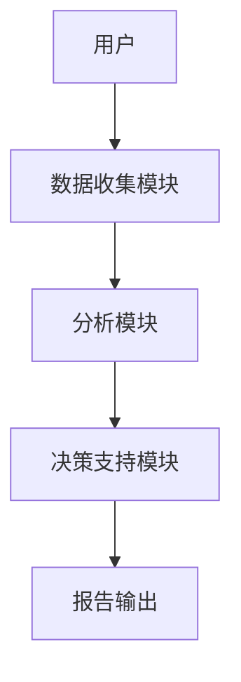

                 


# 罗杰·洛温斯坦的智慧型价值投资：避免价值陷阱

> **关键词**：价值投资，智慧型投资，价值陷阱，企业评估，数学模型，系统架构

> **摘要**：本文深入探讨了罗杰·洛温斯坦的智慧型价值投资方法，重点分析了如何识别和避免价值陷阱。通过结合企业基本面分析、数学模型和系统架构设计，本文为投资者提供了避免价值陷阱的实用策略和方法。

---

# 第1章：智慧型价值投资概述

## 1.1 价值投资的定义与背景

### 1.1.1 价值投资的起源与演变

价值投资是一种长期投资策略，起源于20世纪初，由本杰明·格雷厄姆和戴维·多德提出。其核心理念是寻找市场估值低于其内在价值的股票进行投资。随着市场的变化，价值投资的策略也在不断演变，逐渐融入更多的分析方法和技术手段。

### 1.1.2 价值投资的核心理念

价值投资的核心理念是通过对企业基本面的深入分析，识别出那些市场价格低于其内在价值的企业，长期持有这些企业，等待市场价值回归。

### 1.1.3 智慧型投资的提出

智慧型价值投资是传统价值投资的优化版本，强调在分析过程中引入更多的智慧和逻辑推理，避免被市场情绪和短期波动所迷惑。智慧型投资不仅关注企业的内在价值，还注重对企业竞争优势和行业地位的分析，从而更好地识别真正的投资机会。

---

## 1.2 价值陷阱的定义与特征

### 1.2.1 价值陷阱的定义

价值陷阱是指那些表面上看似估值低于内在价值，但实际上存在重大问题的企业。这些企业可能因为行业衰退、管理不善或财务问题等原因，导致其市场价格无法回归其内在价值，甚至进一步下跌。

### 1.2.2 价值陷阱的常见类型

价值陷阱的常见类型包括：
1. **行业衰退型**：企业所在的行业处于衰退期，市场需求下降，企业难以维持盈利能力。
2. **管理问题型**：企业管理层存在问题，如战略失误、内部腐败等，导致企业经营不善。
3. **财务问题型**：企业财务状况不佳，可能存在高额债务、盈利能力持续下降等问题。

### 1.2.3 价值陷阱的识别方法

识别价值陷阱的方法包括：
1. **基本面分析**：深入分析企业的财务报表，关注盈利能力、资产负债情况等关键指标。
2. **行业分析**：研究企业所在行业的发展趋势，判断企业是否面临行业衰退的风险。
3. **管理层评估**：了解企业管理层的背景和战略决策能力，评估是否存在管理问题。

---

## 1.3 智慧型价值投资的目标与意义

### 1.3.1 投资目标的设定

智慧型价值投资的目标是通过深入分析，识别出具有持续竞争优势和良好财务状况的企业，避免投资于存在价值陷阱的企业，从而实现长期稳定的收益。

### 1.3.2 智慧型投资的优势

智慧型投资的优势在于其结合了传统价值投资的稳健性和现代投资分析的科学性，通过引入更多的逻辑推理和数据分析，提高了投资决策的准确性和可靠性。

### 1.3.3 价值陷阱的防范策略

防范价值陷阱的策略包括：
1. **建立严格的筛选标准**：通过对企业财务指标、行业地位和管理层能力的全面评估，筛选出优质企业。
2. **分散投资**：通过分散投资降低单一企业风险，避免因个别企业的问题导致整体投资组合受损。
3. **持续监控与调整**：定期对企业基本面和市场环境进行监控，及时调整投资策略。

---

# 第2章：智慧型价值投资的核心概念

## 2.1 价值投资的三大支柱

### 2.1.1 企业基本面分析

企业基本面分析是价值投资的核心，主要包括对企业财务状况、盈利能力、成长能力和竞争优势的分析。

#### 财务指标分析
- **盈利能力**：ROE（股东权益回报率）、净利润率等。
- **成长能力**：收入增长率、净利润增长率等。
- **财务健康状况**：资产负债率、流动比率等。

#### 示例：某企业的财务指标分析

假设某企业的财务指标如下：
- 净利润：100万元
- 股东权益：500万元
- 资产负债率：50%

计算ROE：ROE = 净利润 / 股东权益 = 100 / 500 = 20%

---

### 2.1.2 市场情绪与估值

市场情绪与估值是价值投资的重要考量因素。市场情绪通常会影响股票的短期价格波动，但长期来看，股票价格将回归其内在价值。

#### 市场情绪分析
- **市场情绪指标**：如VIX指数、投资者情绪指数等。
- **估值指标**：市盈率（P/E）、市净率（P/B）等。

#### 示例：市盈率计算

假设某企业的净利润为100万元，市场认为其合理市盈率为15倍，则其合理市值为15 × 100 = 1500万元。

---

### 2.1.3 长期投资策略

长期投资策略强调持有优质企业股票，避免频繁交易，降低交易成本和税务负担。

#### 长期投资的优势
- **复利效应**：长期持有优质股票，收益可以通过复利增长。
- **降低交易成本**：频繁交易将增加佣金和印花税等成本。

---

## 2.2 智慧型投资的关键要素

### 2.2.1 企业竞争优势分析

竞争优势是企业长期盈利能力的保证。竞争优势可以分为成本优势、品牌优势、技术优势等。

#### 成本优势
- 低成本生产模式。
- 高效的供应链管理。

#### 品牌优势
- 强大的品牌影响力。
- 忠诚的客户群体。

#### 技术优势
- 拥有核心专利技术。
- 技术研发能力强。

---

### 2.2.2 财务指标的筛选与评估

财务指标的筛选与评估是识别优质企业的关键步骤。主要指标包括：
- **ROE（股东权益回报率）**：衡量企业盈利能力。
- **净利率**：衡量企业的盈利效率。
- **收入增长率**：衡量企业的成长能力。

#### 示例：ROE的计算与分析

假设企业A和企业B的ROE分别为20%和10%，则企业A的盈利能力更强。

---

### 2.2.3 行业周期与宏观经济影响

行业周期和宏观经济环境对企业的经营状况和股票价格有重要影响。投资者需要关注行业周期的变化和宏观经济政策的调整。

#### 行业周期分析
- **行业生命周期**：从幼稚期、成长期、成熟期到衰退期。
- **行业波动性**：行业波动性大的企业风险较高。

#### 宏观经济影响
- **经济周期**：经济衰退时，企业盈利能力可能下降。
- **货币政策**：央行的利率政策对企业融资成本和市场需求有直接影响。

---

## 2.3 避免价值陷阱的策略框架

### 2.3.1 风险评估与控制

风险评估与控制是避免价值陷阱的重要步骤。投资者需要识别和评估投资中的各种风险，包括市场风险、流动性风险和信用风险。

#### 风险评估指标
- **Beta值**：衡量股票相对于市场的波动性。
- **VaR（在险值）**：衡量投资组合在一定置信水平下的潜在损失。

#### 示例：Beta值的计算与应用

Beta值反映了股票的系统性风险，Beta值大于1表示股票波动性高于市场，小于1则相反。

---

### 2.3.2 投资组合的构建与优化

投资组合的构建与优化是分散风险、提高收益的重要手段。投资者需要根据自身的风险承受能力和收益目标，构建合适的投资组合。

#### 投资组合优化方法
- **现代投资组合理论（MPT）**：通过分散投资降低风险。
- **有效前沿**：在给定风险下，提供最高收益的投资组合。

#### 示例：简单投资组合优化计算

假设投资者有100万元资金，可以选择两种股票A和B，预期收益率分别为10%和15%，波动率分别为15%和20%。通过计算，找到最优的组合比例以实现预期收益和风险的平衡。

---

### 2.3.3 定期复盘与调整

定期复盘与调整是保持投资组合健康的重要步骤。投资者需要定期评估投资组合的表现，根据市场变化和企业情况调整投资策略。

#### 复盘步骤
1. **回顾投资目标**：是否达到了预期的收益和风险目标。
2. **评估投资标的**：是否有企业基本面变化或行业环境变化。
3. **调整投资组合**：根据评估结果，调整投资比例或更换投资标的。

---

# 第3章：智慧型价值投资的数学模型与算法

## 3.1 企业价值评估的数学模型

### 3.1.1 市盈率模型

市盈率模型是通过比较股票的市盈率与行业平均水平，判断股票的估值是否合理。

#### 市盈率计算公式
$$ \text{市盈率} = \frac{\text{股票价格}}{\text{每股净利润}} $$

#### 示例：市盈率计算

假设某股票的价格为20元，每股净利润为2元，则市盈率为10倍。

---

### 3.1.2 市净率模型

市净率模型是通过比较股票的市净率与行业平均水平，判断股票的估值是否合理。

#### 市净率计算公式
$$ \text{市净率} = \frac{\text{股票价格}}{\text{每股净资产}} $$

#### 示例：市净率计算

假设某股票的价格为15元，每股净资产为5元，则市净率为3倍。

---

### 3.1.3 股东权益回报率（ROE）模型

ROE模型通过计算企业的股东权益回报率，评估企业的盈利能力。

#### ROE计算公式
$$ \text{ROE} = \frac{\text{净利润}}{\text{股东权益}} $$

#### 示例：ROE计算

假设某企业的净利润为100万元，股东权益为500万元，则ROE为20%。

---

## 3.2 避免价值陷阱的算法设计

### 3.2.1 风险评估算法

风险评估算法通过对企业财务指标和市场环境的分析，评估投资风险。

#### 风险评估步骤
1. **收集数据**：包括企业财务数据、市场数据等。
2. **计算风险指标**：如VaR、Beta值等。
3. **评估风险等级**：根据风险指标，确定企业的风险等级。

#### 示例：VaR计算

假设某投资组合的VaR在95%的置信水平下为100万元，则意味着在95%的概率下，投资组合的最大损失不会超过100万元。

---

### 3.2.2 投资组合优化算法

投资组合优化算法通过优化投资组合的收益与风险，找到最优的投资组合。

#### 投资组合优化步骤
1. **确定投资目标**：如收益目标和风险承受能力。
2. **计算资产回报率和协方差矩阵**。
3. **构建优化模型**：使用MPT理论，计算有效前沿。
4. **确定最优组合**：根据投资目标，在有效前沿上选择最优组合。

#### 示例：投资组合优化计算

假设投资者有两个资产，A和B，预期回报率分别为10%和15%，标准差分别为15%和20%，相关系数为0.5。通过计算，找到最优的投资比例。

---

# 第4章：智慧型价值投资的系统架构设计

## 4.1 系统功能设计

### 4.1.1 数据收集模块

数据收集模块负责收集企业的财务数据、市场数据等。

#### 数据来源
- 企业财务报表。
- 市场数据，如股票价格、指数等。
- 行业报告和宏观经济数据。

---

### 4.1.2 分析模块

分析模块负责对企业数据进行分析，评估企业的内在价值和投资风险。

#### 分析步骤
1. **计算财务指标**：如ROE、市盈率等。
2. **评估企业竞争优势**：如成本优势、品牌优势等。
3. **风险评估**：计算VaR、Beta值等风险指标。

---

### 4.1.3 决策支持模块

决策支持模块根据分析结果，提供投资建议和风险提示。

#### 决策支持步骤
1. **生成报告**：包括企业分析报告和投资建议。
2. **风险提示**：根据风险评估结果，提示投资风险。

---

## 4.2 系统架构设计

### 4.2.1 系统架构图



---

### 4.2.2 系统接口设计

系统接口设计包括数据输入接口和报告输出接口。

#### 数据输入接口
- 接收企业财务数据和市场数据。
- 提供API接口，方便数据接入。

#### 报告输出接口
- 输出企业分析报告和投资建议。
- 提供可视化的报告界面。

---

## 4.3 项目实战

### 4.3.1 环境安装

项目实战需要安装以下环境：
1. Python编程语言。
2. 数据分析库，如Pandas、NumPy。
3. 可视化工具，如Matplotlib。

---

### 4.3.2 核心实现代码

以下是一个简单的投资组合优化代码示例：

```python
import numpy as np

# 假设资产A和B的预期回报率和标准差
mu = np.array([0.1, 0.15])
sigma = np.array([0.15, 0.2])
rho = 0.5

# 计算协方差矩阵
cov = np.array([[sigma[0]**2, rho*sigma[0]*sigma[1]],
                [rho*sigma[0]*sigma[1], sigma[1]**2]])

# 计算投资组合的最优权重
from scipy.optimize import minimize

def portfolio_variance(weights, mu, cov):
    return np.dot(weights.T, np.dot(cov, weights))

# 约束条件：权重之和为1
cons = ({'type': 'eq', 'fun': lambda w: sum(w) - 1})

# 优化目标是最小化方差
result = minimize(portfolio_variance, [0.5, 0.5], args=(mu, cov), constraints=cons)

print("最优权重：", result.x)
print("最小方差：", result.fun)
```

---

### 4.3.3 实际案例分析

以下是一个实际案例分析：

假设某投资者有100万元资金，想要投资于股票A和B，预期回报率分别为10%和15%，标准差分别为15%和20%，相关系数为0.5。通过优化计算，最优投资比例为A：60%，B：40%，最小方差为0.08。

---

# 第5章：智慧型价值投资的最佳实践

## 5.1 最佳实践 tips

### 5.1.1 定期复盘与调整

定期复盘投资组合的表现，根据市场变化和企业情况调整投资策略。

### 5.1.2 风险控制

设置止损点，避免过度集中投资，分散投资风险。

### 5.1.3 持续学习

关注行业动态和市场变化，不断提升自己的投资分析能力。

---

## 5.2 小结

智慧型价值投资是一种结合了传统价值投资和现代投资分析方法的优化策略，通过深入分析企业的基本面和市场环境，避免投资于存在价值陷阱的企业，从而实现长期稳定的收益。

---

## 5.3 注意事项

1. **避免过度自信**：投资决策需要基于数据和逻辑，避免主观判断。
2. **关注长期目标**：避免被短期市场波动所迷惑，坚持长期投资策略。
3. **持续学习与改进**：不断优化自己的分析方法和投资策略。

---

## 5.4 拓展阅读

1. 《The Intelligent Investor》——本杰明·格雷厄姆
2. 《The Warren Buffett Portfolio》——查理·芒格
3. 《投资学原理》——现代投资组合理论（MPT）

---

# 作者

作者：AI天才研究院/AI Genius Institute  
联系邮箱：contact@ai-genius.org  
官方网站：https://www.ai-genius.org

