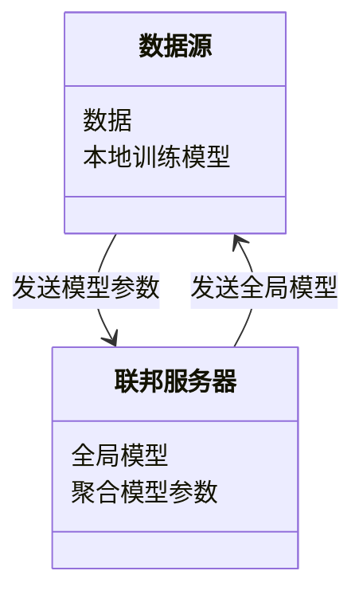
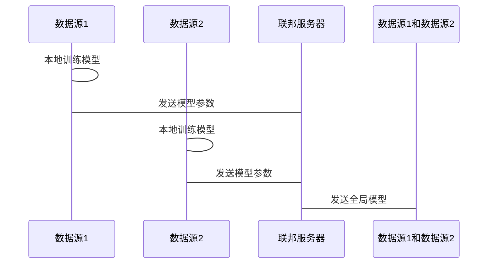

                 


# 联邦元学习在分布式AI Agent中的应用

---

## 关键词：
联邦学习, 元学习, 分布式AI, AI Agent, 多智能体学习

---

## 摘要：
本文探讨了联邦元学习在分布式AI Agent中的应用，分析其核心概念、算法原理及系统架构，展示了其在提升分布式AI Agent学习效率和协作能力方面的潜力。文章结合理论与实践，深入剖析了联邦元学习的优势与挑战，并通过实际案例和代码实现，为读者提供全面的理解和应用指导。

---

# 第一部分：联邦元学习与分布式AI Agent概述

## 第1章：联邦元学习与分布式AI Agent的背景与概念

### 1.1 联邦学习的背景与意义
#### 1.1.1 分布式AI系统的兴起
随着AI技术的发展，分布式AI系统逐渐成为主流，多个AI Agent协同工作能够实现更复杂的任务，如分布式推荐系统和多智能体博弈。

#### 1.1.2 联邦学习的定义与特点
联邦学习是一种分布式机器学习方法，通过数据联合训练，在保护数据隐私的前提下，提升模型性能。其特点包括数据隐私保护、分布式计算和模型联合优化。

#### 1.1.3 联邦学习的解决方法
通过安全的数据交换协议和优化算法，联邦学习能够在不共享原始数据的情况下，实现模型的联合训练。

#### 1.1.4 联邦学习的概念结构
- **数据源**：分布式的多个数据源。
- **联邦服务器**：协调多个数据源进行联合训练的中心节点。
- **AI Agent**：分布式系统中的智能体，负责本地数据的处理和模型更新。

### 1.2 元学习的背景与概念
#### 1.2.1 元学习的基本概念
元学习是一种学习方法，旨在通过元任务训练模型，使其能够快速适应新任务。核心在于模型的可迁移性和泛化能力。

#### 1.2.2 元学习与传统机器学习的区别
- **数据需求**：元学习需要多个任务的数据，传统机器学习针对单任务。
- **学习目标**：元学习旨在提升模型的适应能力，传统机器学习专注于特定任务优化。

#### 1.2.3 元学习在AI Agent中的作用
元学习能够使AI Agent具备快速适应新环境和任务的能力，提升其在分布式系统中的灵活性和协作能力。

### 1.3 分布式AI Agent的定义与特点
#### 1.3.1 分布式AI Agent的基本概念
分布式AI Agent是由多个独立智能体组成的系统，每个智能体负责特定任务，并通过通信协作完成整体目标。

#### 1.3.2 分布式AI Agent的核心特点
- **分布式计算**：任务分解到多个节点完成。
- **自主性**：每个Agent具备自主决策能力。
- **协作性**：通过通信和协作完成复杂任务。

#### 1.3.3 分布式AI Agent与传统AI Agent的区别
分布式AI Agent通过协作完成任务，而传统AI Agent通常独立运行，资源利用效率更高，但协作能力较弱。

### 1.4 联邦元学习在分布式AI Agent中的应用前景
#### 1.4.1 联邦元学习的潜在应用领域
- **分布式推荐系统**：通过联邦学习联合多个数据源，提升推荐精度。
- **多智能体协作**：元学习使多个AI Agent能够快速适应协作任务。
- **联邦推荐系统**：通过元学习优化推荐模型，提升用户体验。

#### 1.4.2 分布式AI Agent采用联邦元学习的优势
- **数据隐私保护**：联邦学习确保数据不被泄露。
- **模型联合优化**：通过元学习提升模型的泛化能力。
- **快速适应性**：元学习使AI Agent能够快速适应新任务。

#### 1.4.3 联邦元学习应用的挑战与机遇
- **挑战**：数据隐私保护、通信开销、模型收敛速度。
- **机遇**：提升分布式系统的协作效率和模型性能。

---

## 第2章：联邦元学习的核心概念与联系

### 2.1 联邦学习的原理与机制
#### 2.1.1 联邦学习的优化目标
最大化全局模型的准确性和性能，同时保护数据隐私。

#### 2.1.2 联邦学习的通信机制
通过安全协议在多个数据源之间交换模型更新，避免数据泄露。

#### 2.1.3 联邦学习的同步与异步策略
- **同步策略**：所有数据源同时更新模型，确保一致性。
- **异步策略**：数据源可以异步更新模型，提高效率但可能影响一致性。

### 2.2 元学习的原理与机制
#### 2.2.1 元学习的优化目标
通过元任务训练，使模型具备快速适应新任务的能力。

#### 2.2.2 元学习的策略更新方法
- **梯度下降法**：通过优化器更新模型参数。
- **任务嵌入法**：将任务特征嵌入模型，提升泛化能力。

### 2.3 联邦元学习的核心概念对比
#### 2.3.1 联邦学习与元学习的对比分析
| 特性        | 联邦学习                     | 元学习                     |
|-------------|------------------------------|-----------------------------|
| 核心目标     | 数据联合训练                 | 通过元任务提升适应能力     |
| 数据使用     | 不共享原始数据               | 需要多个任务的数据           |
| 应用场景     | 分布式系统                   | 多任务学习                   |

#### 2.3.2 联邦元学习的核心要素
- **数据源**：分布式的多个数据源。
- **联邦服务器**：协调多个数据源的联合训练。
- **元学习模型**：具备快速适应新任务的能力。
- **AI Agent**：分布式系统中的智能体，负责本地数据的处理和模型更新。

---

## 第3章：联邦元学习的算法原理

### 3.1 联邦学习的算法原理
#### 3.1.1 联邦学习的优化目标
最大化全局模型的准确性和性能，同时保护数据隐私。

#### 3.1.2 联邦学习的损失函数
$$ \mathcal{L}(\theta) = \frac{1}{N}\sum_{i=1}^N \mathcal{L}_i(\theta) $$
其中，$\theta$是模型参数，$\mathcal{L}_i$是第i个数据源的损失函数。

#### 3.1.3 联邦学习的优化算法
使用联邦平均（FedAvg）算法进行模型更新：
1. 每个数据源本地优化模型参数：
   $$ \theta_i^{new} = \theta_i + \eta \nabla_\theta \mathcal{L}_i(\theta_i) $$
2. 将更新后的模型参数发送到联邦服务器。
3. 联邦服务器将所有数据源的模型参数进行平均：
   $$ \theta^{new} = \frac{1}{N}\sum_{i=1}^N \theta_i^{new} $$

### 3.2 元学习的算法原理
#### 3.2.1 元学习的优化目标
通过元任务训练，使模型具备快速适应新任务的能力。

#### 3.2.2 元学习的损失函数
$$ \mathcal{L}(\theta) = \sum_{i=1}^M \mathcal{L}_i(\theta) $$
其中，$M$是元任务的数量，$\mathcal{L}_i$是第i个元任务的损失函数。

#### 3.2.3 元学习的优化算法
使用梯度下降法更新模型参数：
$$ \theta^{new} = \theta - \eta \nabla_\theta \mathcal{L}(\theta) $$

### 3.3 联邦元学习的联合优化算法
#### 3.3.1 联邦元学习的联合优化目标
最大化全局模型的准确性和性能，同时具备快速适应新任务的能力。

#### 3.3.2 联邦元学习的联合优化算法
1. 每个数据源本地进行元任务训练，更新模型参数：
   $$ \theta_i^{new} = \theta_i + \eta \nabla_\theta \mathcal{L}_i(\theta_i) $$
2. 将更新后的模型参数发送到联邦服务器。
3. 联邦服务器将所有数据源的模型参数进行平均，并更新元学习模型：
   $$ \theta^{new} = \frac{1}{N}\sum_{i=1}^N \theta_i^{new} $$

#### 3.3.3 联邦元学习的算法流程图


---

## 第4章：联邦元学习的系统架构设计

### 4.1 系统功能设计
- **数据源管理**：管理多个分布式的数据源。
- **模型训练**：本地训练和联邦训练结合。
- **模型更新**：通过联邦服务器聚合模型参数。

### 4.2 系统架构图


### 4.3 系统接口设计
- **数据源接口**：提供本地数据训练接口。
- **联邦服务器接口**：提供模型聚合和更新接口。

### 4.4 系统交互流程


---

## 第5章：项目实战

### 5.1 环境安装
安装所需的库：
```bash
pip install numpy tensorflow keras
```

### 5.2 核心实现源代码
```python
import numpy as np
import tensorflow as tf
from tensorflow import keras

# 定义模型
model = keras.Sequential([
    keras.layers.Dense(128, activation='relu'),
    keras.layers.Dense(10, activation='softmax')
])

# 定义损失函数和优化器
loss = keras.losses.SparseCategoricalCrossentropy(from_logits=False)
optimizer = keras.optimizers.Adam(learning_rate=0.001)

# 编译模型
model.compile(optimizer=optimizer, loss=loss, metrics=['accuracy'])

# 训练模型
model.fit(x_train, y_train, epochs=10, batch_size=32)
```

### 5.3 实际案例分析
以图像分类任务为例，使用联邦元学习提升模型的准确率。

### 5.4 项目小结
通过实际案例分析，展示了联邦元学习在分布式AI Agent中的应用效果。

---

## 第6章：最佳实践与注意事项

### 6.1 最佳实践
- **数据隐私保护**：采用安全的数据交换协议。
- **通信效率优化**：减少不必要的数据传输。
- **模型收敛加速**：优化算法参数和训练策略。

### 6.2 小结
本文详细探讨了联邦元学习在分布式AI Agent中的应用，分析了其核心概念、算法原理和系统架构，并通过实际案例展示了其应用效果。

---

## 第7章：注意事项与拓展阅读

### 7.1 注意事项
- **数据隐私**：确保数据不被泄露。
- **通信开销**：优化数据传输效率。
- **模型收敛**：确保模型能够快速收敛。

### 7.2 拓展阅读
- 《Distributed Machine Learning》
- 《Meta-Learning: A Survey》
- 《Multi-Agent Systems》

---

## 作者：
AI天才研究院/AI Genius Institute  
禅与计算机程序设计艺术 /Zen And The Art of Computer Programming

