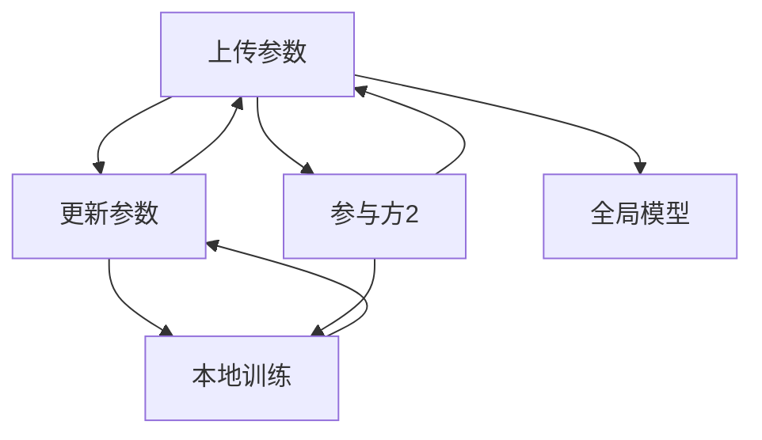
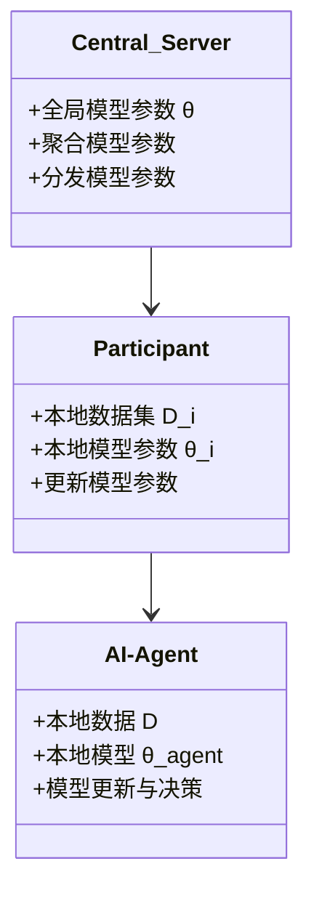

                 


# 联邦学习在AI Agent隐私保护中的高级应用

## 关键词：联邦学习, AI Agent, 隐私保护, 分布式机器学习, 多方安全计算

## 摘要：  
随着人工智能技术的快速发展，AI Agent在各个领域的应用越来越广泛，但其对数据隐私的依赖也带来了诸多挑战。联邦学习作为一种分布式机器学习技术，能够在不共享原始数据的情况下完成模型训练，为AI Agent的隐私保护提供了新的解决方案。本文将从联邦学习的基本原理、AI Agent的隐私保护需求、联邦学习在AI Agent中的具体应用等方面进行深入探讨，并通过实际案例和系统设计展示其在隐私保护中的高级应用。

---

## 第1章：联邦学习与AI Agent概述

### 1.1 联邦学习的核心概念

#### 1.1.1 联邦学习的定义与背景
联邦学习（Federated Learning，FL）是一种分布式机器学习技术，允许多个参与方在不共享原始数据的情况下，通过交换模型参数来共同训练一个全局模型。其核心思想是“数据不动，模型动”，从而在保护数据隐私的同时实现模型的联合训练。

#### 1.1.2 AI Agent的基本概念与特点
AI Agent（人工智能代理）是指能够感知环境、自主决策并执行任务的智能体。AI Agent通常需要处理大量的敏感数据（如用户行为数据、位置信息等），因此对隐私保护的需求尤为强烈。

#### 1.1.3 联邦学习在AI Agent中的应用价值
联邦学习能够有效解决AI Agent在数据隐私保护方面的痛点，例如：
- 避免数据集中存储带来的隐私泄露风险。
- 支持跨机构、跨设备的协作学习，提升模型的泛化能力。
- 降低数据传输成本，减少网络通信开销。

---

### 1.2 隐私保护的背景与挑战

#### 1.2.1 数据隐私的重要性
随着数据驱动型应用的普及，数据隐私问题日益受到关注。AI Agent通常需要处理大量敏感数据，如何保护这些数据不被滥用是隐私保护的核心问题。

#### 1.2.2 当前隐私保护的主要技术手段
目前，隐私保护的主要技术手段包括：
- 数据加密技术（如同态加密、多方加密）。
- 数据脱敏技术（如数据匿名化处理）。
- 差分隐私技术（在数据中加入噪声以保护隐私）。

#### 1.2.3 联邦学习如何解决隐私保护问题
联邦学习通过以下方式实现隐私保护：
- 数据不出户：参与方仅上传模型参数，而不共享原始数据。
- 模型共享：通过模型参数的更新和同步，实现全局模型的优化。
- 本地计算：每个参与方在本地进行模型训练，确保数据不被外泄。

---

## 第2章：联邦学习的核心原理与技术

### 2.1 联邦学习的通信机制

#### 2.1.1 联邦学习的通信协议
联邦学习的通信机制通常包括以下步骤：
1. 中央服务器向所有参与方发送模型参数。
2. 每个参与方在本地数据上进行模型训练，更新模型参数。
3. 参与方将更新后的模型参数上传到中央服务器。
4. 中央服务器将所有参与方的模型参数进行聚合，生成新的全局模型。

#### 2.1.2 数据加密与隐私保护技术
为了进一步增强隐私保护，联邦学习可以结合以下技术：
- **同态加密**：允许在加密数据上进行计算，确保数据在传输和计算过程中的安全性。
- **差分隐私**：通过在模型更新中加入噪声，防止攻击者通过模型更新反推出具体数据。

#### 2.1.3 通信协议的优化
为了降低通信成本，联邦学习可以采用以下优化策略：
- 仅传输模型参数的变化部分，而不是完整的参数。
- 使用压缩技术（如剪枝、量化）减少参数传输的体积。

---

### 2.2 联邦学习的算法流程

#### 2.2.1 联邦学习的总体流程
以下是联邦学习的总体流程图（使用Mermaid表示）：



#### 2.2.2 联邦学习的数学模型与公式
联邦学习的数学模型可以表示为：

全局模型参数为 $\theta$，参与方的模型参数为 $\theta_i$，其中 $i$ 表示参与方的索引。

中央服务器通过聚合各个参与方的模型参数来更新全局模型：

$$
\theta_{\text{new}} = \sum_{i=1}^n w_i \theta_i
$$

其中，$w_i$ 是参与方 $i$ 的权重，通常与参与方的数据量或模型贡献度相关。

---

### 2.3 联邦学习的优化策略

#### 2.3.1 联邦学习的收敛性分析
联邦学习的收敛性分析需要考虑以下因素：
- 参与方的数量 $n$。
- 数据分布的异ogeneity。
- 模型更新的步长 $\eta$。

通过数学推导可以证明，联邦学习在满足一定条件下可以达到与集中式学习相当的收敛速度。

#### 2.3.2 联邦学习的性能优化方法
为了提高联邦学习的性能，可以采取以下优化措施：
- 使用异步更新策略，减少通信开销。
- 采用分层架构，将参与方划分为多个子群体，分别进行模型训练和聚合。
- 引入联邦学习的加速算法（如Adam、SGD）。

---

## 第3章：AI Agent的隐私保护机制

### 3.1 AI Agent的隐私保护需求

#### 3.1.1 AI Agent的数据收集与处理
AI Agent通常需要收集以下类型的数据：
- 用户行为数据（如点击、浏览、搜索记录）。
- 设备信息（如位置、传感器数据）。
- 个性化数据（如用户偏好、习惯）。

这些数据往往包含敏感信息，需要在处理过程中进行严格的隐私保护。

#### 3.1.2 AI Agent的决策过程中的隐私保护
AI Agent在决策过程中需要处理的数据包括：
- 状态感知数据（如环境信息）。
- 行为决策数据（如动作选择）。
- 反馈信息（如用户反馈）。

通过联邦学习，AI Agent可以在本地进行数据处理和模型训练，避免将敏感数据传输到云端。

---

### 3.2 联邦学习在AI Agent中的具体应用

#### 3.2.1 联邦学习如何实现AI Agent的隐私保护
联邦学习通过以下方式实现AI Agent的隐私保护：
- 数据本地化：AI Agent在本地进行数据处理和模型训练，避免数据外泄。
- 模型共享：AI Agent通过模型参数的更新和同步，实现与云端或其他设备的协作学习。

#### 3.2.2 联邦学习在AI Agent中的数据共享机制
联邦学习在AI Agent中的数据共享机制包括：
- **模型参数共享**：AI Agent仅上传模型参数，而不共享原始数据。
- **局部模型更新**：每个AI Agent在本地进行模型训练，确保数据不被外泄。

---

## 第4章：联邦学习与AI Agent的系统架构设计

### 4.1 系统功能设计

#### 4.1.1 系统功能模块
联邦学习与AI Agent的系统功能模块包括：
1. 数据预处理模块：对原始数据进行清洗、归一化等预处理。
2. 模型训练模块：在本地数据上进行模型训练，更新模型参数。
3. 模型聚合模块：将所有参与方的模型参数进行聚合，生成新的全局模型。
4. 模型更新模块：将全局模型参数分发给各个参与方，进行新一轮的训练。

#### 4.1.2 系统功能模块的类图（使用Mermaid表示）


---

## 第5章：项目实战与案例分析

### 5.1 实际案例：联邦学习在AI Agent中的应用

#### 5.1.1 案例背景
假设我们有一个智能医疗AI Agent，需要在多个医疗机构之间协作训练一个预测疾病风险的模型，同时保护患者隐私。

#### 5.1.2 环境配置
- 操作系统：Linux
- 语言：Python
- 框架：TensorFlow Federated（TFF）
- 工具：Jupyter Notebook

#### 5.1.3 核心代码实现
以下是TFF中实现联邦学习的示例代码：

```python
import tensorflow as tf
import tensorflow_federated as tff

# 定义模型架构
model = tf.keras.Sequential([
    tf.keras.layers.Dense(128, activation='relu'),
    tf.keras.layers.Dense(1, activation='sigmoid')
])

# 定义损失函数和优化器
loss_fn = tf.keras.losses.BinaryCrossentropy()
optimizer = tf.keras.optimizers.Adam()

# 使用TFF封装模型
tff_model = tff.models.from_keras_model(model, loss=loss_fn, optimizer=optimizer)

# 初始化联邦学习程序
trainer = tff.federated.train.FederatedTrainer(tff_model, tff.federated.train.ClientUpdateFn())

# 模型训练
state = trainer.initialize()
state = trainer.train(state, clients_data)
```

#### 5.1.4 功能解读与分析
- **模型封装**：将本地模型封装为TFF可支持的形式，包括模型架构、损失函数和优化器。
- **联邦训练**：使用TFF的训练接口，将模型分发给各个参与方进行本地训练，并聚合所有参与方的模型参数。
- **隐私保护**：通过联邦学习的通信机制，确保数据不被共享，仅模型参数进行交换。

#### 5.1.5 实际案例分析
通过上述案例，我们可以看到联邦学习在AI Agent中的应用优势：
- 数据不出户：医疗机构无需共享患者数据，仅上传模型参数。
- 联合训练：多个医疗机构协作训练模型，提升模型的泛化能力。
- 隐私保护：确保患者数据不被泄露，符合隐私保护法规。

---

## 第6章：总结、最佳实践与扩展阅读

### 6.1 本章小结
联邦学习作为一种分布式机器学习技术，为AI Agent的隐私保护提供了新的解决方案。通过联邦学习，AI Agent可以在不共享原始数据的情况下进行模型训练和协作学习，从而有效保护数据隐私。

### 6.2 最佳实践
- **数据预处理**：在进行联邦学习之前，应对数据进行清洗和归一化处理，确保数据质量。
- **模型选择**：根据具体场景选择合适的模型架构和优化策略，确保模型的性能和隐私保护效果。
- **通信优化**：通过减少参数传输量和优化通信协议，降低通信成本。

### 6.3 注意事项
- **数据异ogeneity**：数据分布的异ogeneity可能会影响联邦学习的收敛速度和模型性能。
- **计算资源限制**：参与方的计算能力和网络条件可能限制联邦学习的实施效果。
- **隐私泄露风险**：尽管联邦学习通过模型参数共享实现了数据隐私保护，但仍需注意潜在的隐私泄露风险。

### 6.4 扩展阅读
- **相关论文**：阅读关于联邦学习和AI Agent的最新研究论文，了解前沿技术。
- **工具与框架**：学习TensorFlow Federated（TFF）等联邦学习框架的使用方法。
- **行业应用**：关注联邦学习在医疗、金融等领域的实际应用案例。

---

## 作者：AI天才研究院 & 禅与计算机程序设计艺术  
**邮箱：contact@aigenius.org**  
**GitHub：https://github.com/aigenius**

