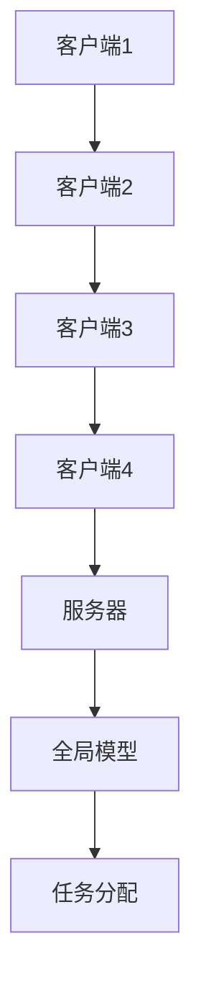

                 


# 联邦学习在分布式AI Agent训练中的应用

> **关键词**：联邦学习、分布式AI、AI Agent、多代理协作、机器学习

> **摘要**：本文系统地探讨了联邦学习在分布式AI Agent训练中的应用，分析了联邦学习的核心概念、数学模型和系统架构，并通过实际案例展示了如何在分布式环境中训练AI Agent。文章从背景介绍到系统实现，再到项目实战，详细讲解了联邦学习与AI Agent结合的理论与实践，为读者提供了全面的视角。

---

## 第一部分: 联邦学习与分布式AI Agent训练概述

### 第1章: 联邦学习与AI Agent的基本概念

#### 1.1 联邦学习的定义与特点

**1.1.1 联邦学习的定义**

联邦学习（Federated Learning，FL）是一种分布式机器学习方法，旨在在不将数据集中到中央服务器的情况下，通过多个边缘设备或服务器协作训练模型。其核心思想是“数据不动，模型动”，即数据保持在本地设备或机构，仅模型参数在参与方之间进行交换。

**1.1.2 联邦学习的核心特点**

- **数据隐私性**：数据无需传输到中央服务器，保护了数据的隐私和安全性。
- **分布式训练**：模型在多个边缘设备或服务器上分布式训练，适用于数据分布式的场景。
- **通信效率**：通过模型参数的交换，减少数据传输量，降低通信成本。

**1.1.3 联邦学习与传统机器学习的区别**

传统的集中式机器学习需要将所有数据集中到中央服务器进行训练，而联邦学习通过分布式训练，避免了数据的集中存储和传输，更适合大规模分布式场景。

#### 1.2 AI Agent的定义与特点

**1.2.1 AI Agent的定义**

AI Agent（人工智能代理）是一种能够感知环境并采取行动以实现目标的智能实体。它可以是一个软件程序、机器人或其他智能系统，通过与环境交互来完成特定任务。

**1.2.2 AI Agent的核心特点**

- **自主性**：能够在没有外部干预的情况下自主决策。
- **反应性**：能够实时感知环境并做出反应。
- **社会性**：能够与其他AI Agent或人类进行交互和协作。

**1.2.3 分布式AI Agent的定义与优势**

分布式AI Agent是指多个AI Agent在不同的物理或计算节点上运行，通过通信和协作完成共同目标。其优势包括：

- **任务分解**：将复杂任务分解为多个子任务，由不同的AI Agent分别处理。
- **容错性**：分布式系统中单个节点的故障不会导致整个系统崩溃。
- **扩展性**：可以通过增加更多的AI Agent来扩展系统能力。

#### 1.3 联邦学习在分布式AI Agent训练中的应用背景

**1.3.1 分布式AI Agent训练的背景**

随着AI技术的快速发展，AI Agent的应用场景越来越广泛，例如自动驾驶、智能客服、分布式机器人系统等。然而，这些场景中数据通常是分布式的，且数据拥有者（如用户、设备）可能不愿意将数据集中到中央服务器。

**1.3.2 联邦学习在分布式训练中的优势**

- **隐私保护**：联邦学习通过保护数据隐私，避免了数据集中带来的隐私泄露风险。
- **数据多样性**：分布式数据通常更具多样性，有助于模型的泛化能力。
- **计算资源利用**：利用分布式计算资源进行模型训练，提高训练效率。

**1.3.3 联邦学习与分布式AI Agent训练的结合**

通过将联邦学习应用于分布式AI Agent训练，可以在保护数据隐私的前提下，利用分布式数据训练高效的模型，提升AI Agent的智能性和协作能力。

---

## 第2章: 联邦学习的核心概念与原理

### 2.1 联邦学习的核心概念

#### 2.1.1 联邦学习的通信协议

联邦学习的通信协议是实现模型参数同步的关键。常见的通信协议包括：

- **gRPC**：高性能的RPC框架，适用于分布式系统中的通信。
- **HTTP/HTTPS**：基于REST的通信方式，简单易用但效率较低。
- **WebSocket**：实时双向通信协议，适用于需要实时更新的场景。

#### 2.1.2 联邦学习的数据安全与隐私保护

数据安全是联邦学习的核心关注点之一。常见的隐私保护技术包括：

- **差分隐私**：通过在模型更新中添加噪声，保护数据的隐私性。
- **同态加密**：对数据进行加密后进行计算，确保数据在计算过程中保持加密状态。
- **联邦隐私保护机制**：通过局部模型更新和参数聚合，保护数据的隐私性。

#### 2.1.3 联邦学习的同步与优化算法

同步与优化算法是联邦学习的核心，决定了模型的训练效率和准确率。常见的同步与优化算法包括：

- **联邦平均（FedAvg）**：通过客户端上传模型参数到服务器，服务器对参数进行平均后分发给客户端。
- **联邦加权平均（FedWeightedAvg）**：根据客户端的数据量或计算能力对模型参数进行加权平均。
- **分布式优化算法**：如Adam、SGD等优化算法的分布式实现。

### 2.2 联邦学习的数学模型与公式

#### 2.2.1 联邦学习的数学模型

联邦学习的数学模型通常包括以下几个部分：

- **损失函数**：定义模型的损失，如交叉熵损失。
- **优化目标**：最小化损失函数，如$\min L(\theta)$，其中$\theta$表示模型参数。
- **模型更新规则**：如$\theta_{t+1} = \theta_t - \eta \nabla L(\theta_t)$，其中$\eta$是学习率。

#### 2.2.2 联邦学习的同步算法

同步算法是联邦学习的核心，常见的同步算法包括：

- **参数服务器模式**：客户端将模型参数上传到参数服务器，服务器对参数进行同步更新。
- **去中心化模式**：客户端之间直接通信，进行模型参数的同步更新。

#### 2.2.3 联邦学习的优化算法

优化算法用于优化模型参数，常见的优化算法包括：

- **随机梯度下降（SGD）**：$ \theta_{t+1} = \theta_t - \eta \nabla L(\theta_t) $
- **Adam优化器**：结合动量和自适应学习率的优化算法。

### 2.3 联邦学习的核心原理

#### 2.3.1 联邦学习的通信机制

通信机制决定了模型参数如何在客户端和服务器之间传输。常见的通信机制包括：

- **同步通信**：客户端等待服务器响应后继续训练。
- **异步通信**：客户端无需等待服务器响应，可以并行训练。

#### 2.3.2 联邦学习的数据处理流程

数据处理流程包括：

1. **数据预处理**：对数据进行清洗、归一化等处理。
2. **数据分割**：将数据分割为训练集和验证集。
3. **模型训练**：在本地数据上训练模型，更新模型参数。
4. **参数同步**：将模型参数上传到服务器，与其他客户端进行模型参数同步。

#### 2.3.3 联邦学习的模型更新流程

模型更新流程包括：

1. **参数下载**：客户端从服务器下载当前模型参数。
2. **本地训练**：在本地数据上更新模型参数。
3. **参数上传**：将更新后的模型参数上传到服务器。
4. **模型聚合**：服务器对所有客户端上传的参数进行聚合，得到新的全局模型。

---

## 第3章: 分布式AI Agent训练的核心概念与原理

### 3.1 分布式AI Agent训练的核心概念

#### 3.1.1 分布式AI Agent训练的定义

分布式AI Agent训练是指在多个计算节点上进行AI Agent模型的训练，每个节点负责部分数据的训练，通过通信协议同步模型参数，最终得到一个全局模型。

#### 3.1.2 分布式AI Agent训练的特点

- **分布式计算**：利用多个计算节点进行并行训练，提高训练效率。
- **数据分割**：将数据分割到不同的计算节点，每个节点负责一部分数据的训练。
- **模型同步**：通过通信协议同步各个节点的模型参数，得到全局模型。

#### 3.1.3 分布式AI Agent训练的优势

- **计算能力提升**：通过分布式计算，提高模型训练的速度。
- **数据多样性**：分布式数据通常更具多样性，有助于模型的泛化能力。
- **扩展性**：可以通过增加更多的计算节点来扩展系统能力。

### 3.2 分布式AI Agent训练的数学模型与公式

#### 3.2.1 分布式AI Agent训练的数学模型

分布式AI Agent训练的数学模型与传统的机器学习模型类似，但需要考虑分布式训练中的同步和优化问题。常见的数学模型包括：

- **损失函数**：定义模型的损失，如交叉熵损失。
- **优化目标**：最小化损失函数，如$\min L(\theta)$，其中$\theta$表示模型参数。
- **模型更新规则**：如$\theta_{t+1} = \theta_t - \eta \nabla L(\theta_t) $，其中$\eta$是学习率。

#### 3.2.2 分布式AI Agent训练的同步算法

同步算法是分布式AI Agent训练的核心，常见的同步算法包括：

- **参数服务器模式**：客户端将模型参数上传到参数服务器，服务器对参数进行同步更新。
- **去中心化模式**：客户端之间直接通信，进行模型参数的同步更新。

#### 3.2.3 分布式AI Agent训练的优化算法

优化算法用于优化模型参数，常见的优化算法包括：

- **随机梯度下降（SGD）**：$ \theta_{t+1} = \theta_t - \eta \nabla L(\theta_t) $
- **Adam优化器**：结合动量和自适应学习率的优化算法。

---

## 第4章: 联邦学习在分布式AI Agent训练中的系统架构与实现方案

### 4.1 系统架构设计

#### 4.1.1 系统架构概述

联邦学习在分布式AI Agent训练中的系统架构通常包括以下几个部分：

- **客户端**：负责本地数据的训练和模型参数的更新。
- **服务器**：负责接收客户端上传的模型参数，进行参数聚合，分发新的模型参数给客户端。
- **通信协议**：客户端和服务器之间的通信协议，如gRPC、HTTP/HTTPS等。

#### 4.1.2 系统功能设计

系统功能设计包括：

1. **数据预处理**：对数据进行清洗、归一化等处理。
2. **模型训练**：在本地数据上训练模型，更新模型参数。
3. **参数同步**：将模型参数上传到服务器，与其他客户端进行模型参数同步。
4. **模型聚合**：服务器对所有客户端上传的参数进行聚合，得到新的全局模型。

#### 4.1.3 系统架构的Mermaid图



### 4.2 系统实现方案

#### 4.2.1 系统实现的核心步骤

1. **环境搭建**：安装必要的软件和库，如Python、TensorFlow、Keras等。
2. **数据准备**：收集和预处理数据，将其分割为训练集和验证集。
3. **模型定义**：定义AI Agent的模型架构，如神经网络模型。
4. **训练过程**：在本地数据上训练模型，更新模型参数。
5. **参数同步**：将模型参数上传到服务器，与其他客户端进行模型参数同步。
6. **模型聚合**：服务器对所有客户端上传的参数进行聚合，得到新的全局模型。

#### 4.2.2 系统实现的Python代码

以下是一个简单的联邦学习训练示例代码：

```python
import numpy as np
import tensorflow as tf
from tensorflow.keras import layers
import os

# 定义模型
def create_model():
    model = tf.keras.Sequential([
        layers.Dense(128, activation='relu'),
        layers.Dense(10, activation='softmax')
    ])
    model.compile(optimizer='adam', loss='sparse_categorical_crossentropy', metrics=['accuracy'])
    return model

# 客户端训练
def client_train(client_model, x_train, y_train, epochs=1):
    history = client_model.fit(x_train, y_train, epochs=epochs, verbose=0)
    return history

# 参数服务器模式
def server_aggregate(global_model, client_models):
    global_model.set_weights([model.get_weights()[0] for model in client_models])
    return global_model

# 主程序
def main():
    # 创建多个客户端模型
    num_clients = 4
    clients = [create_model() for _ in range(num_clients)]
    
    # 分割数据
    x_train = np.random.rand(1000, 10)
    y_train = np.random.randint(0, 10, 1000)
    
    # 客户端训练
    client_weights = []
    for client in clients:
        client_train(client, x_train, y_train)
        client_weights.append(client.get_weights()[0])
    
    # 服务器聚合
    global_model = create_model()
    server_aggregate(global_model, clients)
    
    # 输出全局模型的权重
    print(global_model.get_weights()[0])

if __name__ == "__main__":
    main()
```

### 4.3 项目实战

#### 4.3.1 项目实战环境安装

需要安装的环境包括：

- Python 3.6+
- TensorFlow 2.0+
- Keras
- Mermaid

安装命令：

```bash
pip install python-tensorflow keras mermaid4jupyter
```

#### 4.3.2 核心代码实现

以下是项目的核心代码实现：

```python
import numpy as np
import tensorflow as tf
from tensorflow.keras import layers
import os

# 定义模型
def create_model():
    model = tf.keras.Sequential([
        layers.Dense(128, activation='relu'),
        layers.Dense(10, activation='softmax')
    ])
    model.compile(optimizer='adam', loss='sparse_categorical_crossentropy', metrics=['accuracy'])
    return model

# 客户端训练
def client_train(client_model, x_train, y_train, epochs=1):
    history = client_model.fit(x_train, y_train, epochs=epochs, verbose=0)
    return history

# 参数服务器模式
def server_aggregate(global_model, client_models):
    global_model.set_weights([model.get_weights()[0] for model in client_models])
    return global_model

# 主程序
def main():
    # 创建多个客户端模型
    num_clients = 4
    clients = [create_model() for _ in range(num_clients)]
    
    # 分割数据
    x_train = np.random.rand(1000, 10)
    y_train = np.random.randint(0, 10, 1000)
    
    # 客户端训练
    client_weights = []
    for client in clients:
        client_train(client, x_train, y_train)
        client_weights.append(client.get_weights()[0])
    
    # 服务器聚合
    global_model = create_model()
    server_aggregate(global_model, clients)
    
    # 输出全局模型的权重
    print(global_model.get_weights()[0])

if __name__ == "__main__":
    main()
```

---

## 第5章: 联邦学习在分布式AI Agent训练中的未来展望与最佳实践

### 5.1 未来展望

随着联邦学习技术的不断发展，其在分布式AI Agent训练中的应用前景广阔。未来的研究方向包括：

- **更高效的通信协议**：通过优化通信协议，降低通信成本，提高训练效率。
- **更强大的隐私保护机制**：通过引入更先进的加密技术和差分隐私，进一步提高数据隐私保护能力。
- **更智能的模型优化算法**：通过研究更高效的优化算法，提高模型的训练速度和准确率。

### 5.2 最佳实践

以下是联邦学习在分布式AI Agent训练中的最佳实践建议：

1. **数据预处理**：在训练前对数据进行清洗、归一化等处理，确保数据质量。
2. **模型选择**：根据任务需求选择合适的模型架构，如卷积神经网络、循环神经网络等。
3. **通信协议优化**：选择适合的通信协议，如gRPC、HTTP/HTTPS等，优化通信效率。
4. **隐私保护**：在模型训练过程中，通过差分隐私、同态加密等技术保护数据隐私。
5. **模型优化**：通过Adam、SGD等优化算法，优化模型参数，提高训练效率和准确率。

### 5.3 注意事项

在实际应用中，需要注意以下几点：

- **数据隐私**：确保数据的隐私性，避免数据泄露。
- **通信效率**：优化通信协议，降低通信成本。
- **模型收敛性**：确保模型的收敛性，提高训练效率。

---

## 小结

通过本文的详细讲解，我们系统地探讨了联邦学习在分布式AI Agent训练中的应用，从背景介绍到系统实现，再到项目实战，全面分析了联邦学习的核心概念、数学模型和系统架构。希望本文能够为读者提供一个全面的视角，帮助读者更好地理解和应用联邦学习技术。

---

**作者：AI天才研究院 & 禅与计算机程序设计艺术**

**声明：本文为原创文章，转载请注明出处。**

