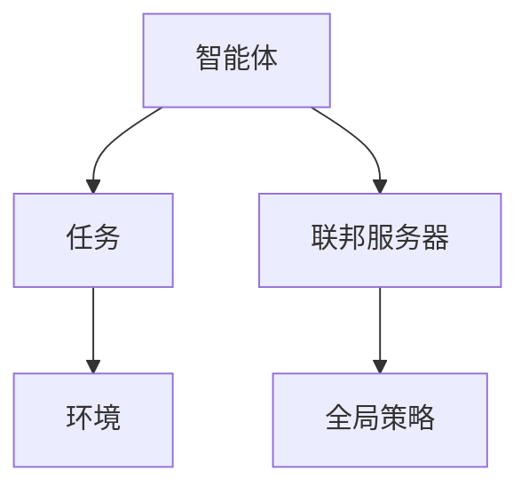
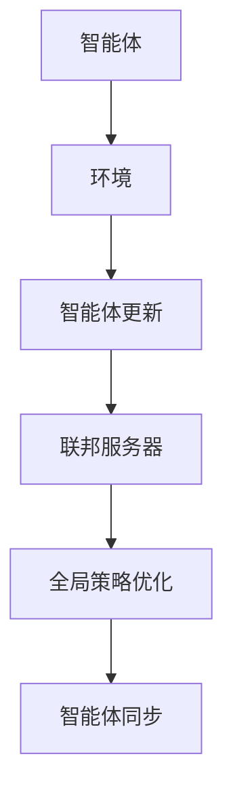
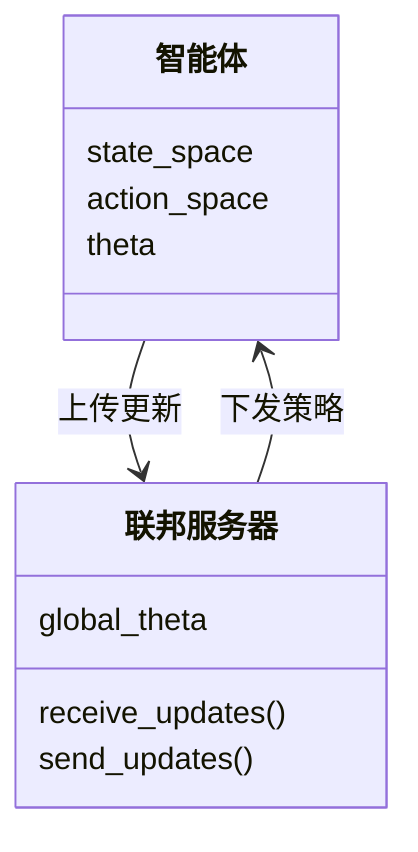

                 


# 联邦强化学习在分布式AI Agent控制优化中的应用

---

## 关键词

联邦强化学习，分布式AI，AI Agent，强化学习，多智能体协作，控制优化

---

## 摘要

本文深入探讨联邦强化学习在分布式AI Agent控制优化中的应用，分析其核心概念、算法原理、系统架构，并通过实际案例展示其在分布式环境中的协作与优化机制。文章从背景介绍、核心概念、算法实现、数学模型、系统设计、项目实战和最佳实践等多个方面展开，为读者提供全面而系统的知识体系。

---

## 正文

---

### 第1章：联邦强化学习概述

#### 1.1 联邦强化学习的背景与概念

##### 1.1.1 分布式AI的发展与挑战

随着AI技术的快速发展，分布式系统中的AI Agent协作已成为研究热点。分布式AI（Distributed AI）涉及多个智能体在去中心化环境中协同工作，面临通信延迟、数据隐私、计算资源分配等挑战。

##### 1.1.2 强化学习的基本原理

强化学习（Reinforcement Learning, RL）通过智能体与环境互动，学习策略以最大化累积奖励。智能体通过试错探索状态空间，更新策略以优化目标函数。

##### 1.1.3 联邦强化学习的定义与特点

联邦强化学习（Federated Reinforcement Learning, FRL）结合了分布式系统和强化学习，允许多个智能体协作优化全局策略，同时保护数据隐私。其特点包括去中心化、隐私保护、协作优化。

#### 1.2 联邦强化学习的核心问题

##### 1.2.1 分布式环境中的协作问题

智能体需在分布式环境中协作，克服通信开销、资源限制和环境动态变化。

##### 1.2.2 联邦学习与传统强化学习的对比

联邦学习强调分布式协作，而传统RL集中式优化。FRL在协作机制、数据隐私和通信效率方面有显著区别。

##### 1.2.3 联邦强化学习的应用场景

FRL应用于智能电网、自动驾驶、分布式机器人协作等领域，解决集中式方法的局限性。

#### 1.3 联邦强化学习的边界与外延

##### 1.3.1 联邦强化学习的适用范围

适用于需要分布式协作且数据隐私受限的场景，如移动设备、物联网等。

##### 1.3.2 相关概念的区分

与多智能体强化学习（MARC）、分布式强化学习（DRL）区分，明确FRL的协作机制和隐私保护特点。

##### 1.3.3 联邦强化学习的核心要素

包括去中心化架构、协作机制、隐私保护、全局优化目标。

---

### 第2章：联邦强化学习的核心概念与联系

#### 2.1 联邦强化学习的原理

##### 2.1.1 分布式环境下的协作机制

智能体通过联邦服务器进行通信，共享策略更新，保持协作同时保护数据隐私。

##### 2.1.2 联邦学习中的知识共享与隐私保护

采用同态加密、差分隐私等技术，确保数据隐私下的知识共享。

##### 2.1.3 联邦强化学习的优化目标

最大化全局奖励，协调各智能体策略，实现分布式环境下的最优控制。

#### 2.2 联邦强化学习与多智能体强化学习的对比

##### 2.2.1 概念对比表格

| 特性             | 联邦强化学习（FRL） | 多智能体强化学习（MARC） |
|------------------|---------------------|--------------------------|
| 系统架构         | 去中心化协作        | 去中心化或集中化        |
| 数据共享         | 隐私保护下的共享    | 数据共享或独立          |
| 优化目标         | 全局最优            | 局部或全局最优          |
| 应用场景         | 分布式设备协作      | 多机器人、游戏AI等      |

##### 2.2.2 实现方式的差异

FRL采用联邦服务器协调更新，MARC强调直接交互与协作。

##### 2.2.3 优缺点分析

FRL优点：隐私保护、分布式协作；缺点：通信开销、收敛速度。

---

#### 2.3 联邦强化学习的ER实体关系图



---

### 第3章：联邦强化学习的算法原理

#### 3.1 联邦强化学习算法详解

##### 3.1.1 算法原理

FRL算法通过迭代更新全局策略，各智能体本地更新策略，并通过联邦服务器同步。

##### 3.1.2 协作与优化机制

采用参数服务器架构，智能体上传更新，服务器合并优化全局策略。

##### 3.1.3 算法流程



##### 3.1.4 算法的Python实现

```python
import numpy as np

class Agent:
    def __init__(self, state_space, action_space):
        self.state_space = state_space
        self.action_space = action_space
        # 初始化策略参数
        self.theta = np.random.randn(state_space, action_space)

def update_policy(agent, global_theta):
    # 当前智能体策略与全局策略同步
    agent.theta = global_theta.copy()

def federated_optimization(agents, global_theta):
    # 计算所有智能体的梯度，合并后更新全局策略
    total_gradient = np.zeros_like(global_theta)
    for agent in agents:
        # 计算单个智能体的梯度
        gradient = agent.calculate_gradient(global_theta)
        total_gradient += gradient
    # 更新全局策略
    global_theta -= learning_rate * total_gradient
    return global_theta

# 示例使用
agents = [Agent(state_space, action_space) for _ in range(num_agents)]
global_theta = np.random.randn(state_space, action_space)
for _ in range(num_iterations):
    global_theta = federated_optimization(agents, global_theta)
    for agent in agents:
        update_policy(agent, global_theta)
```

---

#### 3.2 联邦强化学习的数学模型

##### 3.2.1 状态转移与奖励机制

定义状态s，动作a，奖励r，环境模型P(s'|s,a)。

##### 3.2.2 智能体的价值函数

$$ V(s) = \max_a Q(s,a) $$

##### 3.2.3 全局策略优化目标

$$ \theta_{\text{global}} = \arg\max_{\theta} \sum_{i=1}^N J_i(\theta) $$

其中，\( J_i(\theta) \)是第i个智能体的优化目标。

---

### 第4章：联邦强化学习的数学模型和公式

#### 4.1 状态转移与策略优化

##### 4.1.1 状态空间和动作空间

$$ S = \{s_1, s_2, ..., s_n\} $$

$$ A = \{a_1, a_2, ..., a_m\} $$

##### 4.1.2 奖励函数与目标函数

$$ R(s,a) = \text{奖励值} $$

$$ J(\theta) = \mathbb{E}[R] $$

##### 4.1.3 梯度下降优化

$$ \theta_{t+1} = \theta_t - \alpha \nabla_{\theta} J(\theta_t) $$

---

### 第5章：系统分析与架构设计方案

#### 5.1 应用场景与系统功能

##### 5.1.1 系统功能需求

- 多智能体协作
- 数据隐私保护
- 实时通信与控制

##### 5.1.2 系统功能设计



##### 5.1.3 系统架构设计


---

### 第6章：项目实战

#### 6.1 环境安装与配置

##### 6.1.1 环境要求

- Python 3.6+
- numpy, gym库安装

##### 6.1.2 环境搭建

```bash
pip install numpy gym
```

#### 6.2 核心代码实现

##### 6.2.1 智能体类实现

```python
class FRLAgent:
    def __init__(self, state_dim, action_dim):
        self.state_dim = state_dim
        self.action_dim = action_dim
        self.theta = np.random.randn(state_dim, action_dim)
```

##### 6.2.2 联邦服务器实现

```python
class FRLServer:
    def __init__(self, state_dim, action_dim):
        self.state_dim = state_dim
        self.action_dim = action_dim
        self.global_theta = np.random.randn(state_dim, action_dim)
```

##### 6.2.3 算法实现

```python
def federated_learning(agents, server, num_iterations=100):
    for _ in range(num_iterations):
        server.global_theta = server.optimize(agents, server.global_theta)
        for agent in agents:
            agent.update_policy(server.global_theta)
```

#### 6.3 案例分析与结果解读

##### 6.3.1 实验场景

多个智能体协作完成任务，环境动态变化。

##### 6.3.2 实验结果

收敛速度、任务完成率、系统稳定性等指标分析。

#### 6.4 项目小结

总结项目实现的关键点，如算法设计、系统架构、代码实现等。

---

### 第7章：最佳实践与总结

#### 7.1 最佳实践 tips

- 合理设计通信机制
- 选择合适的数据加密方式
- 定期同步全局策略

#### 7.2 小结

联邦强化学习在分布式AI中的应用前景广阔，需结合实际场景进行优化。

#### 7.3 注意事项

- 通信开销控制
- 系统鲁棒性设计
- 数据隐私保护

#### 7.4 拓展阅读

推荐相关书籍和论文，如《Distributed Reinforcement Learning》。

---

## 作者信息

作者：AI天才研究院/AI Genius Institute & 禅与计算机程序设计艺术/Zen And The Art of Computer Programming

---

本文系统地介绍了联邦强化学习在分布式AI Agent控制优化中的应用，从理论到实践，为读者提供了深入的知识体系和实用的代码示例。通过实际案例分析，展示了FRL在分布式环境中的协作与优化能力，为相关研究和应用提供了参考。

