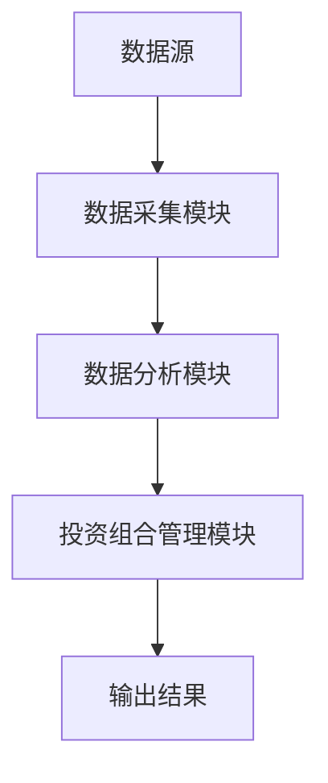
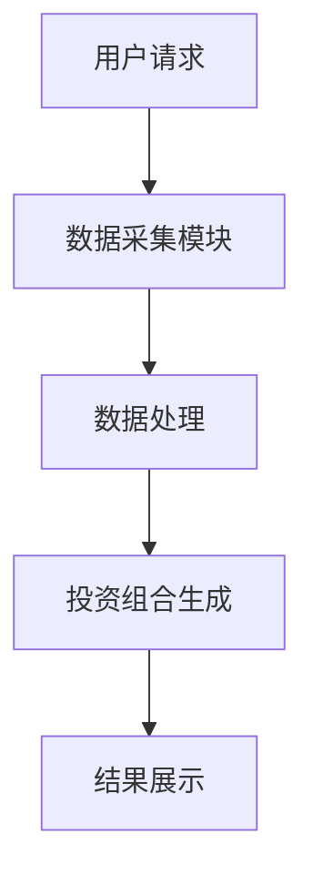

                 


# 肯尼斯·费雪的增长型价值投资

> 关键词：价值投资、成长股、投资策略、基本面分析、投资组合

> 摘要：本文详细探讨了肯尼斯·费雪的增长型价值投资策略，分析了其核心概念、选股方法、投资组合构建与管理，以及实际应用中的数学模型和系统架构设计。通过具体的案例分析和代码实现，帮助读者深入理解增长型价值投资的理论与实践。

---

## 第一部分: 背景介绍

### 第1章: 投资的基本概念

#### 1.1 价值投资与成长股投资

##### 1.1.1 价值投资的定义与特点
- **定义**：价值投资是一种投资策略，旨在以低于内在价值的价格购买优质股票。
- **特点**：注重安全边际、长期持有、注重基本面分析。
- **优缺点对比**：价值投资的优点是风险较低，缺点是需要耐心等待市场回归内在价值。

##### 1.1.2 成长股投资的定义与特点
- **定义**：成长股投资是指投资于那些预期收入和利润将快速增长的公司股票。
- **特点**：注重未来增长潜力、愿意承受较高的市盈率、适合长期投资者。
- **优缺点对比**：成长股投资的优点是收益潜力大，缺点是波动性高，风险较大。

#### 1.2 肯尼斯·费雪的投资理念

##### 1.2.1 费雪的增长型价值投资
- **定义**：将价值投资与成长股投资相结合，寻找那些基本面良好且具有持续增长潜力的公司。
- **核心要素**：注重公司的盈利能力、成长能力、财务健康状况和行业地位。
- **与其他策略的区别**：不同于纯价值投资的低估值策略，也不同于纯成长股投资的高市盈率策略。

---

## 第二部分: 核心概念与联系

### 第2章: 基本面分析

#### 2.1 基本面分析的核心要素

##### 2.1.1 盈利能力
- **指标**：净利润率、ROE（净资产收益率）、ROA（资产回报率）。
- **分析方法**：通过比较公司与行业平均水平，评估其盈利能力。

##### 2.1.2 成长能力
- **指标**：收入增长率、净利润增长率、息税前利润增长率。
- **分析方法**：通过趋势分析，判断公司未来的增长潜力。

##### 2.1.3 财务健康状况
- **指标**：资产负债率、流动比率、速动比率。
- **分析方法**：评估公司的偿债能力，判断财务风险。

##### 2.1.4 行业地位与竞争优势
- **指标**：市场占有率、品牌影响力、专利数量。
- **分析方法**：评估公司在行业中的地位和竞争优势。

#### 2.2 股价与内在价值的关系

##### 2.2.1 内在价值的定义
- 内在价值是公司未来现金流的现值。

##### 2.2.2 股价与内在价值的差异
- 股价受市场情绪影响，可能偏离内在价值。

##### 2.2.3 内在价值的估算
- 使用DCF模型（现金流贴现法）估算内在价值。

---

## 第三部分: 算法原理与数学模型

### 第3章: 投资模型与算法

#### 3.1 费雪选股模型

##### 3.1.1 模型构建逻辑
- 结合基本面分析和成长股特征，筛选出具有持续增长潜力的公司。

##### 3.1.2 指标权重分配
- 盈利能力（30%）、成长能力（40%）、财务健康状况（20%）、行业地位（10%）。

##### 3.1.3 模型应用案例
- 以苹果公司为例，分析其各项指标是否符合增长型价值投资的标准。

#### 3.2 数学模型与公式

##### 3.2.1 净资产收益率（ROE）
$$ ROE = \frac{\text{净利润}}{\text{股东权益}} $$

##### 3.2.2 每股收益（EPS）
$$ EPS = \frac{\text{净利润}}{\text{普通股股数}} $$

##### 3.2.3 市盈率（P/E）
$$ P/E = \frac{\text{股价}}{\text{每股收益}} $$

---

## 第四部分: 系统分析与架构设计

### 第4章: 投资系统设计

#### 4.1 系统功能设计

##### 4.1.1 数据采集模块
- 从股票数据库中获取公司财务数据和市场数据。

##### 4.1.2 数据分析模块
- 使用费雪选股模型对股票进行筛选和评分。

##### 4.1.3 投资组合管理模块
- 根据评分结果构建和调整投资组合。

#### 4.2 系统架构设计

##### 4.2.1 系统架构图


##### 4.2.2 数据流图


---

## 第五部分: 项目实战

### 第5章: 实战案例分析

#### 5.1 环境安装
- 安装Python和相关库（pandas、numpy、matplotlib）。

#### 5.2 核心代码实现

##### 5.2.1 数据采集
```python
import pandas as pd

def get_data(ticker):
    # 假设从数据库获取数据
    data = pd.DataFrame({'Revenue': [100, 200, 300], 'Net Income': [20, 40, 60]})
    return data
```

##### 5.2.2 费雪模型评分
```python
def fisher_score(data):
    # 计算ROE
    roe = data['Net Income'] / data['股东权益']
    # 计算收入增长率
    revenue_growth = (data['Revenue'].pct_change() * 100).mean()
    # 综合评分
    score = (roe + revenue_growth) / 2
    return score
```

#### 5.3 案例分析
- 以科技行业为例，分析苹果、谷歌等公司的费雪评分，构建投资组合。

---

## 第六部分: 最佳实践

### 第6章: 投资策略与风险管理

#### 6.1 最佳实践 tips
- 定期审视投资组合，根据公司基本面变化进行调整。
- 保持分散投资，降低风险。

#### 6.2 小结
- 肯尼斯·费雪的增长型价值投资策略结合了价值和成长股投资的优势，是一种有效的长期投资策略。

#### 6.3 注意事项
- 避免情绪化投资，坚持长期持有。
- 定期进行财务健康检查，评估投资组合的风险和收益。

#### 6.4 拓展阅读
- 阅读费雪的《成长股的秘密》深入理解其投资理念。
- 学习其他投资策略，如指数投资和趋势投资。

---

作者：AI天才研究院/AI Genius Institute & 禅与计算机程序设计艺术 /Zen And The Art of Computer Programming

