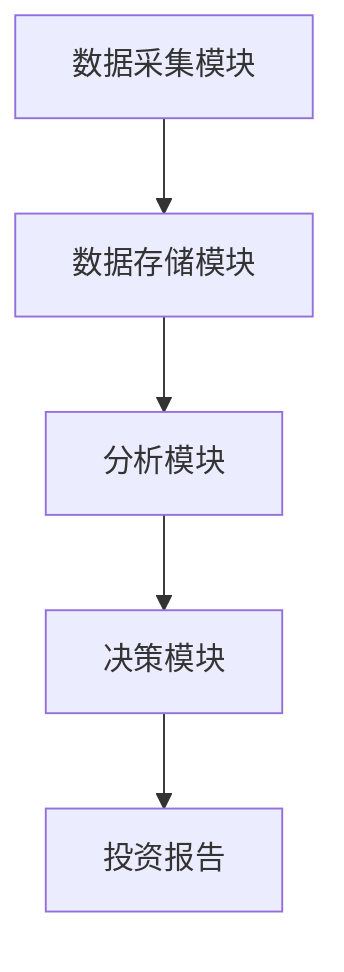

                 


# 肯尼斯·费雪的增长型价值投资：未来潜力股的发掘

## 关键词：增长型价值投资、投资策略、财务指标分析、公司潜力评估、投资组合优化

## 摘要：  
本文深入探讨了肯尼斯·费雪的增长型价值投资理念，结合技术分析方法，系统地介绍了如何识别和评估具有未来潜力的公司，构建高效的投资组合。通过详细分析核心概念、算法原理和实际案例，本文为投资者提供了科学的投资决策依据。

---

## 第一部分：引言

### 1.1 投资的定义与重要性  
投资是指将资金投入到某个项目或资产中，以期获得未来收益的行为。在现代经济中，投资不仅是个人财富增长的重要手段，也是企业和社会经济发展的重要推动力。  

### 1.2 增长型价值投资的起源  
增长型价值投资是由投资大师肯尼斯·费雪提出的一种投资策略，它结合了价值投资和成长股投资的理念。这种策略注重寻找那些具有强大基本面和未来增长潜力的公司，通过长期持有实现超额收益。

### 1.3 本书的目标与结构  
本文旨在通过系统的方法，帮助读者掌握增长型价值投资的核心理念，并结合技术分析方法，提升投资决策的科学性和准确性。文章结构清晰，内容涵盖背景介绍、核心概念、算法原理、数学模型、系统架构、项目实战和总结等部分。

---

## 第二部分：增长型价值投资的核心概念

### 2.1 增长型价值投资的定义与特点  
增长型价值投资是一种结合了价值投资和成长股投资的策略。其核心在于寻找那些当前市场价格低于其内在价值，同时具备强劲增长潜力的公司。  

#### 2.1.1 与传统价值投资和成长股投资的区别  
| 投资策略 | 价值投资 | 成长股投资 | 增长型价值投资 |
|----------|----------|----------|----------------|
| 核心理念 | 买入低于内在价值的股票 | 投资于高成长公司 | 结合价值与成长 |
| 重点分析 | 市盈率、市净率 | 营收增长率、净利润增长率 | 两者兼顾 |
| 适合场景 | 市场低估阶段 | 市场高增长阶段 | 兼具低估与高增长 |

#### 2.1.2 费雪的增长型价值投资理念  
通过 Mermaid 实体关系图，展示增长型价值投资的核心要素：公司基本面、财务指标、市场趋势和投资者情绪。

```mermaid
erDiagram
    company --> has : company id
    financialMetrics --> has : metric id
    marketTrend --> affects : company
    investorSentiment --> influences : marketTrend
    company --> calculates : intrinsicValue
```

---

## 第三部分：评估公司未来潜力的算法原理

### 3.1 算法概述  
增长型价值投资的算法基于财务指标和市场趋势分析，通过量化方法筛选具有潜力的公司。

#### 3.1.1 财务指标分析  
通过分析市盈率（P/E）、市净率（P/B）、ROE（净资产收益率）等指标，评估公司的价值和成长性。

#### 3.1.2 市场趋势分析  
结合行业发展趋势和宏观经济指标，判断公司的未来增长潜力。

### 3.2 算法实现  
以下是用于计算市盈率的 Python 代码示例：

```python
def calculate_pe(stock_price, earnings_per_share):
    return stock_price / earnings_per_share

# 示例数据
stock_price = 100
earnings_per_share = 5
pe_ratio = calculate_pe(stock_price, earnings_per_share)
print(f"市盈率：{pe_ratio}")
```

---

## 第四部分：数学模型与公式

### 4.1 财务指标公式  
市盈率（P/E）的计算公式为：  

$$ P/E = \frac{股票价格}{每股收益} $$  

净资产收益率（ROE）的计算公式为：  

$$ ROE = \frac{净利润}{股东权益} $$  

### 4.2 市场趋势模型  
基于历史数据分析，构建市场趋势预测模型：  

$$ 预测增长率 = \alpha \times 当前增长率 + \beta \times 行业平均增长率 $$  

---

## 第五部分：系统架构与设计

### 5.1 系统功能设计  
投资分析系统包括数据采集、分析模块和决策模块。

#### 5.1.1 数据采集模块  
通过API接口获取实时数据，存储于数据库中。

#### 5.1.2 分析模块  
使用Python和机器学习算法对数据进行分析，生成投资报告。

#### 5.1.3 决策模块  
根据分析结果，生成投资建议。

### 5.2 系统架构图  


---

## 第六部分：项目实战

### 6.1 环境配置  
安装必要的库，如Pandas、NumPy和Matplotlib。

### 6.2 代码实现  
以下是一个简单的财务指标计算示例：

```python
import pandas as pd

# 假设data是一个包含股票数据的DataFrame
data['P/E'] = data['股票价格'] / data['每股收益']
data['ROE'] = data['净利润'] / data['股东权益']
```

### 6.3 案例分析  
以某科技公司为例，分析其财务指标和市场表现，评估其投资潜力。

---

## 第七部分：总结与最佳实践

### 7.1 总结  
增长型价值投资结合了价值和成长股的分析，通过科学的方法筛选潜力股，实现长期稳定的收益。

### 7.2 投资建议  
- 定期复盘和调整投资组合。
- 关注宏观经济和行业趋势。
- 保持对市场的敏感性，及时调整策略。

---

## 作者：AI天才研究院/AI Genius Institute & 禅与计算机程序设计艺术 /Zen And The Art of Computer Programming

