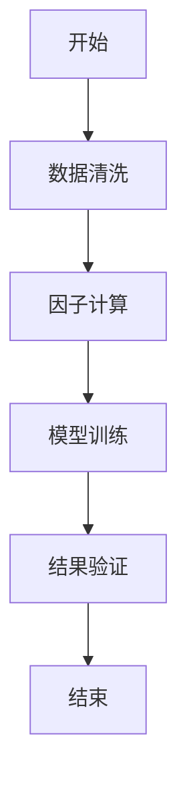
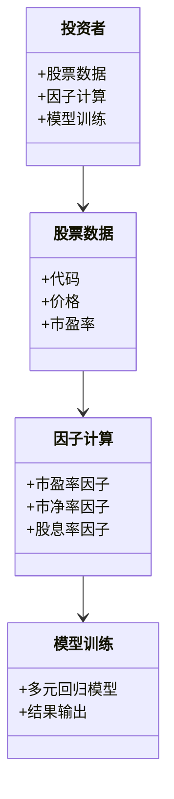

                 


```markdown
# 肯尼斯·费雷尔的价值因子研究

> 关键词：价值因子、多因子模型、投资策略、金融分析、数据分析

> 摘要：价值因子是金融投资中的重要概念，本文从背景介绍、核心概念、算法原理、系统架构、项目实战和最佳实践等方面深入探讨了价值因子的研究与应用。通过详细分析价值因子的属性特征、数学模型和实际案例，本文为投资者和研究人员提供了有价值的参考。

---

# 第一部分: 肯尼斯·费雷尔的价值因子研究背景介绍

## 第1章: 价值因子的定义与背景

### 1.1 价值因子的定义
价值因子是衡量股票内在价值的重要指标，通常包括市盈率、市净率、股息率等指标。这些指标反映了股票的估值水平，帮助投资者判断其是否被市场低估或高估。

### 1.2 价值因子的历史发展
价值投资理念起源于20世纪30年代，由本杰明·格雷厄姆提出。肯尼斯·费雷尔在此基础上进一步发展了价值因子的概念，提出了更系统的多因子模型，为现代金融分析奠定了基础。

### 1.3 价值因子在金融投资中的意义
价值因子能够帮助投资者发现被市场低估的股票，从而实现超额收益。通过多因子模型，投资者可以综合考虑多个因子的影响，提高投资决策的科学性和准确性。

---

# 第二部分: 价值因子的核心概念与联系

## 第2章: 价值因子的核心概念

### 2.1 价值因子的属性特征
价值因子的属性特征包括：
- **流动性特征**：高流动性意味着股票容易买卖，对冲风险能力更强。
- **风险特征**：低风险因子的股票通常波动性较小，适合风险厌恶型投资者。
- **收益特征**：高收益因子的股票通常具有较高的预期回报。

| 因子类型 | 流动性特征 | 风险特征 | 收益特征 |
|----------|------------|----------|----------|
| 市盈率   | 高         | 中       | 高       |
| 市净率   | 中         | 低       | 中       |
| 股息率   | 高         | 中       | 中       |

### 2.2 价值因子的ER实体关系图
```mermaid
er
actor(投资者) -->
    entity(股票) -->
        entity(价值因子)
    entity(市场) -->
        entity(价值因子)
```

---

# 第三部分: 价值因子的算法原理

## 第3章: 价值因子的算法原理

### 3.1 价值因子的多因子模型构建


#### 3.1.1 数据预处理
```python
import pandas as pd
data = pd.read_csv('stock_data.csv')
data_clean = data.dropna()
```

#### 3.1.2 因子回归分析
$$ y = \beta_1x_1 + \beta_2x_2 + \epsilon $$

### 3.2 价值因子的数学模型
$$ R_i = \alpha + \beta_1F_1 + \beta_2F_2 + ... + \beta_nF_n + \epsilon $$

---

# 第四部分: 价值因子的系统分析与架构设计

## 第4章: 价值因子分析系统的架构设计

### 4.1 系统功能设计


---

# 第五部分: 价值因子的项目实战

## 第5章: 价值因子的项目实战

### 5.1 环境安装
```bash
pip install numpy pandas scikit-learn
```

### 5.2 核心代码实现
```python
import pandas as pd
import numpy as np
from sklearn.linear_model import LinearRegression

# 数据预处理
data = pd.read_csv('stock_data.csv')
data_clean = data.dropna()

# 因子计算
factors = data_clean[['市盈率', '市净率', '股息率']]
target = data_clean['收益']

# 模型训练
model = LinearRegression()
model.fit(factors, target)

# 结果输出
print(model.coef_)
```

### 5.3 实际案例分析
以某股票为例，计算其市盈率、市净率和股息率，并预测其未来收益。

---

# 第六部分: 价值因子的最佳实践与总结

## 第6章: 价值因子的最佳实践

### 6.1 最佳实践
- **数据质量**：确保数据的完整性和准确性。
- **模型选择**：根据实际情况选择合适的多因子模型。
- **风险控制**：合理配置资产，分散投资风险。

### 6.2 小结
价值因子研究为投资者提供了科学的投资决策依据，但实际应用中需结合市场环境和个股特性。

### 6.3 未来研究方向
- 深入研究不同市场环境下价值因子的表现。
- 结合人工智能技术，探索更复杂的因子模型。

### 6.4 拓展阅读
推荐阅读《投资学》、《Python金融数据分析》等书籍，进一步深入了解价值因子的应用。

---

# 作者

作者：AI天才研究院/AI Genius Institute & 禅与计算机程序设计艺术 /Zen And The Art of Computer Programming
```

