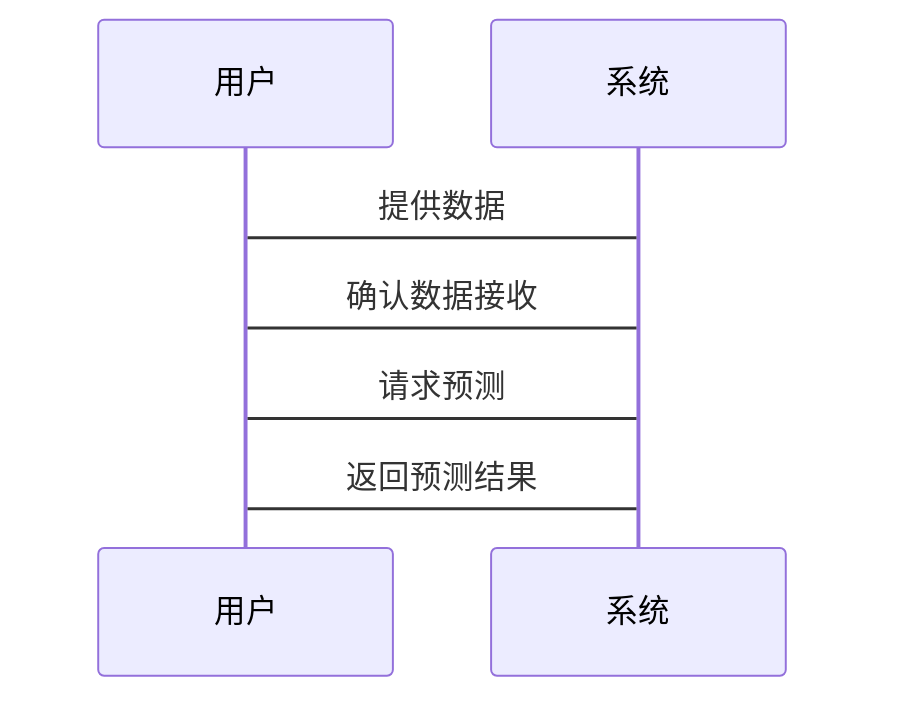

                 


# 肯尼斯·费雷尔的价值投资量化模型

> 关键词：价值投资，量化模型，金融数据分析，机器学习，投资策略

> 摘要：本文深入探讨了肯尼斯·费雷尔的价值投资量化模型，结合价值投资的核心理念与现代量化分析方法，详细解析了模型的构建过程、算法原理及其在实际投资中的应用。文章从理论基础到实践操作，系统地介绍了该模型的创新点、优势以及实际案例分析，为读者提供了一个全面理解价值投资量化模型的框架。

---

## 第一部分: 背景与概述

### 第1章: 价值投资与量化模型的结合

#### 1.1 价值投资的核心理念
- 价值投资的定义与历史发展
  - 价值投资的起源与发展
  - 格雷厄姆与多德的价值投资理论
- 价值投资的核心原则
  - 买入低于内在价值的股票
  - 长期持有的投资策略
- 价值投资在现代金融中的地位
  - 传统价值投资的局限性
  - 量化分析对价值投资的补充作用

#### 1.2 量化模型的基本概念
- 量化投资的定义
  - 量化投资的定义与特点
  - 数据驱动的投资决策
- 量化模型的主要类型
  - 基于因子模型的投资策略
  - 基于机器学习的投资策略
- 量化模型在金融分析中的作用
  - 数据处理与分析
  - 风险控制与收益优化

#### 1.3 价值投资与量化模型的结合
- 肯尼斯·费雷尔模型的背景
  - 传统价值投资的局限性
  - 量化分析的兴起
- 量化模型如何提升价值投资的效率
  - 数据驱动的因子筛选
  - 算法优化的投资决策
- 肯尼斯·费雷尔模型的创新点
  - 数据驱动的因子优化
  - 机器学习在投资策略中的应用

---

## 第二部分: 核心概念与算法原理

### 第2章: 核心概念与定义

#### 2.1 价值因子的定义
- 价值因子的计算方法
  - 市盈率（P/E）
  - 市净率（P/B）
  - 股息率（Dividend Yield）
- 价值因子的筛选标准
  - 低市盈率与高股息率的结合
  - 市净率与企业价值的匹配

#### 2.2 量化模型的输入与输出
- 模型的输入数据
  - 历史股价数据
  - 财务报表数据
  - 宏观经济指标
- 模型的输出结果
  - 投资评分
  - 投资建议
  - 风险评估

#### 2.3 模型的适用范围与边界
- 模型适用的市场环境
  - 稳定的市场环境
  - 波动性较高的市场环境
- 模型的边界条件
  - 数据质量要求
  - 市场有效性假设

### 第3章: 核心概念的联系与对比

#### 3.1 价值因子与成长因子的对比
- 价值因子的特点
  - 低估值
  - 高股息率
- 成长因子的特点
  - 高收益
  - 高市盈率
- 两者的对比分析
  - 价值因子的风险较低
  - 成长因子的收益潜力较高

#### 3.2 不同量化模型的优缺点分析
- 常见量化模型的对比
  - 基于因子模型的投资策略
  - 基于机器学习的投资策略
  - 基于统计套利的投资策略
- 肯尼斯·费雷尔模型的优势
  - 数据驱动的因子优化
  - 机器学习的非线性预测能力
  - 多因子模型的稳定性

#### 3.3 模型的实体关系图（ER图）
- 数据实体关系
  - 股票信息表
  - 财务报表表
  - 市场数据表
- 关系图的展示
  - 股票信息与财务数据的关系
  - 财务数据与市场数据的关系

### 第4章: 算法原理与数学模型

#### 4.1 算法原理概述
- 模型的输入数据与特征选择
  - 数据清洗与预处理
  - 特征筛选与降维
- 模型的构建与训练
  - 回归模型
  - 分类模型
  - 聚类模型
- 模型的验证与优化
  - 交叉验证
  - 参数调优

#### 4.2 算法流程图
- 数据预处理流程
  - 数据清洗
  - 特征工程
  - 数据标准化
- 模型训练流程
  - 数据分割
  - 模型训练
  - 模型评估
- 模型预测流程
  - 新数据输入
  - 模型预测
  - 结果输出

#### 4.3 核心数学模型
- 价值因子计算公式
  - $$价值因子 = \frac{股息率}{市盈率}$$
- 模型的回归方程
  - $$收益 = \beta_0 + \beta_1 \times 价值因子 + \epsilon$$
- 风险调整后的收益计算
  - $$夏普比率 = \frac{收益 - 无风险利率}{波动率}$$

---

## 第三部分: 系统分析与架构设计

### 第5章: 系统分析

#### 5.1 问题场景介绍
- 问题背景
  - 传统价值投资的局限性
  - 量化分析的必要性
- 项目目标与范围
  - 构建一个基于价值因子的量化投资模型
  - 实现一个自动化的投资决策系统
- 系统功能需求
  - 数据采集与处理
  - 模型训练与预测
  - 投资策略生成

### 第6章: 系统架构设计

#### 6.1 系统架构图
- 系统架构图（Mermaid）
  ```mermaid
  graph TD
    A[数据源] --> B[数据处理模块]
    B --> C[特征工程模块]
    C --> D[模型训练模块]
    D --> E[预测结果]
  ```

#### 6.2 系统功能模块划分
- 数据采集模块
  - 数据爬取
  - 数据清洗
- 特征工程模块
  - 特征筛选
  - 数据标准化
- 模型训练模块
  - 模型选择
  - 参数调优
- 结果输出模块
  - 预测结果
  - 投资建议

#### 6.3 系统接口设计
- 数据接口
  - 数据输入接口
  - 数据输出接口
- 模型接口
  - 模型训练接口
  - 模型预测接口

### 第7章: 系统交互设计

#### 7.1 用户与系统的交互流程（Mermaid序列图）


#### 7.2 系统内部模块交互（Mermaid协作图）
```mermaid
collaboration
    participant 数据处理模块
    participant 特征工程模块
    participant 模型训练模块
    数据处理模块->特征工程模块: 提供处理后的数据
    特征工程模块->模型训练模块: 提供特征向量
    模型训练模块->特征工程模块: 返回训练结果
```

---

## 第四部分: 项目实战

### 第8章: 项目实战

#### 8.1 环境安装与配置

##### 8.1.1 开发环境搭建
- 安装Python
  - 安装Anaconda
  - 配置虚拟环境
- 安装相关库
  - NumPy
  - Pandas
  - Scikit-learn
  - XGBoost

##### 8.1.2 数据库安装与配置
- 安装MySQL
  - 配置数据库连接
  - 创建数据库表
- 数据库连接示例代码
  ```python
  import pymysql
  connection = pymysql.connect(host='localhost', user='root', password='password', db='finance_data')
  ```

#### 8.2 数据预处理与特征工程

##### 8.2.1 数据清洗
- 数据清洗步骤
  - 删除缺失值
  - 处理异常值
- 示例代码
  ```python
  import pandas as pd
  data = pd.read_csv('stock_data.csv')
  data.dropna(inplace=True)
  ```

##### 8.2.2 特征工程
- 特征选择
  - 选择相关性高的特征
  - 删除冗余特征
- 特征转换
  - 标准化
  - 编码
- 示例代码
  ```python
  from sklearn.preprocessing import StandardScaler
  scaler = StandardScaler()
  features_scaled = scaler.fit_transform(features)
  ```

#### 8.3 模型训练与预测

##### 8.3.1 模型训练
- 训练数据分割
  ```python
  from sklearn.model_selection import train_test_split
  X_train, X_test, y_train, y_test = train_test_split(features, labels, test_size=0.2)
  ```
- 模型选择
  ```python
  from sklearn.ensemble import RandomForestRegressor
  model = RandomForestRegressor(n_estimators=100, random_state=42)
  model.fit(X_train, y_train)
  ```

##### 8.3.2 模型预测
- 预测示例
  ```python
  predictions = model.predict(X_test)
  ```
- 模型评估
  ```python
  from sklearn.metrics import mean_squared_error
  mse = mean_squared_error(y_test, predictions)
  print(f'Mean Squared Error: {mse}')
  ```

#### 8.4 项目总结
- 项目成果
  - 成功构建了价值投资量化模型
  - 实现了自动化投资决策系统
- 项目经验
  - 数据质量的重要性
  - 模型选择的敏感性
  - 系统架构的合理性

---

## 第五部分: 最佳实践与总结

### 第9章: 最佳实践

#### 9.1 小结
- 肯尼斯·费雷尔模型的核心优势
  - 数据驱动的因子优化
  - 机器学习的非线性预测能力
  - 多因子模型的稳定性

#### 9.2 注意事项
- 数据来源的可靠性
  - 数据清洗的重要性
  - 数据偏差的影响
- 模型的局限性
  - 数据驱动的局限性
  - 模型的过拟合风险
  - 市场环境的变化影响

#### 9.3 拓展阅读
- 价值投资经典书籍
  - 《价值》——李录
  - 《投资的艺术》——本杰明·格雷厄姆
- 量化投资经典书籍
  - 《算法交易：手把手教你用Python在Excel中进行算法交易》——Rishi K. Nath
  - 《量化交易入门：使用Python进行算法交易》——Sue
- 相关研究论文
  - Factor Investing
  - Machine Learning in Finance

---

## 作者信息

作者：AI天才研究院/AI Genius Institute & 禅与计算机程序设计艺术/Zen And The Art of Computer Programming

