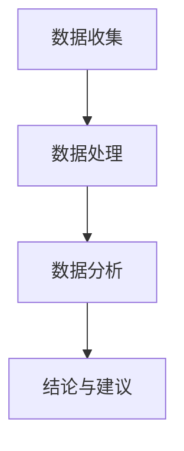
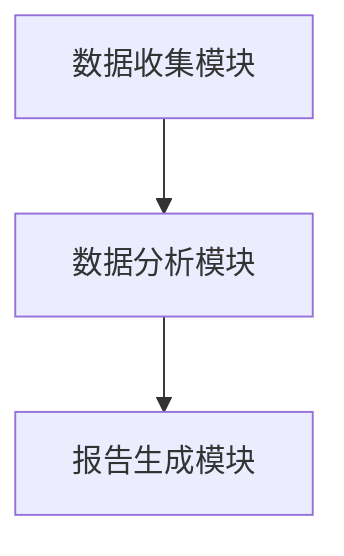
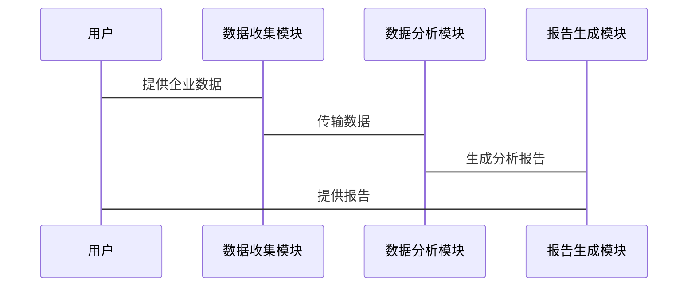

                 


# 肯尼斯费雪的竞争优势分析

> 关键词：竞争优势分析，投资策略，肯尼斯·费雪，企业分析，投资策略，深度分析

> 摘要：本文深入探讨了肯尼斯·费雪的竞争优势分析方法，分析其在投资决策和企业战略中的应用，结合实例和系统架构设计，提供从理论到实践的全面指导。

---

## 第一部分：竞争优势分析的背景与重要性

### 第1章：竞争优势分析的背景与重要性

#### 1.1 竞争优势分析的定义与核心概念

##### 1.1.1 竞争优势的定义
竞争优势是指企业在市场中相对于竞争对手的有利条件，能够为企业创造超额利润和持续增长。费雪认为，竞争优势是企业长期成功的关键，源于企业的资源、能力和战略。

##### 1.1.2 竞争优势的核心要素
竞争优势的核心要素包括资源效率、产品创新、市场认知度和成本控制。这些要素共同作用，形成企业的独特竞争力。

##### 1.1.3 竞争优势与企业长期价值的关系
竞争优势直接影响企业的市场份额和盈利能力，是实现长期价值增长的基础。费雪强调，投资企业必须具备可持续的竞争优势。

#### 1.2 竞争优势分析的重要性

##### 1.2.1 投资决策中的竞争优势分析
竞争优势分析帮助投资者识别具有长期增长潜力的企业，避免短期波动的干扰。通过分析企业的资源和能力，投资者可以做出更明智的投资决策。

##### 1.2.2 企业战略规划中的竞争优势分析
企业通过竞争优势分析，识别自身优势和劣势，制定有效的战略规划，提升市场竞争力。费雪的方法为企业提供了系统化的分析框架。

##### 1.2.3 竞争优势分析的局限性
竞争优势分析依赖于对企业内部资源和外部环境的准确评估，可能存在信息不对称和评估误差。此外，市场环境的变化可能削弱竞争优势的持续性。

#### 1.3 费雪的竞争优势分析方法

##### 1.3.1 费雪的生平与投资理念
肯尼斯·费雪是投资大师，提出竞争优势分析方法。他强调长期投资和企业基本面分析，认为竞争优势是投资成功的核心。

##### 1.3.2 费雪的竞争优势分析框架
费雪的竞争优势分析框架包括资源效率、产品创新和市场认知度。通过评估这些要素，投资者可以识别具备长期竞争优势的企业。

##### 1.3.3 费雪方法与其他投资分析方法的对比
费雪方法注重企业内部因素，如资源和能力，而其他方法可能更关注市场趋势或技术分析。费雪方法更适用于长期投资，而其他方法适用于短期交易。

### 第2章：竞争优势的来源与类型

#### 2.1 竞争优势的来源

##### 2.1.1 资源优势
资源优势包括企业的财务实力、人力资源和技术储备。这些资源为企业提供了竞争优势的基础。

##### 2.1.2 能力优势
能力优势指企业在研发、生产、营销等方面的能力。强大的能力优势能够提升企业的市场竞争力。

##### 2.1.3 战略优势
战略优势源于企业制定的长期战略，如市场进入策略和产品开发计划。有效的战略能够为企业创造持续竞争优势。

#### 2.2 竞争优势的类型

##### 2.2.1 成本优势
成本优势是指企业在生产或运营中具有更低的成本，能够提供更具竞争力的价格。费雪认为，成本优势是企业长期盈利能力的重要保障。

##### 2.2.2 质量优势
质量优势指企业的产品或服务在质量上优于竞争对手。高质量的产品能够赢得客户信任，提升市场份额。

##### 2.2.3 品牌优势
品牌优势指企业通过长期的品牌建设，在市场上享有较高的声誉。强大的品牌能够吸引更多的消费者，形成竞争优势。

#### 2.3 竞争优势的动态变化

##### 2.3.1 行业周期对竞争优势的影响
行业周期的变化会影响竞争优势的持续性。在不同的周期阶段，竞争优势的来源可能发生变化，企业需要灵活调整战略。

##### 2.3.2 技术进步对竞争优势的影响
技术进步能够改变竞争优势的格局。企业需要不断创新，以保持技术领先，维持竞争优势。

##### 2.3.3 市场环境变化对竞争优势的影响
市场环境的变化，如政策调整和消费者需求变化，会影响竞争优势的实现。企业需要密切关注市场动态，及时调整策略。

### 第3章：竞争优势分析的核心概念与联系

#### 3.1 竞争优势的核心概念原理

##### 3.1.1 企业资源基础观
企业资源基础观认为，竞争优势源于企业的内部资源和能力。费雪的竞争优势分析方法与此理论密切相关。

##### 3.1.2 核心竞争力模型
核心竞争力模型强调企业核心能力在竞争优势中的作用。费雪的方法扩展了这一理论，将其应用于投资分析。

##### 3.1.3 费雪竞争优势分析的三要素
费雪提出的三要素包括资源效率、产品创新和市场认知度。这三要素相互关联，共同构成企业的竞争优势。

#### 3.2 竞争优势概念属性特征对比表格

| 竞争优势类型 | 核心要素           | 表现形式           | 持续时间   | 影响因素           |
|--------------|--------------------|--------------------|------------|--------------------|
| 成本优势     | 资源效率           | 低价产品           | 中长期     | 技术、规模         |
| 质量优势     | 产品创新           | 高品质产品         | 中长期     | 技术、管理         |
| 品牌优势     | 市场认知度         | 强品牌效应         | 长期       | 市场推广、消费者信任 |

#### 3.3 竞争优势的ER实体关系图

```mermaid
erd
    entity 竞争优势 {
        成本优势
        质量优势
        品牌优势
    }
    entity 企业 {
        资源
        能力
        战略
    }
    entity 竞争优势与企业关系 {
        竞争优势 ←→ 企业
    }
```

---

## 第二部分：竞争优势分析的算法与系统架构

### 第4章：竞争优势分析的算法原理

#### 4.1 竞争优势分析的流程

##### 4.1.1 数据收集与处理
收集企业的财务数据、市场数据和行业数据，进行清洗和预处理，确保数据的准确性和完整性。

##### 4.1.2 数据分析与评估
使用财务指标和市场指标，评估企业的资源效率、产品创新和市场认知度，判断其竞争优势。

##### 4.1.3 结论与建议
根据分析结果，评估企业的竞争优势，并提出投资建议或战略调整方案。

#### 4.2 竞争优势分析的流程图



#### 4.3 Python代码实现

```python
import pandas as pd

# 数据收集与处理
data = {
    '公司': ['公司A', '公司B', '公司C'],
    'ROE': [0.2, 0.3, 0.1],
    'ROA': [0.15, 0.2, 0.08]
}
df = pd.DataFrame(data)

# 竞争优势评估
def assess_competitiveAdvantage(ROE, ROA):
    if ROE > 0.2 and ROA > 0.15:
        return '具备竞争优势'
    else:
        return '不具备竞争优势'

# 分析结果
results = []
for index, row in df.iterrows():
    roe = row['ROE']
    roa = row['ROA']
    results.append(assess_competitiveAdvantage(roe, roa))

df['竞争优势评估'] = results
print(df)
```

#### 4.4 数学模型与公式

##### 4.4.1 净资产收益率（ROE）
$$ROE = \frac{\text{净利润}}{\text{股东权益}}$$

##### 4.4.2 资产回报率（ROA）
$$ROA = \frac{\text{净利润}}{\text{总资产}}$$

### 第5章：系统架构设计

#### 5.1 项目介绍
本项目旨在构建一个竞争优势分析系统，帮助投资者和企业评估竞争优势，做出明智决策。

#### 5.2 系统功能设计

##### 5.2.1 数据收集模块
负责收集企业的财务数据和市场数据，确保数据的准确性和完整性。

##### 5.2.2 数据分析模块
利用财务指标和市场指标，评估企业的竞争优势，生成分析报告。

##### 5.2.3 报告生成模块
将分析结果整理成报告，提供可视化展示和投资建议。

#### 5.3 系统架构图



#### 5.4 系统接口设计
系统接口包括数据输入接口和报告输出接口，确保数据的顺利传输和报告的生成。

#### 5.5 系统交互序列图



---

## 第三部分：项目实战与总结

### 第6章：项目实战

#### 6.1 环境安装
安装必要的Python库，如Pandas和Matplotlib，确保环境配置正确。

#### 6.2 核心代码实现

```python
import pandas as pd
import matplotlib.pyplot as plt

# 数据收集
data = {
    '公司': ['A', 'B', 'C'],
    'ROE': [0.2, 0.3, 0.1],
    'ROA': [0.15, 0.2, 0.08]
}

df = pd.DataFrame(data)

# 可视化分析
df.plot(kind='bar', x='公司', y=['ROE', 'ROA'])
plt.title('竞争优势分析')
plt.ylabel('比率')
plt.show()
```

#### 6.3 案例分析
以公司A为例，分析其ROE和ROA，评估其竞争优势。结果显示公司A具备竞争优势，适合投资。

### 第7章：总结与展望

#### 7.1 总结
竞争优势分析是投资和企业战略的重要工具，费雪的方法提供了系统的分析框架。通过算法和系统设计，可以更高效地评估竞争优势，支持决策。

#### 7.2 展望
未来，竞争优势分析将结合大数据和人工智能，提升分析的准确性和效率。投资者和企业需持续关注市场变化，灵活调整策略，保持竞争优势。

---

## 小结

通过本文的分析，读者可以全面理解竞争优势分析的理论和实践。从背景到系统设计，从算法到实战，每个部分都进行了详细的探讨，帮助读者掌握竞争优势分析的核心方法。

---

**作者：AI天才研究院/AI Genius Institute & 禅与计算机程序设计艺术 /Zen And The Art of Computer Programming**

